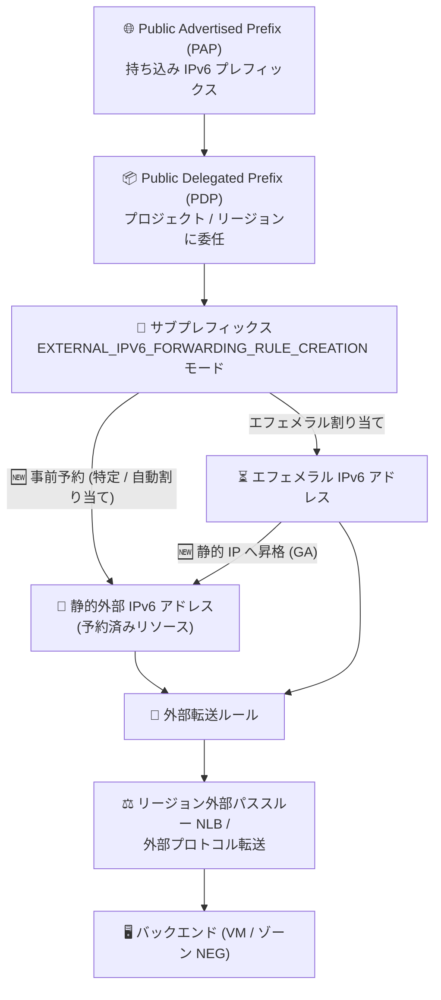

# Virtual Private Cloud / Cloud Load Balancing: BYOIP IPv6 アドレスの静的予約とエフェメラルアドレスの昇格が GA

**リリース日**: 2026-08-27

**サービス**: Virtual Private Cloud (VPC), Cloud Load Balancing

**機能**: BYOIP IPv6 アドレスの静的予約およびエフェメラル BYOIP IPv6 アドレスの静的 IP への昇格

**ステータス**: 一般提供 (GA)

📊 [このアップデートのインフォグラフィックを見る](https://takech9203.github.io/google-cloud-news-summary/20260827-vpc-byoip-ipv6-static-reservation-ga.html)

## 概要

Google Cloud は、Bring Your Own IP (BYOIP) の IPv6 サブプレフィックスから静的外部 IPv6 アドレスを予約する機能を一般提供 (GA) にしました。`EXTERNAL_IPV6_FORWARDING_RULE_CREATION` モードのサブプレフィックスから、特定の IPv6 アドレス範囲を指定して予約するか、Google Cloud に自動割り当てさせて予約できます。予約した静的アドレスは、リージョン外部パススルー Network Load Balancer および外部プロトコル転送の転送ルールに割り当てられます。

あわせて、外部転送ルールで使用中のエフェメラル (一時的な) BYOIP IPv6 アドレスを、予約済みの静的 IP アドレスに昇格 (promote) する機能も GA になりました。昇格により、転送ルールを削除してもアドレス範囲が解放されなくなります。

このアップデートは、自社保有の IPv6 アドレスブロックを Google Cloud に持ち込んで外部パススルー Network Load Balancer を運用する企業 (通信事業者、大規模 SaaS 事業者、オンプレミスから移行中の組織など) にとって、IP アドレスのライフサイクル管理を大幅に改善するものです。同一の機能が VPC と Cloud Load Balancing の両プロダクトのリリースノートで発表されています。

**アップデート前の課題**

- BYOIP IPv6 サブプレフィックスのアドレスを転送ルールで使う場合、ロードバランサー作成前に特定のアドレスを静的に予約しておくことができなかった
- エフェメラルなアドレス割り当てでは、転送ルールを削除するとアドレス範囲が解放されてしまい、同じアドレスを確実に維持する手段がなかった
- DNS 登録や許可リスト (ファイアウォール設定) などでアドレスの固定が必要な環境では、アドレスの永続性を保証しにくかった

**アップデート後の改善**

- ロードバランサー作成前に、BYOIP サブプレフィックスから特定または自動割り当ての IPv6 アドレス範囲を静的アドレスとして予約できるようになった
- 使用中のエフェメラル BYOIP IPv6 アドレスをそのまま静的 IP アドレスに昇格でき、転送ルール削除時のアドレス解放を防止できるようになった
- 昇格操作はダウンタイムなしで行え、既存のトラフィックに影響しない (VM のエフェメラルアドレス昇格と同様、パケットはドロップされない)

## アーキテクチャ図



BYOIP のサブプレフィックスから静的 IPv6 アドレスを事前予約して転送ルールに割り当てるフローと、使用中のエフェメラルアドレスを静的 IP に昇格する 2 つの新しい GA パス (🆕) を示しています。

## サービスアップデートの詳細

### 主要機能

1. **BYOIP サブプレフィックスからの静的外部 IPv6 アドレス予約**
   - `EXTERNAL_IPV6_FORWARDING_RULE_CREATION` モードのサブプレフィックス (Public Delegated Prefix) から静的外部 IPv6 アドレスを予約可能
   - 特定の IPv6 アドレス範囲を指定するか、Google Cloud による自動割り当てを選択できる
   - 予約する範囲のサイズは、サブプレフィックスの割り当て可能プレフィックス長 (allocatable prefix length) に一致する (指定した単一の IPv6 アドレスが予約範囲のベースアドレスとなる)

2. **転送ルールへの割り当て**
   - 予約した静的アドレスは、リージョン外部パススルー Network Load Balancer の転送ルール、および外部プロトコル転送の転送ルールに割り当て可能
   - 転送ルール作成時に、予約済みアドレスリソースの名前または IP アドレス範囲そのものを指定して参照できる

3. **エフェメラル BYOIP IPv6 アドレスの静的 IP への昇格**
   - 外部転送ルールで使用中のエフェメラル BYOIP IPv6 アドレス範囲を、予約済み静的外部 IP アドレスに昇格できる
   - 昇格により、転送ルールを削除してもアドレス範囲が解放されなくなる
   - Google Cloud コンソール (「静的 IP アドレスに昇格」メニュー) または gcloud CLI で操作可能

## 技術仕様

### 対象リソースと前提

| 項目 | 詳細 |
|------|------|
| 対象サブプレフィックスモード | `EXTERNAL_IPV6_FORWARDING_RULE_CREATION` |
| 対象ロードバランサー | リージョン外部パススルー Network Load Balancer、外部プロトコル転送 |
| エンドポイントタイプ | `NETLB` (`--endpoint-type=NETLB`) |
| アドレス範囲サイズ | サブプレフィックスの割り当て可能プレフィックス長に一致 (例: /56) |
| スコープ | リージョン (アドレスのリージョンは PDP のリージョンと一致する必要がある) |
| IPv6 BYOIP の制約 | リージョンアドレスのみサポート (グローバル IPv6 BYOIP アドレスは作成不可) |

### サブプレフィックスモードの排他性

外部アクセスの IPv6 サブプレフィックスでは、以下の 2 つのモードは相互排他であり、作成時にいずれかを選択します。

| モード | 用途 |
|--------|------|
| `EXTERNAL_IPV6_FORWARDING_RULE_CREATION` | リージョン外部パススルー NLB / 外部プロトコル転送の転送ルール (今回の GA 対象) |
| `EXTERNAL_IPV6_SUBNETWORK_CREATION` | サブネットへの外部 IPv6 範囲の割り当て (VM インスタンス専用) |

## 設定方法

### 前提条件

1. BYOIP の Public Advertised Prefix (PAP) と Public Delegated Prefix (PDP) がプロビジョニング済みであること (外部アクセスプレフィックスのプロビジョニングには約 2〜4 週間かかる)
2. `EXTERNAL_IPV6_FORWARDING_RULE_CREATION` モードのサブプレフィックスが作成済みであること
3. プロジェクトで `compute.addresses.*` の IAM 権限を持っていること (リージョンアドレスの場合)

### 手順

#### ステップ 1: BYOIP サブプレフィックスから静的 IPv6 アドレスを予約する

```bash
# 特定のアドレス範囲を予約する場合 (--addresses を指定)
# 自動割り当ての場合は --addresses を省略
gcloud compute addresses create ADDRESS_NAME \
    --region=REGION \
    --ip-collection=PDP_NAME \
    --addresses=IPV6_ADDRESS \
    --endpoint-type=NETLB \
    --prefix-length=PREFIX_LENGTH
```

`PDP_NAME` には `EXTERNAL_IPV6_FORWARDING_RULE_CREATION` モードの PDP (サブプレフィックス) 名を指定します。`PREFIX_LENGTH` は PDP の割り当て可能プレフィックス長 (例: 56) と一致させます。

#### ステップ 2: 予約済みアドレスを使って転送ルールを作成する

```bash
gcloud compute forwarding-rules create FWD_RULE_NAME \
    --load-balancing-scheme=EXTERNAL \
    --ip-protocol=TCP \
    --ports=ALL \
    --ip-version=IPV6 \
    --region=REGION \
    --address=ADDRESS_NAME \
    --backend-service=BACKEND_SERVICE
```

`--address` には予約済みアドレスリソースの名前、または IPv6 CIDR 範囲を直接指定できます。

#### ステップ 3 (代替パス): 使用中のエフェメラルアドレスを静的 IP に昇格する

```bash
# エフェメラル範囲の先頭 IPv6 アドレスを指定して昇格
gcloud compute addresses create ADDRESS_NAME \
    --addresses=IPV6_ADDRESS \
    --region=REGION \
    --endpoint-type=NETLB
```

コンソールの場合は、「IP アドレス」ページの「外部 IP アドレス」タブで対象アドレスのメニューから「静的 IP アドレスに昇格」を選択します。

## メリット

### ビジネス面

- **IP アドレス資産の永続性確保**: 自社保有の IPv6 アドレスを DNS や取引先の許可リストに登録している場合でも、転送ルールの再作成やロードバランサーの再構成でアドレスが失われるリスクを排除できる
- **移行・DR 計画の柔軟性**: ロードバランサー作成前にアドレスを確定できるため、オンプレミスや他クラウドからの移行時に DNS 切り替え計画を事前に立てやすい

### 技術面

- **Infrastructure as Code との親和性**: アドレスリソースを独立して予約・管理できるため、Terraform などでアドレスと転送ルールのライフサイクルを分離して管理できる
- **無停止での昇格**: 使用中のエフェメラルアドレスをそのまま静的 IP に昇格でき、トラフィックへの影響なくアドレスを固定化できる
- **特定アドレスの指定と自動割り当ての選択**: 要件に応じて、サブプレフィックス内の特定範囲の指定と Google Cloud による自動選択を使い分けられる

## デメリット・制約事項

### 制限事項

- BYOIP-provided の外部転送ルールは、リージョン外部パススルー Network Load Balancer と外部プロトコル転送でのみ使用可能 (Application Load Balancer などでは使用不可)
- IPv6 BYOIP プレフィックスはリージョンアドレスのみをサポートし、グローバル IPv6 BYOIP アドレスは作成できない
- 予約範囲のサイズはサブプレフィックスの割り当て可能プレフィックス長に固定され、任意のサイズでは予約できない
- BYOIP アドレスはプロジェクト間で移動できない

### 考慮すべき点

- BYOIP 自体の外部アクセスプレフィックスのプロビジョニングには約 2〜4 週間を要し、短縮はできない
- 外部アクセスの IPv6 サブプレフィックスは、転送ルール用 (`EXTERNAL_IPV6_FORWARDING_RULE_CREATION`) とサブネット用 (`EXTERNAL_IPV6_SUBNETWORK_CREATION`) のモードが相互排他のため、用途を事前に設計しておく必要がある
- Google が BYOIP プレフィックスの重複する経路広報 (Google 外部での同一プレフィックスの広報) をサポートしていない点は従来どおり注意が必要

## ユースケース

### ユースケース 1: 自社 IPv6 プレフィックスを使った NLB の計画的デプロイ

**シナリオ**: 通信事業者が自社保有の IPv6 プレフィックスを Google Cloud に持ち込み、リージョン外部パススルー NLB で公開サービスを提供する。DNS 登録と顧客側ファイアウォールの許可リスト設定のため、ロードバランサー構築前にアドレスを確定させたい。

**実装例**:
```bash
# 1. サブプレフィックスから特定範囲を静的予約
gcloud compute addresses create nlb-v6-addr \
    --region=asia-northeast1 \
    --ip-collection=byoip-v6-subprefix \
    --addresses=2001:db8:1234:: \
    --endpoint-type=NETLB \
    --prefix-length=56

# 2. 予約アドレスで転送ルールを作成
gcloud compute forwarding-rules create nlb-fwd-rule \
    --load-balancing-scheme=EXTERNAL \
    --ip-protocol=TCP --ports=ALL --ip-version=IPV6 \
    --region=asia-northeast1 \
    --address=nlb-v6-addr \
    --backend-service=my-backend-service
```

**効果**: ロードバランサー構築に先立って IP アドレスを確定でき、DNS・許可リストの事前準備と計画的な切り替えが可能になる。

### ユースケース 2: 既存 NLB のエフェメラル BYOIP アドレスの固定化

**シナリオ**: プレビュー期間中や過去にエフェメラル割り当てで構築した BYOIP IPv6 の NLB が本番稼働しており、構成変更 (転送ルールの再作成) 時にアドレスが解放されるリスクを解消したい。

**効果**: 使用中のアドレスを無停止で静的 IP に昇格でき、転送ルールを削除・再作成してもアドレスが維持されるため、安全に構成変更を行える。

## 料金

BYOIP アドレスは、インポート後は Google 提供の IP アドレスと同様に管理されますが、**アイドル状態・使用中を問わず IP アドレス自体への課金は発生しません** (Google 提供の静的外部 IP アドレスは未割り当ての場合に高いレートで課金されるのと対照的です)。

ロードバランサー (リージョン外部パススルー Network Load Balancer) の転送ルールおよびデータ処理には、通常の Cloud Load Balancing / ネットワーク料金が適用されます。詳細は料金ページを参照してください。

- [VPC ネットワーク料金 (外部 IP アドレス)](https://cloud.google.com/vpc/network-pricing#ipaddress)
- [Cloud Load Balancing の料金](https://cloud.google.com/vpc/network-pricing#lb)

## 利用可能リージョン

IPv6 BYOIP プレフィックスはリージョンアドレスのみをサポートします。予約するアドレスのリージョンは、Public Delegated Prefix のリージョンと一致している必要があります。詳細は [BYOIP のドキュメント](https://docs.cloud.google.com/vpc/docs/bring-your-own-ip) を参照してください。

## 関連サービス・機能

- **Bring Your Own IP (BYOIP)**: 今回の機能の基盤。PAP / PDP / サブプレフィックスの階層で自社 IP アドレスを Google Cloud に持ち込む仕組み
- **リージョン外部パススルー Network Load Balancer**: 予約した BYOIP IPv6 アドレスの主要な割り当て先。バックエンドサービス、マルチプロトコル、ゾーン NEG の各構成に対応
- **外部プロトコル転送 (External Protocol Forwarding)**: 単一ターゲットインスタンスへの転送ルールでも BYOIP IPv6 アドレスを利用可能
- **Cloud DNS**: 静的に固定した IPv6 アドレスの AAAA レコード登録と組み合わせて利用

## 参考リンク

- 📊 [インフォグラフィック](https://takech9203.github.io/google-cloud-news-summary/20260827-vpc-byoip-ipv6-static-reservation-ga.html)
- [公式リリースノート (2026 年 8 月 27 日)](https://docs.cloud.google.com/release-notes#August_27_2026)
- [IPv6 サブプレフィックスの作成と使用 (外部転送ルールの作成)](https://docs.cloud.google.com/vpc/docs/create-ipv6-sub-prefixes)
- [Bring your own IP addresses の概要](https://docs.cloud.google.com/vpc/docs/bring-your-own-ip)
- [バックエンドサービスを使用するリージョン外部パススルー NLB の設定](https://docs.cloud.google.com/load-balancing/docs/network/setting-up-network-backend-service)
- [複数 IP プロトコル対応のリージョン外部パススルー NLB の設定](https://docs.cloud.google.com/load-balancing/docs/network/setting-up-networklb-multiple-protocols)
- [ゾーン NEG を使用するリージョン外部パススルー NLB の設定](https://docs.cloud.google.com/load-balancing/docs/network/setting-up-network-zonal-neg)
- [料金ページ (VPC ネットワーク料金)](https://cloud.google.com/vpc/network-pricing)

## まとめ

BYOIP IPv6 アドレスの静的予約とエフェメラルアドレスの昇格が GA となり、自社保有 IPv6 プレフィックスを使った外部パススルー Network Load Balancer のアドレス管理が Google 提供アドレスと同等の運用性を獲得しました。BYOIP IPv6 を利用中の環境では、本番稼働中のエフェメラルアドレスを静的 IP に昇格させ、意図しないアドレス解放のリスクを解消することを推奨します。新規構築では、アドレスの事前予約を IaC に組み込むことで、DNS 切り替えを含む計画的なデプロイが可能になります。

---

**タグ**: #VPC #CloudLoadBalancing #BYOIP #IPv6 #NetworkLoadBalancer #GA #ネットワーキング
