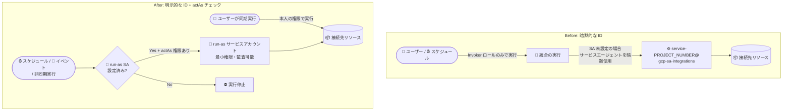

# Application Integration: 統合実行の認可 (Run-as サービスアカウント) 変更の事前告知

**リリース日**: 2026-08-28

**サービス**: Application Integration

**機能**: 統合実行における ID (アイデンティティ) と認可モデルの変更

**ステータス**: Announcement (事前告知 / 対応が必要な場合あり)

📊 [このアップデートのインフォグラフィックを見る](https://takech9203.github.io/google-cloud-news-summary/20260828-application-integration-run-as-authorization-changes.html)

## 概要

Application Integration において、統合 (インテグレーション) 実行時の ID の扱いが変更されることが発表されました。変更後は、すべての実行が「トリガーした本人 (ユーザー)」または「設定済みの run-as サービスアカウント」のいずれかの明示的な ID で動作するようになります。また、統合を実行するには、その統合の run-as サービスアカウントに対して「として動作する (act as)」権限 (`iam.serviceAccounts.actAs`、通常は Service Account User ロール) が必要になります。

スケジュールやイベントによって起動される「人が介在しない」統合は、run-as サービスアカウントの明示的な設定が必須になります。どちらの ID も利用できない実行は、継続されずに停止します。多くの統合は現状のまま動作し続けますが、一部の統合は事前の設定変更が必要であり、対応しない場合は変更適用後に実行が停止するため、Application Integration を利用しているすべてのプロジェクトで影響確認が推奨されます。

公式ドキュメント「[Prepare for upcoming authorization changes](https://docs.cloud.google.com/application-integration/docs/prepare-for-authorization-changes)」に、影響を受ける統合の特定方法と更新手順がまとめられています。

**アップデート前の課題**

- 統合に OAuth 2.0 プロファイルもユーザー管理サービスアカウントも設定されていない場合、プロジェクトのデフォルトサービスアカウント (`service-PROJECT_NUMBER@gcp-sa-integrations.iam.gserviceaccount.com`) が暗黙的に使用されており、実行の背後にある ID が明示的ではなかった
- Application Integration Invoker などのロールだけで統合を実行でき、統合が動作するサービスアカウントに対する `iam.serviceAccounts.actAs` の確認は行われていなかった (実行者の権限と実行時の権限が分離されていなかった)
- プロジェクト共通のサービスエージェントに依存する実行では、統合ごとのアクセス範囲の限定や監査ログでの識別が難しかった

**アップデート後の改善**

- すべての実行の ID が明示的になり、「トリガーした本人」または「設定した run-as サービスアカウント」のいずれかとして動作するため、アクセス制御と監査が明確になる
- run-as サービスアカウントは通常のサービスアカウントと同様に、スコープの限定・管理・監査が可能になり、統合ごとに最小権限の専用アカウントを割り当てる運用が推奨される
- 統合の実行に run-as サービスアカウントへの act as 権限が必要になることで、権限のないユーザーや自動化が広い権限を持つ統合を実行することを防止できる

## アーキテクチャ図



変更前はサービスエージェントへの暗黙的なフォールバックがありましたが、変更後はすべての実行が「トリガーした本人」か「明示的に設定された run-as サービスアカウント」のどちらかで動作し、どちらの ID もない実行は停止します。

## サービスアップデートの詳細

### 主要機能 (変更点)

1. **実行 ID の明示化**
   - すべての統合実行は、「トリガーした本人 (その人自身のアクセス権が適用される)」または「設定した run-as サービスアカウント」のいずれかとして動作する
   - run-as サービスアカウントは、プロジェクト内の他のサービスアカウントと同様に、権限のスコープ設定・管理・監査ができる

2. **実行時の actAs 権限チェック**
   - 統合を実行するには、その統合の run-as サービスアカウントに対する Service Account User ロール (`roles/iam.serviceAccountUser`、`iam.serviceAccounts.actAs` 権限) が必要になる
   - `roles/integrations.integrationAdmin`、`integrationEditor`、`integrationInvoker` のいずれも `iam.serviceAccounts.actAs` を含まないため、別途付与が必要
   - 統合の編集・公開 (publish)・承認にも同じ権限チェックが適用される

3. **人が介在しない実行での run-as サービスアカウント必須化**
   - スケジュールやイベントで起動される統合、非同期で実行される統合は、run-as サービスアカウントの明示的な設定が必要になる
   - どちらの ID も利用できない実行は、継続されずに停止する

### run-as サービスアカウントが必要かどうかの判定

実行全体を通じて誰の認証情報も利用できない場合にのみ、run-as サービスアカウントが必要です。

| 統合の実行方法 | 実行者の認証情報は利用可能か | run-as SA は必要か |
|------|------|------|
| 同期実行 (人が起動し、結果を待つ) | 実行全体で利用可能 | 不要 |
| 非同期実行 (キューに入り、後で完了する) | トリガーの瞬間のみ | 必要 |
| 無人実行 (スケジュールやイベントが起動する) | 人が存在しない | 必要 |

**注意**: 非同期実行は人がトリガーした場合でも対象になります。キューに入った処理は実行者の認証情報を引き継がないため、実際に実行される時点では認可する人がいなくなるためです。

### 影響を受ける統合の特定方法

**ステップ 1: 人が介在せずに実行されることがあるか確認**

以下のいずれかに該当する場合、その統合は人が介在せずに実行されます。

- Cloud Scheduler、Cloud Pub/Sub、Salesforce、Integration Connectors イベントのトリガーを持つ
- API の `scheduleIntegrations` でスケジュール実行される
- 他の統合から Call Integration タスクで非同期サブ統合として呼び出される
- Suspend タスクまたは Approval タスクを使用している (実行が待機状態のまま期限切れになる可能性がある)

**ステップ 2: run-as サービスアカウントが未設定か確認**

リージョン内の公開済みバージョンと run-as サービスアカウントを一覧するには、以下を実行します。

```bash
curl -s -G -H "Authorization: Bearer $(gcloud auth print-access-token)" \
  --data-urlencode "filter=state=ACTIVE" \
  --data-urlencode "pageSize=1000" \
  "https://REGION-integrations.googleapis.com/v1/projects/PROJECT_ID/locations/REGION/integrations/-/versions" \
  | jq -r '.integrationVersions[] | [ .name, (.runAsServiceAccount // "NONE") ] | @tsv'
```

`NONE` と表示された統合のうち、ステップ 1 に該当するものが対応対象です。

**注意点 (公式ドキュメントより)**:
- `filter=state=ACTIVE` はリクエスト側に付ける。`-` ワイルドカードは統合ごとに最新の 1 バージョンのみを返すため、取得後にフィルタすると「最新バージョンが未公開ドラフト」の統合が結果から漏れる
- レスポンスに `nextPageToken` が含まれる場合は、トークンが返ってこなくなるまで `pageToken=TOKEN` を付けて繰り返す
- コンソールの警告は観測された実行に部分的に依存するため、実行頻度の低いスケジュール統合は警告が出ないまま対応が必要な場合がある。「コンソールに警告がない = 対応不要」とは判断しない

## 設定方法

### 前提条件

- 対応は以下の順序で行うこと。タスク 2 と 3 は publish (公開) を伴い、publish 自体が権限チェックの対象になるため、**必ずタスク 1 (Service Account User の付与) を最初に実施する**
- run-as サービスアカウントを先に設定してしまうと、修正を保存するための publish が権限不足で拒否される可能性がある

### 手順

#### ステップ 1: 既存の run-as サービスアカウントに Service Account User を付与

統合を実行・承認・編集・公開するすべての人 (自動化で使用するサービスアカウントを含む) に付与します。

```bash
gcloud iam service-accounts add-iam-policy-binding SERVICE_ACCOUNT \
  --project=SERVICE_ACCOUNT_PROJECT_ID \
  --member='user:PRINCIPAL' \
  --role='roles/iam.serviceAccountUser'
```

- グループには `group:`、自動化には `serviceAccount:` を使用する (人の入れ替わりに強いため、通常はグループ付与が推奨)
- **`--project` はサービスアカウントを所有するプロジェクトを指定する。** run-as サービスアカウントが統合と別プロジェクトにある場合、統合側のプロジェクトに付与しても効果がない (公式ドキュメントで「最も多い間違い」とされている)

#### ステップ 2: 人が介在せずに実行される統合に run-as サービスアカウントを設定

1. サービスアカウントを選択または作成し、統合のタスクがアクセスするリソースに必要なロールを付与する。付与内容の目安として、プロジェクトの Application Integration サービスエージェント (`service-PROJECT_NUMBER@gcp-sa-integrations.iam.gserviceaccount.com`) が現在保持しているロールのうち、その統合が使う部分だけを新しいアカウントに与える
2. そのサービスアカウントに対し、統合を実行・承認・編集・公開する全員 (自動化を含む) に Service Account User を付与する
3. 統合を開き、ツールバーの Integration summary ペインでサービスアカウントを設定する
4. 統合を publish する

Google Cloud は、すべての統合で広い権限を持つ 1 つのアカウントを共有するのではなく、**統合ごとに専用の最小権限サービスアカウント**を使うことを推奨しています。個々の統合の影響範囲を限定でき、監査ログに名前で記録されるためです。

#### ステップ 3: 認証プロファイルのサービスアカウントにも Service Account User を付与

タイプが「Service account」または「OIDC token」の[認証プロファイル](https://docs.cloud.google.com/application-integration/docs/configure-authentication-profiles)で指定されているサービスアカウントにも、同様に Service Account User を付与します。これらは通常、run-as サービスアカウントとは別のアカウントです。

## 技術仕様

### 権限不足時の症状と対処 (トラブルシューティング)

| 状況 | 発生する事象 | 対処 |
|------|------|------|
| トリガーした人が run-as SA に対する actAs 権限を持たない | `PERMISSION_DENIED` でトリガーが拒否される。チェックは実行がキューに入る前に行われるため、実行ログには何も記録されない | トリガーする人に Service Account User を付与 |
| ユーザー認証情報のない実行に run-as SA が未設定 | Connectors、Call REST Endpoint、Cloud Run functions タスクが接続先への処理で失敗する。publish 時には "The integration is missing run-as service account since governance is enabled for your project." が表示される | run-as サービスアカウントを設定 |
| 認証プロファイルの SA に対する actAs 権限がない | 該当タスクのみ拒否され、実行の残りは継続する ("You do not have permission to use Auth Config ID because you cannot act as its service account") | プロファイルで指定された SA に Service Account User を付与 |
| 承認者が run-as SA に対する actAs 権限を持たない | 承認処理が可視のエラーなしに失敗し、実行は期限切れまで一時停止したままになる (「承認が機能しなくなった」ように見える) | 承認する可能性のある全員に Service Account User を付与 |
| 編集・公開する人が権限を持たない | "Publisher does not have required permission to publish integration with service account" が表示される。公開済みの統合は動作し続ける。自動化が publish する場合はデプロイパイプライン側でエラーになる | 編集者・公開者・自動化に Service Account User を付与 |
| トリガーした本人として実行され、その人がリソースにアクセスできない | 実行は正常に開始し、途中のタスクがリソース名を示して失敗する | 本人にアクセス権を与えるか、必要な権限を持つ run-as SA に切り替える (実行者によってアクセスが変動しなくなるため後者が推奨) |

### よくある質問 (公式ドキュメントより)

- **ロールを付与したのにまだ失敗する**: 付与先プロジェクトの誤り (SA を所有するプロジェクトに付与する必要がある)、認可判定のキャッシュと IAM 伝播の遅延、run-as SA と認証プロファイルの SA の両方に付与が必要、のいずれかを確認する
- **Integration Invoker ロールでは不十分なのか**: 統合の実行自体は可能だが、統合が動作するサービスアカウントとして動作する権限 (`iam.serviceAccounts.actAs`) は含まれておらず、別途付与が必要
- **同期実行のみの統合**: トリガーした本人という ID が既に存在するため、run-as サービスアカウントは不要

## デメリット・制約事項

### 考慮すべき点

- 対応しないまま変更が適用されると、スケジュール実行・イベント駆動の統合が停止する。これらは自動実行のため失敗してもコンソールに警告が出ず、実行頻度が低い場合は変更適用前に一度も実行されず問題に気付けない可能性があるため、事前の棚卸しが必要
- 3 つの対応タスクは順序が重要 (Service Account User の付与 → run-as SA の設定 → 認証プロファイル SA への付与)。publish 自体が権限チェックの対象になるため、順序を誤ると修正の保存が拒否される
- CI/CD などの自動化が統合を publish している場合、その自動化が使用するサービスアカウントにも Service Account User の付与が必要
- クロスプロジェクト構成では、ロールの付与先を「サービスアカウントを所有するプロジェクト」にする必要がある

## 料金

今回の発表は認可モデルの変更であり、料金に関する変更は含まれていません。Application Integration は従量課金 (Pay-as-you-go) モデルで、統合の実行回数、処理データ量、接続ノード数に基づいて課金されます (無料枠あり)。詳細は[料金ページ](https://docs.cloud.google.com/application-integration/docs/pricing)を参照してください。

## 関連サービス・機能

- **IAM (Service Account User ロール)**: 今回の変更の中心。`roles/iam.serviceAccountUser` (`iam.serviceAccounts.actAs`) の付与が実行・編集・公開・承認の前提になる
- **Cloud Scheduler / Cloud Pub/Sub / Salesforce / Integration Connectors イベントトリガー**: これらのトリガーを持つ統合は「人が介在しない実行」に該当し、run-as サービスアカウントの設定が必須になる
- **Integration Connectors**: Connectors タスクは権限不足時に失敗する対象の 1 つ。認証プロファイルで指定するサービスアカウントにも actAs 権限の付与が必要
- **Cloud Audit Logs**: run-as サービスアカウントは監査ログに名前で記録されるため、統合ごとの専用アカウント運用により追跡性が向上する

## 参考リンク

- 📊 [インフォグラフィック](https://takech9203.github.io/google-cloud-news-summary/20260828-application-integration-run-as-authorization-changes.html)
- [公式リリースノート](https://docs.cloud.google.com/release-notes#August_28_2026)
- [Prepare for upcoming authorization changes (公式ドキュメント)](https://docs.cloud.google.com/application-integration/docs/prepare-for-authorization-changes)
- [Access control with IAM (Application Integration)](https://docs.cloud.google.com/application-integration/docs/access-control)
- [Configure authentication profiles](https://docs.cloud.google.com/application-integration/docs/configure-authentication-profiles)
- [Best practices for working with service accounts](https://docs.cloud.google.com/iam/docs/best-practices-service-accounts)
- [料金ページ](https://docs.cloud.google.com/application-integration/docs/pricing)

## まとめ

Application Integration の実行 ID が明示化され、run-as サービスアカウントへの actAs 権限が実行の前提となる重要な変更です。特にスケジュール・イベント駆動・非同期の統合は run-as サービスアカウントが未設定だと停止するため、変更適用前に公式手順に沿って影響する統合を棚卸しし、「Service Account User の付与 → run-as サービスアカウントの設定 → 認証プロファイル SA への付与」の順で対応を完了させることを推奨します。

---

**タグ**: #ApplicationIntegration #IAM #ServiceAccount #Security #Authorization #BreakingChange
