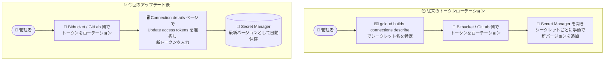

# Cloud Build: Connection details ページからのアクセストークン更新 (Bitbucket / GitLab 2nd gen 接続)

**リリース日**: 2026-08-28

**サービス**: Cloud Build

**機能**: 2nd generation Bitbucket / GitLab ホスト接続のアクセストークンを Connection details ページから更新

**ステータス**: 一般提供 (GA)

📊 [このアップデートのインフォグラフィックを見る](https://takech9203.github.io/google-cloud-news-summary/20260828-cloud-build-connection-token-rotation.html)

## 概要

Cloud Build の 2nd generation リポジトリ接続において、Bitbucket および GitLab のホスト接続で使用するアクセストークンを、Google Cloud コンソールの **Connection details ページから直接更新**できるようになりました。対象は Bitbucket Cloud / Bitbucket Data Center / Bitbucket Server、および GitLab.com / GitLab Enterprise Edition の各ホスト接続です。

Cloud Build の 2nd gen 接続では、ソースプロバイダー側で発行したアクセストークン (Bitbucket は Admin / Read トークン、GitLab は `api` / `read_api` スコープのトークン) を Secret Manager に保存して認証に使用します。これらのトークンには有効期限があり、期限切れになるとホスト接続が切断され、リポジトリのリンクやトリガーの実行に失敗します。今回のアップデートにより、トークンのローテーション作業がコンソール上の数クリックで完結するようになり、CI/CD パイプラインの運用負荷と復旧時間が削減されます。

また、期限切れ時のエラー表示も改善されており、Connection details ページに「Connection is disconnected due to an invalid or expired access token」というメッセージが表示されるほか、リポジトリのリンク時に表示される「Invalid access token」メッセージから **View connection** をクリックすると、該当する接続の Connection details ページに直接移動できます。

**アップデート前の課題**

従来、期限切れトークンのローテーションには Secret Manager を直接操作する複数ステップの手作業が必要でした。

- `gcloud builds connections describe` コマンドを実行し、出力の `authorizerCredential.userTokenSecretVersion` / `readAuthorizerCredential.userTokenSecretVersion` フィールドから、接続に紐づく Secret Manager のシークレット名を特定する必要があった
- 特定したシークレットごとに Secret Manager のページを開き、手動で「新しいバージョンを追加」する必要があった (リージョナルシークレットの場合はタブの切り替えも必要)
- Cloud Build の画面から Secret Manager の画面へ行き来する必要があり、トークン期限切れによる接続断からの復旧に時間がかかった

**アップデート後の改善**

- Connection details ページの **Update access tokens** から、新しいトークン値を入力するだけでローテーションが完結するようになった
- 入力したトークンは Cloud Build が自動的に Secret Manager の該当シークレットの最新バージョンとして保存するため、シークレット名の特定や Secret Manager の手動操作が不要になった
- **Update connection to always use latest version** オプションにより、接続が常にシークレットの最新バージョンを参照するように併せて更新できるようになった (特定のバージョン番号を使い続けたい場合は未選択のままにできる)

## アーキテクチャ図



従来はシークレット名の特定と Secret Manager での手動バージョン追加が必要でしたが、今回のアップデートで Connection details ページからの入力だけで Secret Manager への保存まで自動化されました。

## サービスアップデートの詳細

### 主要機能

1. **Connection details ページからのトークン更新**
   - 接続の詳細ページで **Update access tokens** を選択すると Token rotation メニューが開き、新しいトークンを入力して **Update** を押すだけでローテーションが完了する
   - Bitbucket 接続では API access token (Admin) と Read access token の 2 つ、GitLab 接続では `api` スコープと `read_api` スコープの 2 つのトークンを更新する

2. **Secret Manager への自動保存**
   - 入力された新しいトークンは、その接続に紐づく既存シークレットの**最新バージョン**として Secret Manager に自動保存される
   - シークレット名を調べて手動で新バージョンを追加する作業が不要になる

3. **最新シークレットバージョンの自動参照オプション**
   - **Update connection to always use latest version** を選択すると、接続が常にシークレットの最新バージョン (`latest`) を使用するように更新される
   - 特定のシークレットバージョン番号を参照する運用をしている場合は、このオプションを未選択のままにすることもできる

4. **期限切れ時のエラー導線の明確化**
   - トークンが期限切れになると、Connection details ページに「Connection is disconnected due to an invalid or expired access token」というエラーが表示される
   - リポジトリのリンク時に「Invalid access token」が表示された場合、**View connection** から該当接続の Connection details ページへ直接移動できる

## 技術仕様

### 対象となるホスト接続とトークン

| ホストタイプ | 世代 | 更新対象のトークン |
|------|------|------|
| Bitbucket Cloud | 2nd gen | Admin アクセストークン (Repositories: Read/Admin、Pull Requests: Read、Webhooks: Read/Write)、Read アクセストークン (Repositories: Read) |
| Bitbucket Data Center | 2nd gen | Admin アクセストークン、Read アクセストークン |
| Bitbucket Server | 2nd gen | Admin アクセストークン、Read アクセストークン |
| GitLab.com | 2nd gen | `api` スコープトークン (リポジトリの接続/切断用)、`read_api` スコープトークン (トリガーによるソースコードアクセス用) |
| GitLab Enterprise Edition | 2nd gen | `api` スコープトークン、`read_api` スコープトークン |

### トークン期限切れ時の主な症状

| 操作 | 表示されるエラー |
|------|------|
| Connection details ページの表示 | Connection is disconnected due to an invalid or expired access token |
| リポジトリのリンク | Invalid access token (View connection から接続詳細へ移動可能) / Failed to fetch repositories to link |
| Triggers ページで Run をクリック | Failed to list branches. You can still enter one manually |

## 設定方法

### 前提条件

1. Cloud Build の 2nd generation ホスト接続 (Bitbucket または GitLab) が作成済みであること
2. ソースプロバイダー側 (Bitbucket / GitLab) でトークンをローテーションできる権限があること
3. 接続の管理には Cloud Build Connection Admin (`roles/cloudbuild.connectionAdmin`) IAM ロールが必要

### 手順

#### ステップ 1: ソースプロバイダー側でトークンをローテーション

Bitbucket または GitLab のドキュメントに従い、接続に使用しているアクセストークンをローテーションします。ローテーションすると新しい認証情報を持つトークンが発行され、旧トークンは無効化されます。ローテーション後のトークンは元のトークンと同じ権限・スコープを持ちます。新しいトークンの ID をコピーしておきます。

#### ステップ 2: Connection details ページでトークンを更新

1. Google Cloud コンソールで対象接続の **Connection details** ページを開く
2. **Update access tokens** を選択する
3. **Token rotation** メニューで、API access token と Read access token の各フィールドに新しいトークンを入力する
4. (任意) 接続が常に最新のシークレットバージョンを使うようにする場合は **Update connection to always use latest version** を選択する
5. **Update** を選択して保存する

Cloud Build が新しいトークンを Secret Manager の該当シークレットの最新バージョンとして保存し、接続が復旧します。

## メリット

### ビジネス面

- **ダウンタイムの短縮**: トークン期限切れによる CI/CD パイプラインの停止から、コンソール操作のみで迅速に復旧できる
- **運用負荷の軽減**: Secret Manager の知識がなくても、Cloud Build の画面内でトークン管理が完結する

### 技術面

- **オペレーションミスの削減**: シークレット名の特定 (`gcloud builds connections describe`) や Secret Manager での手動バージョン追加が不要になり、誤ったシークレットを更新するリスクが減る
- **エラーから解決までの導線**: 「Invalid access token」エラーの **View connection** から該当接続に直行でき、原因特定が容易になる
- **シークレットバージョン運用の柔軟性**: 最新バージョンを常に参照する設定と、特定バージョンを固定する設定のどちらの運用にも対応できる

## デメリット・制約事項

### 制限事項

- 対象は 2nd generation のホスト接続のみ (1st generation の接続は対象外)
- 対象ホストは Bitbucket (Cloud / Data Center / Server) と GitLab (GitLab.com / GitLab Enterprise Edition) の接続
- トークン自体のローテーションは引き続きソースプロバイダー (Bitbucket / GitLab) 側で実施する必要がある (Cloud Build 側で自動発行されるわけではない)

### 考慮すべき点

- トークンが期限切れの間は、接続の無効化やリポジトリのリンクができない (トークンをローテーションするまで復旧しない)
- 特定のシークレットバージョン番号を参照する運用をしている場合は、**Update connection to always use latest version** の選択有無を意図に合わせて判断する必要がある
- ローテーション後のトークンは元のトークンと同じ権限・スコープを引き継ぐため、権限の見直しはローテーションとは別に行う必要がある

## ユースケース

### ユースケース 1: 期限切れトークンによるビルドトリガー障害からの迅速な復旧

**シナリオ**: Bitbucket Cloud のアクセストークンが有効期限を迎え、Cloud Build のトリガー実行時に「Failed to list branches」エラーが発生。CI/CD パイプラインが停止している。

**実装例**:
```text
1. Bitbucket Cloud でリポジトリのアクセストークンをローテーションし、新トークンの ID をコピー
2. Cloud Build の Connection details ページで「Update access tokens」を選択
3. Admin / Read の新トークンを入力して「Update」
4. トリガーを再実行して復旧を確認
```

**効果**: gcloud コマンドや Secret Manager の操作なしで復旧が完結し、パイプライン停止時間を最小化できる。

### ユースケース 2: GitLab トークンの定期ローテーション運用

**シナリオ**: セキュリティポリシーにより GitLab のパーソナルアクセストークンに有効期限を設定し、定期的にローテーションしている組織。期限のたびに Secret Manager の手動更新作業が発生していた。

**効果**: 定期ローテーションのたびに必要だったシークレット名の特定と Secret Manager での手動バージョン追加が不要になり、運用手順書が簡素化される。「Update connection to always use latest version」を有効にしておけば、以降のローテーションでも接続が常に最新トークンを参照する。

## 料金

このアップデートは既存のトークンローテーション操作をコンソールに統合するものです。Cloud Build および Secret Manager (トークンはシークレットとして保存) の料金体系は各料金ページを参照してください。

- [Cloud Build の料金](https://cloud.google.com/build/pricing)
- [Secret Manager の料金](https://cloud.google.com/secret-manager/pricing)

## 関連サービス・機能

- **Secret Manager**: 接続のアクセストークンはシークレットとして保存される。今回の機能では新トークンが自動的に最新シークレットバージョンとして保存される。CMEK (顧客管理の暗号鍵) による暗号化にも対応
- **Cloud Build リポジトリ (2nd gen)**: 今回の対象となるホスト接続の仕組み。リージョン単位で接続を作成し、Bitbucket / GitLab / GitHub などのソースプロバイダーと連携する
- **Cloud Build トリガー**: 接続したリポジトリへの push などをきっかけにビルドを自動実行する。トークン期限切れの影響を直接受ける機能
- **IAM**: 接続の管理には Cloud Build Connection Admin (`roles/cloudbuild.connectionAdmin`) ロールが必要

## 参考リンク

- 📊 [インフォグラフィック](https://takech9203.github.io/google-cloud-news-summary/20260828-cloud-build-connection-token-rotation.html)
- [公式リリースノート](https://docs.cloud.google.com/release-notes#August_28_2026)
- [Rotate old or expired Bitbucket Cloud access tokens](https://docs.cloud.google.com/build/docs/automating-builds/bitbucket/connect-host-bitbucket-cloud#fix_rotated_tokens)
- [Rotate old or expired Bitbucket Data Center access tokens](https://docs.cloud.google.com/build/docs/automating-builds/bitbucket/connect-host-bitbucket-data-center)
- [Rotate old or expired GitLab access tokens](https://docs.cloud.google.com/build/docs/automating-builds/gitlab/connect-host-gitlab)
- [Rotate old or expired GitLab Enterprise Edition access tokens](https://docs.cloud.google.com/build/docs/automating-builds/gitlab/connect-host-gitlab-enterprise-edition)
- [料金ページ (Cloud Build)](https://cloud.google.com/build/pricing)

## まとめ

Cloud Build の 2nd gen Bitbucket / GitLab 接続で、期限切れトークンのローテーションが Connection details ページからの操作だけで完結するようになりました。従来必要だった gcloud でのシークレット名特定や Secret Manager の手動更新が不要になり、トークン期限切れによる CI/CD 停止からの復旧が大幅に簡素化されます。Bitbucket / GitLab 接続を運用しているチームは、トークンローテーションの運用手順を新しいコンソールフローに更新することを推奨します。

---

**タグ**: #CloudBuild #CICD #Bitbucket #GitLab #SecretManager #DevOps #セキュリティ
