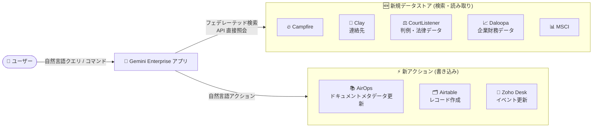

# Gemini Enterprise: 新規データストア 5 種の追加と 3 コネクタの新アクション対応 (Preview)

**リリース日**: 2026-08-28

**サービス**: Gemini Enterprise

**機能**: 新規データストア (Campfire、Clay、CourtListener、Daloopa、MSCI) と新アクション (AirOps、Airtable、Zoho Desk) のサポート

**ステータス**: Public Preview

📊 [このアップデートのインフォグラフィックを見る](https://takech9203.github.io/google-cloud-news-summary/20260828-gemini-enterprise-new-data-stores-actions.html)

## 概要

Gemini Enterprise において、新たに 5 種類のサードパーティデータストアが Public Preview で利用可能になりました。追加されたのは Campfire、Clay、CourtListener、Daloopa、MSCI で、いずれも自然言語によるデータの検索・読み取り (フェデレーテッド検索) に対応します。Clay は連絡先データ、CourtListener は米国の判例・法律データ、Daloopa は企業ファンダメンタルズ・財務ドキュメント・株価などの金融データを対象としており、法務・金融分野の外部データソースが大きく拡充されました。

あわせて、既存の 3 つのコネクタに新しいアクション (書き込み操作) が Public Preview で追加されました。AirOps では「ナレッジベースドキュメントのメタデータ更新」、Airtable では「テーブルへのレコード作成」、Zoho Desk では「イベントの更新」が自然言語コマンドで実行できるようになります。

このアップデートにより、Gemini Enterprise を全社検索・エージェント基盤として利用する企業は、外部 SaaS やデータプロバイダーの情報を横断検索するだけでなく、検索結果を起点とした書き込み操作までを単一のインターフェースで完結できる範囲が広がります。

**アップデート前の課題**

- Campfire、Clay、CourtListener、Daloopa、MSCI のデータは Gemini Enterprise の標準コネクタでは検索できず、各サービスの UI や API を個別に利用する必要があった
- Airtable コネクタでは既存レコードの更新 (2026-08-11 追加) やテーブル・ベースの作成はできたが、テーブルへの新規レコード作成には対応していなかった
- Zoho Desk コネクタではイベントの作成 (2026-05-15 追加) はできたが、作成済みイベントの詳細を更新するには Zoho Desk 側での操作が必要だった
- AirOps コネクタではナレッジベースの作成・更新や URL 追加はできたが、ナレッジベース内ドキュメントのメタデータ更新には対応していなかった

**アップデート後の改善**

- 5 種類の新データストアを接続することで、法務データ (CourtListener)、金融データ (Daloopa、MSCI)、連絡先データ (Clay) などを Gemini Enterprise から自然言語で横断検索できるようになった
- Airtable の「Create records for a table」により、会話の流れの中で特定テーブルへ新規レコードを直接追加できるようになった
- Zoho Desk の「Update event」により、ヘルプデスクポータルのイベント詳細を自然言語で更新できるようになった
- AirOps の「Update knowledge base document metadata」により、ナレッジベース内ドキュメントのメタデータ管理まで Gemini Enterprise から実行できるようになった

## アーキテクチャ図

ユーザーの自然言語クエリは Gemini Enterprise から各データソースの API に直接送信され (フェデレーテッド検索)、結果が他の接続済みデータソースの結果とブレンドして表示されます。アクション対応コネクタでは、検索に加えて書き込み操作も実行できます。

## サービスアップデートの詳細

### 主要機能

1. **新規データストア 5 種 (Public Preview)**
   - **Campfire**: Campfire のデータを自然言語で検索・読み取り
   - **Clay**: Clay の連絡先 (contacts) を自然言語で検索・読み取り
   - **CourtListener**: 米国の判例・法律データ (CourtListener Data エンティティ) を自然言語で検索・読み取り
   - **Daloopa**: 企業の発見、企業ファンダメンタルズの取得、財務ドキュメントの検索、株価の取得 (Financial Data エンティティ)
   - **MSCI**: MSCI のデータを自然言語で検索・読み取り

2. **AirOps: Update knowledge base document metadata**
   - ナレッジベース内のドキュメントのメタデータを自然言語コマンドで更新
   - 既存のアクション (ナレッジベースの作成・更新、URL 追加、グリッド操作、レポート作成など) に加わる 11 個目のアクション

3. **Airtable: Create records for a table**
   - 特定のテーブルに新規レコードを作成
   - 既存のアクション (ベース作成、テーブル作成・更新、フィールド作成、レコードコメント作成、レコード更新) と合わせて、テーブル操作の CRUD がさらに充実

4. **Zoho Desk: Update event**
   - ヘルプデスクポータルのイベントの詳細を更新
   - チケット・コメント・タスク・コール・イベントを対象とした計 12 個のアクションに拡充

### フェデレーテッド検索の動作

新規データストアはフェデレーテッド検索 (data federation) 方式で動作します。

- クエリは各データソース (例: CourtListener API、Daloopa API) に直接送信され、データは Gemini Enterprise のインデックスにコピーされない
- 検索結果は他の接続済みデータソースの結果とブレンドされて表示される
- 精度向上のため、LLM がクエリを書き換えてから送信する場合があり、セッションのクエリ履歴の一部が含まれる可能性がある
- データが第三者システムに到達した後は、そのシステムの利用規約とプライバシーポリシーが適用される

## 技術仕様

### 新規データストアの共通仕様

| 項目 | 詳細 |
|------|------|
| ステータス | Public Preview (Pre-GA Offerings Terms が適用) |
| 接続方式 | フェデレーテッド検索 (データソース API への直接照会) |
| 対応ロケーション | global、us、eu |
| 暗号化 | us / eu 選択時は Google 管理キーまたは Cloud KMS キー (CMEK) を設定 |
| 静的 IP | Advanced options で静的 IP エグレスを有効化可能 (送信元 IP の許可リスト登録向け) |
| VPC Service Controls | 既存データストアへの境界適用は不可 (削除・再作成が必要) |
| 課金 | General pricing または Configurable pricing を選択 |

### 新アクションの一覧

| コネクタ | 新アクション | 説明 |
|----------|-------------|------|
| AirOps | Update knowledge base document metadata | ナレッジベース内ドキュメントのメタデータを更新 |
| Airtable | Create records for a table | 特定のテーブルに新規レコードを作成 |
| Zoho Desk | Update event | イベントの詳細を更新 |

## 設定方法

### 前提条件

1. Google Cloud プロジェクトと Gemini Enterprise のライセンス
2. 接続先データソース (Campfire、Clay、CourtListener、Daloopa、MSCI など) のアカウントと認可
3. 組織ポリシー `discoveryengine.managed.allowedDataSources` を使用している場合は、対象コネクタの値 (`campfire`、`clay`、`courtlistener`、`daloopa`、`msci`) の許可

### 手順 (データストアの作成)

#### ステップ 1: データストアの作成

1. Google Cloud コンソールで **Gemini Enterprise** ページに移動
2. ナビゲーションメニューで **Data stores** をクリックし、**Create data store** をクリック
3. **Source** セクションで対象のデータソース (例: CourtListener) を検索して **Select** をクリック
4. **Data** セクションで検索対象のエンティティを選択 (例: CourtListener は「CourtListener Data」、Daloopa は「Financial Data」)
5. アクション対応コネクタ (AirOps など) の場合は **Actions** セクションで有効化するアクションを選択 (後から追加も可能)
6. 必要に応じて **Advanced options** で **Enable Static IP Addresses** を選択
7. **Configuration** セクションでマルチリージョン (global / us / eu) とコネクタ名を設定し、us / eu の場合は暗号化設定 (Google 管理キーまたは Cloud KMS キー) を構成
8. **Billing** セクションで General pricing または Configurable pricing を選択し、**Create** をクリック

#### ステップ 2: アプリへの接続と認可

1. データストアの状態が **Creating** から **Active** に変わったことを確認
2. 作成したデータストアを既存のアプリに接続するか、新しいアプリを作成して接続
3. クエリを実行する前に、Gemini Enterprise がデータソースにアクセスすることをユーザーが認可 (Authorize)

## メリット

### ビジネス面

- **専門データへのアクセス拡大**: 判例 (CourtListener)、企業財務 (Daloopa)、MSCI のデータなど、法務・金融分野の専門データを日常の検索体験に統合できる
- **業務完結性の向上**: 検索から書き込み (レコード作成、イベント更新、メタデータ更新) までを Gemini Enterprise の会話内で完結でき、ツール間の切り替えを削減できる
- **導入の速さ**: フェデレーテッド検索方式のため、データのインジェスト (取り込み) を待たずに外部データソースへ即座にアクセスできる

### 技術面

- **ストレージ管理不要**: データは Gemini Enterprise のインデックスにコピーされないため、ストレージ消費や同期スケジュールの管理が不要
- **セキュリティオプション**: 静的 IP エグレス、CMEK (us / eu)、VPC Service Controls (新規作成時) などのエンタープライズ向け制御に対応
- **段階的なアクション追加**: データストア作成時にアクションをスキップしても、後から追加・管理できる

## デメリット・制約事項

### 制限事項

- Public Preview のため Pre-GA Offerings Terms が適用され、サポートが限定される場合がある
- 対応ロケーションは global、us、eu のみ
- 既存データストアへの VPC Service Controls 境界の適用は不可 (適用するにはデータストアの削除・再作成が必要)
- アプリにアクション付きデータストアを関連付ける場合、単一コネクタタイプのアクションを持つデータストアは 1 つのみとすることが推奨される
- AirOps コネクタのフェデレーテッド検索・アクション機能は Private Preview であり、利用には許可リストへの登録が必要

### 考慮すべき点

- フェデレーテッド検索ではデータがインデックス化されないため、インジェスト方式と比べて検索品質が低くなる可能性がある
- クエリ文字列はサードパーティの検索バックエンドに送信され、サードパーティがクエリをユーザーの ID に関連付ける可能性がある
- 複数のフェデレーテッド検索データソースを有効にしている場合、クエリがすべてのソースに送信される可能性がある
- LLM によるクエリ書き換えにより、セッションのクエリ履歴の一部が外部 API へ送信されるクエリに含まれる可能性があるため、プライバシー要件を確認する必要がある

## ユースケース

### ユースケース 1: 法務チームの判例リサーチ

**シナリオ**: 法務部門が訴訟対応のために米国の判例を調査する際、CourtListener の Web サイトで個別に検索し、社内ドキュメントと突き合わせる作業が発生していた。

**実装例**: CourtListener データストアを作成して法務チーム向けの Gemini Enterprise アプリに接続し、「〇〇に関連する直近の判例を要約して」のような自然言語クエリで検索する。

**効果**: 判例データと社内ナレッジ (Google Drive、SharePoint など) を横断した検索・要約が単一のインターフェースで可能になり、リサーチ時間を短縮できる。

### ユースケース 2: 金融アナリストの企業分析

**シナリオ**: 投資調査チームが企業のファンダメンタルズ分析を行う際、Daloopa や MSCI のデータを個別ツールで参照していた。

**効果**: Daloopa データストア経由で企業の発見、ファンダメンタルズ取得、財務ドキュメント検索、株価取得を自然言語で実行でき、MSCI データとあわせた分析ワークフローを Gemini Enterprise 上に集約できる。

### ユースケース 3: サポートチームの Airtable / Zoho Desk 運用自動化

**シナリオ**: カスタマーサポートチームが問い合わせ管理に Zoho Desk、案件トラッキングに Airtable を使用しており、日程変更のたびに各ツールを開いて手動で更新していた。

**実装例**: Gemini Enterprise 上で「明日の顧客ミーティングのイベントを 15 時に変更して」(Zoho Desk: Update event)、「このサマリーを案件管理テーブルに新規レコードとして追加して」(Airtable: Create records for a table) のように指示する。

**効果**: 検索・要約から記録・更新までを会話内で完結でき、ツール切り替えによる作業ロスと転記ミスを削減できる。

## 料金

データストア作成時の Billing セクションで **General pricing** または **Configurable pricing** を選択します。料金はライセンス体系に基づくため、詳細は以下の公式ページを参照してください。

- [Gemini Enterprise のライセンス](https://docs.cloud.google.com/gemini/enterprise/docs/licenses)
- [Gemini Enterprise の料金](https://cloud.google.com/gemini-enterprise/pricing)

## 利用可能リージョン

新規データストア (Campfire、Clay、CourtListener、Daloopa、MSCI) は **global、us、eu** のロケーションでサポートされます。

## 関連サービス・機能

- **Cloud KMS (CMEK)**: us / eu ロケーション選択時に、顧客管理の暗号鍵でデータストアを保護可能
- **VPC Service Controls**: 新規作成するデータストアに境界を適用してアプリを保護可能 (既存データストアへの適用は不可)
- **Cloud Monitoring**: データコネクタの `request_count` / `request_latencies` メトリクスでツール呼び出しの監視が可能 (2026-08-24 のアップデートで拡充)
- **組織ポリシー (`discoveryengine.managed.allowedDataSources`)**: 組織で利用を許可するデータソースを制御可能
- **カスタム MCP サーバーコネクタ**: 標準コネクタにないデータソースを Model Context Protocol 経由で接続する代替手段

## 参考リンク

- 📊 [インフォグラフィック](https://takech9203.github.io/google-cloud-news-summary/20260828-gemini-enterprise-new-data-stores-actions.html)
- [公式リリースノート](https://docs.cloud.google.com/release-notes#August_28_2026)
- [Gemini Enterprise リリースノート](https://docs.cloud.google.com/gemini/enterprise/docs/release-notes)
- [サードパーティデータソースの接続 (コネクタ一覧)](https://docs.cloud.google.com/gemini/enterprise/docs/connectors/connect-third-party-data-source)
- [Campfire コネクタ](https://docs.cloud.google.com/gemini/enterprise/docs/connectors/campfire)
- [Clay コネクタ](https://docs.cloud.google.com/gemini/enterprise/docs/connectors/clay)
- [CourtListener コネクタ](https://docs.cloud.google.com/gemini/enterprise/docs/connectors/courtlistener)
- [Daloopa コネクタ](https://docs.cloud.google.com/gemini/enterprise/docs/connectors/daloopa)
- [MSCI コネクタ](https://docs.cloud.google.com/gemini/enterprise/docs/connectors/msci)
- [AirOps コネクタ](https://docs.cloud.google.com/gemini/enterprise/docs/connectors/airops)
- [Airtable コネクタ](https://docs.cloud.google.com/gemini/enterprise/docs/connectors/airtable)
- [Zoho Desk コネクタ](https://docs.cloud.google.com/gemini/enterprise/docs/connectors/zohodesk)
- [料金ページ](https://cloud.google.com/gemini-enterprise/pricing)

## まとめ

Gemini Enterprise のコネクタエコシステムが、法務 (CourtListener)・金融 (Daloopa、MSCI) といった専門データ領域と、AirOps / Airtable / Zoho Desk の書き込みアクションへとさらに拡大しました。外部 SaaS を横断する検索とアクション実行を単一のエージェント基盤に統合したい組織は、Public Preview の制約 (Pre-GA 条項、ロケーション制限、フェデレーテッド検索のデータ取り扱い) を確認したうえで、対象データストアの接続を検証することを推奨します。

---

**タグ**: #GeminiEnterprise #DataStore #Connector #FederatedSearch #Actions #Preview #CourtListener #Daloopa #MSCI #Airtable #ZohoDesk #AirOps
