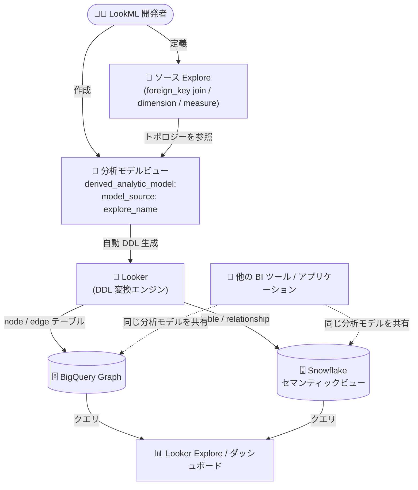

# Looker: Looker 26.14 アップデートまとめ (in-database 分析モデル、MongoSQL 対応、Unused Content Cleanup GA)

**リリース日**: 2026-08-28

**サービス**: Looker

**機能**: Looker 26.14 関連アップデート群

**ステータス**: GA / Preview / Change / Fixed / Announcement (混在)

📊 [このアップデートのインフォグラフィックを見る](https://takech9203.github.io/google-cloud-news-summary/20260828-looker-26-14-updates.html)

## 概要

Looker 26.14 に関連する一連のアップデートが発表されました。2026 年 8 月 24 日から 8 月 26 日にかけて、Looker 26.14 を実行している Looker (original) インスタンスでは対象機能が自動的に有効化されます。

今回の目玉は 3 点です。第一に、LookML の Explore 定義から in-database 分析モデル (BigQuery Graphs や Snowflake セマンティックビューなど) を直接生成できる `derived_analytic_model` パラメータの `model_source` サブパラメータが Preview として登場しました。Explore のトポロジー、`foreign_key` で定義された join、ディメンション、メジャーを Looker が自動的にデータベースネイティブな分析モデルの DDL に変換するため、データベース固有の SQL DDL を書く必要がありません。第二に、Looker が MongoSQL への接続を正式サポートしました。レガシーの MongoDB Connector for BI (MongoBI) は引き続きサポートされますが、MongoSQL ダイアレクトへの移行が推奨されます。第三に、未使用コンテンツの特定・整理を自動化する Advanced Unused Content Cleanup 機能が GA (一般提供) となりました。

このほか、ロール作成・編集 UI の刷新 (Preview)、Google Maps Enhancements の機能追加、マージクエリ編集体験の改善、JDBC パラメータの許可値制限、ダッシュボード関連の 2 件の修正が含まれます。LookML 開発者、Looker 管理者、MongoDB をデータソースとして利用するチームに影響のあるアップデートです。

**アップデート前の課題**

- BigQuery Graphs や Snowflake セマンティックビューなどの in-database 分析モデルを Looker 管理で作成するには、SQL DDL ステートメントを自分で記述する必要があった (SQL ベースの derived_analytic_model)
- Advanced Unused Content Cleanup は Preview 段階であり、Pre-GA 提供条件のもとでの限定サポートだった
- MongoDB への接続はレガシーの MongoDB Connector for BI (MongoBI) に依存し、カスタム JDBC ドライバ JAR ファイルの手動インストールが必要だった
- マージクエリタイルをダッシュボード上で編集すると新しいタブが開き、編集コンテキストが分断されていた
- ダッシュボードのパラメータフィルタが、手動で制限されたオプションリストをデフォルト値の決定時に正しく尊重しないケースがあった
- ダッシュボードタブ上のタイルが、タブを開いていなくても実行されることがあった

**アップデート後の改善**

- `model_source` サブパラメータにより、既存の LookML Explore を指定するだけで Explore のトポロジー・join・ディメンション・メジャーが in-database 分析モデルの DDL に自動変換されるようになった (Preview)
- Advanced Unused Content Cleanup が GA となり、未使用コンテンツフォルダでの特定、スケジュールされた一括クリーンアップ、所有者への自動通知、オプトアウトが正式機能として利用可能になった
- MongoSQL ダイアレクトが正式サポートされ、Apache-2.0 ライセンスの JDBC ドライバが Looker に同梱されるため、手動でのドライバインストールが不要になった
- マージクエリタイルの編集がダッシュボード編集キャンバス内の「Join data」ページで直接行えるようになった (New Looker Explore と Merge Query Experience の Preview 有効時)
- ダッシュボードパラメータフィルタとタブ上のタイル実行に関する 2 件の不具合が修正された

## アーキテクチャ図



LookML ベースの derived analytic model では、`model_source` で指定した Explore のトポロジーを Looker が自動的にデータベースネイティブの DDL に変換し、BigQuery Graph や Snowflake セマンティックビューとしてデータベース内に作成・管理します。生成された分析モデルは Looker 以外の BI ツールやアプリケーションからも共有でき、セマンティック定義の一貫性を保てます。

## サービスアップデートの詳細

### 主要機能

1. **LookML ベースの in-database 分析モデル定義 (Preview)**
   - `derived_analytic_model` パラメータの新しい `model_source` サブパラメータにより、既存の LookML Explore から Looker 管理の in-database 分析モデルを直接定義できる
   - Looker が Explore のトポロジーを自動変換: 各 LookML ビューは BigQuery Graph のノードテーブル (Snowflake ではテーブル) に、`foreign_key` で定義された join はエッジテーブル (Snowflake ではリレーションシップ) に、ディメンションとメジャーはノードプロパティ (Snowflake ではディメンションとメトリクス) になる
   - 分析モデルビューに対する Explore をクエリすると、Looker がデータベースのスクラッチスキーマに分析モデルを作成する DDL を生成・実行し、以降は LookML 定義が変更されるまで既存モデルを再利用する
   - derived table と異なり、分析モデルオブジェクトはデータベース内にデータを永続化せず、増分更新も行わない (リレーションシップとメジャーを定義するセマンティックモデル)
   - BigQuery と Snowflake の接続のみサポート
   - `fields` サブパラメータでエクスポートするフィールドの許可/拒否リストを指定でき、`join` リファインメントで分析モデル専用に `foreign_key` を追加定義できる

2. **Advanced Unused Content Cleanup の GA 化**
   - 未使用コンテンツ (指定期間内の閲覧数 0、アクティブなスケジュールなし、所有者による一時除外なし) を「Unused content」フォルダで一元的に特定・管理できる
   - 管理者はコンテンツの個別または一括 (1 スケジュールあたりダッシュボード 30 件 / Look 30 件まで) のクリーンアップをスケジュールでき、コンテンツ所有者へ自動通知が送られる
   - コンテンツ所有者は特定コンテンツを自動クリーンアップからオプトアウトできる (オプトアウト後 90 日間はスケジュール対象外)
   - ゴミ箱への移動は論理削除であり、管理者は Trash フォルダから復元可能
   - 利用には `save_dashboards` または `save_looks` 権限が必要 (機能の有効化には Admin ロールが必要)

3. **MongoSQL 接続の正式サポート (Announcement)**
   - Looker が MongoSQL ダイアレクト (MongoSQL Interface) による MongoDB への直接接続をサポート
   - Apache-2.0 ライセンスの JDBC ドライバが Looker に同梱されており、レガシーの MongoBI ダイアレクトと異なりカスタム JDBC ドライバ JAR の手動インストールが不要
   - 既存の MongoDB Connector for BI (MongoBI) 接続は引き続きサポートされるが、MongoSQL ダイアレクトへの更新が推奨される
   - MongoDB Connector for BI の非推奨化の 1 年前に顧客へ通知が行われる予定

4. **New/Edit Roles Enhancement (Preview)**
   - Admin パネルの Users セクションにある Roles ページで、ロールの作成・編集向けにモダナイズされたステップバイステップのインターフェースを提供

5. **Google Maps Enhancements の機能追加 (Change)**
   - Dual-axis Map がポイントとサークルをサポート
   - TopoJSON ファイルの URL を指定したカスタムマップレイヤーに対応

6. **マージクエリ編集体験の改善 (Change)**
   - New Looker Explore と Merge Query Experience の Preview 機能が有効な場合、ダッシュボード上のマージクエリタイルの編集が、新しいタブではなくダッシュボード編集キャンバス内の「Join data」ページで直接開くようになった

7. **JDBC パラメータの許可値制限 (Change)**
   - データベース接続時に追加の JDBC パラメータを指定できるが、Looker が一部パラメータの許可値を制限するようになった
   - 許可される値は、各ダイアレクトのデータベース構成ページの「Supported JDBC parameters」セクションに記載される

8. **不具合修正 (Fixed)**
   - ダッシュボードのパラメータフィルタが、デフォルト値の決定時に手動で制限されたオプションリストを正しく尊重するようになった
   - ダッシュボードタブ上のタイルは、保存先のタブが開かれたときにのみ実行されるようになった

## 技術仕様

### LookML ベース derived analytic model の変換マッピング

| LookML 要素 | BigQuery Graph | Snowflake セマンティックビュー |
|------|------|------|
| ソース Explore 内の各ビュー | ノードテーブル | テーブル |
| `foreign_key` 付き join | エッジテーブル | リレーションシップ |
| ディメンション / メジャー | ノードプロパティ | ディメンション / メトリクス |

### derived_analytic_model の主な制約 (Preview)

| 項目 | 詳細 |
|------|------|
| 対応接続 | BigQuery、Snowflake のみ |
| 主キー | ソース Explore 内のビューは `primary_key: yes` の定義が必須 |
| join 要件 | ソース Explore の各 join に `foreign_key` パラメータが必須 (join リファインメントで追加定義可) |
| 対応データ型 | dimension/measure: string, number, date, yesno / dimension のみ: time, date_time |
| メジャー | ベースメジャーはデータベース側の分析モデルで事前定義が必要。Looker 側で新規の集計 (sum, count 等) は定義不可。既存メジャーに基づく非集計型の派生メジャーは定義可 |
| join 制限 | 分析モデルベースの Explore には join を含められない。標準 LookML ビューの Explore への join も不可 |
| 非対応機能 | フィルタ付きメジャー、Aggregate Awareness、カスタムカレンダー等の暗黙 join に依存する機能、Looker legacy runtime |

### LookML 定義例

```lookml
view: sales_analytic_model {
  derived_analytic_model: {
    model_source: order_items {
      fields: [order_items.id, orders.id, orders.status, users.name]
      join: +orders {
        foreign_key: order_id
      }
      join: +users {
        foreign_key: orders.user_id
      }
    }
  }
}
```

## 設定方法

### 前提条件 (LookML ベース derived analytic model)

1. BigQuery または Snowflake への接続を使用していること
2. ソース Explore 内の各ビューに `primary_key: yes` が定義されていること
3. ソース Explore の各 join に `foreign_key` が定義されていること (または `model_source` 内の join リファインメントで定義)

### 手順

#### ステップ 1: ソース Explore の定義

```lookml
explore: order_items {
  fields: [ALL_FIELDS*]
  join: orders {
    relationship: many_to_one
    foreign_key: order_id
  }
  join: users {
    relationship: many_to_one
    foreign_key: orders.user_id
  }
}
```

ベースビューに主キーを定義し、`foreign_key` を使用した join で Explore を定義します。

#### ステップ 2: 分析モデルビューの作成

```lookml
view: sales_analytic_model {
  derived_analytic_model: {
    model_source: order_items {}
  }
  # 生成された分析モデルのプロパティにマップする
  # dimension / dimension_group / measure を定義
  dimension: orders_status {
    type: string
    sql: ${TABLE}.orders_status ;;
  }
  measure: total_order_amount {
    type: number
    sql: ${TABLE}.orders_total_order_amount ;;
  }
}
```

`model_source` でソース Explore を指定し、`${TABLE}.<view_name>_<field_name>` 形式で生成モデルのプロパティを参照するフィールドを定義します。その後、この分析モデルビューに対する Explore を作成してクエリします。

#### 参考: MongoBI から MongoSQL への移行手順

1. MongoDB ドキュメント「Transition from Atlas BI Connector to MongoSQL」で SQL 構文の差異を確認する
2. Looker で MongoSQL の新規接続をセカンダリ接続として作成する
3. LookML プロジェクトの新しい開発ブランチで、モデルファイルの `connection` パラメータを MongoSQL 接続に変更する
4. SQL Runner で Explore のサンプルクエリを実行し、構文と結果を検証する
5. Content Validator でダッシュボードと Look の破損参照をスキャンし、Looker CI の SQL Validator でディメンションを検証する
6. 検証エラーを解消後、本番環境にデプロイする

**注意**: カスタム SQL ブロック、日付フォーマット、データベース関数を使用する既存の LookML モデルは構文調整が必要な場合があります。検証なしに本番接続を直接 MongoSQL に切り替えると、ダッシュボード、Look、スケジュール、アラートが壊れる可能性があります。

## メリット

### ビジネス面

- **セマンティック定義の一貫性**: Explore で定義したセマンティックモデルを BigQuery Graph や Snowflake セマンティックビューとしてデータベース側に公開でき、Looker 以外の BI ツールやアプリケーションとも定義を共有できる
- **ガバナンスの向上**: Advanced Unused Content Cleanup の GA により、肥大化しがちなダッシュボード・Look を正式サポートのもとで計画的に整理でき、インスタンスの健全性を維持できる
- **MongoDB 活用の将来性確保**: MongoSQL への移行パスが明確になり、MongoBI 非推奨化 (1 年前通知) に先立って計画的に移行できる

### 技術面

- **DDL 記述の自動化**: `model_source` により、データベース固有の SQL DDL を書かずに Explore 定義から in-database 分析モデルを生成・管理できる
- **運用負荷の軽減**: MongoSQL ダイアレクトは JDBC ドライバが同梱されており、MongoBI で必要だったカスタム JDBC ドライバの手動インストールが不要
- **バージョン管理との統合**: in-database 分析モデルは Looker IDE、バージョン管理、Continuous Integration で管理できる

## デメリット・制約事項

### 制限事項

- in-database 分析モデル (derived_analytic_model) は Preview であり、Pre-GA 提供条件が適用される。対応接続は BigQuery と Snowflake のみ
- 分析モデルでは対応データ型が限定され、Looker 側での新規集計メジャー定義、join、フィルタ付きメジャー、Aggregate Awareness などが利用できない
- Advanced Unused Content Cleanup の一括スケジュールは 1 スケジュールあたりコンテンツタイプごとに 30 件まで
- Advanced Unused Content Cleanup は Looker 26.6 以降が必要で、Looker (original) は Looker ホスト型インスタンスであることが条件 (Preview 時点のドキュメント記載)

### 考慮すべき点

- 2026 年 8 月 24 日〜26 日に Looker 26.14 の Looker (original) インスタンスで対象機能が自動有効化されるため、管理者は挙動変更 (マージクエリ編集、Google Maps Enhancements など) を事前に把握しておく
- MongoBI から MongoSQL への移行では SQL 構文差異による LookML の修正が必要になる場合があり、検証プロセス (SQL Runner、Content Validator、Looker CI) を経てから本番切り替えを行うべき
- JDBC パラメータの許可値制限により、これまで指定していたパラメータが制限対象になっていないか、各ダイアレクトのドキュメントで確認が必要

## ユースケース

### ユースケース 1: Explore 定義を BigQuery Graph として全社共有

**シナリオ**: Looker で EC サイトの注文分析用 Explore (orders、order_items、users) を運用しているが、データサイエンスチームが BigQuery 上で直接グラフ分析を行いたい。セマンティック定義を二重管理したくない。

**実装例**:
```lookml
view: sales_analytic_model {
  derived_analytic_model: {
    model_source: order_items {
      fields: [order_items.id, order_items.price, orders.id, orders.status, users.name]
    }
  }
}
```

**効果**: Looker が Explore トポロジーから BigQuery Graph のノード/エッジテーブルの DDL を自動生成・管理し、Looker と BigQuery 直接利用の両方で一貫したセマンティック定義を共有できる。

### ユースケース 2: MongoDB データソースの近代化

**シナリオ**: MongoDB Atlas 上のドキュメントデータを MongoBI 経由で Looker から分析しているが、カスタム JDBC ドライバの管理負荷が高く、コネクタの将来的な非推奨化にも備えたい。

**効果**: MongoSQL ダイアレクトへ移行することで、同梱 JDBC ドライバによる運用簡素化と、MongoBI 非推奨化への事前対応を実現できる。セカンダリ接続と開発ブランチを使った段階的移行により、既存コンテンツへの影響を抑えられる。

### ユースケース 3: 大規模インスタンスのコンテンツ棚卸し

**シナリオ**: 数千のダッシュボードと Look が蓄積し、どれが実際に使われているか分からない。手動での棚卸しは現実的でない。

**効果**: GA となった Advanced Unused Content Cleanup により、閲覧数 0 のコンテンツを Unused content フォルダで特定し、所有者への自動通知付きでクリーンアップをスケジュールできる。所有者はオプトアウトで必要なコンテンツを保護でき、誤削除はゴミ箱からの復元で救済できる。

## 料金

今回のアップデートに固有の料金情報は Release Notes に記載されていません。Looker の料金体系 (プラットフォーム利用料 + ユーザーライセンス) の詳細は料金ページを参照してください。

- [Looker 料金ページ](https://cloud.google.com/looker/pricing)

## 関連サービス・機能

- **BigQuery (BigQuery Graph)**: LookML ベース derived analytic model の生成先。Explore のビューがノードテーブル、join がエッジテーブルに変換される
- **Snowflake (セマンティックビュー)**: derived analytic model のもう 1 つの生成先。テーブルとリレーションシップ、ディメンションとメトリクスに変換される
- **Looker Continuous Integration (Looker CI)**: in-database 分析モデルの管理や、MongoSQL 移行時の SQL Validator による検証に利用
- **MongoDB Atlas (MongoSQL Interface)**: 新たにサポートされた MongoSQL ダイアレクトの接続先
- **Content Validator / SQL Runner**: MongoSQL 移行時のコンテンツ・クエリ検証に利用

## 参考リンク

- 📊 [インフォグラフィック](https://takech9203.github.io/google-cloud-news-summary/20260828-looker-26-14-updates.html)
- [公式リリースノート](https://docs.cloud.google.com/release-notes#August_28_2026)
- [in-database 分析モデルの概要](https://docs.cloud.google.com/looker/docs/analytic-models)
- [derived_analytic_model パラメータリファレンス](https://docs.cloud.google.com/looker/docs/reference/param-view-derived-analytic-model)
- [MongoSQL への接続](https://docs.cloud.google.com/looker/docs/db-config-mongosql)
- [MongoDB Connector for BI と MongoSQL への移行](https://docs.cloud.google.com/looker/docs/db-config-mongodb#migrating-to-mongosql)
- [未使用コンテンツの管理 (Advanced Unused Content Cleanup)](https://docs.cloud.google.com/looker/docs/manage-unused-content)
- [Looker 料金ページ](https://cloud.google.com/looker/pricing)

## まとめ

Looker 26.14 では、LookML Explore から BigQuery Graph や Snowflake セマンティックビューを自動生成する `model_source` (Preview) が加わり、Looker のセマンティックレイヤーをデータベース側へ展開する戦略が一段と具体化しました。あわせて Advanced Unused Content Cleanup の GA と MongoSQL の正式サポートにより、コンテンツガバナンスとデータソース近代化の両面で運用改善が期待できます。Looker (original) インスタンスでは 8 月 24 日〜26 日に対象機能が自動有効化されるため、管理者は挙動変更点の確認を、MongoBI 利用者は MongoSQL への移行計画の検討を推奨します。

---

**タグ**: Looker, LookML, derived_analytic_model, BigQuery Graph, Snowflake, MongoSQL, MongoDB, Advanced Unused Content Cleanup, BI, セマンティックレイヤー, Preview, GA
