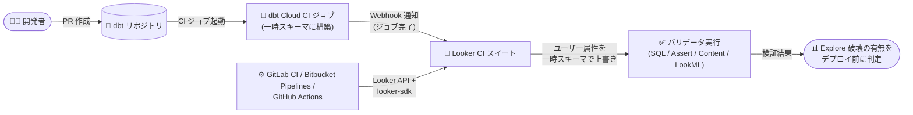

# Looker: Continuous Integration の機能強化 (dbt Cloud CI 連携と外部 CI/CD ワークフローからのトリガー対応)

**リリース日**: 2026-08-28

**サービス**: Looker

**機能**: Continuous Integration (CI) の dbt Cloud CI 連携、および GitLab CI / Bitbucket Pipelines / GitHub Actions からのトリガー対応

**ステータス**: 一般提供 (Looker 26.14 リリースの一部)

📊 [このアップデートのインフォグラフィックを見る](https://takech9203.github.io/google-cloud-news-summary/20260828-looker-continuous-integration-enhancements.html)

## 概要

Looker 26.14 リリースの一部として、Looker Continuous Integration (CI) に 2 つの機能強化が発表されました。1 つ目は **dbt Cloud CI 連携**で、dbt Cloud の CI ジョブが完了したタイミングで Looker の CI スイートを自動実行できるようになりました。これにより、dbt モデルの変更が Looker Explore で SQL エラーを引き起こさないかを、dbt の変更がデプロイされる前に検証できます。2 つ目は**外部 CI/CD ワークフローからのトリガー対応**で、Looker API と公式 Python SDK (`looker-sdk`) を使用して、GitLab CI、Bitbucket Pipelines、GitHub Actions のワークフローから Looker CI を起動できるようになりました。

Looker CI は、SQL Validator / Assert Validator / Content Validator / LookML Validator の 4 つのバリデータで構成され、SQL・データテスト・コンテンツ・LookML の問題を本番反映前に検出する機能です。今回のアップデートにより、dbt によるデータ変換レイヤーの変更と LookML のセマンティックレイヤーの整合性検証がパイプラインとして自動化され、さらに組織が既に利用している CI/CD 基盤に Looker の検証を組み込めるようになりました。

対象ユーザーは、dbt Cloud と Looker を併用しているアナリティクスエンジニアリングチームや、GitLab / Bitbucket / GitHub Actions ベースの CI/CD パイプラインで LookML プロジェクトの品質管理を統合したいデータプラットフォームチームです。

**アップデート前の課題**

- Looker CI の自動トリガーは、LookML リポジトリへの pull request 送信時とスケジュール実行に限られており、dbt モデルの変更 (カラム削除やテーブル名変更など) が Looker Explore を壊すかどうかは、dbt の変更が本番にデプロイされた後でないと検出できなかった
- dbt 側の変更による Looker 側への影響確認は、手動で CI スイートを実行するか、本番反映後のエラー発生で気付く運用になりがちだった
- CI スイートのトリガー手段が Looker 内部 (IDE からの手動実行、LookML の pull request、スケジュール) に閉じており、GitLab CI や Bitbucket Pipelines など組織の既存 CI/CD パイプラインから Looker の検証を呼び出す公式な手順が案内されていなかった

**アップデート後の改善**

- dbt Cloud CI ジョブの完了をトリガーに CI スイートが自動実行され、dbt モデルの変更が Looker Explore に SQL エラーを引き起こすかどうかを、dbt の変更のデプロイ前に検証できるようになった
- dbt Cloud が CI 実行用に作成する一時スキーマを Looker が自動的に識別し、ユーザー属性を一時スキーマ名で上書きしてバリデータを実行するため、破壊的変更 (カラム削除、テーブル名変更など) をマージ前に検出できるようになった
- Looker API と公式 Python SDK (`looker-sdk`) を使用して、GitLab CI、Bitbucket Pipelines、GitHub Actions のワークフローから Looker CI をトリガーできるようになり、設定手順とサンプルスクリプトが Admin settings - Continuous Integration ドキュメントで案内されるようになった

## アーキテクチャ図

dbt Cloud の CI ジョブ完了が Webhook 経由で Looker CI スイートをトリガーし、dbt が作成した一時スキーマに対してバリデータを実行するパイプラインです。加えて、GitLab CI / Bitbucket Pipelines / GitHub Actions からも Looker API と Python SDK 経由で CI を起動できます。

## サービスアップデートの詳細

### 主要機能

1. **dbt Cloud CI ジョブ完了時の CI スイート自動実行 (Feature)**
   - CI スイートの作成・編集時に「Trigger on pull requests from dbt Cloud」トグルを有効化することで設定する
   - トリガー対象の **dbt Cloud Job** (CI ジョブタイプのみ対応) と、データベース接続のスキーマ名を保持する **Schema user attribute** を指定する
   - スイート保存時に、Looker が dbt Cloud アカウントにジョブ完了を待ち受ける Webhook を自動登録する

2. **一時スキーマの動的識別とユーザー属性の上書き**
   - dbt Cloud トリガーの CI 実行では、Looker が dbt Cloud の実行ごとに作成される一時スキーマを動的に識別する
   - CI 実行の間だけ、設定したユーザー属性 (例: 接続のスキーマ属性) を一時スキーマ名で上書きし、その一時スキーマに対してバリデータを実行する
   - これにより、カラム削除やテーブル名変更のような破壊的変更が dbt の本番マージ前に検出できる。実行完了後、ユーザー属性の値は CI ユーザーの標準値に戻る

3. **外部 CI/CD ワークフローからのトリガー対応 (Change)**
   - Looker CI を GitLab CI、Bitbucket Pipelines、GitHub Actions の各ワークフローからトリガーできることが明確化された
   - Looker API と公式 Looker Python SDK (`looker-sdk`) を使用する
   - 設定手順とサンプルスクリプトは [Admin settings - Continuous Integration ドキュメント](https://docs.cloud.google.com/looker/docs/admin-panel-platform-ci)で案内される

## 技術仕様

### Looker CI の利用要件

| 項目 | 詳細 |
|------|------|
| インスタンス | Looker がホストするインスタンスで、CI が有効化されていること |
| Looker (Google Cloud core) の制約 | Public 接続構成のみサポート。CMEK 有効インスタンス、Private / Hybrid 接続構成では非サポート |
| CI ユーザー | CI 有効化時に Looker CI Users グループ (Looker CI Users ロール) の CI ユーザーが 10 個自動作成される |
| 権限 | CI スイートの作成・設定には `manage_ci` 権限、手動実行・再実行には `see_ci` 権限が必要 |
| バリデータ | SQL Validator / Assert Validator / Content Validator / LookML Validator |
| データ所在 | CI は一部データを米国に保存するため、データ所在地要件があるインスタンスでは有効化しないこと |

### dbt Cloud 連携の Admin 設定 (Continuous Integration Admin ページ)

| 設定項目 | 内容 |
|----------|------|
| dbt Cloud Host URL | dbt Cloud アカウントの URL |
| dbt Cloud API Key | dbt Cloud のサービスアカウントトークン |
| Test Connection | Looker が dbt Cloud への接続を検証し、dbt Cloud Account ID を取得 |
| User Attributes | CI 実行時に上書き可能なユーザー属性と CI 実行用の値のペアを登録 (dbt Cloud の一時スキーマを指すために使用) |

## 設定方法

### 前提条件

1. CI の利用要件を満たす Looker インスタンスで、Admin メニューの Platform セクションにある Continuous Integration ページから CI が有効化されていること
2. dbt Cloud 連携の場合: dbt Cloud アカウントとサービスアカウントトークンを用意し、Continuous Integration Admin ページで dbt Cloud Configuration (Host URL / API Key) を設定済みであること
3. CI スイートを設定する Looker ユーザーが `manage_ci` 権限を持つこと

### 手順 (dbt Cloud トリガーの設定)

#### ステップ 1: Admin ページで dbt Cloud 連携とユーザー属性を設定する

Continuous Integration Admin ページの dbt Cloud Configuration セクションで dbt Cloud Host URL と dbt Cloud API Key (サービスアカウントトークン) を入力し、**Test Connection** で接続を検証して **Save** をクリックします。あわせて User Attributes セクションで、CI 実行時に上書きするユーザー属性 (スキーマ名を保持する属性) と CI 実行用の値を登録します。

#### ステップ 2: CI スイートで dbt Cloud トリガーを有効化する

Looker IDE のナビゲーションバーから Continuous Integration アイコン → Suites タブを開き、スイートの作成または編集画面で **Trigger on pull requests from dbt Cloud** トグルを有効化して、以下を設定します。

- **dbt Cloud Job**: このスイートをトリガーする dbt Cloud CI ジョブをドロップダウンから選択 (CI ジョブタイプのみ表示。手動の dbt Cloud 実行は非対応)
- **Schema user attribute**: データベース接続のスキーマ名を保持する Looker ユーザー属性を選択 (Admin パネルで CI 用に有効化された属性のみ表示)

スイートを保存すると、Looker が dbt Cloud アカウントにジョブ完了を待ち受ける Webhook を自動登録します。必要に応じて **Enable email alerts** トグルで CI 実行結果 (Failed / Error / Passed / Cancelled) のメールアラートも設定できます。

### 手順 (外部 CI/CD ワークフローからのトリガー)

GitLab CI、Bitbucket Pipelines、GitHub Actions の各ワークフローからは、Looker API と公式 Looker Python SDK (`looker-sdk`) を使用して CI をトリガーします。具体的な設定手順とサンプルスクリプトは [Admin settings - Continuous Integration ドキュメント](https://docs.cloud.google.com/looker/docs/admin-panel-platform-ci)を参照してください。

## メリット

### ビジネス面

- **本番障害の未然防止**: dbt モデルの破壊的変更 (カラム削除、テーブル名変更など) がダッシュボードや Explore を壊す前に検出できるため、ビジネスユーザーが目にするレポートの信頼性が向上する
- **データチームと BI チームの連携強化**: データ変換レイヤー (dbt) とセマンティックレイヤー (LookML) の整合性検証が自動化され、チーム間の手動確認コストが削減される

### 技術面

- **一時スキーマに対する検証の自動化**: dbt Cloud CI が作成する一時スキーマを Looker が動的に識別しユーザー属性を上書きするため、検証環境の手動セットアップが不要
- **既存 CI/CD 基盤への統合**: GitLab CI / Bitbucket Pipelines / GitHub Actions から Looker API 経由で CI を起動でき、組織の標準パイプラインに Looker の検証ステップを組み込める
- **Webhook の自動登録**: dbt Cloud トリガーを有効化したスイートを保存するだけで Webhook が自動登録され、dbt Cloud 側での手動の Webhook 設定が不要

## デメリット・制約事項

### 制限事項

- dbt Cloud トリガーで対応するのは dbt Cloud の **CI ジョブタイプのみ**で、手動の dbt Cloud 実行はサポートされない
- dbt Cloud CI ジョブによってトリガーされた CI 実行は**本番 LookML ブランチに対して実行される**ため、Content Validator と LookML Validator は開発ブランチ上のエラーを検証しない
- Looker (Google Cloud core) インスタンスでは、CI は Public 接続構成のみサポート。CMEK 有効インスタンスや Private / Hybrid 接続構成では利用できない
- CI は一部データを米国に保存するため、データ所在地要件があるインスタンスでは有効化すべきでない。また、Looker CI は FedRAMP High / Moderate、DoD IL5 の認可境界に含まれない

### 考慮すべき点

- Looker の Continuous Integration はレガシーのスタンドアロン Spectacles サービスをベースにしており、スタンドアロン Spectacles サービス自体は 2026 年 11 月 30 日以降に廃止が開始される。既存の Spectacles ユーザーは Looker CI への移行を計画する必要がある
- dbt Cloud 連携には dbt Cloud のサービスアカウントトークンが必要となるため、トークンの管理・ローテーション運用を検討する
- Looker (original) インスタンスで IP 許可リストを使用している場合、CI 用の IP アドレスを手動で追加する必要がある (IP アドレスはサポートに問い合わせ)

## ユースケース

### ユースケース 1: dbt モデル変更のマージ前検証

**シナリオ**: アナリティクスエンジニアが dbt リポジトリに pull request を作成し、既存モデルのカラム名を変更した。この変更が Looker の Explore やダッシュボードを壊さないかをマージ前に確認したい。

**実装例**:

1. dbt リポジトリへの PR 作成で dbt Cloud の CI ジョブが起動し、一時スキーマに変更後のモデルを構築
2. ジョブ完了の Webhook を受けて Looker CI スイートが自動実行され、スキーマ属性を一時スキーマ名で上書き
3. SQL Validator が Explore のディメンションを一時スキーマに対して検証し、参照切れのカラムを検出
4. 検証結果 (Failed) を確認して、dbt の変更マージ前に LookML 側の修正を計画

**効果**: dbt の破壊的変更による Looker 側の SQL エラーを本番デプロイ前に検出でき、ダッシュボード障害を未然に防止できる。

### ユースケース 2: 既存 CI/CD パイプラインへの Looker 検証の組み込み

**シナリオ**: 組織の標準 CI/CD 基盤が GitLab CI であり、データ関連リポジトリのパイプラインの一部として Looker の検証を実行し、結果をパイプラインの成否に反映させたい。

**効果**: Looker API と公式 Python SDK (`looker-sdk`) を使ったスクリプトをパイプラインのジョブとして実行することで、Looker CI を既存パイプラインに統合でき、Looker IDE を開かずに検証を自動化できる。GitHub Actions や Bitbucket Pipelines でも同様に構成可能。

## 料金

Looker CI 機能自体の追加料金に関する公式情報は確認できませんでした。Looker の料金の詳細は公式の料金ページを参照してください。

- [Looker 料金ページ](https://cloud.google.com/looker/pricing)

## 関連サービス・機能

- **dbt Cloud**: dbt モデルの CI ジョブが Looker CI スイートのトリガーとなる。連携には dbt Cloud のサービスアカウントトークンが必要
- **GitHub / GitLab / Bitbucket**: LookML リポジトリのホスティングと、外部 CI/CD ワークフロー (GitHub Actions / GitLab CI / Bitbucket Pipelines) からの Looker CI トリガーに使用。なお、LookML の pull request トリガー (CI GitHub app) はクラウド版 GitHub のみ対応
- **Looker API / Looker Python SDK (looker-sdk)**: 外部 CI/CD ワークフローから CI をトリガーするためのインターフェース
- **LookML データテスト (Assert Validator)**: CI スイート内で LookML の data tests を実行し、失敗とエラーを報告

## 参考リンク

- 📊 [インフォグラフィック](https://takech9203.github.io/google-cloud-news-summary/20260828-looker-continuous-integration-enhancements.html)
- [公式リリースノート](https://docs.cloud.google.com/release-notes#August_28_2026)
- [Looker Continuous Integration の概要](https://docs.cloud.google.com/looker/docs/continuous-integration)
- [CI スイートの作成 (dbt Cloud トリガー)](https://docs.cloud.google.com/looker/docs/ci-create-suite)
- [CI スイートの実行](https://docs.cloud.google.com/looker/docs/ci-run-suite)
- [Admin settings - Continuous Integration](https://docs.cloud.google.com/looker/docs/admin-panel-platform-ci)
- [Looker 料金ページ](https://cloud.google.com/looker/pricing)

## まとめ

今回のアップデートにより、Looker CI は dbt Cloud CI ジョブの完了を起点とした自動検証と、GitLab CI / Bitbucket Pipelines / GitHub Actions からの API ベースのトリガーに対応し、データ変換からセマンティックレイヤーまでを貫く品質ゲートとして CI/CD パイプラインに組み込みやすくなりました。dbt Cloud と Looker を併用しているチームは、CI スイートの dbt Cloud トリガーを有効化して破壊的変更のマージ前検出を導入することを推奨します。また、レガシー Spectacles を利用中のチームは 2026 年 11 月 30 日以降の廃止開始に備えて Looker CI への移行を計画してください。

---

**タグ**: Looker, Continuous Integration, dbt Cloud, CI/CD, GitHub Actions, GitLab CI, Bitbucket Pipelines, looker-sdk, LookML, データ品質
