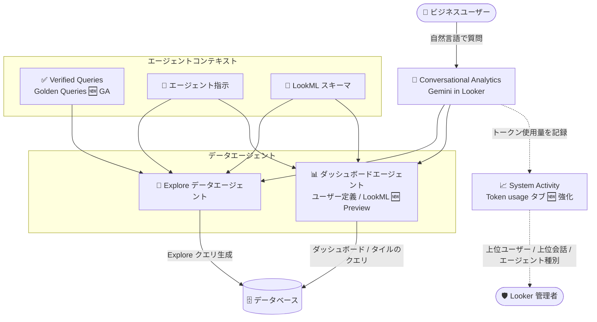

# Looker: Conversational Analytics アップデート (Verified Queries GA / LookML ダッシュボードエージェント / トークン使用量オブザーバビリティ強化)

**リリース日**: 2026-08-28

**サービス**: Looker

**機能**: Conversational Analytics — Verified Queries (Golden Queries) GA、LookML ダッシュボードのデータエージェント対応 (Preview)、System Activity トークン使用量タブの強化

**ステータス**: GA (Verified Queries) / Preview (LookML ダッシュボードエージェント) / Changed (System Activity)

📊 [このアップデートのインフォグラフィックを見る](https://takech9203.github.io/google-cloud-news-summary/20260828-looker-conversational-analytics-updates.html)

## 概要

Looker 26.14 リリースの一部として、Gemini for Google Cloud を活用した自然言語データ分析機能「Conversational Analytics」に関する 3 つのアップデートが発表されました。自然言語での質問に対する回答精度を高める「Verified Queries (Golden Queries)」が一般提供 (GA) となり、Looker (Google Cloud core) インスタンスでも定義できるようになりました。また、LookML ダッシュボード上でデータエージェントを定義してチャットできる機能が Preview として追加され、System Activity の Conversational Analytics ダッシュボードにおけるトークン使用量のオブザーバビリティも強化されています。

Verified Queries は、自然言語の質問とそれに対応する正確な Looker Explore クエリのペアをあらかじめ定義しておく仕組みで、エージェントが複雑なビジネス上の質問を推測に頼らず処理するための「正解 (gold standard)」として機能します。今回の GA 化により、本番環境での利用を前提とした Explore データエージェントの精度向上施策として正式に採用できるようになりました。

対象ユーザーは、Conversational Analytics を組織展開する Looker 管理者・LookML 開発者、およびダッシュボードを通じてセルフサービス分析を行うビジネスユーザーです。特にトークン使用量の可視化強化は、Gemini in Looker のコスト管理を担う管理者にとって重要なアップデートです。

**アップデート前の課題**

- Verified Queries は Preview 機能であり、利用には Gemini in Looker 管理ページで Enable Trusted Tester Features 配下の Verified Queries 設定を有効化する必要があった。また Looker (original) インスタンスでのみ利用可能で、Looker (Google Cloud core) インスタンスでは定義できなかった
- ダッシュボードエージェントによるチャットはユーザー定義ダッシュボードが中心で、LookML ダッシュボード上でのデータエージェント定義・会話には対応が限定的だった
- System Activity の Conversational Analytics ダッシュボードの Token usage タブでは、合計トークン数・日次推移・エージェント別トークン使用量は確認できたが、どのユーザー・どの会話がトークンを多く消費しているかを特定できず、データエージェントの種別も判別できなかった

**アップデート後の改善**

- Verified Queries (Golden Queries) が GA となり、Pre-GA 利用規約の制約なく本番利用が可能になった。Looker (Google Cloud core) インスタンスでも Verified Queries を定義できるようになった
- LookML ダッシュボード上でデータエージェントを定義してチャットできるようになった (Preview)。利用には Gemini in Looker 管理ページで Conversational Analytics 設定と Enable Dashboard Agents 設定の有効化が必要
- Token usage タブに、トークン使用量の多い上位ユーザー (top users) と上位会話 (top conversations) のオブザーバビリティ情報が追加され、メトリクスにデータエージェントの種別 (Explore エージェント / ダッシュボードエージェントなど) が表示されるようになった

## アーキテクチャ図



Conversational Analytics のデータエージェントは、LookML スキーマ・エージェント指示・Verified Queries をコンテキストとして自然言語の質問を Looker クエリに変換します。今回のアップデートで Verified Queries が GA になり、LookML ダッシュボードでのエージェント定義 (Preview) と System Activity でのトークン使用量オブザーバビリティ強化が加わりました。

## サービスアップデートの詳細

### 主要機能

1. **Verified Queries (Golden Queries) の一般提供 (GA)**
   - 自然言語の質問と、それに対応する正確な Looker Explore クエリのペアを事前定義し、エージェントの「正解」として機能させる仕組み
   - 適切に定義された Verified Queries により、Explore データエージェントの応答精度が向上する
   - Looker (Google Cloud core) インスタンスでも定義可能になった (従来の Preview では Looker (original) のみ)
   - エージェントの作成・編集画面で「+ Add verified query」を選択し、自然言語の質問 (Question) と対応する Explore の URL (Answer) を登録する。Preview ボタンで Explore クエリを検証できる

2. **LookML ダッシュボードのデータエージェント対応 (Preview)**
   - LookML ダッシュボード上でデータエージェントを定義し、「Chat with this dashboard」からダッシュボードとその配下のクエリ連携タイルに対して自然言語で質問できる
   - 利用には Gemini in Looker 管理ページで Conversational Analytics 設定と Enable Dashboard Agents 設定の両方を有効化する必要がある
   - 「Manage agent」からエージェント情報を編集でき、Advanced options で Advanced Analytics の有効化、Show thinking (推論ステップ・生成クエリ・データテーブルの表示)、Show debug info (実行ステップの表示) を設定できる
   - LookML ダッシュボードエージェントではエージェント指示 (instructions) の編集はできない (ユーザー定義ダッシュボードエージェントとの相違点)

3. **System Activity: Token usage タブのオブザーバビリティ強化 (Changed)**
   - Conversational Analytics System Activity ダッシュボードの Token usage タブに、トークン使用量の多い上位ユーザー (top users) と上位会話 (top conversations) の情報が追加された
   - オブザーバビリティメトリクスにデータエージェントの種別が表示されるようになり、Explore エージェントとダッシュボードエージェントなどの内訳を把握できる
   - 従来から提供されている指標: Total Estimated Input Tokens、Total Estimated Output Tokens、Daily Estimated Token Usage、Top Agents by Token Usage
   - ダッシュボードは 24 時間ごとに更新され、トークン計測は Conversational Analytics Agent Token usage プレビュー機能を有効化した時点から開始される

## 技術仕様

### Verified Queries の制限事項

| 項目 | 詳細 |
|------|------|
| 対応エージェント | Explore データエージェントのみ (スタンドアロン会話、ダッシュボードエージェントでは利用不可) |
| Explore の条件 | エージェントに定義済みの Explore を参照する必要がある (未定義の Explore を参照するとエラー) |
| 非対応クエリ | カスタムフィールドやピボットを含む Explore クエリは非対応 |
| 推奨数 | 登録数に上限はないが、エージェントあたり 30〜50 ペアを推奨 |

### Conversational Analytics のトークン計測

| トークン種別 | 含まれる内容 |
|------|------|
| 入力データトークン | チャットに入力された質問、セッションの会話履歴、メタデータやエージェント指示などのデータコンテキスト |
| 出力データトークン | 自然言語の回答、データ取得のために生成された API 呼び出しや SQL クエリ、モデルが生成したビジュアライゼーションなど |

## 設定方法

### 前提条件

1. Looker インスタンスで Gemini in Looker が有効化されていること
   - Looker (original): 管理者が Gemini in Looker 設定と Conversational Analytics 設定を有効化
   - Looker (Google Cloud core): `roles/looker.admin` IAM ロールを持つユーザーが Google Cloud コンソールで Gemini in Looker を有効化し、Looker 管理パネルの Gemini in Looker ページで Conversational Analytics 設定を有効化
2. ダッシュボードエージェント / エージェントワークフローを利用する場合は Looker 26.8 以降
3. IP 許可リストを構成している場合は、Google Cloud サービスからの接続を許可する設定 (Looker (original): Allow Google Cloud services 設定、Looker (Google Cloud core): Link Google services with this instance チェックボックス) が必要

### 手順

#### ステップ 1: ダッシュボードエージェントの有効化 (Preview 機能)

Gemini in Looker 管理ページで以下を有効化します。

1. **Conversational Analytics** 設定をオンにする
2. **Enable Dashboard Agents** 設定をオンにする (Enable Trusted Tester Features 配下の場合はそちらも有効化)

#### ステップ 2: Verified Query の追加

1. Explore を少なくとも 1 つデータソースとするデータエージェントを作成、または既存エージェントを編集する
2. エージェントの作成・編集ページで **+ Add verified query** を選択する
3. **Question** にユーザーが尋ねそうな自然言語の質問を入力する
4. **Answer** に正しいクエリまたはビジュアライゼーションを表す Explore の URL を貼り付ける (空欄のまま **Preview** をクリックして Explore ビルダーでクエリを新規作成することも可能)
5. **Preview** で Explore クエリを検証し、**Save** をクリックする

#### ステップ 3: LookML ダッシュボードでエージェントとチャット

1. LookML ダッシュボードを開き、**Chat with this dashboard** を選択する
2. **Ask a question** フィールドに自然言語で質問を入力する
3. 必要に応じて **Manage agent** から Advanced options (Advanced Analytics、Show thinking、Show debug info) を設定する

#### ステップ 4: トークン使用量の確認

1. 管理パネルの Preview features で **Conversational Analytics Agent Token usage** を有効化する
2. 管理パネルの **System Activity** セクションで Conversational Analytics ダッシュボードを開く
3. **Token usage** タブで、合計トークン数、日次推移、上位エージェント、上位ユーザー、上位会話、エージェント種別を確認する

## メリット

### ビジネス面

- **回答精度の向上による信頼性確保**: Verified Queries により、重要な KPI や複雑なビジネスロジックを含む質問に対して検証済みの正確な回答を返せるようになり、セルフサービス分析への信頼が高まる
- **ガバナンスされたダッシュボードでの対話分析**: LookML ダッシュボード (コード管理されたダッシュボード) でもチャットが可能になり、ガバナンスを維持したままビジネスユーザーの分析体験を拡張できる
- **AI 利用コストの可視化**: どのユーザー・どの会話がトークンを多く消費しているかを特定できるため、Gemini in Looker の利用状況とコストの説明責任を果たしやすくなる

### 技術面

- **推測に頼らないクエリ生成**: Verified Queries が「正解」の例として機能するため、エージェントが LookML フィールドの選択やフィルタ適用を誤るリスクを低減できる
- **GA による本番適用**: Pre-GA Offerings Terms の制約 (限定サポートなど) がなくなり、Looker (Google Cloud core) を含む本番環境で正式に利用できる
- **エージェント種別ごとの利用分析**: Token usage メトリクスにエージェント種別が表示されるため、Explore エージェントとダッシュボードエージェントの利用傾向を分けて分析・最適化できる

## デメリット・制約事項

### 制限事項

- Verified Queries は Explore データエージェント専用であり、スタンドアロン会話やダッシュボードエージェントでは利用できない
- Verified Queries はカスタムフィールドやピボットを含む Explore クエリをサポートしない
- LookML ダッシュボードエージェントではエージェント指示 (instructions) を編集できない
- LookML ダッシュボードのデータエージェントは Preview 機能であり、Pre-GA Offerings Terms が適用される (サポートが限定される場合がある)
- System Activity の Conversational Analytics ダッシュボードは Gemini Enterprise 上での会話のオブザーバビリティは提供しない

### 考慮すべき点

- Verified Queries はエージェントあたり 30〜50 ペア以内に抑えることが推奨されており、多様なフィルタやフィルタ値を含む質問・クエリのバリエーションを含めるとよい
- トークン計測は Conversational Analytics Agent Token usage プレビュー機能を有効化した時点から開始されるため、有効化以前の利用状況は遡って確認できない
- Token usage タブの表示は 24 時間ごとの更新であり、リアルタイムの利用状況監視には向かない
- LookML の定義 (フィールドの説明やシノニム) とエージェント指示・Verified Queries の役割分担を設計しないと、コンテキストが重複してメンテナンスコストが増える

## ユースケース

### ユースケース 1: 経営 KPI に関する質問の回答精度を保証する

**シナリオ**: 経営層向けの売上分析エージェントで、「新規ビジネスの MRR は?」のような複雑なビジネスロジックを含む質問に対して、必ず承認済みの定義でクエリを実行させたい。

**実装例**:
```
Verified Query の登録例:
- Question: 「先月の新規ビジネスの月間経常収益 (MRR) は?」
- Answer: 承認済みの Explore クエリ URL
  (new_business フラグでフィルタし、mrr メジャーを選択、
   前月で期間フィルタしたクエリ)
```

**効果**: エージェントが「新規ビジネス」「MRR」といったビジネス用語を推測で解釈することなく、検証済みのクエリパターンに基づいて正確に回答する。GA 化により本番の経営レポーティング用途にも適用できる。

### ユースケース 2: LookML ダッシュボード利用部門へのセルフサービス分析展開

**シナリオ**: コード管理された LookML ダッシュボードを標準レポートとして全社配布している企業で、ダッシュボードの数値に対する「なぜ?」「他の切り口では?」という追加の問いにビジネスユーザー自身が答えられるようにしたい。

**効果**: ダッシュボード上の「Chat with this dashboard」から、表示中のダッシュボードとクエリ連携タイルに対して自然言語で深掘りできる。アナリストへのアドホックな依頼が減り、ガバナンスされたデータモデルの範囲内でセルフサービス分析が完結する。

### ユースケース 3: Gemini in Looker のトークンコスト管理

**シナリオ**: Conversational Analytics を全社展開した Looker 管理者が、トークン使用量の急増要因を特定し、コストの最適化と部門への説明を行いたい。

**効果**: Token usage タブで上位ユーザー・上位会話・エージェント種別ごとのトークン使用量を確認し、ヘビーユーザーの利用パターンや高コストな会話を特定できる。エージェント指示や Verified Queries の改善による無駄なやり取りの削減など、具体的な最適化アクションにつなげられる。

## 料金

Conversational Analytics の利用はデータトークン (LLM が処理するテキスト・データの基本単位) で計測され、入力データトークンと出力データトークンに分類されます。トークン使用量に基づく料金の詳細は [Looker の料金ページ](https://cloud.google.com/looker/pricing)を参照してください。

## 関連サービス・機能

- **Gemini for Google Cloud (Gemini in Looker)**: Conversational Analytics の基盤となる AI 機能。インスタンスでの有効化が利用の前提条件
- **Looker (Google Cloud core)**: Google Cloud コンソールで管理される Looker インスタンス。今回の GA で Verified Queries の定義に対応
- **Conversational Analytics API**: Looker の UI と同様のデータエージェント機能をアプリケーションから利用できる API。エージェントへの authored context の提供方法が Looker UI と一部異なる
- **Gemini Enterprise**: データエージェントの公開先。公開したエージェントの事前定義コンテキストと分析を、より広いユーザーに提供できる (Gemini Enterprise 上の会話は System Activity のオブザーバビリティ対象外)
- **Looker System Activity**: インスタンスの利用状況を可視化する管理者向け機能。Conversational Analytics ダッシュボード (Engagement / Token usage / Responses & feedback タブ) を含む

## 参考リンク

- 📊 [インフォグラフィック](https://takech9203.github.io/google-cloud-news-summary/20260828-looker-conversational-analytics-updates.html)
- [公式リリースノート](https://docs.cloud.google.com/release-notes#August_28_2026)
- [Conversational Analytics in Looker の概要](https://docs.cloud.google.com/looker/docs/conversational-analytics-overview)
- [Explore データエージェントの作成と管理 (Verified Queries の定義)](https://docs.cloud.google.com/looker/docs/conversational-analytics-looker-data-agents)
- [ダッシュボードエージェントによるダッシュボードへの質問](https://docs.cloud.google.com/looker/docs/conversational-analytics-looker-data-agents-dashboards)
- [Conversational Analytics in Looker のセットアップ](https://docs.cloud.google.com/looker/docs/conversational-analytics-looker-setup)
- [System Activity ダッシュボード (Conversational Analytics / Token usage)](https://docs.cloud.google.com/looker/docs/system-activity-dashboards)
- [料金ページ](https://cloud.google.com/looker/pricing)

## まとめ

Verified Queries の GA 化により、Conversational Analytics の回答精度を組織のビジネスロジックに沿って保証する仕組みが本番利用可能になり、Looker (Google Cloud core) ユーザーにも門戸が開かれました。LookML ダッシュボードエージェント (Preview) とトークン使用量オブザーバビリティの強化を合わせると、「ガバナンスされた対話型分析の展開」と「AI 利用コストの管理」を両輪で進められる状態が整いつつあります。Conversational Analytics を展開中の組織は、主要な Explore エージェントへの Verified Queries の登録と、Token usage タブでの利用状況レビューの運用化を検討することをおすすめします。

---

**タグ**: Looker, Conversational Analytics, Gemini in Looker, Verified Queries, Golden Queries, Data Agents, LookML Dashboard, System Activity, Token Usage, GA, Preview
