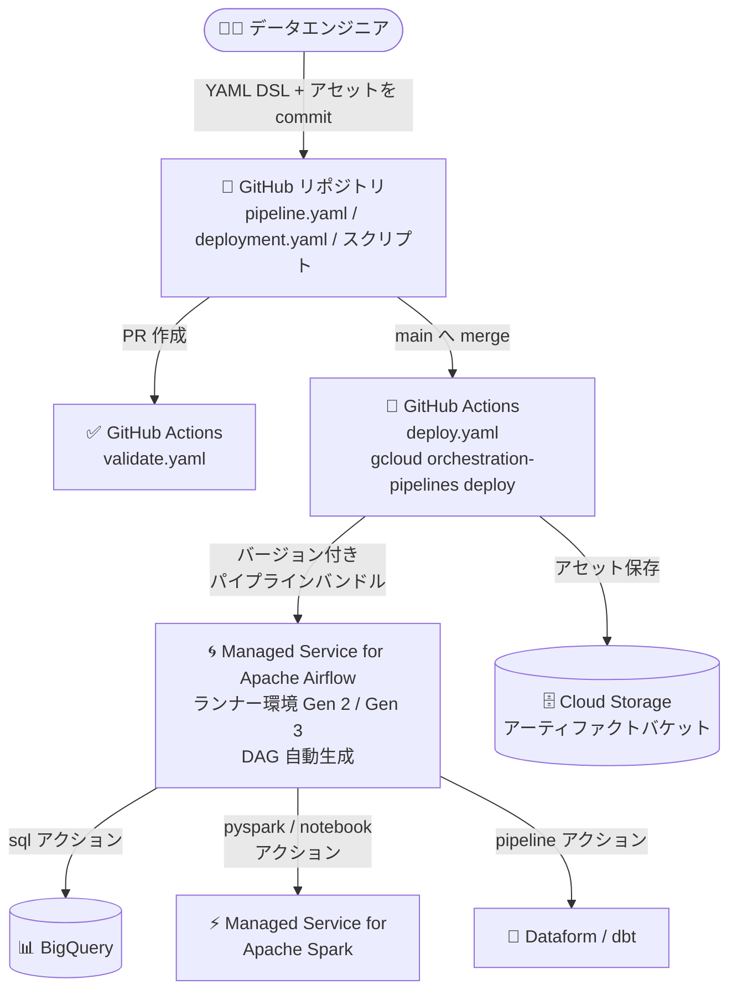

# Google Cloud Managed Service for Apache Airflow: Orchestration Pipelines が一般提供 (GA) に

**リリース日**: 2026-08-28

**サービス**: Google Cloud Managed Service for Apache Airflow (旧 Cloud Composer)

**機能**: Orchestration Pipelines

**ステータス**: GA (一般提供)

📊 [このアップデートのインフォグラフィックを見る](https://takech9203.github.io/google-cloud-news-summary/20260828-managed-airflow-orchestration-pipelines-ga.html)

## 概要

Google Cloud Managed Service for Apache Airflow (旧 Cloud Composer) の **Orchestration Pipelines** が一般提供 (GA) になりました。Orchestration Pipelines は、Google Cloud 上のデータ / AI パイプラインを対象とした、宣言型のオーケストレーションおよび自動デプロイフレームワークです。YAML ベースの DSL (Domain Specific Language) でパイプラインとデプロイ構成を宣言的に定義でき、デプロイ・バージョニング・オーケストレーションはフレームワーク側が処理するため、ユーザーはワークフローのロジックに集中できます。

デプロイされたパイプラインは、ランナー環境として指定した Managed Service for Apache Airflow 環境 (Gen 2 / Gen 3、Airflow 2 / Airflow 3 に対応) 上で実行されます。パイプライン定義から Airflow DAG ファイルが自動生成されるため、ユーザーが DAG ファイルを直接管理する必要はありません。

主な対象ユーザーは、データパイプラインの CI/CD を確立したいデータエンジニアやデータサイエンティストです。GitHub との連携による自動検証・自動デプロイ、開発 / ステージング / 本番といった複数デプロイ環境の管理、バージョン管理されたパイプラインバンドルによる再現性の確保が可能です。

**アップデート前の課題**

- Orchestration Pipelines は Preview (Pre-GA) として提供されており、Pre-GA Offerings Terms が適用され、サポートが限定的である場合があった
- 従来の Airflow ベースのパイプライン管理では、Python で DAG を記述し、DAG ファイルの配置・更新・バージョン管理を自分で行う必要があった
- パイプライン定義とスクリプトなどのアセットを一体としてバージョン管理・ロールバックする仕組みや、環境ごとのデプロイ構成の管理を自前で構築する必要があった

**アップデート後の改善**

- GA となり、本番ワークロードでの利用に適した一般提供ステータスで Orchestration Pipelines を利用できるようになった
- YAML ベースの宣言型 DSL でパイプラインを定義でき、Airflow DAG はフレームワークが自動生成・管理するため、DAG ファイルの直接管理が不要になった
- パイプライン定義とアセット (Python スクリプトなど) を「パイプラインバンドル」として単一ユニットでバージョン管理・デプロイでき、すべてのデプロイが追跡されるためロールバックや特定リランの再現が容易になった
- GitHub Actions と連携した検証 (validate) / デプロイ (deploy) のワークフローがスキャフォールディングとして提供され、データパイプラインの CI/CD を短時間で確立できるようになった

## アーキテクチャ図



Git リポジトリ上の YAML パイプライン定義が GitHub Actions で検証・デプロイされ、Managed Airflow ランナー環境上で自動生成された DAG として BigQuery、Managed Service for Apache Spark、Dataform / dbt などの各エンジンにアクションを実行する構成です。

## サービスアップデートの詳細

### 主要機能

1. **宣言型 DSL (YAML ベース)**
   - パイプライン、アクション、デプロイ構成を YAML で定義 (1 パイプライン = 1 ファイルとしてリポジトリに格納)
   - `pipelineId`、`description`、`owner`、`tags`、`defaults` (プロジェクト / ロケーション / リトライ数)、`triggers` (cron スケジュール)、`actions` などのトップレベルキーで構成
   - パイプライン失敗時のメール通知 (`onPipelineFailure`、SendGrid 構成が必要) にも対応

2. **デプロイ環境 (Deployment Environments)**
   - 開発 / ステージング / 本番など複数のデプロイ環境を定義し、それぞれに個別のランナー環境とアーティファクトバケットを構成可能
   - ランナー環境は Managed Airflow 環境 (Gen 2 / Gen 3、Airflow 2 / Airflow 3) を使用

3. **パイプラインバンドルによるバージョン管理と再現性**
   - パイプライン定義と関連アセットをバージョン付きパッケージとして単一ユニットでデプロイ
   - すべてのデプロイが追跡され、ロールバックや特定の実行の再現が容易
   - ローカルバンドルのデプロイ (開発用、ファイルの md5 ベースの ID) と、Git コミット SHA にひも付くコミット済み変更のデプロイ (CI/CD 用) の 2 方式をサポート

4. **多様なアクションと実行エンジン**
   - アクション: `pyspark` (PySpark スクリプト)、`notebook` (ノートブック実行)、`sql` (SQL クエリ)、`python` (Python スクリプト)、`pipeline` (Dataform / dbt ワークフロー)
   - エンジン: BigQuery、Managed Service for Apache Spark (既存クラスタ / エフェメラルクラスタ / サーバーレスバッチ)、Airflow ワーカー上でのローカル実行、Dataform サービス
   - リソースの自動プロビジョニング機構により、実行に必要なリソース (例: 特定構成の Spark クラスタ) が存在しない場合に自動作成することも可能

5. **変数置換・シークレット管理と検証ツール**
   - カスタム変数、環境変数、CI/CD プロバイダ (GitHub) のシークレットによるパラメータ化に対応
   - デプロイ前に構文・セマンティクスをチェックする検証コマンドを提供
   - トリガーは cron 式によるスケジュール実行と手動実行の両方をサポート

## 技術仕様

### 対応環境・統合

| 項目 | 詳細 |
|------|------|
| オーケストレーションエンジン | Managed Service for Apache Airflow (Gen 2 / Gen 3)、Airflow 2 / Airflow 3 対応 |
| コンピュート / データエンジン | BigQuery、Managed Service for Apache Spark、Dataform、dbt |
| 開発環境 | VS Code、Antigravity (Google Cloud Data Agent Kit 拡張経由)、Colab / JupyterLab などの IDE |
| Git プロバイダ | GitHub |
| パッケージのプリインストール | `composer-3-airflow-3.1.7-build.5`、`composer-3-airflow-2.11.1-build.1`、`composer-3-airflow-2.10.5-build.34`、`composer-3-airflow-2.9.3-build.54`、`composer-2.16.11-airflow-2.11.1`、`composer-2.16.11-airflow-2.10.5` 以降。それ以前のバージョンでは PyPI から `orchestration-pipelines` パッケージを手動インストール |
| 必要な IAM ロール | `composer.environmentAndStorageObjectAdmin`、`iam.serviceAccountUser` (ランナー環境の作成・管理) |

### パイプライン定義の例 (SQL アクション + BigQuery エンジン)

```yaml
modelVersion: "1.0"
pipelineId: "sql-on-bigquery"
description: "A pipeline with a BigQueryInsertJob task."
runner: "airflow"
owner: "data-eng-team"
defaults:
  projectId: "example-project"
  location: "us-central1"
  executionConfig:
    retries: 0
triggers:
  - schedule:
      interval: "0 5 * * *"
      startTime: "2025-10-01T00:00:00"
      endTime: "2026-10-01T00:00:00"
      catchup: false
      timezone: "UTC"
actions:
  - sql:
      name: "run_bigquery_insert_job_select"
      query:
        path: "sql-scripts/count_rows.sql"
      engine:
        bigquery:
          location: "US"
          destinationTable: "example-project.example_dataset.example_table_query_results"
```

## 設定方法

### 前提条件

1. ランナー環境として使用する Managed Service for Apache Airflow 環境を作成しておく (作成には約 25 分。Google Cloud コンソール、gcloud CLI、Terraform で作成可能)
2. Cloud Composer API と、パイプラインアクションで使用する Google Cloud サービスの API を有効化する
3. パイプラインアクションのアーティファクトを保存する Cloud Storage バケットを用意する

### 手順

#### ステップ 1: パイプラインバンドルのスキャフォールディングを初期化

```bash
gcloud beta orchestration-pipelines init PIPELINE_NAME \
  --environment DEPLOYMENT_ENVIRONMENT \
  --composer-environment RUNNER_ENVIRONMENT \
  --artifacts-bucket ARTIFACTS_BUCKET_NAME \
  --project PROJECT_ID \
  --region REGION \
  --service-account SERVICE_ACCOUNT
```

リポジトリ内に、パイプライン定義の例 (`orchestration-pipeline.yaml`)、デプロイ構成 (`deployment.yaml`)、GitHub Actions の検証・デプロイワークフロー (`.github/workflows/validate.yaml` / `deploy.yaml`) が生成されます。初期化は 1 回のみ実行します (再実行すると既存の構成変更が上書きされるため)。

#### ステップ 2: パイプラインをデプロイ

```bash
# 開発用: ローカルバンドルのデプロイ (デプロイ後は常に一時停止状態、手動トリガーで実行)
gcloud beta orchestration-pipelines deploy \
  --environment DEPLOYMENT_ENVIRONMENT \
  --local

# CI/CD 用: コミット済み変更のデプロイ (バンドル ID が Git コミット SHA にひも付く)
```

デプロイが完了すると、バンドル ID / バージョン ID とともに各パイプラインのデプロイステータス (例: `Pipeline 'example-pipeline': [OK] (Status: HEALTHY)`) が出力されます。

## メリット

### ビジネス面

- **本番利用への適合**: GA により一般提供ステータスとなり、本番のデータ / AI パイプラインへの適用判断がしやすくなった
- **チーム開発の標準化**: Git リポジトリと GitHub Actions を軸とした検証・デプロイフローにより、データパイプラインの変更管理をソフトウェア開発と同様のプロセスで統制できる
- **監査性とロールバック**: すべてのデプロイがバージョンとして追跡されるため、問題発生時のロールバックや過去の実行の再現が容易

### 技術面

- **DAG 管理からの解放**: YAML 定義から Airflow DAG が自動生成されるため、DAG ファイルの記述・配置・更新の管理が不要
- **インフラの抽象化**: BigQuery、Managed Service for Apache Spark、Dataform / dbt など複数エンジンにまたがる処理を単一の宣言型定義で記述できる
- **環境分離**: 開発 / ステージング / 本番のデプロイ環境をそれぞれ別のランナー環境・アーティファクトバケットで構成でき、安全なリリースフローを実現できる

## デメリット・制約事項

### 制限事項

- `pyspark` / `notebook` アクションでは、すべてのアクションで共有する 1 つの `requirements.txt` のみサポート。uv ツールによるパッケージビルドは Windows 非対応。プリビルドバイナリを持つ Python パッケージのみサポート
- `sql` アクションの `query` キーでのインライン定義には制限がある (ドキュメントの Limitations を参照)
- ローカルバンドルとしてデプロイしたパイプラインは常に一時停止状態でデプロイされ、スケジュールでは起動しない (手動トリガーのみ)
- バンドルの「現在のバージョン」は常に 1 つのみで、現在のバージョン以外のパイプラインは手動トリガーできない

### 考慮すべき点

- 現時点で利用可能なランナーは Managed Service for Apache Airflow のみで、Managed Airflow のクォータとシステム上限がすべて適用される
- Git プロバイダは GitHub のみが記載されており、他の Git ホスティングサービスとの CI/CD 連携は明記されていない
- 古い Composer バージョンでは `orchestration-pipelines` パッケージの手動インストールが必要
- パイプライン失敗時のメール通知には、ランナー環境での SendGrid メールサービスの構成が必要

## ユースケース

### ユースケース 1: データパイプラインの CI/CD 確立

**シナリオ**: データエンジニアリングチームが、BigQuery の SQL 変換と PySpark ジョブから成る日次 ETL パイプラインを、コードレビューを経て安全に本番リリースしたい。

**実装例**:
```
1. パイプラインを YAML DSL で定義し、SQL / PySpark スクリプトとともに GitHub リポジトリで管理
2. PR 作成時に GitHub Actions (validate.yaml) が構文・セマンティクスを自動検証
3. main ブランチへのマージで GitHub Actions (deploy.yaml) が本番ランナー環境へ自動デプロイ
4. バンドルのバージョンが Git コミット SHA にひも付き、問題時は以前のバージョンへロールバック
```

**効果**: 変更のたびに自動で検証・デプロイされ、リリースの一貫性と監査性が確保される。

### ユースケース 2: マルチエンジンのデータ / AI ワークフロー統合

**シナリオ**: BigQuery での SQL 変換、Managed Service for Apache Spark でのノートブック実行、Dataform ワークフローの実行を 1 つのパイプラインとして依存関係付きでオーケストレーションしたい。

**効果**: `dependsOn` によるアクション間の依存定義だけで、複数エンジンにまたがる処理を単一の宣言型パイプラインとして管理でき、個別の Airflow DAG やオペレーターの実装が不要になる。

### ユースケース 3: 開発・ステージング・本番の環境分離

**シナリオ**: 開発中のパイプラインをステージング用ランナー環境で検証してから本番環境へ昇格させたい。

**効果**: デプロイ環境ごとに個別のランナー環境・アーティファクトバケット・変数を構成でき、`--local` デプロイ (常に一時停止・手動トリガーのみ) を使った安全な開発検証と、コミットベースの本番デプロイを分離できる。

## 料金

Orchestration Pipelines 自体の個別料金は公式ドキュメントに記載されていません。ランナー環境として使用する Managed Service for Apache Airflow 環境のコストが発生し、Managed Airflow の料金体系が適用されます。また、アクションの実行先である BigQuery や Managed Service for Apache Spark などの各サービスの利用料金が別途発生します。

詳細は [Managed Service for Apache Airflow の料金ページ](https://cloud.google.com/composer/pricing) を参照してください。

## 関連サービス・機能

- **Managed Service for Apache Airflow (旧 Cloud Composer)**: Orchestration Pipelines の唯一のランナー環境。Gen 2 / Gen 3、Airflow 2 / Airflow 3 に対応
- **BigQuery**: `sql` アクションの実行エンジン。クエリ結果を宛先テーブルに出力可能
- **Managed Service for Apache Spark**: `pyspark` / `notebook` / `sql` アクションの実行エンジン (既存クラスタ、エフェメラルクラスタ、サーバーレスバッチ)
- **Dataform / dbt**: `pipeline` アクションで実行するデータ変換フレームワーク (Airflow ワーカー上または Dataform サービス上で実行)
- **Cloud Storage**: バージョン付きパイプラインアセットとアクション出力を保存するアーティファクトバケット
- **Google Cloud Data Agent Kit**: VS Code / Antigravity からのパイプライン開発・デプロイを支援する拡張機能

## 参考リンク

- 📊 [インフォグラフィック](https://takech9203.github.io/google-cloud-news-summary/20260828-managed-airflow-orchestration-pipelines-ga.html)
- [公式リリースノート](https://docs.cloud.google.com/release-notes#August_28_2026)
- [Orchestration Pipelines 概要](https://docs.cloud.google.com/orchestration-pipelines/overview)
- [ランナー環境の作成](https://docs.cloud.google.com/orchestration-pipelines/create-runner-environments)
- [Orchestration Pipelines のデプロイ](https://docs.cloud.google.com/orchestration-pipelines/deploy-orchestration-pipelines)
- [Orchestration Pipelines DSL リファレンス](https://docs.cloud.google.com/orchestration-pipelines/reference/orchestration-pipelines-dsl-reference)
- [コード例 (GitHub)](https://github.com/GoogleCloudPlatform/orchestration-pipelines/tree/main/examples)
- [料金ページ (Managed Airflow)](https://cloud.google.com/composer/pricing)

## まとめ

Orchestration Pipelines の GA により、Managed Service for Apache Airflow 上のデータ / AI パイプラインを YAML の宣言型定義と Git ベースの CI/CD で管理する手法が本番利用可能になりました。Airflow DAG を直接管理する運用からの移行や、複数エンジンにまたがるパイプラインの標準化を検討しているチームは、GitHub 上の公式コード例とスキャフォールディング (`gcloud beta orchestration-pipelines init`) から評価を始めることを推奨します。

---

**タグ**: #GoogleCloud #ApacheAirflow #CloudComposer #OrchestrationPipelines #DataEngineering #CICD #GA
