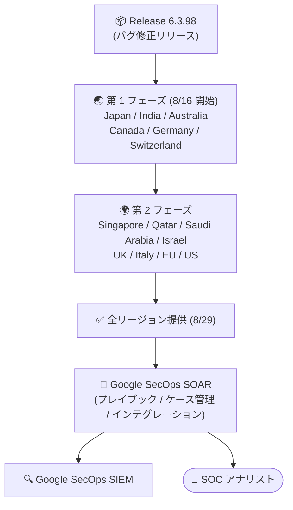

# Google SecOps SOAR: Release 6.3.98 全リージョン提供開始

**リリース日**: 2026-08-29

**サービス**: Google SecOps SOAR

**機能**: Release 6.3.98

**ステータス**: Announcement (全リージョン提供)

📊 [このアップデートのインフォグラフィックを見る](https://takech9203.github.io/google-cloud-news-summary/20260829-google-secops-soar-6-3-98.html)

## 概要

Google SecOps SOAR の Release 6.3.98 が全リージョンで利用可能になりました。本リリースは 2026 年 8 月 16 日に第 1 フェーズのリージョン (Japan、India、Australia、Canada、Germany、Switzerland) へのロールアウトが開始され、約 2 週間を経て残りの第 2 フェーズのリージョン (Singapore、Qatar、Saudi Arabia、Israel、UK、Italy、EU マルチリージョン、US マルチリージョン) を含むすべてのリージョンに展開が完了しました。

リリースノートによると、Release 6.3.98 の内容は「内部的なバグ修正および顧客報告によるバグ修正 (internal and customer bug fixes)」です。新機能の追加はなく、プラットフォームの安定性と品質を向上させるメンテナンスリリースという位置付けです。

Google SecOps SOAR は SaaS 型のプラットフォームであるため、アップデートは Google 側で自動的に適用されます。ユーザー側での対応作業は不要ですが、SOC チームの管理者は自環境のバージョンが 6.3.98 に更新されたことを確認し、既存のプレイブックやインテグレーションが正常に動作していることを確認することが推奨されます。

**アップデート前の課題**

- Release 6.3.97 (2026 年 8 月 15 日に全リージョン提供) までのバージョンには、内部および顧客から報告されたバグが残存していた
- 8 月 16 日時点では Release 6.3.98 は第 1 フェーズのリージョンのみで利用可能で、第 2 フェーズのリージョン (EU / US マルチリージョンなど) のユーザーは修正の適用を待つ必要があった

**アップデート後の改善**

- 内部および顧客報告のバグ修正がすべてのリージョンのテナントに適用された
- 第 1 フェーズ・第 2 フェーズを問わず、全リージョンで同一バージョン (6.3.98) に統一され、一貫した動作が保証される

## アーキテクチャ図

Google SecOps SOAR のリリースは 2 段階の地域展開 (日曜日に実施、第 2 フェーズは第 1 フェーズの 1 週間後が基本) を経て全リージョンに適用されます。Release 6.3.98 は 8 月 16 日の第 1 フェーズ開始を経て、8 月 29 日に全リージョンで利用可能になりました。

## サービスアップデートの詳細

### 主要な内容

1. **内部および顧客報告のバグ修正**
   - Release 6.3.98 には内部で検出されたバグと顧客から報告されたバグの修正が含まれる
   - 新機能の追加はなく、安定性・品質向上を目的としたメンテナンスリリース

2. **段階的ロールアウトの完了**
   - 2026 年 8 月 16 日: 第 1 フェーズのリージョンへロールアウト開始
   - 2026 年 8 月 29 日: 全リージョンで利用可能に

### リリースサイクルの動向 (参考)

| 日付 | 内容 |
|------|------|
| 2026-08-15 | Release 6.3.97 が全リージョンで利用可能 |
| 2026-08-16 | Release 6.3.98 が第 1 フェーズのリージョンへロールアウト開始 |
| 2026-08-27 | 8 月 30 日 (日) の標準メンテナンスウィンドウでの SOAR データベース・インフラメンテナンスを告知 (短時間のダウンタイムあり、ユーザー対応不要) |
| 2026-08-29 | Release 6.3.98 が全リージョンで利用可能 |
| 2026-08-30 | Release 6.3.99 が第 1 フェーズのリージョンへロールアウト開始 |

## 技術仕様

### 段階的リリース (2 フェーズロールアウト)

Google SecOps SOAR のリリースは、スタンドアロンの SOAR プラットフォームと Google SecOps 統合プラットフォーム内の SOAR コンポーネントの両方に対して、以下の 2 段階で展開されます。アップデートは日曜日に実施され、第 2 フェーズのリージョンは第 1 フェーズの 1 週間後にアップグレードされるのが標準です。

| フェーズ | 対象リージョン |
|----------|----------------|
| 第 1 フェーズ | Japan、India、Australia、Canada、Germany、Switzerland |
| 第 2 フェーズ | Singapore、Qatar、Saudi Arabia、Israel、UK (London)、Italy、EU (マルチリージョン)、US (マルチリージョン) |

自環境の割り当てリージョンが不明な場合は、Google SecOps の担当者に問い合わせてください。

## メリット

### ビジネス面

- **運用負荷ゼロのアップデート**: SaaS 型プラットフォームのため、バグ修正は Google 側で自動適用され、ユーザーによるパッチ適用作業は不要
- **リスクを抑えた展開**: 2 フェーズの段階的ロールアウトにより、問題があった場合の影響範囲を限定しながら全リージョンへ展開される

### 技術面

- **安定性の向上**: 内部および顧客報告のバグが修正され、プレイブック実行やケース管理の信頼性が向上
- **全リージョンでのバージョン統一**: マルチリージョンで運用する組織 (MSSP など) でも全環境が同一バージョンで動作する

## デメリット・制約事項

### 考慮すべき点

- 修正されたバグの個別の詳細 (修正項目のリスト) はリリースノートでは公開されていない
- 第 1 フェーズと第 2 フェーズのリージョン間では、一時的に稼働バージョンが異なる期間が発生する
- 2026 年 8 月 30 日 (日) の標準メンテナンスウィンドウで SOAR データベース・インフラメンテナンスが予定されており、短時間のダウンタイムが発生する (ユーザー対応は不要)

## 料金

Google SecOps SOAR は Google SecOps のパッケージ (Standard / Enterprise / Enterprise Plus) の一部として提供され、料金は取り込みデータ量に基づきます。本リリース (バグ修正) 自体による追加料金は発生しません。詳細は以下を参照してください。

- [Google SecOps パッケージ概要](https://docs.cloud.google.com/chronicle/docs/secops/secops-packages)
- [Google Security Operations 料金](https://cloud.google.com/security/products/security-operations)

## 利用可能リージョン

全リージョンで利用可能です (第 1 フェーズ: Japan、India、Australia、Canada、Germany、Switzerland / 第 2 フェーズ: Singapore、Qatar、Saudi Arabia、Israel、UK、Italy、EU マルチリージョン、US マルチリージョン)。

## 関連サービス・機能

- **Google SecOps SIEM**: SOAR と統合された SIEM。SIEM で検出したアラートを SOAR のケースとして自動起票し、プレイブックで対応を自動化する
- **Google SecOps Marketplace インテグレーション**: 300 以上のプレビルドインテグレーションにより、サードパーティ製品との連携・レスポンスのオーケストレーションが可能
- **Gemini in Security Operations**: 自然言語によるプレイブック作成やケース要約 (Enterprise パッケージ以上)

## 参考リンク

- 📊 [インフォグラフィック](https://takech9203.github.io/google-cloud-news-summary/20260829-google-secops-soar-6-3-98.html)
- [Google Cloud リリースノート (2026 年 8 月 29 日)](https://docs.cloud.google.com/release-notes#August_29_2026)
- [Google SecOps SOAR リリースノート (Release 6.3.98)](https://docs.cloud.google.com/chronicle/docs/soar/release-notes#August_16_2026)
- [Google SecOps のリリースプラン (段階的リリース)](https://docs.cloud.google.com/chronicle/docs/soar/overview-and-introduction/soar-gradual-release)
- [Google SecOps パッケージ概要](https://docs.cloud.google.com/chronicle/docs/secops/secops-packages)
- [料金ページ](https://cloud.google.com/security/products/security-operations)

## まとめ

Google SecOps SOAR の Release 6.3.98 は、内部および顧客報告のバグ修正を含むメンテナンスリリースであり、全リージョンへの展開が完了しました。SaaS 型のためユーザー側の適用作業は不要ですが、SOC 管理者は自環境のバージョン更新後にプレイブックやインテグレーションの正常動作を確認しておくとよいでしょう。また、8 月 30 日には次期リリース 6.3.99 の第 1 フェーズ展開と定期メンテナンスが予定されている点にも留意してください。

---

**タグ**: Google SecOps, SOAR, セキュリティ, リリースアップデート, バグ修正, SOC
