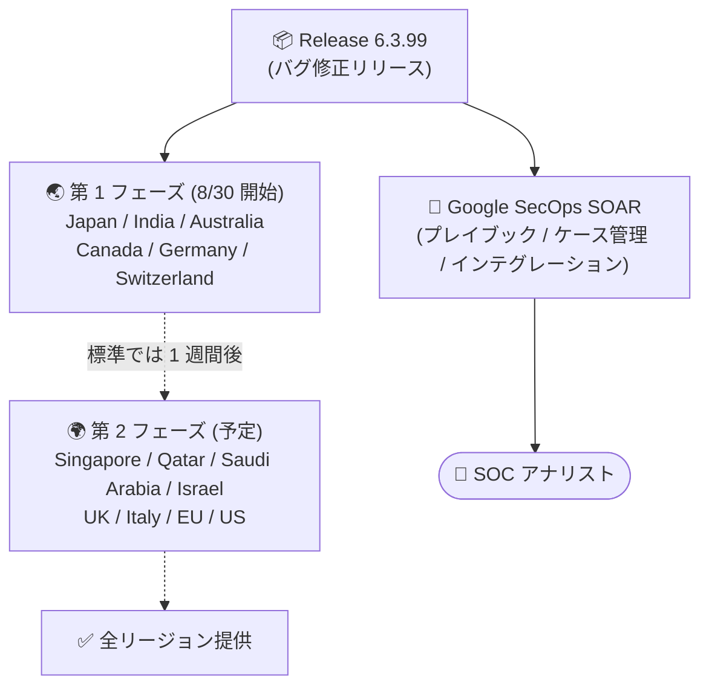

# Google SecOps SOAR: Release 6.3.99 第 1 フェーズリージョンへロールアウト開始

**リリース日**: 2026-08-30

**サービス**: Google SecOps SOAR

**機能**: Release 6.3.99

**ステータス**: Announcement (第 1 フェーズリージョンへロールアウト中)

📊 [このアップデートのインフォグラフィックを見る](https://takech9203.github.io/google-cloud-news-summary/20260830-google-secops-soar-6-3-99.html)

## 概要

Google SecOps SOAR の Release 6.3.99 が、第 1 フェーズのリージョン (Japan、India、Australia、Canada、Germany、Switzerland) へのロールアウトを開始しました。リリースノートによると、本リリースの内容は「内部的なバグ修正および顧客報告によるバグ修正 (internal and customer bug fixes)」であり、新機能の追加はないメンテナンスリリースです。

Google SecOps SOAR のリリースは 2 段階の地域展開を採用しており、アップデートは日曜日に実施され、第 2 フェーズのリージョンは第 1 フェーズの 1 週間後にアップグレードされるのが標準です。前バージョンの Release 6.3.98 は 8 月 16 日に第 1 フェーズ展開が開始され、8 月 29 日に全リージョンで利用可能になっており、6.3.99 も同様のサイクルで残りのリージョンへ展開される見込みです。

SaaS 型プラットフォームのためアップデートは Google 側で自動適用され、ユーザー側での対応作業は不要です。なお、同日の 8 月 30 日 (日) には標準メンテナンスウィンドウでの SOAR データベース・インフラメンテナンス (短時間のダウンタイムあり、ユーザー対応不要) も予定されていたことが 8 月 27 日に告知されています。

**アップデート前の課題**

- Release 6.3.98 (2026 年 8 月 29 日に全リージョン提供) までのバージョンには、内部および顧客から報告されたバグが残存していた

**アップデート後の改善**

- 内部および顧客報告のバグ修正が第 1 フェーズのリージョン (Japan、India、Australia、Canada、Germany、Switzerland) のテナントに適用され始めた
- 第 2 フェーズのリージョンへも標準サイクル (第 1 フェーズの 1 週間後) で展開される見込み

## アーキテクチャ図

Google SecOps SOAR のリリースは 2 段階の地域展開 (日曜日に実施、第 2 フェーズは第 1 フェーズの 1 週間後が基本) を経て全リージョンに適用されます。Release 6.3.99 は 8 月 30 日に第 1 フェーズの展開が開始された段階です。

## サービスアップデートの詳細

### 主要な内容

1. **内部および顧客報告のバグ修正**
   - Release 6.3.99 には内部で検出されたバグと顧客から報告されたバグの修正が含まれる
   - 新機能の追加はなく、安定性・品質向上を目的としたメンテナンスリリース

2. **第 1 フェーズリージョンへのロールアウト開始**
   - 2026 年 8 月 30 日 (日) に Japan、India、Australia、Canada、Germany、Switzerland への展開を開始
   - 第 2 フェーズのリージョンは標準では 1 週間後にアップグレードされる

### リリースサイクルの動向 (参考)

| 日付 | 内容 |
|------|------|
| 2026-08-16 | Release 6.3.98 が第 1 フェーズのリージョンへロールアウト開始 |
| 2026-08-27 | 8 月 30 日 (日) の標準メンテナンスウィンドウでの SOAR データベース・インフラメンテナンスを告知 (短時間のダウンタイムあり、ユーザー対応不要) |
| 2026-08-29 | Release 6.3.98 が全リージョンで利用可能 |
| 2026-08-30 | Release 6.3.99 が第 1 フェーズのリージョンへロールアウト開始 |

## 技術仕様

### 段階的リリース (2 フェーズロールアウト)

Google SecOps SOAR のリリースは、スタンドアロンの SOAR プラットフォームと Google SecOps 統合プラットフォーム内の SOAR コンポーネントの両方に対して、以下の 2 段階で展開されます。アップデートは日曜日に実施され、第 2 フェーズのリージョンは第 1 フェーズの 1 週間後にアップグレードされるのが標準です。

| フェーズ | 対象リージョン |
|----------|----------------|
| 第 1 フェーズ | Japan、India、Australia、Canada、Germany、Switzerland |
| 第 2 フェーズ | Singapore、Qatar、Saudi Arabia、Israel、UK (London)、Italy、EU (マルチリージョン)、US (マルチリージョン) |

自環境の割り当てリージョンが不明な場合は、Google SecOps の担当者に問い合わせてください。

## メリット

### ビジネス面

- **運用負荷ゼロのアップデート**: SaaS 型プラットフォームのため、バグ修正は Google 側で自動適用され、ユーザーによるパッチ適用作業は不要
- **リスクを抑えた展開**: 2 フェーズの段階的ロールアウトにより、問題があった場合の影響範囲を限定しながら全リージョンへ展開される

### 技術面

- **安定性の向上**: 内部および顧客報告のバグが修正され、プレイブック実行やケース管理の信頼性が向上
- **予測可能なリリースサイクル**: 日曜日実施・1 週間間隔の 2 段階展開という定型サイクルにより、SOC チームはバージョン更新のタイミングを見込んで運用計画を立てられる

## デメリット・制約事項

### 考慮すべき点

- 修正されたバグの個別の詳細 (修正項目のリスト) はリリースノートでは公開されていない
- 第 2 フェーズのリージョン (EU / US マルチリージョンなど) では、全リージョン提供のアナウンスまで本リリースの修正は適用されない
- 第 1 フェーズと第 2 フェーズのリージョン間では、一時的に稼働バージョンが異なる期間が発生する

## 料金

Google SecOps SOAR は Google SecOps のパッケージ (Standard / Enterprise / Enterprise Plus) の一部として提供されます。本リリース (バグ修正) 自体による追加料金は発生しません。詳細は以下を参照してください。

- [Google SecOps パッケージ概要](https://docs.cloud.google.com/chronicle/docs/secops/secops-packages)
- [Google Security Operations 料金](https://cloud.google.com/security/products/security-operations)

## 利用可能リージョン

第 1 フェーズのリージョン (Japan、India、Australia、Canada、Germany、Switzerland) へのロールアウトが開始された段階です。第 2 フェーズのリージョン (Singapore、Qatar、Saudi Arabia、Israel、UK、Italy、EU マルチリージョン、US マルチリージョン) へは標準では 1 週間後に展開されます。

## 関連サービス・機能

- **Google SecOps SIEM**: SOAR と統合された SIEM。SIEM で検出したアラートを SOAR のケースとして自動起票し、プレイブックで対応を自動化する
- **Google SecOps Marketplace インテグレーション**: プレビルドインテグレーションにより、サードパーティ製品との連携・レスポンスのオーケストレーションが可能

## 参考リンク

- 📊 [インフォグラフィック](https://takech9203.github.io/google-cloud-news-summary/20260830-google-secops-soar-6-3-99.html)
- [Google Cloud リリースノート (2026 年 8 月 30 日)](https://docs.cloud.google.com/release-notes#August_30_2026)
- [Google SecOps SOAR リリースノート](https://docs.cloud.google.com/chronicle/docs/soar/release-notes#August_30_2026)
- [Google SecOps のリリースプラン (段階的リリース)](https://docs.cloud.google.com/chronicle/docs/soar/overview-and-introduction/soar-gradual-release)
- [Google SecOps パッケージ概要](https://docs.cloud.google.com/chronicle/docs/secops/secops-packages)
- [料金ページ](https://cloud.google.com/security/products/security-operations)

## まとめ

Google SecOps SOAR の Release 6.3.99 は、内部および顧客報告のバグ修正を含むメンテナンスリリースであり、第 1 フェーズのリージョンへのロールアウトが開始されました。SaaS 型のためユーザー側の適用作業は不要ですが、第 1 フェーズのリージョン (日本を含む) を利用する SOC 管理者は、バージョン更新後にプレイブックやインテグレーションの正常動作を確認しておくとよいでしょう。第 2 フェーズのリージョンへは標準サイクルでは 1 週間後に展開されるため、全リージョン提供のアナウンスにも留意してください。

---

**タグ**: Google SecOps, SOAR, セキュリティ, リリースアップデート, バグ修正, SOC
