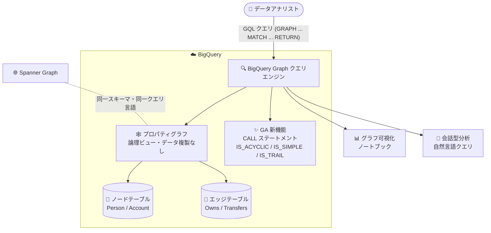

# BigQuery: BigQuery Graph 一般提供 (GA) 開始

**リリース日**: 2026-08-31

**サービス**: BigQuery

**機能**: BigQuery Graph (グラフ分析機能)

**ステータス**: GA (一般提供)

📊 [このアップデートのインフォグラフィックを見る](https://takech9203.github.io/google-cloud-news-summary/20260831-bigquery-graph-ga.html)

## 概要

BigQuery Graph が一般提供 (GA) となりました。BigQuery Graph は、BigQuery の分析基盤の上で大規模なグラフ分析を実行できる機能です。データをノード (頂点) とエッジ (辺) を持つグラフとしてモデル化し、Graph Query Language (GQL) を使用することで、SQL では表現が困難な複雑な関係性やパターンをデータから発見できます。既存のテーブルやビューから直接ノードテーブル・エッジテーブルを定義できるため、既存ワークフローの変更やデータの複製 (ETL) は不要です。

BigQuery Graph は ISO GQL 標準および ISO Property Graph Queries (SQL/PGQ) 標準に準拠したグラフクエリインターフェースをサポートしており、リレーショナルモデルとグラフモデルの相互運用性を提供します。また、Spanner Graph と同じグラフスキーマ・クエリ言語を共有しているため、Spanner でオペレーショナルなグラフワークロードを実行し、BigQuery で複雑なグラフ分析を実行する、といった使い分けがデータの再モデリングやクエリの書き換えなしに可能です。

今回の GA では、新たに **CALL グラフクエリステートメント** と、パス検査用の GQL 関数 **IS_ACYCLIC**、**IS_SIMPLE**、**IS_TRAIL** のサポートが追加されました。不正検知、レコメンデーション、カスタマー 360、サプライチェーン分析などのグラフワークロードを BigQuery 上で構築するデータアナリスト・データエンジニアが対象です。

**アップデート前の課題**

- グラフデータをテーブルとして表現した場合、データの走査にセルフジョインや再帰的ジョインが必要で、SQL でグラフ走査ロジックを記述するとクエリが複雑になり、作成・保守・デバッグが困難だった
- BigQuery Graph は GA 前 (Preview) の段階であり、本番ワークロードへの適用には慎重な判断が必要だった
- グラフクエリ内から table-valued function (TVF) やサブクエリをモジュール化して呼び出す標準的な手段がなかった
- パスの循環 (ノードの繰り返し) やエッジの重複をクエリ内で判定する組み込み関数がなかった

**アップデート後の改善**

- BigQuery Graph が GA となり、本番ワークロードで利用可能になった
- CALL ステートメントにより、名前付き TVF やインラインサブクエリをグラフクエリ内から呼び出せるようになり、モジュール化されたクエリ設計と複雑なロジックの再利用が可能になった
- IS_ACYCLIC / IS_SIMPLE / IS_TRAIL 関数により、パスのノード繰り返し・エッジ繰り返しの有無をクエリ内で直接判定できるようになった

## アーキテクチャ図



プロパティグラフは既存のノード・エッジテーブル上の論理ビューとして機能し、GQL クエリで関係性を走査します。GA では CALL ステートメントとパス検査関数が追加され、Spanner Graph との相互運用も可能です。

## サービスアップデートの詳細

### 主要機能

1. **BigQuery Graph の一般提供 (GA)**
   - ISO GQL 標準・ISO SQL/PGQ 標準に準拠したグラフクエリインターフェース
   - 既存のテーブルやビューから直接ノード・エッジテーブルを定義。グラフはデータの論理ビューとして機能し、データの移動やコピーは発生しない
   - グラフクエリと SQL の完全な相互運用性により、ETL の運用負荷なしにユースケースごとに最適なツールを選択可能
   - ベクトル検索・全文検索との統合により、セマンティックな意味やキーワードをグラフ分析に活用可能
   - クエリ結果のグラフ形式での可視化、会話型分析 (自然言語) によるグラフへの質問にも対応

2. **CALL グラフクエリステートメント (新規サポート)**
   - 名前付き TVF またはインラインサブクエリをワーキングテーブルに対して実行
   - `YIELD` 句で TVF の出力列の選択・リネームが可能
   - `OPTIONAL CALL` により、出力を生成しない行も NULL 値付きで保持
   - `CALL PER ()` により、行ごとではなくワーキングテーブル全体に対して TVF を 1 回だけ実行可能

3. **パス検査 GQL 関数 (新規サポート)**
   - `IS_ACYCLIC(graph_path)`: パスにノードの繰り返しがないか判定 (繰り返しがなければ TRUE)
   - `IS_SIMPLE(graph_path)`: パスがシンプルか判定 (繰り返しノードがない、または先頭と末尾のみが繰り返しの場合 TRUE)
   - `IS_TRAIL(graph_path)`: パスにエッジの繰り返しがないか判定 (繰り返しがなければ TRUE)
   - いずれも戻り値は BOOL、引数が NULL の場合は NULL を返す

## 技術仕様

### 新機能の仕様

| 項目 | 詳細 |
|------|------|
| クエリ言語 | GQL (ISO GQL 標準準拠)、SQL/PGQ 標準サポート |
| グラフ定義 | `CREATE PROPERTY GRAPH` ステートメントまたはビジュアルグラフモデラー |
| CALL ステートメント | `[OPTIONAL] CALL [PER ()] tvf_name(...) [YIELD ...]` / `[OPTIONAL] CALL (変数リスト) { サブクエリ }` |
| IS_ACYCLIC / IS_SIMPLE / IS_TRAIL | 引数: `GRAPH_PATH` 値、戻り値: `BOOL` |
| データ更新 | ノード・エッジテーブルのデータを更新 (グラフは論理ビュー) |
| スキーマ変更 | `CREATE PROPERTY GRAPH` によるグラフスキーマの再定義が必要 |
| Spanner Graph 連携 | 同一のグラフスキーマ・クエリ言語を共有 |

### CALL ステートメントの構文

```sql
-- 名前付き TVF の呼び出し
[ OPTIONAL ] CALL [ PER () ] tvf_name ( [ expression [, ...] ] )
  [ YIELD tvf_column [ AS alias ] [, ...] ]

-- インラインサブクエリの呼び出し
[ OPTIONAL ] CALL ( [ variable_name [, ...] ] ) { subquery }
```

## 設定方法

### 前提条件

1. GQL クエリを実行するには、Enterprise または Enterprise Plus エディションの予約 (reservation) が必要
2. グラフのノード・エッジとなるテーブル (エンティティと関係を格納) が BigQuery データセットに存在すること

### 手順

#### ステップ 1: プロパティグラフの作成

```sql
CREATE OR REPLACE PROPERTY GRAPH graph_db.FinGraph
  NODE TABLES (
    graph_db.Account,
    graph_db.Person
  )
  EDGE TABLES (
    graph_db.PersonOwnAccount
      SOURCE KEY (id) REFERENCES Person (id)
      DESTINATION KEY (account_id) REFERENCES Account (id)
      LABEL Owns,
    graph_db.AccountTransferAccount
      SOURCE KEY (id) REFERENCES Account (id)
      DESTINATION KEY (to_id) REFERENCES Account (id)
      LABEL Transfers
  );
```

既存のテーブルをノードテーブル・エッジテーブルとして定義します。データの移動やコピーは発生しません。

#### ステップ 2: GQL クエリの実行 (新機能の利用例)

```sql
-- CALL ステートメントでインラインサブクエリを呼び出す
GRAPH graph_db.FinGraph
MATCH (p:Person)
CALL (p) {
  MATCH (p)-[:Owns]->(a:Account)
  RETURN COUNT(a) AS num_accounts
}
RETURN p.name, num_accounts;

-- IS_ACYCLIC でパスの循環を検査する
GRAPH graph_db.FinGraph
MATCH p=(src:Account)-[t1:Transfers]->(mid:Account)-[t2:Transfers]->(dst:Account)
RETURN src.id AS source_account_id, IS_ACYCLIC(p) AS is_acyclic_path;
```

グラフクエリは BigQuery の SQL クエリと同じ方法で実行できます。

#### ステップ 3: グラフの可視化 (任意)

```
%%bigquery --graph
GRAPH graph_db.FinGraph
MATCH p = ((person:Person {name: "Dana"})-[own:Owns]->(account:Account))
RETURN TO_JSON(p) AS path;
```

ノートブックの `%%bigquery --graph` マジックコマンドで、クエリ結果をグラフ形式で可視化できます (クエリは JSON 形式でグラフ要素を返す必要があります)。

## メリット

### ビジネス面

- **本番利用可能な安定性**: GA となり、不正検知やカスタマー 360 などのミッションクリティカルなグラフ分析ワークロードに安心して採用できる
- **ETL 不要によるコスト削減**: 既存テーブルの論理ビューとしてグラフを定義するため、データ複製・変換パイプラインの構築・運用コストが不要
- **Spanner Graph との相互運用**: オペレーショナルワークロード (Spanner) と分析ワークロード (BigQuery) を、データの再モデリングやクエリ書き換えなしに使い分け可能

### 技術面

- **クエリのモジュール化**: CALL ステートメントにより TVF やサブクエリとして複雑なロジックを部品化・再利用でき、クエリの保守性が向上
- **パス品質の判定**: IS_ACYCLIC / IS_SIMPLE / IS_TRAIL により、循環参照の検出や重複のないルート抽出をクエリ内で完結できる
- **SQL との統合**: GoogleSQL のすべての関数・演算子・条件式をグラフクエリ内で利用でき、ベクトル検索・全文検索とも組み合わせ可能

## デメリット・制約事項

### 制限事項

- GQL クエリの実行には Enterprise または Enterprise Plus エディションの予約が必要 (オンデマンド課金では GRAPH_EXPAND 関数による SQL クエリのみ利用可能)
- 特定の BigQuery エディションで作成された予約では利用できない場合がある
- グラフスキーマの変更には `CREATE PROPERTY GRAPH` ステートメントによる再定義が必要
- BigQuery Graph は、テーブルや列の削除・変更が既存のグラフスキーマを無効化するかどうかをチェックしない。破壊的なスキーマ変更を避ける責任はユーザー側にある

### 考慮すべき点

- グラフのノード定義で使用しているテーブルを削除する前に、まずグラフからそのノード定義を削除するといったベストプラクティスに従う必要がある
- `CALL PER ()` は名前付き TVF のみサポートし、インラインサブクエリや OPTIONAL 句とは併用できない
- CALL ステートメント使用時は、TVF/サブクエリの出力列と入力テーブルの列を合わせた最終的な列名が一意である必要がある

## ユースケース

### ユースケース 1: 金融不正検知 (マネーロンダリング検出)

**シナリオ**: ユーザー、口座、送金の複雑な関係を分析し、資金が元の口座に還流する循環送金パターンなど、リレーショナルデータベースでは検出が難しい不審なパターンを特定する。

**実装例**:
```sql
GRAPH graph_db.FinGraph
MATCH p=(src:Account)-[:Transfers]->(:Account)-[:Transfers]->(dst:Account)
WHERE NOT IS_ACYCLIC(p)
RETURN src.id AS source_account_id, TO_JSON(p) AS suspicious_path;
```

**効果**: IS_ACYCLIC 関数で循環パス (ノードの繰り返しを含むパス) を直接抽出でき、複雑なセルフジョインを書かずにマネーロンダリングの疑いがある送金経路を検出できる。

### ユースケース 2: カスタマー 360 とレコメンデーション

**シナリオ**: 顧客の関係性、嗜好、購買履歴をグラフとして追跡し、顧客を全体像として把握する。CALL ステートメントで顧客ごとの集計ロジックをサブクエリとして部品化し、パーソナライズされたレコメンデーションやターゲティング施策に活用する。

**効果**: グラフパターンマッチングにより SQL の再帰ジョインでは困難な多段の関係走査を直感的に記述でき、会話型分析と組み合わせて自然言語でのデータ探索も可能になる。

### ユースケース 3: サプライチェーンの影響分析

**シナリオ**: 部品、サプライヤー、注文、在庫、欠陥をグラフとしてモデル化し、グラフパターンで影響分析・コスト積み上げ・コンプライアンスチェックを効率的に実行する。IS_TRAIL でエッジの重複がない調達経路のみを抽出する。

**効果**: 特定部品の欠陥が影響する最終製品の範囲を高速に特定でき、トレーサビリティ要件にも対応できる。

## 料金

BigQuery Graph は BigQuery の容量ベース (capacity-based) の料金モデルを使用し、コンピュートとストレージの使用量に対してのみ課金されます。

- **コンピュート**: GQL クエリの実行には Enterprise または Enterprise Plus エディションの予約が必要。グラフクエリはスロット単位の BigQuery 容量コンピュート料金で課金される。オンデマンド課金の場合は、GRAPH_EXPAND 関数を呼び出してグラフに対する SQL クエリを実行できる
- **ストレージ**: グラフの定義に使用される基盤テーブルのストレージに対して 1 回のみ課金される。同じテーブル上に複数のグラフモデルを構築しても、ストレージ料金は標準の BigQuery ストレージ料金 (アクティブまたは長期保存) に従い追加課金はない

詳細は [BigQuery の料金ページ](https://cloud.google.com/bigquery/pricing) を参照してください。

## 利用可能リージョン

公式ドキュメントでリージョン固有の提供情報は確認できませんでした。最新の提供状況は [BigQuery Graph のドキュメント](https://docs.cloud.google.com/bigquery/docs/graph-overview) および [BigQuery エディションの概要](https://docs.cloud.google.com/bigquery/docs/editions-intro) を参照してください。

## 関連サービス・機能

- **Spanner Graph**: BigQuery Graph と同じグラフスキーマ・クエリ言語 (GQL) を共有。Spanner でオペレーショナルなグラフワークロード、BigQuery で複雑なグラフ分析を実行する使い分けが可能
- **BigQuery ベクトル検索・全文検索**: グラフ分析にセマンティックな意味やキーワード検索を統合可能
- **BigQuery 会話型分析 (Conversational Analytics)**: グラフをデータソースとして自然言語で質問でき、エージェントが SQL/GQL クエリの作成と結果の可視化を行う
- **BigQuery エディション (Enterprise / Enterprise Plus)**: GQL クエリの実行に必要な予約を提供
- **BigQuery ノートブック**: `%%bigquery --graph` マジックコマンドによるグラフクエリ結果の可視化

## 参考リンク

- 📊 [インフォグラフィック](https://takech9203.github.io/google-cloud-news-summary/20260831-bigquery-graph-ga.html)
- [公式リリースノート](https://docs.cloud.google.com/release-notes#August_31_2026)
- [BigQuery Graph の概要](https://docs.cloud.google.com/bigquery/docs/graph-overview)
- [グラフクエリステートメント (CALL を含む)](https://docs.cloud.google.com/bigquery/docs/reference/standard-sql/graph-query-statements)
- [GQL 関数リファレンス (IS_ACYCLIC / IS_SIMPLE / IS_TRAIL)](https://docs.cloud.google.com/bigquery/docs/reference/standard-sql/graph-gql-functions)
- [プロパティグラフの作成とクエリ](https://docs.cloud.google.com/bigquery/docs/graph-create)
- [BigQuery Graph と Spanner Graph の比較](https://docs.cloud.google.com/bigquery/docs/graph-compare)
- [料金ページ](https://cloud.google.com/bigquery/pricing)

## まとめ

BigQuery Graph の GA により、既存の BigQuery テーブルを ETL なしでグラフとして分析する基盤が本番利用可能になりました。CALL ステートメントとパス検査関数 (IS_ACYCLIC / IS_SIMPLE / IS_TRAIL) の追加により、モジュール化されたクエリ設計と循環・重複パスの判定が標準機能として利用できます。不正検知やカスタマー 360 などの関係性分析を検討している場合は、Enterprise エディション以上の予約を用意し、公式チュートリアル (Codelabs) から評価を始めることを推奨します。

---

**タグ**: #BigQuery #BigQueryGraph #GQL #GraphAnalytics #GA #GraphDatabase #FraudDetection
