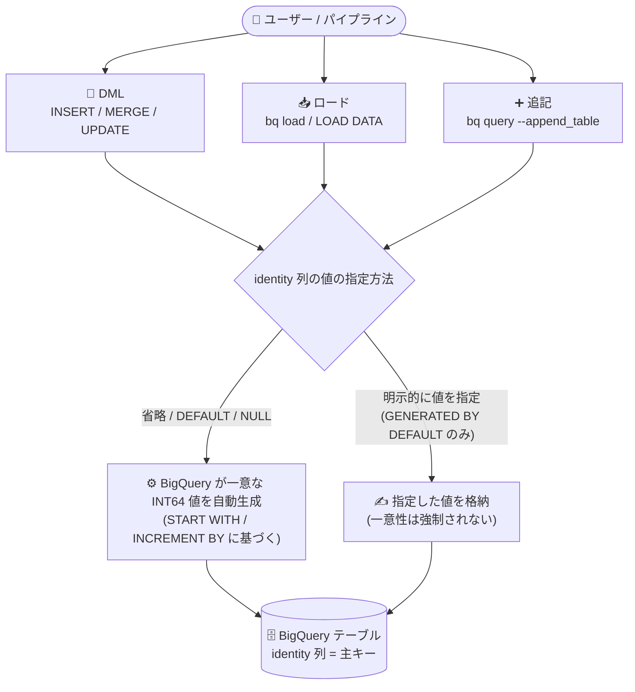

# BigQuery: Identity 列 (自動採番列) の作成が可能に (Preview)

**リリース日**: 2026-08-31

**サービス**: BigQuery

**機能**: Identity 列 (自動採番列) によるテーブル主キーの作成・維持

**ステータス**: Preview

📊 [このアップデートのインフォグラフィックを見る](https://takech9203.github.io/google-cloud-news-summary/20260831-bigquery-identity-columns.html)

## 概要

BigQuery でテーブルに **identity 列 (自動採番列 / auto-incrementing column)** を作成できるようになりました (Preview)。identity 列は、システムが一意な整数値を自動生成して格納する `INT64` 列で、テーブルの主キーの作成と維持に利用できます。identity 列を持つテーブルに行を挿入すると、BigQuery がその列に対して一意な整数値を自動生成します。

これまで BigQuery には Oracle や PostgreSQL などの RDBMS で一般的な自動採番機能が存在せず、サロゲートキーの生成には `GENERATE_UUID` 関数や `ROW_NUMBER()` を使ったバッチ処理などの回避策が必要でした。今回のアップデートにより、`CREATE TABLE` の DDL で `GENERATED AS IDENTITY` 句を指定するだけで、標準 SQL に近い形で自動採番列を定義できるようになります。

主な対象ユーザーは、データウェアハウスでサロゲートキー (代理キー) を管理するデータエンジニア、および Oracle・Teradata などの既存 DWH から BigQuery への移行を検討しているチームです。UUID (文字列) と比較して、整数値はストレージ使用量が少なく、テーブル結合の効率も高いため、identity 列が主キー生成の推奨手段として位置付けられています。

**アップデート前の課題**

- BigQuery には自動採番 (auto-increment) 機能がなく、Oracle の identity 列などからの移行時には `ROW_NUMBER() OVER ()` を使ったバッチ処理での採番など回避策が必要だった (公式の Oracle SQL 移行ガイドでもこの方法が案内されていた)
- `GENERATE_UUID` 関数で一意な文字列キーを生成できたが、文字列は整数より多くのストレージを消費し、結合処理の効率も整数に劣る
- 主キーとなる一意な整数値を、アプリケーション側または ETL パイプライン側で生成・管理する必要があった

**アップデート後の改善**

- `CREATE TABLE` の `GENERATED AS IDENTITY` 句で自動採番列を宣言的に定義でき、行の挿入時に BigQuery が一意な整数値を自動生成するようになった
- `ALTER TABLE ALTER COLUMN SET GENERATED` で既存の `INT64` 列を identity 列に変更でき、`DROP GENERATED` で identity 属性の削除も可能になった
- `INSERT`・`MERGE`・`UPDATE` などの DML、`bq load` / `LOAD DATA` によるロード、`bq query --append_table` によるクエリ結果の追記のいずれでも値の自動生成が機能する
- `INFORMATION_SCHEMA.COLUMNS` ビューで identity 列の構成 (`is_identity`、`identity_generation`、`identity_start`、`identity_increment`) を確認できる

## アーキテクチャ図



DML・ロード・クエリ結果の追記のいずれの経路でも、identity 列を省略するか `DEFAULT` / `NULL` を指定すると BigQuery が一意な整数値を自動生成してテーブルに格納します。`GENERATED BY DEFAULT` モードの場合のみ、ユーザーが明示的な値を指定することも可能です。

## サービスアップデートの詳細

### 主要機能

1. **`GENERATED AS IDENTITY` 句による identity 列の定義**
   - `CREATE TABLE` DDL で `INT64` 列に `GENERATED AS IDENTITY` 句を指定して identity 列を作成する
   - `START WITH` で開始値、`INCREMENT BY` で増分 (連続して生成される値の最小差分) を指定できる
   - 1 テーブルにつき identity 列は最大 1 列

2. **2 つの生成モード**
   - `GENERATED ALWAYS AS IDENTITY`: 値は常にシステム生成。挿入・更新時にユーザーが独自の値を指定することはできない (`ALWAYS` / `BY DEFAULT` を省略した場合のデフォルト)
   - `GENERATED BY DEFAULT AS IDENTITY`: ユーザーが独自の値を挿入・変更できる。ただし、ユーザーが挿入した値の一意性は BigQuery では強制されない
   - 列を省略するか `NULL` を指定して挿入すると自動生成される。identity 列は `NULL` 値を保持できない

3. **既存列への identity 属性の追加・削除**
   - `ALTER TABLE ALTER COLUMN SET GENERATED` で既存の `INT64` 列を identity 列に変更できる (既存行への値のバックフィルは行われない)
   - `ALTER TABLE ALTER COLUMN DROP GENERATED` で identity 属性を削除できる

4. **DML・ロード・追記のサポート**
   - `INSERT` / `MERGE` / `UPDATE` で `DEFAULT` または `NULL` キーワードを使って生成値を利用できる
   - `bq load` コマンドや `LOAD DATA` ステートメントでのロード時、ソースデータやスキーマから identity 列を省略すると値が生成される
   - `bq query --append_table` によるクエリ結果の追記でも identity 列の値が自動生成される

5. **INFORMATION_SCHEMA による構成の確認**
   - `INFORMATION_SCHEMA.COLUMNS` ビューの `is_identity`、`identity_generation`、`identity_start`、`identity_increment` 列で identity 列の設定を確認できる
   - `INFORMATION_SCHEMA.TABLES` ビューの `ddl` 列でも `CREATE TABLE` DDL 内の identity 列定義を確認できる

### 生成される値の特性

| 特性 | 説明 |
|------|------|
| 一意 (Unique) | 自動生成される値はテーブル内で一意 |
| 緩やかな順序 (Loosely ordered) | 生成値が厳密な昇順・降順になることは保証されない |
| 疎 (Sparse) | 生成値が連続することは保証されない。値がスキップされる場合があるが、identity 列の値は必ず指定した増分の倍数だけ異なる |

## 技術仕様

### 構文と主な仕様

| 項目 | 詳細 |
|------|------|
| データ型 | `INT64` のみ |
| 定義句 | `GENERATED [ALWAYS / BY DEFAULT] AS IDENTITY [(START WITH n INCREMENT BY n)]` |
| デフォルトの生成モード | `ALWAYS` (省略時) |
| 列数の上限 | 1 テーブルにつき identity 列は最大 1 列 |
| NULL 値 | identity 列は `NULL` を保持できない (挿入時の `NULL` 指定は自動生成のトリガーになる) |
| 既存列の変更 | `ALTER TABLE ALTER COLUMN SET GENERATED` / `DROP GENERATED` |
| メタデータ確認 | `INFORMATION_SCHEMA.COLUMNS` (`is_identity` ほか)、`INFORMATION_SCHEMA.TABLES` (`ddl`) |
| フィードバック窓口 | bigquery-sql-preview-support@google.com (Preview 期間中) |

### DDL の例

```sql
-- 0 から始まり 5 ずつ増加する identity 列を持つテーブルを作成
CREATE TABLE mydataset.id_table (
  id INT64 GENERATED ALWAYS AS IDENTITY(START WITH 0 INCREMENT BY 5),
  data STRING
);

-- ユーザー指定値も許可する identity 列 (100 から始まり 10 ずつ増加)
CREATE OR REPLACE TABLE mydataset.mytable (
  id INT64 GENERATED BY DEFAULT AS IDENTITY(START WITH 100 INCREMENT BY 10),
  data STRING
);
```

## 設定方法

### 前提条件

1. BigQuery でテーブルを作成・変更できる権限があること
2. Preview 機能である点を理解した上で利用すること (Pre-GA Offerings Terms が適用され、サポートが限定される場合がある)

### 手順

#### ステップ 1: identity 列を持つテーブルを作成する

```sql
CREATE TABLE mydataset.mytable (
  id INT64 GENERATED BY DEFAULT AS IDENTITY(START WITH 100 INCREMENT BY 10),
  data STRING
);
```

`GENERATED AS IDENTITY` 句で `INT64` 列を identity 列として指定します。`START WITH` と `INCREMENT BY` は省略可能です。

#### ステップ 2: データを挿入して自動生成を確認する

```sql
-- identity 列を省略して挿入すると値が自動生成される
INSERT mydataset.mytable (data) VALUES ('A'), ('B'), ('C');

-- BY DEFAULT モードでは独自の値の指定や DEFAULT / NULL による生成も可能
INSERT mydataset.mytable (id, data)
VALUES (155, 'D'), (DEFAULT, 'E'), (NULL, 'F');
```

生成値の行への割り当て順序は変動する可能性があります (緩やかな順序)。

#### ステップ 3: identity 列の構成を確認する

```sql
SELECT
  column_name,
  is_identity,
  identity_generation,
  identity_start,
  identity_increment
FROM
  mydataset.INFORMATION_SCHEMA.COLUMNS
WHERE
  table_name = 'mytable';
```

`INFORMATION_SCHEMA.COLUMNS` ビューで identity 列の生成モード・開始値・増分を確認できます。

## メリット

### ビジネス面

- **DWH 移行の障壁を低減**: Oracle 12c 以降の identity 列など、他の RDBMS / DWH の自動採番機能に相当する構文が使えるようになり、移行時のスキーマ・ETL の書き換え負担が減る
- **運用コストの削減**: サロゲートキー生成のためのカスタムロジック (ROW_NUMBER によるバッチ採番やアプリ側での採番管理) が不要になる

### 技術面

- **ストレージと結合の効率**: 整数キーは UUID などの文字列キーよりストレージ使用量が少なく、テーブル結合も効率的 (公式ドキュメントで identity 列が主キー生成の推奨手段とされている理由)
- **標準的な SQL 構文**: `GENERATED [ALWAYS | BY DEFAULT] AS IDENTITY` という SQL 標準に沿った構文で、宣言的にキー生成を定義できる
- **主キー管理との統合**: BigQuery の主キー (未強制の制約) の作成・維持に identity 列を利用できる

## デメリット・制約事項

### 制限事項

- 1 テーブルにつき identity 列は最大 1 列
- identity 列を持つテーブルは、レガシー SQL での読み取りは可能だが書き込みは不可
- identity 列をクラスタリングやパーティショニングに使用することはできない
- ソースまたは宛先テーブルに identity 列がある場合、次のテーブルコピー操作はサポートされない: `WRITE_APPEND` / `WRITE_TRUNCATE` 書き込み処理を伴うコピー、複数ソースのテーブルコピー
- Storage Write API (gRPC) や `tabledata.insertAll` API メソッドによるストリーミング挿入は、identity 列を持つテーブルではサポートされない

### 考慮すべき点

- Preview 機能のため Pre-GA Offerings Terms が適用され、サポートが限定される可能性がある。本番ワークロードへの適用は慎重に判断する
- 生成値は「一意」だが「厳密な昇順」や「連続性」は保証されない (緩やかな順序・疎)。連番であることを前提とするロジックには利用できない
- `GENERATED BY DEFAULT` モードでユーザーが挿入した値については、BigQuery は一意性を強制しない
- `ALTER TABLE ALTER COLUMN SET GENERATED` で既存列を identity 列化しても、既存行への値のバックフィルは行われない
- BigQuery の主キーは未強制 (not enforced) の制約であり、identity 列を使っても RDBMS のような一意性制約の強制が行われるわけではない

## ユースケース

### ユースケース 1: ディメンションテーブルのサロゲートキー生成

**シナリオ**: データウェアハウスのスタースキーマで、ディメンションテーブルに一意なサロゲートキーを付与したい。従来は `GENERATE_UUID` や `ROW_NUMBER()` による採番処理を ETL パイプラインに組み込んでいた。

**実装例**:
```sql
CREATE TABLE mydataset.dim_customer (
  customer_sk INT64 GENERATED ALWAYS AS IDENTITY,
  customer_id STRING,
  customer_name STRING
);

-- ロード時に customer_sk を省略すれば自動採番される
INSERT mydataset.dim_customer (customer_id, customer_name)
VALUES ('C001', 'Sample Corp'), ('C002', 'Example Inc');
```

**効果**: 整数のサロゲートキーが自動生成されるため、UUID 文字列キーに比べてストレージ効率とファクトテーブルとの結合効率が向上し、採番用のカスタムロジックも不要になる。

### ユースケース 2: MERGE を使った増分取り込みでのキー維持

**シナリオ**: ソースシステムからの増分データを `MERGE` でテーブルに取り込みつつ、新規行には自動生成キーを割り当てたい。

**実装例**:
```sql
MERGE mydataset.mytable T
USING mydataset.source_table S
ON T.data = S.data
WHEN NOT MATCHED THEN
  INSERT (data) VALUES (S.data);
```

**効果**: マージ挿入句で identity 列を省略するだけで新規行にキーが自動生成され、増分取り込みパイプラインでの主キー管理が簡素化される。

### ユースケース 3: Oracle など既存 DWH からの移行

**シナリオ**: Oracle の `GENERATED ALWAYS AS IDENTITY` 列を持つテーブルを BigQuery に移行する。従来の移行ガイドでは `ROW_NUMBER() OVER ()` によるバッチ採番への書き換えが必要だった。

**効果**: 移行先の BigQuery でもほぼ同等の DDL 構文で identity 列を定義できるため、スキーマ変換と採番ロジックの書き換え工数を削減できる。

## 料金

identity 列自体に固有の追加料金は Release Notes およびドキュメントに記載されていません。BigQuery の通常の料金 (ストレージ、分析、データ取り込み) が適用されます。詳細は料金ページを参照してください。

- [BigQuery の料金](https://cloud.google.com/bigquery/pricing)

## 利用可能リージョン

リージョンに関する固有の記載は Release Notes およびドキュメントにありません。最新情報は公式ドキュメントを参照してください。

## 関連サービス・機能

- **BigQuery 主キー・外部キー (未強制制約)**: identity 列の主なユースケースは主キーの作成・維持。BigQuery の主キー / 外部キーは未強制の制約としてクエリオプティマイザのヒントに利用される
- **`GENERATE_UUID` 関数**: 一意な文字列キーを生成する既存の代替手段。identity 列 (整数) の方がストレージ効率・結合効率の面で一般に推奨される
- **`INFORMATION_SCHEMA.COLUMNS` / `INFORMATION_SCHEMA.TABLES`**: identity 列の構成 (生成モード、開始値、増分) や DDL 定義の確認に使用
- **Spanner の IDENTITY 列**: Google Cloud では Spanner が先行して IDENTITY 列 (BIT_REVERSED_POSITIVE) をサポートしており、BigQuery でも同様の概念が利用可能になった

## 参考リンク

- 📊 [インフォグラフィック](https://takech9203.github.io/google-cloud-news-summary/20260831-bigquery-identity-columns.html)
- [公式リリースノート (2026 年 8 月 31 日)](https://docs.cloud.google.com/release-notes#August_31_2026)
- [ドキュメント: Specify an identity column](https://docs.cloud.google.com/bigquery/docs/identity-columns)
- [ドキュメント: DDL (CREATE TABLE)](https://docs.cloud.google.com/bigquery/docs/reference/standard-sql/data-definition-language#create-table-examples)
- [料金ページ](https://cloud.google.com/bigquery/pricing)

## まとめ

BigQuery に待望の自動採番機能である identity 列が Preview として追加され、サロゲートキーや主キーの生成・維持を宣言的な DDL だけで実現できるようになりました。UUID や ROW_NUMBER による従来の回避策と比べ、ストレージ効率・結合効率・運用性の面で優位性があります。まずは非本番環境で `CREATE TABLE ... GENERATED AS IDENTITY` を試し、ストリーミング挿入非対応やクラスタリング不可などの制限が自社のパイプライン設計と両立するかを確認することを推奨します。

---

**タグ**: BigQuery, Identity Column, Auto-increment, Primary Key, DDL, DML, Preview, Data Warehouse
