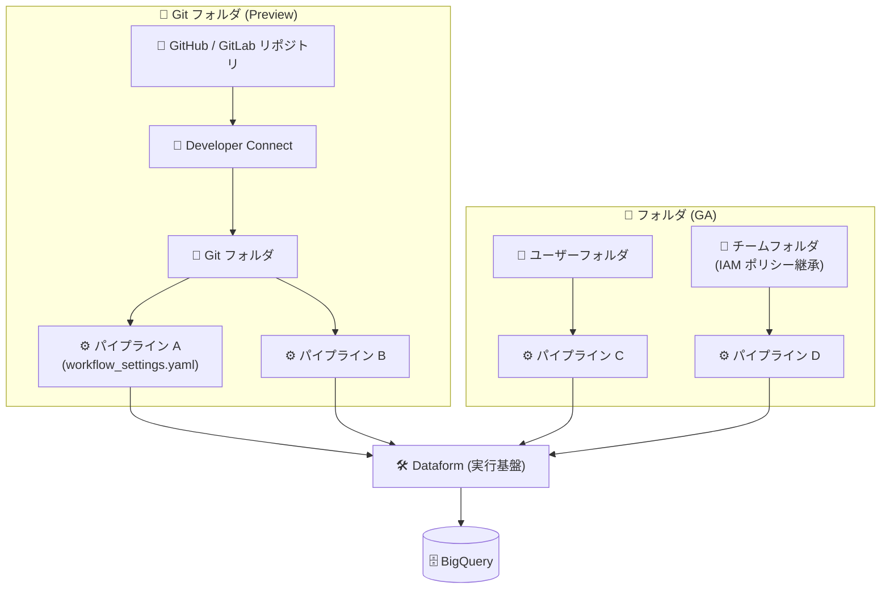

# BigQuery: パイプラインの Git フォルダ対応 (Preview) とフォルダ管理の GA

**リリース日**: 2026-08-31

**サービス**: BigQuery

**機能**: パイプラインの Git フォルダでの作成・保存・管理 (Preview) / フォルダでの作成・保存・管理 (GA)

**ステータス**: Git フォルダ対応は Preview、フォルダ対応は GA (一般提供)

📊 [このアップデートのインフォグラフィックを見る](https://takech9203.github.io/google-cloud-news-summary/20260831-bigquery-pipelines-git-folders.html)

## 概要

BigQuery パイプラインの保存・管理方法に関する 2 つの関連アップデートが発表されました。1 つ目は、BigQuery Studio の **Git フォルダ (Git folders) 内でパイプラインを作成・保存・管理できる機能**が Preview として提供開始されたことです。Git フォルダは、Developer Connect を使用して BigQuery Studio に接続されたリモートの GitHub / GitLab リポジトリを表すもので、1 つの Git リポジトリ内に複数の独立したパイプラインをホスト・整理できます。2 つ目は、**フォルダ (ユーザーフォルダおよびチームフォルダ) を使用したパイプラインの作成・保存・管理が GA (一般提供)** になったことです。

BigQuery パイプラインは Dataform を基盤とする機能で、SQL クエリ、ノートブック、データ準備 (Data Preparation)、SQLX タスクなどのコードアセットを依存関係に基づいた順序でスケジュール実行できます。今回のアップデートにより、パイプラインを BigQuery Studio の Files ペイン上でファイルシステムのように階層的に整理し、フォルダ単位の IAM ポリシー継承によるアクセス制御や、Git リポジトリによるバージョン管理を適用できるようになりました。

対象ユーザーは、BigQuery 上でデータ変換パイプライン (ELT) を構築・運用するデータエンジニアやデータアナリスト、およびパイプラインのコード管理に CI/CD やバージョン管理のプラクティスを適用したいチームです。

**アップデート前の課題**

- パイプラインをリモート Git リポジトリ (GitHub / GitLab) と直接統合されたフォルダ構造で管理する手段が BigQuery Studio になかった
- パイプラインのコードをチームで共有・整理する際、フォルダによる階層管理と IAM ポリシー継承を GA 品質 (SLA・フルサポート付き) で利用できなかった
- 複数の独立したパイプラインを 1 つの Git リポジトリでバージョン管理しながら BigQuery Studio 上で操作するワークフローが確立されていなかった

**アップデート後の改善**

- Git フォルダ (Preview) により、Developer Connect 経由で接続した GitHub / GitLab リポジトリ内でパイプラインを直接作成・管理できるようになった。1 リポジトリに複数の独立したパイプライン、またはリポジトリルートに `workflow_settings.yaml` を置いたルートレベルパイプラインをホストできる
- Git リポジトリのパイプラインは Dataform のデプロイメント機能 (リリース構成によるスケジューリングやマルチ環境オーケストレーション) をサポートする
- フォルダによるパイプライン管理が GA となり、ユーザーフォルダ・チームフォルダ内でパイプラインを階層的に整理し、フォルダの IAM ポリシー継承でアクセス制御を本番運用できるようになった

## アーキテクチャ図



BigQuery Studio の Files ペインでは、Developer Connect 経由で接続した Git フォルダ (Preview) と、ユーザー/チームフォルダ (GA) の両方でパイプラインを作成・整理でき、いずれも Dataform を基盤として BigQuery 上で実行されます。

## サービスアップデートの詳細

### 主要機能

1. **Git フォルダ内でのパイプライン作成・管理 (Preview)**
   - Git フォルダは、Developer Connect を使用して BigQuery Studio に接続されたリモートの GitHub / GitLab リポジトリを表す
   - 1 つの Git リポジトリ内に複数の独立したパイプラインをホスト・整理できる
   - パイプラインを作成すると、`workflow_settings.yaml` (パイプライン構成) と `definitions/actions.yaml` (タスク定義) がデフォルトファイルとして初期化される
   - リモートリポジトリのルートディレクトリに `workflow_settings.yaml` が存在する場合、BigQuery Studio はリポジトリ全体を「ルートレベルパイプライン」として自動認識し、リポジトリフォルダ自体にパイプラインアイコンが表示される
   - Git リポジトリのパイプラインは Dataform のデプロイメント (スケジューリング、リリース構成、マルチ環境オーケストレーション) をサポート

2. **フォルダによるパイプライン管理の GA**
   - BigQuery Studio の Files ペインで、個人のユーザーフォルダまたは共有のチームフォルダ内に直接パイプラインを作成・整理できる
   - フォルダの「+ (作成)」ボタンやコンテキストメニューからパイプラインを作成可能
   - 作成したパイプラインはパイプラインアイコン付きのフォルダとしてファイルツリーに表示される
   - フォルダの IAM ポリシー継承により、親フォルダに付与した権限がサブフォルダとファイルに伝播する

3. **Pipeline Viewer による可視化**
   - パイプラインフォルダをクリックすると Pipeline Viewer が開き、コンパイルされたタスクの DAG (有向非巡回グラフ)、実行ステータス、構成タブが表示される
   - `definitions/` などのネストされたディレクトリや個々のタスクファイルをファイルブラウザで参照できる

## 技術仕様

### パイプラインの保存先の比較

| 項目 | フォルダ (GA) | Git フォルダ (Preview) |
|------|--------------|----------------------|
| 保存場所 | ユーザーフォルダ / チームフォルダ | Developer Connect で接続した GitHub / GitLab リポジトリ |
| バージョン管理 | なし (フォルダ階層による整理) | Git によるバージョン管理 |
| アクセス制御 | フォルダの IAM ポリシー継承 | Developer Connect OAuth User ロールなど |
| Explorer ペインでの表示 | 表示される | 表示されない (Files ペインのみ) |
| デプロイメント | 標準のスケジューリング | Dataform デプロイメント (リリース構成、マルチ環境) |

### 必要な IAM ロール

| 操作 | 必要なロール |
|------|-------------|
| パイプラインの閲覧・実行 | Dataform Viewer (`roles/dataform.viewer`) + BigQuery Job User (`roles/bigquery.jobUser`) をプロジェクトに付与 |
| ユーザー資格情報での実行 | BigQuery Data Editor (`roles/bigquery.dataEditor`) をプロジェクトまたはデータセットに付与 |
| ユーザーフォルダ内の管理 | Code Owner / Code Editor / Code Viewer (`roles/dataform.codeOwner` など) をフォルダに付与 |
| チームフォルダ内の管理 | Team Folder Owner / Contributor / Viewer (`roles/dataform.teamFolderOwner` など) をチームフォルダに付与 |
| Git リポジトリ内の管理 | Developer Connect OAuth User (`roles/developerconnect.oauthUser`) をプロジェクトに付与 |

パイプラインを作成したユーザーには、そのパイプラインに対する Dataform Admin ロール (`roles/dataform.admin`) が自動的に付与されます。

### Git フォルダ作成時のデフォルトファイル

```yaml
# workflow_settings.yaml: パイプライン構成
# definitions/actions.yaml: タスク定義 (初期状態は空)
```

## 設定方法

### 前提条件

1. BigQuery パイプラインの利用に必要な IAM ロールが付与されていること
2. Git フォルダを使用する場合: BigQuery Studio Git リポジトリを Developer Connect 経由で作成・接続済みであること
3. Knowledge Catalog でパイプラインメタデータを管理する場合: プロジェクトで Dataplex API が有効化されていること

### 手順

#### ステップ 1: フォルダ内にパイプラインを作成する (GA)

1. Google Cloud コンソールで BigQuery ページに移動する
2. 左ペインで「Files」をクリックしてファイルブラウザを開く
3. 次のいずれかの方法でパイプラインを作成する
   - パイプラインを配置するユーザーフォルダまたはチームフォルダを選択し、ツールバーの「+ (作成)」ボタンをクリックして「Pipeline」を選択
   - ファイルツリーでフォルダ名の横の「View actions」をクリックし、「Create」>「Pipeline」を選択
4. 作成ダイアログでパイプライン名を入力し、「Create」をクリックする
5. パイプラインフォルダをクリックして Pipeline Viewer を開き、パイプライン設定を構成する

#### ステップ 2: Git フォルダ内にパイプラインを作成する (Preview)

1. Google Cloud コンソールで BigQuery ページに移動する
2. Git リポジトリを未接続の場合は、BigQuery Studio Git リポジトリを作成・接続する (ユーザールートノードの横の「View actions」>「Create」>「Git repository」からリモートリポジトリの URL を入力し、Developer Connect のアカウントコネクタで接続)
3. 左ペインで「Files」をクリックし、接続済みの Git リポジトリフォルダまたはその中のディレクトリを見つける
4. フォルダ名の横の「View actions」をクリックし、「Create」>「Pipeline」を選択する
5. ダイアログでパイプライン名を入力して「Save」をクリックすると、`workflow_settings.yaml` と `definitions/actions.yaml` で初期化されたパイプラインディレクトリが作成される
6. ファイルブラウザでパイプラインディレクトリをクリックして Pipeline Viewer を開く

## メリット

### ビジネス面

- **チームコラボレーションの強化**: チームフォルダと IAM ポリシー継承 (GA) により、チーム単位でパイプラインへのアクセスを効率的に管理でき、統制の取れたデータ基盤運用が可能になる
- **ガバナンスと監査性の向上**: Git フォルダ (Preview) によりパイプラインの変更履歴が Git で追跡でき、コードレビューを通じた変更管理プロセスを適用できる

### 技術面

- **バージョン管理との統合**: GitHub / GitLab リポジトリに Developer Connect 経由で接続し、BigQuery Studio を離れることなくパイプラインのコードをバージョン管理できる
- **マルチ環境デプロイ**: Git リポジトリのパイプラインは Dataform のデプロイメント機能 (リリース構成) をサポートし、開発・本番など複数環境のオーケストレーションに対応する
- **一元的なコード整理**: パイプラインをノートブックや保存済みクエリなどの他のコードアセットと同じ Files ペインで階層的に管理できる

## デメリット・制約事項

### 制限事項

- Git フォルダでのパイプライン管理は Preview であり、Pre-GA 利用規約が適用される (サポートが限定される可能性がある)
- Git フォルダに保存されたパイプラインは Explorer ペインには表示されない (Files ペインでのみ閲覧可能)
- BigQuery Studio Git リポジトリはユーザールートフォルダのコンテキストに制限され、個人利用が想定されている (他のユーザーとの共有は非推奨)
- Git Proxy を使用する Developer Connect アカウントコネクタはサポートされない
- パイプラインは Google Cloud コンソールでのみ利用可能で、作成後にリージョンを変更できない
- フォルダのネストは最大 5 階層まで。100 個を超えるファイル/フォルダを含むフォルダは移動できない

### 考慮すべき点

- ファイル数が多い、ファイルサイズが大きい、ブランチが多い、コミット履歴が深いリポジトリはクローンに時間がかかり、タイムアウトする可能性がある (shallow clone の利用で軽減可能)
- BigQuery パイプラインは Dataform のクォータと制限の対象となる
- スケジュール実行されたパイプラインが次回の実行開始までに完了しない場合、次回の実行はスキップされエラーとしてマークされる
- Preview 機能へのフィードバックは cloud-pipelines-ui@google.com 宛てに送信できる

## ユースケース

### ユースケース 1: Git ベースの ELT パイプライン開発ワークフロー

**シナリオ**: データエンジニアリングチームが、BigQuery 上の ELT パイプラインのコードを GitHub で管理し、プルリクエストベースのコードレビューを経て本番反映したい。

**実装例**:
```
1. GitHub リポジトリを Developer Connect 経由で BigQuery Studio に接続
2. Git フォルダ内にパイプラインを作成 (workflow_settings.yaml + definitions/actions.yaml)
3. SQL クエリや SQLX タスクをパイプラインに追加し、ブランチにコミット
4. GitHub 上でプルリクエストをレビュー・マージ
5. Dataform のリリース構成で本番環境へのデプロイとスケジューリングを構成
```

**効果**: パイプラインの変更がすべて Git で追跡され、レビュー済みのコードのみが本番環境で実行される。マルチ環境 (開発/本番) のオーケストレーションも実現できる。

### ユースケース 2: チームフォルダによる部門別パイプライン管理

**シナリオ**: 分析部門で複数チームがそれぞれパイプラインを運用しており、チームごとにアクセス権限を分離しつつ、フォルダ階層で整理したい。

**効果**: GA となったフォルダ機能により、チームフォルダに Team Folder Owner / Contributor / Viewer ロールを付与するだけで、配下のすべてのパイプラインに権限が継承される。個々のパイプラインへの権限付与作業が不要になり、本番環境での利用にも GA として安心して採用できる。

## 料金

フォルダや Git フォルダによるパイプラインの整理自体に追加料金はありませんが、パイプラインの実行には以下の料金が発生します。

- パイプラインタスクの実行: BigQuery のコンピューティングおよびストレージ料金
- ノートブックを含むパイプライン: Colab Enterprise ランタイム料金 (デフォルトマシンタイプに基づく)
- パイプライン実行ログ: Cloud Logging の料金 (ログ記録は自動的に有効化される)

詳細は [BigQuery の料金ページ](https://cloud.google.com/bigquery/pricing) を参照してください。

## 利用可能リージョン

BigQuery フォルダはすべての [Dataform ロケーション](https://docs.cloud.google.com/dataform/docs/locations)でサポートされます。コードアセットは作成時にデフォルトのコードリージョンに保存され、作成後にリージョンを変更することはできません。

## 関連サービス・機能

- **Dataform**: BigQuery パイプラインとフォルダの実行・管理基盤。パイプラインのスケジューリング、リリース構成、アクセス制御 (IAM) は Dataform の仕組みを利用する
- **Developer Connect**: GitHub / GitLab リポジトリを BigQuery Studio に接続するためのマネージド統合サービス。OAuth 認証フローによる安全な接続を提供する
- **Knowledge Catalog (Dataplex)**: パイプラインで作成されたテーブルのメタデータが自動的に同期され、メタデータの検索・管理が可能
- **Cloud Logging / Cloud Monitoring**: パイプライン実行は Dataform リポジトリ ID 単位で Cloud Logging に記録され、ログベースのアラートポリシーで実行失敗を通知できる
- **Colab Enterprise**: パイプライン内のノートブックタスクの実行ランタイム

## 参考リンク

- 📊 [インフォグラフィック](https://takech9203.github.io/google-cloud-news-summary/20260831-bigquery-pipelines-git-folders.html)
- [公式リリースノート](https://docs.cloud.google.com/release-notes#August_31_2026)
- [ドキュメント: パイプラインの作成](https://docs.cloud.google.com/bigquery/docs/create-pipelines)
- [ドキュメント: パイプラインの管理](https://docs.cloud.google.com/bigquery/docs/manage-pipelines)
- [ドキュメント: フォルダによるコードアセットの整理](https://docs.cloud.google.com/bigquery/docs/code-asset-folders)
- [ドキュメント: BigQuery Studio Git リポジトリによるコード管理](https://docs.cloud.google.com/bigquery/docs/git-repositories)
- [ドキュメント: BigQuery パイプラインの概要](https://docs.cloud.google.com/bigquery/docs/pipelines-introduction)
- [料金ページ](https://cloud.google.com/bigquery/pricing)

## まとめ

BigQuery パイプラインのフォルダ管理が GA となり、チームフォルダと IAM ポリシー継承を活用した本番運用が可能になりました。さらに Git フォルダ (Preview) により、GitHub / GitLab との直接統合でパイプラインのバージョン管理と CI/CD プラクティスの適用が視野に入ります。まずは GA となったフォルダ機能でパイプラインの整理とアクセス制御を見直し、Git ベースの開発ワークフローを検討しているチームは Preview の Git フォルダを評価することをお勧めします。

---

**タグ**: BigQuery, Dataform, パイプライン, Git, Developer Connect, BigQuery Studio, GA, Preview, データエンジニアリング
