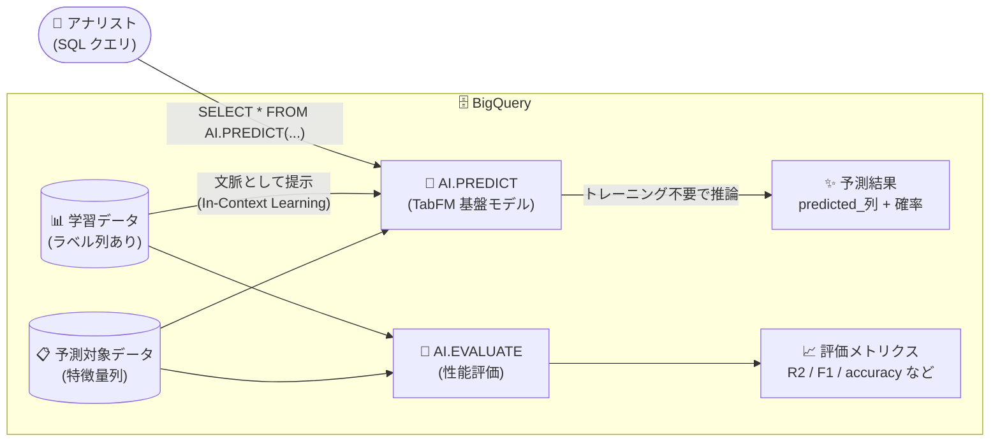

# BigQuery: TabFM による AI.PREDICT ゼロショット予測 (Preview)

**リリース日**: 2026-08-31

**サービス**: BigQuery

**機能**: TabFM (表形式データ向け基盤モデル) による AI.PREDICT / AI.EVALUATE のゼロショット回帰・分類

**ステータス**: Preview

📊 [このアップデートのインフォグラフィックを見る](https://takech9203.github.io/google-cloud-news-summary/20260831-bigquery-tabfm-ai-predict.html)

## 概要

BigQuery が、Google の表形式データ向け事前学習済み基盤モデル **TabFM** をサポートしました。TabFM は In-Context Learning (文脈内学習) によるゼロショットの回帰・分類を実現するモデルで、モデルのトレーニングやハイパーパラメータチューニングを一切行うことなく、構造化データに対して高精度な予測を得ることができます。本機能は Preview として提供されます。

TabFM は **AI.PREDICT 関数**から直接利用でき、学習用データと予測対象データをテーブルまたはクエリとして渡すだけで、SQL 一発で予測結果が返ります。また、**AI.EVALUATE 関数**を使用してモデルの予測性能 (回帰: R2 スコアなど、分類: 適合率・再現率・精度・F1 スコア) を評価できます。ラベル列の型が数値型 (INT64/FLOAT64/NUMERIC/BIGNUMERIC) であれば回帰、STRING/BOOL であれば分類が自動的に実行されます。

TabFM は Google Research が 2026 年 6 月に発表した基盤モデルで、行と列の交互アテンション、行圧縮、ICL Transformer を組み合わせたアーキテクチャを採用し、構造的因果モデル (SCM) で生成された数億件の合成データセットで学習されています。TabArena ベンチマークでは、チューニング済みの XGBoost やランダムフォレストといった業界標準の教師あり学習アルゴリズムを上回る性能が報告されています。データアナリストやデータエンジニアが、ML の専門知識なしに SQL だけで予測分析を実行できるようになる、BigQuery ML の大きな進化です。

**アップデート前の課題**

- BigQuery 内で構造化データの回帰・分類を行うには、`CREATE MODEL` でブースティングツリーや線形回帰などのモデルを明示的にトレーニングする必要があった
- 高精度を得るにはハイパーパラメータチューニングや特徴量エンジニアリングなどの ML 専門知識と試行錯誤の時間が必要だった
- モデルの作成・管理 (保存、バージョン管理、再トレーニング) という運用負荷が発生していた

**アップデート後の改善**

- 事前学習済み基盤モデル TabFM により、モデルのトレーニングなしで即座に予測を実行できるようになった (ゼロショット)
- ハイパーパラメータチューニング不要で、In-Context Learning により高精度な予測が得られるようになった
- AI.PREDICT 関数の 1 クエリで学習データの提示から予測までが完結し、モデル管理が不要になった
- AI.EVALUATE 関数で予測性能の評価 (回帰・分類それぞれの標準メトリクス) も SQL だけで実行できるようになった

## アーキテクチャ図



学習データを「文脈」として TabFM に提示することで、モデルのトレーニングを行わずに予測対象データへの回帰・分類をワンクエリで実行するデータフローです。

## サービスアップデートの詳細

### 主要機能

1. **AI.PREDICT 関数によるゼロショット予測**
   - 学習データ (テーブルまたはクエリ) と予測対象データ (テーブルまたはクエリ) を引数に渡すだけで予測を実行
   - ラベル列は `label_col` 引数で指定 (デフォルトは `label` 列)
   - ラベル列が INT64 / FLOAT64 / NUMERIC / BIGNUMERIC の場合は回帰、BOOL / STRING の場合は分類を自動実行
   - 分類の場合は `predicted_<ラベル列名>_probs` 列に各クラスへの割り当て確率 (`ARRAY<STRUCT<label STRING, prob FLOAT64>>`) も返す

2. **AI.EVALUATE 関数によるモデル性能評価**
   - TabFM の予測性能を SQL だけで評価可能 (TabFM 評価では `label_col` の指定が必須)
   - 回帰: mean_absolute_error、mean_squared_error、mean_squared_log_error、median_absolute_error、r2_score、explained_variance
   - 分類: precision (マクロ平均)、recall (マクロ平均)、accuracy、f1_score (マクロ平均)

3. **TabFM 基盤モデル (Google Research)**
   - 行・列の交互アテンション、行圧縮、ICL Transformer を組み合わせたアーキテクチャ
   - 構造的因果モデル (SCM) で生成した数億件の合成データセットにより事前学習
   - TabArena ベンチマーク (分類 38 データセット + 回帰 13 データセット) でチューニング済み XGBoost 等を上回る性能を報告

## 技術仕様

### AI.PREDICT の構文

```sql
AI.PREDICT(
  { TABLE TRAINING_TABLE | (TRAINING_QUERY) },
  { TABLE PREDICTION_TABLE | (PREDICTION_QUERY) }
  [, label_col => 'LABEL_COL' ]
)
```

### 仕様一覧

| 項目 | 詳細 |
|------|------|
| 対応タスク | 回帰 (数値ラベル)、分類 (STRING / BOOL ラベル) |
| 特徴量・ラベル列の対応型 | STRING、BOOL、INT64、FLOAT64、NUMERIC、BIGNUMERIC |
| 特徴量列の上限 | 最大 20 列 (超過する場合は bqml-feedback@google.com に連絡) |
| 分類カテゴリ数の上限 | 最大 10 カテゴリ |
| 学習データの要件 | `label` 列または `label_col` で指定した列を含むこと。それ以外の列はすべて特徴量として扱われる |
| 予測データの要件 | 学習データのすべての特徴量列を含むこと (追加列の同居は可) |
| 出力 (回帰) | `predicted_<ラベル列名>` (ラベル列と同じ型) |
| 出力 (分類) | `predicted_<ラベル列名>` + `predicted_<ラベル列名>_probs` (各ラベルと確率) |
| ステータス | Preview (Pre-GA Offerings Terms が適用) |

## 設定方法

### 前提条件

1. BigQuery が利用可能なプロジェクトであること
2. 学習データにラベル列 (`label` またはクエリで指定する列) が含まれていること
3. 特徴量列が 20 列以内、分類の場合はカテゴリ数が 10 以内であること

### 手順

#### ステップ 1: AI.PREDICT で回帰予測を実行

```sql
WITH prepared_data AS (
  SELECT *, RAND() <= 0.8 AS training
  FROM `bigquery-public-data.ml_datasets.penguins`
  WHERE body_mass_g > 0
)
SELECT *
FROM AI.PREDICT(
  -- 学習データ
  (SELECT * EXCEPT(training) FROM prepared_data WHERE training),
  -- 予測対象データ
  (SELECT * EXCEPT(training) FROM prepared_data WHERE NOT training),
  label_col => 'body_mass_g');
```

ペンギンの体重 (body_mass_g) を回帰予測する例です。結果には元の列に加えて `predicted_body_mass_g` 列が返ります。

#### ステップ 2: AI.PREDICT で分類予測を実行

```sql
WITH prepared_data AS (
  SELECT *, RAND() <= 0.8 AS training
  FROM `bigquery-public-data.ml_datasets.penguins`
  WHERE sex IS NOT NULL AND sex != "."
)
SELECT *
FROM AI.PREDICT(
  (SELECT * EXCEPT(training) FROM prepared_data WHERE training),
  (SELECT * EXCEPT(training) FROM prepared_data WHERE NOT training),
  label_col => 'sex');
```

STRING 型のラベル列を指定すると分類タスクとして実行され、`predicted_sex` と各クラスの確率 `predicted_sex_probs` が返ります。

#### ステップ 3: AI.EVALUATE で予測性能を評価

```sql
WITH prepared_data AS (
  SELECT *, RAND() <= 0.8 AS training
  FROM `bigquery-public-data.ml_datasets.penguins`
  WHERE body_mass_g > 0
)
SELECT *
FROM AI.EVALUATE(
  (SELECT * EXCEPT(training) FROM prepared_data WHERE training),
  (SELECT * EXCEPT(training) FROM prepared_data WHERE NOT training),
  label_col => 'body_mass_g');
```

回帰では r2_score や mean_absolute_error など、分類では precision / recall / accuracy / f1_score が返り、TabFM の予測品質を定量的に確認できます。

## メリット

### ビジネス面

- **予測分析の民主化**: ML エンジニアでなくても、SQL が書けるアナリストが需要予測や解約予測などの予測分析を即座に実行できる
- **開発期間の大幅な短縮**: モデルのトレーニング、チューニング、デプロイという従来の ML ライフサイクルを省略でき、アイデアから予測結果までの時間を短縮できる
- **運用コストの削減**: モデル資産の管理 (再トレーニング、バージョン管理) が不要

### 技術面

- **ゼロショット / In-Context Learning**: 学習データを文脈として提示するだけで単一のフォワードパスで予測を生成。データセットごとの重み更新が不要
- **高精度**: TabArena ベンチマークでチューニング済みの XGBoost やランダムフォレストを上回る性能を報告 (Google Research)
- **BigQuery ネイティブ**: データの移動なしに BigQuery 内で完結。予測結果はそのまま SQL で後続処理に利用可能
- **評価まで SQL で完結**: AI.EVALUATE により標準的な回帰・分類メトリクスでの性能検証が可能

## デメリット・制約事項

### 制限事項

- 特徴量列は最大 20 列まで (それ以上必要な場合は bqml-feedback@google.com への連絡が必要)
- 分類は最大 10 カテゴリまで
- 特徴量・ラベル列は STRING、BOOL、INT64、FLOAT64、NUMERIC、BIGNUMERIC 型のみ対応

### 考慮すべき点

- Preview 段階のため、Pre-GA Offerings Terms が適用され、サポートが限定される可能性がある。本番ワークロードへの適用は慎重に判断する
- **2026 年 10 月 30 日以降、TabFM はトークンベースの課金に移行予定**。移行後はクエリ内で TabFM が消費したトークンと、クエリの残り部分のスロットまたは処理バイト数の両方が課金されるため、コストの再見積もりが必要
- 大規模データや特徴量の多いデータセットでは、従来の BigQuery ML モデル (ブースティングツリー、AutoML など) の方が適するケースもある

## ユースケース

### ユースケース 1: 顧客データからの解約予測 (分類)

**シナリオ**: BigQuery に蓄積された顧客属性・利用状況データを使って解約 (チャーン) の可能性を予測したいが、ML モデルを構築・運用するリソースがない。

**実装例**:
```sql
SELECT *
FROM AI.PREDICT(
  (SELECT * FROM `myproject.crm.customers_labeled`),   -- 過去の解約実績付きデータ
  (SELECT * FROM `myproject.crm.customers_active`),    -- 現在のアクティブ顧客
  label_col => 'churned');
```

**効果**: モデルのトレーニングなしで解約確率 (`predicted_churned_probs`) が得られ、確率の高い顧客への優先的なリテンション施策に即座に活用できる。

### ユースケース 2: 売上・数値指標の回帰予測

**シナリオ**: 店舗属性や商品特徴などの構造化データから売上金額を見積もりたいが、ハイパーパラメータチューニングの知見がない。

**効果**: 数値型のラベル列を指定するだけで回帰予測が実行され、AI.EVALUATE の r2_score で予測品質を確認しながら、チューニングレスで実用的な見積もりが得られる。

## 料金

Preview 期間中の TabFM の利用は以下のように課金されます。

- **Enterprise / Enterprise Plus エディション**: スロットで課金
- **オンデマンド料金**: 処理されたバイト数に基づいて課金

**重要**: 2026 年 10 月 30 日以降、BigQuery TabFM はトークンベースの料金体系に移行します。移行後は、クエリ内でモデルが消費した TabFM トークンに加え、クエリの残りの部分に対する BigQuery スロットまたは処理バイト数が課金されます。

詳細は [BigQuery ML の料金ページ](https://cloud.google.com/bigquery/pricing#bigquery-ml-pricing) を参照してください。

## 利用可能リージョン

AI.EVALUATE および TabFM モデルは、[サポートされているすべての BigQuery ML ロケーション](https://docs.cloud.google.com/bigquery/docs/locations#locations-for-non-remote-models) で利用できます。

## 関連サービス・機能

- **BigQuery ML (CREATE MODEL)**: 従来型のモデルトレーニングによる回帰・分類 (ブースティングツリー、AutoML Tables など)。20 列超の特徴量や 10 超のカテゴリが必要な場合の選択肢
- **AI.FORECAST (TimesFM)**: 同じく事前学習済み基盤モデル TimesFM を使った時系列予測関数。TabFM とあわせて「トレーニング不要の予測」ラインナップを構成
- **ML.EVALUATE**: 従来の BigQuery ML モデル向け評価関数。TabFM / TimesFM には AI.EVALUATE を使用する
- **BigQuery 生成 AI 関数 (AI.GENERATE など)**: 非構造化データ向けの Gemini ベース関数。TabFM は構造化データ予測を担い、これらを補完する

## 参考リンク

- 📊 [インフォグラフィック](https://takech9203.github.io/google-cloud-news-summary/20260831-bigquery-tabfm-ai-predict.html)
- [公式リリースノート](https://docs.cloud.google.com/release-notes#August_31_2026)
- [Google Research Blog: Introducing TabFM](https://research.google/blog/introducing-tabfm-a-zero-shot-foundation-model-for-tabular-data/)
- [AI.PREDICT 関数リファレンス](https://docs.cloud.google.com/bigquery/docs/reference/standard-sql/bigqueryml-syntax-ai-predict)
- [AI.EVALUATE 関数リファレンス](https://docs.cloud.google.com/bigquery/docs/reference/standard-sql/bigqueryml-syntax-ai-evaluate)
- [料金ページ (BigQuery ML)](https://cloud.google.com/bigquery/pricing#bigquery-ml-pricing)

## まとめ

TabFM の BigQuery 統合により、モデルのトレーニングもチューニングも不要な「ゼロショット予測」が SQL の関数 1 つで実現しました。構造化データの回帰・分類をすばやく試したいチームは、まず AI.PREDICT + AI.EVALUATE で既存の BigQuery データに対する予測品質を検証することをおすすめします。特徴量 20 列・分類 10 カテゴリの上限と、2026 年 10 月 30 日からのトークンベース課金への移行には留意してください。

---

**タグ**: BigQuery, BigQuery ML, TabFM, AI.PREDICT, AI.EVALUATE, 基盤モデル, ゼロショット学習, In-Context Learning, 機械学習, Preview
