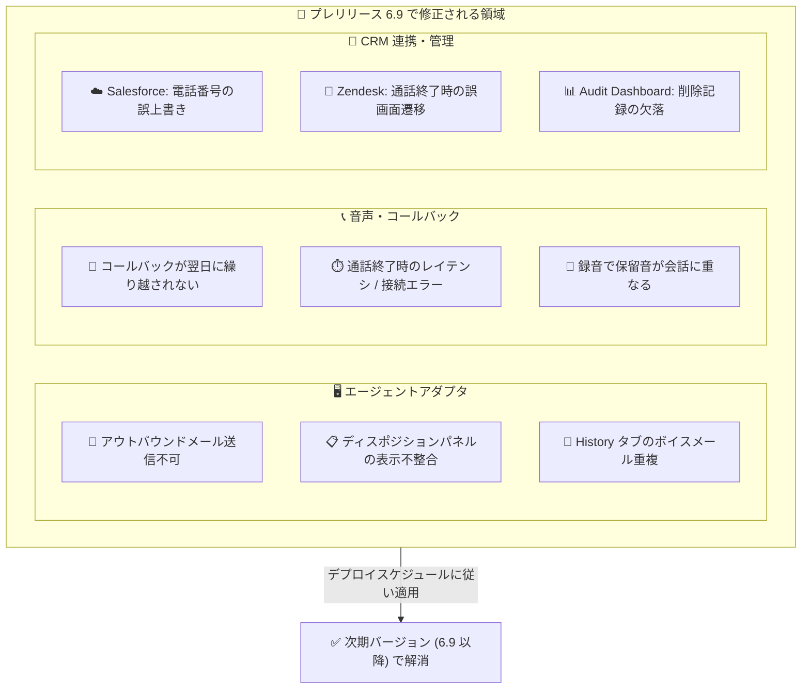

# Google Cloud CCaaS: プレリリースノート 6.9 (9 件の不具合修正)

**リリース日**: 2026-08-31

**サービス**: Google Cloud Contact Center as a Service (CCaaS) / Contact Center AI Platform

**機能**: プレリリースノート 6.9 (不具合修正)

**ステータス**: Announcement + Fixed (プレリリース)

📊 [このアップデートのインフォグラフィックを見る](https://takech9203.github.io/google-cloud-news-summary/20260831-ccaas-prerelease-6-9.html)

## 概要

Google Cloud Contact Center as a Service (CCaaS、旧称 Contact Center AI Platform) の次期バージョンとして想定されているバージョン 6.9 のプレリリースノートが公開されました。プレリリースノートは、次期バージョンで提供が予定されている変更内容を事前に知らせるもので、実際にリリースされるバージョン番号は 6.9 より大きくなる可能性があると明記されています。

今回のプレリリースノートは新機能の追加ではなく、9 件の不具合修正 (Fixed) で構成されています。修正対象は、エージェントのアウトバウンドメール送信、コールアダプタのディスポジションパネルや履歴タブの表示、ボイスコールバックの営業時間外処理、Salesforce・Zendesk との CRM 連携、通話終了時のレイテンシ、録音内の保留音、Audit Dashboard への監査記録など、コンタクトセンター運用の広い範囲に及びます。

CCaaS を運用する管理者や、Salesforce / Zendesk 連携を利用している組織にとって、既知の問題がどのバージョンで解消されるかを把握するうえで重要なアップデートです。実際の適用タイミングは、各インスタンスが選択しているデプロイスケジュールに依存します。

**アップデート前の課題**

このリリースで修正される問題として、以下がリリースノートに明記されています。

- エージェントが新規のアウトバウンドメールを送信できないことがあった
- コールアダプタのディスポジション (対応結果) パネルが、状態更新の不整合により誤って非表示 / 表示になることがあった
- ダイレクトインバウンドのボイスメールが、コールアダプタの History タブに複数回重複して表示されていた
- ボイスコールバックが営業時間の終了時に翌日へ繰り越されず、キャンセルされていた
- Salesforce のケースからクリックトゥダイヤルを使用すると、親アカウントの携帯電話番号がダイヤルした番号で誤って上書きされていた
- 通話終了時に大きなレイテンシや接続エラーがインスタンスで発生することがあった
- 通話録音内で保留音がライブの会話音声と重なって記録されていた
- カスタムの営業時間 (hours of operation) グループを削除しても、Audit Dashboard に記録が表示されなかった
- Zendesk 連携で、音声通話の終了時にアクティブなチケットタブから顧客プロファイルページへ誤って遷移していた

**アップデート後の改善**

- メール、音声、コールバック、CRM 連携にまたがる上記 9 件の問題がすべて修正され、エージェントの日常オペレーションの信頼性が向上する
- Salesforce / Zendesk 連携における CRM データの誤上書きや意図しない画面遷移が解消され、CRM 上のデータ品質とエージェント体験が改善される
- 営業時間グループ削除の監査記録が Audit Dashboard に表示されるようになり、変更管理・監査対応の網羅性が向上する

## アーキテクチャ図

今回の修正 9 件を、エージェントアダプタ、音声・コールバック、CRM 連携・管理の 3 領域に整理した図です。修正は次期バージョンのリリース後、各インスタンスのデプロイスケジュールに従って適用されます。

## サービスアップデートの詳細

### 主要な修正内容

1. **エージェントアダプタ関連の修正**
   - 新規アウトバウンドメールを送信できない問題を修正
   - コールアダプタのディスポジションパネルが状態更新の不整合により誤って表示 / 非表示になる問題を修正
   - ダイレクトインバウンドのボイスメールが History タブに複数回表示される問題を修正

2. **音声・コールバック関連の修正**
   - ボイスコールバックが営業時間終了時にキャンセルされ、翌日へ繰り越されない問題を修正
   - 通話終了時に大きなレイテンシや接続エラーが発生する問題を修正
   - 通話録音内で保留音がライブ会話と重なる問題を修正

3. **CRM 連携 (Salesforce / Zendesk) の修正**
   - Salesforce のケースからのクリックトゥダイヤルで、親アカウントの携帯電話番号がダイヤル番号で上書きされる問題を修正
   - Zendesk 連携で、音声通話終了時にアクティブなチケットタブから顧客プロファイルページへ誤って遷移する問題を修正

4. **管理・監査機能の修正**
   - カスタム営業時間グループの削除が Audit Dashboard に表示されない問題を修正

## 技術仕様

### アップデートの位置づけ

| 項目 | 詳細 |
|------|------|
| リリース種別 | プレリリースノート (次期バージョンの事前告知) |
| 想定バージョン | 6.9 (実際のリリースバージョンは 6.9 より大きくなる可能性あり) |
| 変更内容 | 不具合修正 9 件 (新機能の追加なし) |
| 適用タイミング | インスタンスごとに選択したデプロイスケジュールに依存 |
| 影響を受ける連携 | Salesforce、Zendesk |

### 関連する既存機能: コールバックフルフィルメント時間

今回修正されたコールバックの翌日繰り越しは、バージョン 4.12 で導入された「コールバックフルフィルメント時間 (callback fulfillment hours)」機能に関連します。この機能では、コールバックの翌日ロールオーバーを有効にすると、フルフィルメント時間外にスケジュールされたコールバックが翌日に繰り越されます (無効の場合はキャンセルされます)。今回の修正により、ロールオーバー設定時に営業時間終了でコールバックがキャンセルされてしまう不具合が解消されます。

## メリット

### ビジネス面

- **顧客接点の取りこぼし防止**: 営業時間外のコールバックが翌日に正しく繰り越されるようになり、コールバック依頼をした顧客への折り返し漏れを防げる
- **CRM データ品質の維持**: Salesforce の親アカウントの電話番号が誤って上書きされる問題が解消され、顧客マスタデータの信頼性が保たれる
- **監査・コンプライアンス対応の強化**: 営業時間グループの削除が Audit Dashboard に記録されるようになり、設定変更の追跡が完全になる

### 技術面

- **通話品質・安定性の向上**: 通話終了時のレイテンシ / 接続エラー、録音での保留音と会話音声の重なりが解消される
- **エージェント UI の一貫性向上**: ディスポジションパネルの表示不整合、ボイスメールの重複表示、Zendesk での意図しない画面遷移が解消され、エージェントの操作ミスや混乱を減らせる
- **メールチャネルの復旧**: アウトバウンドメールが送信できない問題の修正により、メールチャネル運用の信頼性が回復する

## デメリット・制約事項

### 考慮すべき点

- これはプレリリースノートであり、正式リリース前の告知である。実際にリリースされるバージョン番号は 6.9 より大きくなる可能性がある
- 修正が自分のインスタンスに適用されるタイミングは、選択しているデプロイスケジュールに依存するため、適用時期を確認する必要がある
- 今回のリリースには新機能は含まれず、不具合修正のみである

## 料金

このアップデートは不具合修正であり、料金への影響はありません。参考として、CCaaS (CCAI Platform) のインスタンスは月次課金で、以下のいずれかの課金モデルが適用されます。

- **同時エージェント数 (Concurrent agents)**: 月内に同時サインインしたエージェントロールのユーザーの最大数
- **登録エージェント数 (Named agents)**: 月内にエージェントロールを持ったユーザーの最大数
- **利用分数 (Minutes used)**: エージェントロールのユーザーがサインインしていた分数

テレフォニー費用は従量課金で別途請求されます。詳細は [Contact Center AI Platform の料金](https://cloud.google.com/contact-center/ccai-platform/pricing)を参照してください。

## 利用可能リージョン

CCaaS が利用可能な国と Google Cloud リージョンについては、[ロケーションのドキュメント](https://docs.cloud.google.com/contact-center/ccai-platform/docs/localities)を参照してください。

## 関連サービス・機能

- **Salesforce 連携**: 今回の修正対象。クリックトゥダイヤル時の電話番号上書き問題が解消される
- **Zendesk 連携**: 今回の修正対象。通話終了時の画面遷移問題が解消される
- **コールバックフルフィルメント時間**: バージョン 4.12 で導入された機能。今回の修正で翌日ロールオーバーが正しく動作するようになる
- **Audit Dashboard**: 設定変更の監査記録を表示するダッシュボード。営業時間グループ削除の記録漏れが解消される
- **Agent Assist / Conversational Agents**: CCaaS が中核として利用する Gemini Enterprise for Customer Experience 製品群

## 参考リンク

- 📊 [インフォグラフィック](https://takech9203.github.io/google-cloud-news-summary/20260831-ccaas-prerelease-6-9.html)
- [公式リリースノート (Google Cloud)](https://docs.cloud.google.com/release-notes#August_31_2026)
- [CCAI Platform リリースノート](https://docs.cloud.google.com/contact-center/ccai-platform/docs/release-notes)
- [デプロイスケジュール](https://cloud.google.com/contact-center/ccai-platform/docs/deployment-schedules)
- [コールバックフルフィルメント時間](https://docs.cloud.google.com/contact-center/ccai-platform/docs/call-settings#callback-fulfillment-hours)
- [CCAI Platform ドキュメント](https://docs.cloud.google.com/contact-center/ccai-platform/docs)

## まとめ

Google Cloud CCaaS の次期バージョン (想定 6.9) のプレリリースノートが公開され、メール送信、コールバックの翌日繰り越し、通話品質、Salesforce / Zendesk 連携、監査記録など 9 件の不具合修正が予告されました。CCaaS を運用中の組織は、自インスタンスのデプロイスケジュールを確認し、特に Salesforce / Zendesk 連携やコールバック運用で該当の問題に遭遇していた場合は、次期バージョンの適用時期を把握しておくことを推奨します。

---

**タグ**: `CCaaS`, `Contact Center AI Platform`, `プレリリース`, `不具合修正`, `Salesforce`, `Zendesk`, `コンタクトセンター`
