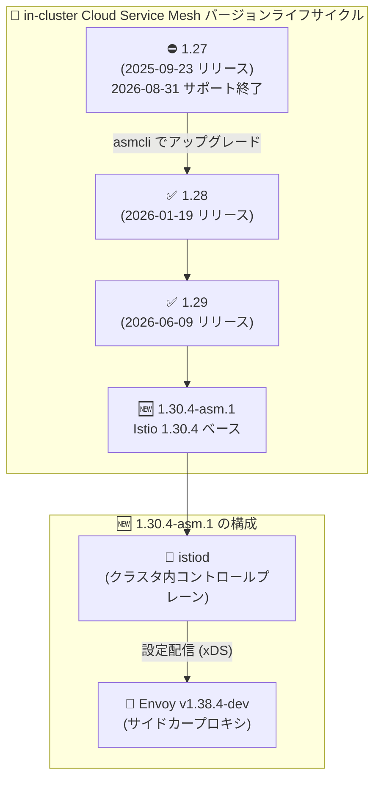

# Cloud Service Mesh: in-cluster 版 1.30.4-asm.1 リリースと 1.27 のサポート終了

**リリース日**: 2026-08-31

**サービス**: Cloud Service Mesh

**機能**: in-cluster Cloud Service Mesh 1.30.4-asm.1 リリース / 1.27 サポート終了 (EOL)

**ステータス**: Announcement

📊 [このアップデートのインフォグラフィックを見る](https://takech9203.github.io/google-cloud-news-summary/20260831-cloud-service-mesh-1-30-4-asm-1.html)

## 概要

in-cluster (クラスタ内コントロールプレーン) 型の Cloud Service Mesh 向けに、新バージョン **1.30.4-asm.1** がダウンロード可能になりました。このリリースは Istio 1.30.4 の機能を、Cloud Service Mesh のサポート対象機能リストの範囲内で含んでいます。データプレーンのプロキシには **Envoy v1.38.4-dev** が使用されます。

同日、**in-cluster Cloud Service Mesh 1.27 のサポートが終了 (End of Life)** したことも発表されました。セルフインストール型の in-cluster Cloud Service Mesh では、Google は現行バージョンと過去 2 つのマイナーバージョン (n-2) をサポートするポリシーを採用しており、1.27 (2025 年 9 月 23 日リリース) はサポート対象外となりました。1.27 以前のバージョンを利用している場合は、サポートされているバージョンへのアップグレードが必要です。

このアップデートは、GKE や GKE Enterprise 環境でセルフインストール型 (asmcli による導入) の Cloud Service Mesh を運用しているプラットフォームチーム・SRE が対象です。Istio の最新マイナーバージョンに追随しつつ、サポートライフサイクルに沿った計画的なアップグレード運用が求められます。

**アップデート前の課題**

- in-cluster Cloud Service Mesh で利用できる最新バージョンは 1.29 系までであり、Istio 1.30 系の機能を Cloud Service Mesh のサポート範囲で利用することができなかった
- 1.27 を利用中のクラスタは、サポート終了が近づいており (公式ドキュメント上の最速 EOL 日は 2026 年 6 月 23 日)、アップグレード計画の判断材料が必要だった

**アップデート後の改善**

- Istio 1.30.4 ベースの 1.30.4-asm.1 が in-cluster Cloud Service Mesh 向けにダウンロード可能になり、Envoy v1.38.4-dev を採用した最新のデータプレーンを利用できるようになった
- 1.27 が正式にサポート終了となったことで、n-2 ポリシーに基づくサポート対象バージョンが明確になり、アップグレードの優先度を判断しやすくなった

## アーキテクチャ図



1.27 のサポート終了に伴い、サポート対象は n-2 ポリシーに基づく新しいバージョン群に移行します。1.30.4-asm.1 はクラスタ内の istiod コントロールプレーンと Envoy v1.38.4-dev ベースのサイドカーで構成されます。

## サービスアップデートの詳細

### 主要機能

1. **in-cluster Cloud Service Mesh 1.30.4-asm.1 の提供開始**
   - Istio 1.30.4 の機能を、Cloud Service Mesh の[サポート対象機能リスト](https://cloud.google.com/service-mesh/docs/supported-features-in-cluster)の範囲内で含む
   - データプレーンには Envoy v1.38.4-dev を使用
   - アップグレード手順は公式ドキュメント「[Upgrade Cloud Service Mesh](https://cloud.google.com/service-mesh/docs/upgrade)」に従う

2. **1.30.4-asm.1 でサポートされない Istio 1.30 機能**
   - DNS クラスタに対する Failover Priority サポート
   - `ENABLE_WILDCARD_HOST_SERVICE_ENTRIES_FOR_TLS`
   - ワークロードごとの複数の CUSTOM 外部認可 (external authorization) プロバイダ
   - `DEBUG_ENDPOINT_AUTH_ALLOWED_NAMESPACES` フラグ

3. **in-cluster Cloud Service Mesh 1.27 のサポート終了 (EOL)**
   - 1.27 は 2025 年 9 月 23 日にリリースされたバージョンで、今回サポート対象外となった
   - セルフインストール型 in-cluster Cloud Service Mesh のサポートポリシーは「現行 + 過去 2 マイナーバージョン (n-2)」
   - 各バージョンの最速 EOL 日は公式ドキュメント「[Supported versions](https://cloud.google.com/service-mesh/docs/supported-features-in-cluster#supported_versions)」で確認できる

## 技術仕様

### バージョン情報

| 項目 | 詳細 |
|------|------|
| リリースバージョン | 1.30.4-asm.1 (in-cluster Cloud Service Mesh) |
| ベース | Istio 1.30.4 (サポート対象機能リストの範囲内) |
| データプレーン | Envoy v1.38.4-dev |
| サポート終了バージョン | in-cluster Cloud Service Mesh 1.27 |
| サポートポリシー | セルフインストール型は現行 + 過去 2 マイナーバージョン (n-2) をサポート |

### 直近の in-cluster バージョンのリリース履歴 (公式ドキュメントより)

| バージョン | リリース日 |
|-----------|-----------|
| 1.30 (1.30.4-asm.1) | 2026 年 8 月 31 日 |
| 1.29 | 2026 年 6 月 9 日 |
| 1.28 | 2026 年 1 月 19 日 |
| 1.27 | 2025 年 9 月 23 日 (サポート終了) |

## 設定方法

### 前提条件

1. Google Cloud プロジェクトで課金が有効になっていること
2. セルフインストール型 (in-cluster) の Cloud Service Mesh を利用していること (asmcli で導入)
3. マルチクラスタメッシュで Cloud Service Mesh certificate authority (Mesh CA) を使用している場合は、各クラスタのアップグレード前に `asmcli create-mesh` の実行が必要

### 手順

#### ステップ 1: (マルチクラスタの場合) フリート Workload Identity の信頼設定

```bash
./asmcli create-mesh \
    FLEET_PROJECT_ID \
    PROJECT_ID_1/CLUSTER_LOCATION_1/CLUSTER_NAME_1 \
    PROJECT_ID_2/CLUSTER_LOCATION_2/CLUSTER_NAME_2
```

Mesh CA を使用するマルチクラスタメッシュでは、アップグレード中もダウンタイムなしでクラスタ間ロードバランシングを継続するため、各クラスタのアップグレード前にフリート Workload Identity プールを信頼するよう構成します。

#### ステップ 2: asmcli install によるアップグレード

```bash
./asmcli install \
    --project_id PROJECT_ID \
    --cluster_name CLUSTER_NAME \
    --cluster_location CLUSTER_LOCATION \
    --fleet_id FLEET_PROJECT_ID \
    --output_dir DIR_PATH \
    --enable_all \
    --ca mesh_ca
```

`asmcli install` を実行して新しいコントロールプレーンをインストールします。`--output_dir` を指定しておくと、サンプルゲートウェイや istioctl などのツールを参照しやすくなります (オプションはドキュメントの例を参照)。

#### ステップ 3: サイドカーインジェクションの有効化とワークロードの再デプロイ

```bash
# 新しいリビジョンのラベルを namespace に付与した上でワークロードを再起動
kubectl rollout restart deployment -n NAMESPACE
```

アップグレードを完了するには、自動サイドカーインジェクションを有効化し、ワークロードを再デプロイして新しいバージョンのプロキシに入れ替えます。必要に応じて Ingress ゲートウェイも個別にアップグレードします。

## メリット

### ビジネス面

- **サポートされた構成の維持**: 1.27 の EOL に対応してサポート対象バージョンへ移行することで、問題発生時に Google のサポートを受けられる状態を維持できる
- **セキュリティリスクの低減**: 最新バージョンに追随することで、脆弱性修正を含む更新を継続的に受け取れる

### 技術面

- **Istio 1.30.4 ベースの機能**: サポート対象機能リストの範囲内で Istio 1.30 系の機能を利用できる
- **最新の Envoy データプレーン**: Envoy v1.38.4-dev を採用したプロキシにより、データプレーンが最新化される

## デメリット・制約事項

### 制限事項

- 1.30.4-asm.1 では以下の Istio 機能はサポートされない:
  - DNS クラスタに対する Failover Priority サポート
  - `ENABLE_WILDCARD_HOST_SERVICE_ENTRIES_FOR_TLS`
  - ワークロードごとの複数の CUSTOM 外部認可プロバイダ
  - `DEBUG_ENDPOINT_AUTH_ALLOWED_NAMESPACES` フラグ
- Istio のすべての機能が利用できるわけではなく、[サポート対象機能リスト](https://cloud.google.com/service-mesh/docs/supported-features-in-cluster)の範囲内に限られる

### 考慮すべき点

- 1.27 以前を利用中のクラスタはサポート対象外となっているため、速やかにサポート対象バージョンへのアップグレードを計画する必要がある
- セルフインストール型は n-2 サポートポリシーのため、年に複数回のアップグレード運用を前提としたプロセス整備が必要
- アップグレード後はワークロードの再デプロイ (プロキシの入れ替え) が必要なため、ローリング再起動の影響を考慮した計画が必要

## ユースケース

### ユースケース 1: 1.27 クラスタからの計画的アップグレード

**シナリオ**: in-cluster Cloud Service Mesh 1.27 を利用している GKE クラスタが、EOL によりサポート対象外となった。サポートされた構成に戻すためにアップグレードを実施する。

**実装例**:
```bash
# 1. 現在のコントロールプレーンのバージョンを確認
kubectl get pods -n istio-system -l app=istiod \
  -o jsonpath='{.items[*].spec.containers[*].image}'

# 2. asmcli で新バージョンをインストール (カナリアアップグレード)
./asmcli install --project_id PROJECT_ID \
  --cluster_name CLUSTER_NAME --cluster_location CLUSTER_LOCATION \
  --fleet_id FLEET_PROJECT_ID --output_dir ./asm-output --enable_all

# 3. namespace のリビジョンラベルを切り替えてワークロードを再デプロイ
kubectl rollout restart deployment -n NAMESPACE
```

**効果**: サポート対象バージョンへ移行し、Google のサポートとセキュリティ更新を受けられる状態を回復できる。

### ユースケース 2: Istio 1.30 系機能の検証環境での評価

**シナリオ**: セルフインストール型の Cloud Service Mesh を運用しており、Istio 1.30 系の機能をサポート範囲内で評価したい。

**効果**: 検証用クラスタに 1.30.4-asm.1 を導入し、サポート対象機能リストと非サポート機能 (Failover Priority for DNS clusters など) を確認した上で、本番環境への展開可否を判断できる。

## 料金

Cloud Service Mesh は GKE Enterprise の一部として、またはスタンドアロンサービスとして利用できます。GKE Enterprise サブスクライバーは追加料金なしで利用でき、Google Cloud 外 (オンプレミス、AWS、Azure など) での利用には GKE Enterprise の契約が必要です。今回のバージョンリリース自体による料金変更はありません。

詳細は公式の料金ページを参照してください: [Cloud Service Mesh の料金](https://cloud.google.com/service-mesh/pricing)

## 利用可能リージョン

in-cluster Cloud Service Mesh はユーザーが管理する GKE / GKE Enterprise クラスタ内にコントロールプレーンをインストールする方式のため、特定リージョンへの依存はありません。対応プラットフォームの詳細は[サポート対象機能ドキュメント](https://cloud.google.com/service-mesh/docs/supported-features-in-cluster)を参照してください。

## 関連サービス・機能

- **Google Kubernetes Engine (GKE)**: in-cluster Cloud Service Mesh の主要な実行基盤。GKE Enterprise ではマルチクラスタメッシュやフリート機能と連携する
- **GKE Enterprise (フリート)**: マルチクラスタメッシュではフリート Workload Identity プールを信頼ドメインとして使用し、クラスタ間ロードバランシングを実現する
- **Cloud Service Mesh certificate authority (Mesh CA)**: mTLS 用証明書を発行するマネージド CA。アップグレード時の `asmcli create-mesh` 実行に関係する
- **Certificate Authority Service (CA Service)**: Mesh CA の代替として利用できるマネージド CA (別料金)
- **マネージド Cloud Service Mesh**: コントロールプレーンを Google が管理する方式。今回のリリースはセルフインストール型 (in-cluster) が対象で、マネージド版は別のリリースチャネルで更新される

## 参考リンク

- 📊 [インフォグラフィック](https://takech9203.github.io/google-cloud-news-summary/20260831-cloud-service-mesh-1-30-4-asm-1.html)
- [公式リリースノート](https://docs.cloud.google.com/release-notes#August_31_2026)
- [Cloud Service Mesh リリースノート](https://cloud.google.com/service-mesh/docs/release-notes)
- [サポート対象機能 (in-cluster)](https://cloud.google.com/service-mesh/docs/supported-features-in-cluster)
- [サポート対象バージョン](https://cloud.google.com/service-mesh/docs/supported-features-in-cluster#supported_versions)
- [Cloud Service Mesh のアップグレード](https://cloud.google.com/service-mesh/docs/upgrade)
- [料金ページ](https://cloud.google.com/service-mesh/pricing)

## まとめ

in-cluster Cloud Service Mesh に Istio 1.30.4 ベースの 1.30.4-asm.1 が追加され、同時に 1.27 がサポート終了となりました。セルフインストール型は n-2 のサポートポリシーで運用されるため、1.27 以前を利用中の環境は速やかにアップグレード計画を立て、新規・検証環境では 1.30.4-asm.1 の非サポート機能 (DNS クラスタの Failover Priority など) を確認した上で導入を進めることを推奨します。

---

**タグ**: `Cloud Service Mesh`, `Istio`, `Envoy`, `GKE`, `GKE Enterprise`, `Service Mesh`, `EOL`, `アップグレード`, `Announcement`
