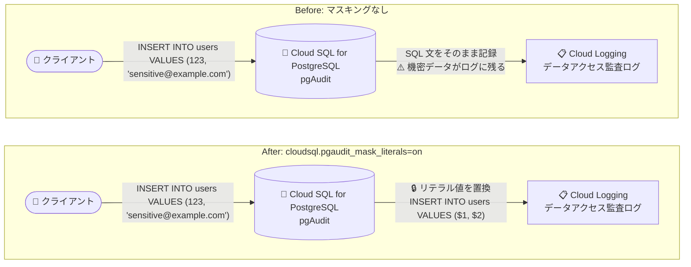

# Cloud SQL for PostgreSQL: pgAudit 拡張機能による監査ログの機密情報マスキング

**リリース日**: 2026-08-31

**サービス**: Cloud SQL for PostgreSQL

**機能**: pgAudit 拡張機能によるリテラル値マスキング (機密情報のログ出力防止)

**ステータス**: 一般提供 (GA)

📊 [このアップデートのインフォグラフィックを見る](https://takech9203.github.io/google-cloud-news-summary/20260831-cloud-sql-postgresql-pgaudit-sensitive-data-redaction.html)

## 概要

Cloud SQL for PostgreSQL の pgAudit 拡張機能に、SQL 文中のリテラル値をマスキングする機能が追加されました。新しいデータベースフラグ `cloudsql.pgaudit_mask_literals` を有効にすると、監査ログに記録される SQL 文中の文字列定数・数値などのリテラル値が位置プレースホルダー (`$1`, `$2` など) に置き換えられます。これにより、パスワードやシークレットなどの機密情報を示す可能性のある文字列リテラルが、ログのクエリ結果に表示されることを防止できます。

pgAudit 拡張機能は、Cloud SQL for PostgreSQL でデータベース監査を実現するオープンソース拡張機能であり、政府機関・金融・ISO 認証などのコンプライアンス要件で求められるログの構成に利用されています。従来、pgAudit は実行された SQL 文をそのまま記録するため、クエリに埋め込まれた機密データが監査ログに残るリスクがありました。今回のアップデートにより、クエリの構造と実行された操作を監査しつつ、機密性の高いデータ値をログに残さない運用が可能になります。

本機能は、メンテナンスバージョン `[PostgreSQL version].R20260712.01_06` 以降でサポートされます。監査要件とデータプライバシー要件を両立させたい規制業界のデータベース管理者やセキュリティチームに特に有用なアップデートです。

**アップデート前の課題**

pgAudit による監査ログには SQL 文がそのまま記録されるため、以下の課題がありました。

- クエリに埋め込まれたパスワード、個人情報、シークレットなどの機密データが監査ログにそのまま記録されてしまう可能性があった
- 監査ログの閲覧権限を持つユーザーが、ログ経由で機密データ値にアクセスできてしまうリスクがあった
- データプライバシーに関するコンプライアンス・規制要件と、SQL 操作の監査要件の両立が難しかった

**アップデート後の改善**

- `cloudsql.pgaudit_mask_literals` フラグを有効にすることで、SQL 文中の文字列定数・数値などのリテラル値が位置プレースホルダーに置換されて記録されるようになった
- パスワードやシークレットなどの機密データ値をログに残さずに、クエリの構造と実行された操作を監査できるようになった
- データプライバシーに関するコンプライアンス・規制要件への対応が容易になった

## アーキテクチャ図



マスキング有効時は、pgAudit 拡張機能が SQL 文を監査ログに書き込む前に処理し、クエリ内のリテラル値を位置プレースホルダーに置換してから記録します。

## サービスアップデートの詳細

### 主要機能

1. **リテラル値の自動マスキング**
   - `cloudsql.pgaudit_mask_literals` フラグを `on` に設定すると、pgAudit 拡張機能が監査ログへの書き込み前に SQL 文を処理する
   - クエリ内のリテラル値 (文字列定数、数値など) を識別し、位置プレースホルダー (`$1`, `$2` など) に置換してから記録する

2. **機密データのログ出力防止**
   - クエリに埋め込まれた可能性のあるパスワード、個人情報、シークレットが監査ログに表示されることを防止する
   - データプライバシーに関するコンプライアンス・規制要件への対応を支援する

3. **クエリ構造の監査は維持**
   - リテラル値のみが置換されるため、クエリの構造 (テーブル、カラム、操作の種類) と実行された操作の監査は引き続き可能

### マスキングの動作例

**元の SQL 文:**

```sql
INSERT INTO users (id, email) VALUES (123, 'sensitive@example.com');
```

**マスキング有効時に監査ログへ記録される SQL 文:**

```sql
INSERT INTO users (id, email) VALUES ($1, $2);
```

ID とメールアドレスのリテラル値がプレースホルダーに置き換えられて記録されます。

## 技術仕様

### 要件

| 項目 | 詳細 |
|------|------|
| 新規フラグ | `cloudsql.pgaudit_mask_literals` (デフォルト: 無効) |
| 前提フラグ | `cloudsql.enable_pgaudit=on` (デフォルトは無効のため、有効化が必要) |
| 対応 PostgreSQL バージョン | PostgreSQL 14 以降 |
| 対応メンテナンスバージョン | `[PostgreSQL version].R20260712.01_06` 以降 |
| マスキング対象 | 文字列定数、数値、その他のリテラル値 |
| 置換形式 | 位置プレースホルダー (`$1`, `$2`, ...) |
| 設定方法 | Google Cloud コンソール、gcloud CLI、Cloud SQL Admin API |

### 監査ログの出力先

pgAudit が生成した監査ログは、Cloud Logging にデータアクセス監査ログとして送信されます。ログエクスプローラで以下のクエリを使用して確認できます。

```
resource.type="cloudsql_database"
logName="projects/<your-project-name>/logs/cloudaudit.googleapis.com%2Fdata_access"
protoPayload.request.@type="type.googleapis.com/google.cloud.sql.audit.v1.PgAuditEntry"
```

## 設定方法

### 前提条件

1. Cloud SQL for PostgreSQL バージョン 14 以降のインスタンス (メンテナンスバージョン `R20260712.01_06` 以降)
2. `cloudsql.enable_pgaudit` フラグの有効化と pgAudit 拡張機能の作成 (`cloudsqlsuperuser` ロールを持つユーザーが必要)
3. プロジェクトでデータアクセス監査ログが有効になっていること (ログの閲覧に必要)

### 手順

#### ステップ 1: pgAudit の有効化とマスキングの有効化

```bash
gcloud sql instances patch INSTANCE_NAME \
  --database-flags cloudsql.enable_pgaudit=on,cloudsql.pgaudit_mask_literals=on
```

`INSTANCE_NAME` をインスタンス名に置き換えます。`cloudsql.enable_pgaudit` フラグの値を変更するとインスタンスが再起動される点に注意してください。また、このコマンドは既存のデータベースフラグを上書きするため、既存フラグを維持する場合はすべてのフラグを指定する必要があります。

#### ステップ 2: pgAudit 拡張機能の作成

```sql
CREATE EXTENSION pgaudit;
```

psql クライアントを使用して実行します (Terraform による pgAudit 拡張機能の作成はサポートされていません)。

#### ステップ 3: 監査対象の設定

```bash
gcloud sql instances patch INSTANCE_NAME \
  --database-flags cloudsql.enable_pgaudit=on,cloudsql.pgaudit_mask_literals=on,pgaudit.log=all
```

`pgaudit.log` フラグで監査対象の操作を設定します (例: `all` で全操作、`read,write` で読み書き操作のみ)。

#### マスキングの無効化

```bash
gcloud sql instances patch INSTANCE_NAME \
  --database-flags cloudsql.enable_pgaudit=on,cloudsql.pgaudit_mask_literals=off
```

## メリット

### ビジネス面

- **コンプライアンス対応の強化**: データプライバシーに関するコンプライアンス・規制要件を満たしやすくなり、政府機関・金融・ISO 認証などで求められる監査ログ要件とプライバシー要件の両立が可能になる
- **情報漏洩リスクの低減**: 監査ログ経由でのパスワード、個人情報、シークレットの露出を防止し、ログ閲覧権限を持つ担当者への不要なデータ開示を回避できる

### 技術面

- **フラグ設定のみで有効化**: データベースフラグの設定のみでマスキングを有効化でき、アプリケーション側の変更が不要
- **監査価値の維持**: リテラル値のみを置換するため、クエリの構造と実行された操作 (コマンド種別、対象テーブルなど) の監査能力は維持される
- **柔軟な管理**: Google Cloud コンソール、gcloud CLI、Cloud SQL Admin API のいずれからでも設定可能

## デメリット・制約事項

### 制限事項

- `cloudsql.pgaudit_mask_literals` フラグは Cloud SQL for PostgreSQL バージョン 14 以降でのみサポートされる
- メンテナンスバージョン `[PostgreSQL version].R20260712.01_06` 以降が必要
- 前提となる `cloudsql.enable_pgaudit` フラグはデフォルトで無効のため、明示的な有効化が必要 (変更時にインスタンスが再起動される)

### 考慮すべき点

- マスキングを有効にすると、リテラル値がログに残らないため、実際に投入・検索された値を用いたトラブルシューティングやフォレンジック調査には利用できなくなる (監査要件と調査要件のバランスを検討する)
- 監査ログは Cloud Logging に送信される前にインスタンスのディスクに一時的に書き込まれる。ログ取り込みレートは 4 MB/秒であり、これを超えるログ生成負荷はディスク使用量の増大を招く可能性があるため、自動ストレージ増量の有効化とディスク使用率 (`cloudsql.googleapis.com/database/disk/utilization`) のモニタリングが推奨される
- 明示的な `CREATE ROLE` コマンドで作成されたデータベースユーザーには監査設定を変更する権限がない (Google Cloud コンソールまたは gcloud コマンドで作成されたユーザーのみ変更可能)

## ユースケース

### ユースケース 1: 金融機関におけるコンプライアンス監査とプライバシー保護の両立

**シナリオ**: 金融機関のデータベースで、規制要件により全 SQL 操作の監査ログ取得が義務付けられている。一方で、アプリケーションが顧客の個人情報を含む INSERT/UPDATE 文を実行するため、監査ログに個人情報が残ることが社内のデータプライバシーポリシーに抵触する。

**実装例**:
```bash
gcloud sql instances patch finance-db \
  --database-flags cloudsql.enable_pgaudit=on,cloudsql.pgaudit_mask_literals=on,pgaudit.log=all
```

**効果**: 全操作の監査証跡を確保しつつ、個人情報などのリテラル値はプレースホルダーに置換されるため、監査要件とプライバシー要件を同時に満たせる。

### ユースケース 2: 監査ログ閲覧権限の分離が難しい組織でのリスク低減

**シナリオ**: 運用チームが Cloud Logging の監査ログを日常的に閲覧しているが、アプリケーションのクエリにシークレットや認証情報が含まれる場合があり、ログ経由での意図しない開示が懸念される。

**効果**: マスキングにより、ログ閲覧者はクエリの構造と操作内容のみを確認でき、機密性の高いデータ値には触れずに監査・運用業務を遂行できる。

## 料金

pgAudit のリテラル値マスキング機能自体に関する追加料金の記載はありません。pgAudit の監査ログは Cloud Logging のデータアクセス監査ログとして送信されるため、Cloud Logging の料金が適用されます。また、監査ログはインスタンスのディスクに一時的に書き込まれるため、ログ生成量に応じてストレージ使用量が増加する可能性があります。

- [Cloud SQL の料金](https://cloud.google.com/sql/pricing)
- [Cloud Logging の料金](https://cloud.google.com/stackdriver/pricing)

## 利用可能リージョン

リージョン固有の制限に関する記載はありません。要件はメンテナンスバージョン (`[PostgreSQL version].R20260712.01_06` 以降) と PostgreSQL バージョン (14 以降) です。

## 関連サービス・機能

- **Cloud Logging**: pgAudit が生成した監査ログはデータアクセス監査ログとして Cloud Logging に送信され、ログエクスプローラで閲覧できる
- **Cloud Audit Logs**: Cloud SQL インスタンスに対する管理・メンテナンス操作の監査には Cloud Audit Logs を使用する (pgAudit は SQL コマンド・クエリの監査を担当)
- **Cloud Monitoring**: ディスク使用率メトリクス (`cloudsql.googleapis.com/database/disk/utilization`) を使用して、監査ログ生成によるディスク使用量の増加を監視できる
- **Secret Manager**: そもそも SQL やアプリケーション設定にシークレットを直接埋め込まないためのシークレット管理サービスとして併用が推奨される

## 参考リンク

- 📊 [インフォグラフィック](https://takech9203.github.io/google-cloud-news-summary/20260831-cloud-sql-postgresql-pgaudit-sensitive-data-redaction.html)
- [公式リリースノート](https://docs.cloud.google.com/release-notes#August_31_2026)
- [ドキュメント: pgAudit を使用した PostgreSQL の監査](https://docs.cloud.google.com/sql/docs/postgres/pg-audit)
- [ドキュメント: データベースフラグの構成](https://docs.cloud.google.com/sql/docs/postgres/flags)
- [料金ページ](https://cloud.google.com/sql/pricing)

## まとめ

Cloud SQL for PostgreSQL の pgAudit 拡張機能に、SQL 文中のリテラル値を位置プレースホルダーに置換するマスキング機能が追加され、パスワードやシークレットなどの機密情報が監査ログに残るリスクを排除しつつ、クエリ構造と操作の監査を継続できるようになりました。監査要件とデータプライバシー要件の両立が求められる環境では、インスタンスのメンテナンスバージョンを確認のうえ、`cloudsql.pgaudit_mask_literals` フラグの有効化を検討することを推奨します。

---

**タグ**: Cloud SQL, PostgreSQL, pgAudit, セキュリティ, 監査ログ, データプライバシー, コンプライアンス, Cloud Logging
