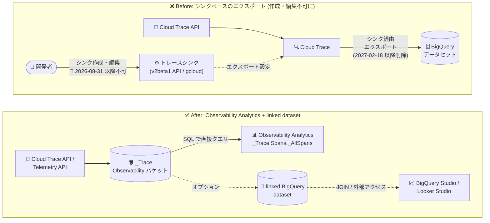

# Cloud Trace: トレースシンクの新規作成・編集が不可に (廃止マイルストーン)

**リリース日**: 2026-08-31

**サービス**: Cloud Trace

**機能**: トレースシンク (Trace Sinks) の作成・編集の無効化

**ステータス**: Breaking Change

📊 [このアップデートのインフォグラフィックを見る](https://takech9203.github.io/google-cloud-news-summary/20260831-cloud-trace-sinks-create-edit-disabled.html)

## 概要

2026 年 8 月 31 日より、Cloud Trace のトレースシンク (Trace Sinks) を新規作成・編集できなくなった。トレースシンクは、Cloud Trace API 経由で取り込まれたトレーススパンを BigQuery データセットにエクスポートするための Beta 機能で、2026 年 2 月 18 日に非推奨 (Deprecated) が発表されていた。今回のアップデートは、その非推奨化スケジュールにおける強制段階 (作成・編集の無効化) にあたる Breaking Change である。

公式ドキュメントによると、シンクによる BigQuery へのスパンエクスポート機能自体は 2027 年 2 月 18 日以降に削除 (シャットダウン) される予定であり、今回の変更はその中間マイルストーンとなる。トレースデータを SQL で分析したいユーザーには、代替手段として Observability Analytics でのクエリ、および linked BigQuery dataset の利用が案内されている。

この変更は、トレースシンクを利用してトレースデータを BigQuery にエクスポートしているすべてのプロジェクトに影響する。特に、Terraform や CI/CD パイプラインなどの自動化でシンクの作成・更新を行っている場合、該当する API 呼び出し (Cloud Trace API v2beta1 の `CreateTraceSink` / `UpdateTraceSink` に相当する操作) が機能しなくなるため、早急な対応が必要となる。

**アップデート前の課題**

- 2026 年 2 月 18 日の非推奨化以降もトレースシンクの作成・編集は技術的に可能であり、非推奨機能への新規依存が発生し得る状態だった
- シンクベースのエクスポートは Cloud Trace API で取り込まれたスパンのみが対象で、Google Cloud サービスが出力したスパンや Telemetry API 経由のスパンはサポートされていなかった
- トレースシンクは Beta ステータスのまま提供されており、限定的なサポートしか受けられなかった

**アップデート後の改善 (変更点)**

- 2026 年 8 月 31 日以降、トレースシンクの新規作成・編集ができなくなった (既存シンクの削除は移行手順として引き続き案内されている)
- 非推奨機能への新規依存が防止され、2027 年 2 月 18 日以降の機能削除に向けた移行が促進される
- 移行先の Observability Analytics では、`_Trace.Spans._AllSpans` ビューに対して SQL で直接クエリでき、シンクや宛先データセットの管理が不要になる
- BigQuery Studio からのクエリや他のビジネスデータとの JOIN が必要な場合は、linked BigQuery dataset で対応できる

## アーキテクチャ図



従来のシンクベースのエクスポートは 2026 年 8 月 31 日以降、作成・編集が不可となった (上段)。移行後は Observability バケットに格納されたトレースデータを Observability Analytics から SQL で直接クエリでき、必要に応じて linked BigQuery dataset を作成して BigQuery Studio などの外部サービスからアクセスする (下段)。

## サービスアップデートの詳細

### 主要機能 (変更内容)

1. **トレースシンクの作成・編集の無効化**
   - 2026 年 8 月 31 日以降、トレースシンクの新規作成および編集ができなくなった
   - 対象は Cloud Trace API v2beta1 の `TracingConfigService` が提供するシンク管理操作 (作成: `CreateTraceSink`、更新: `UpdateTraceSink`) と、対応する `gcloud alpha trace sinks create` / `update` コマンドに相当する操作
   - シンクの一覧表示 (`gcloud alpha trace sinks list`) と削除 (`gcloud alpha trace sinks delete`) は移行手順として引き続きドキュメントに記載されている

2. **非推奨化スケジュールの進行**
   - 2026 年 2 月 18 日: トレースシンクの非推奨化を発表
   - 2026 年 8 月 31 日: シンクの作成・編集を無効化 (今回のマイルストーン)
   - 2027 年 2 月 18 日以降: シンクによる BigQuery へのスパンエクスポート機能を削除 (シャットダウン)

3. **移行先: Observability Analytics**
   - Google Cloud コンソールの Observability Analytics ページで `_Trace.Spans._AllSpans` ビューに対して SQL クエリを実行できる
   - システム定義クエリのロード、SQL エディタでのカスタムクエリ、Query Builder によるメニュー選択でのクエリ構築に対応
   - クエリ結果はテーブルまたはチャートとして表示でき、カスタムダッシュボードに保存できる

4. **移行先: linked BigQuery dataset**
   - トレースデータを他の BigQuery データセットと JOIN する場合、BigQuery Studio など別サービスからクエリする場合、BigQuery reserved slots でクエリを実行する場合、SQL クエリ結果をアラートポリシーで監視する場合に使用する
   - Observability Analytics から直接クエリするだけであれば linked dataset は不要

## 技術仕様

### 非推奨化のタイムライン

| 日付 | イベント |
|------|---------|
| 2026 年 2 月 18 日 | トレースシンクの非推奨化 (Deprecated) |
| 2026 年 8 月 31 日 | シンクの作成・編集が不可に (今回の Breaking Change) |
| 2027 年 2 月 18 日以降 | シンクによるスパンエクスポート機能の削除 |

### スキーマの比較 (Observability Analytics vs レガシーシンク)

既存のシンクベースのクエリを移行する際は、以下のスキーマの違いに合わせた書き換えが必要となる。

| 項目 | Observability Analytics | レガシーシンク |
|------|------------------------|---------------|
| Trace ID | `trace_id` | `extendedFields.traceId` |
| Span ID | `span_id` | `span.spanId` |
| Parent span ID | `parent_span_id` | `span.parentSpanId` |
| Span name | `name` | `span.displayName.value` |
| Span kind | `kind` (OpenTelemetry SpanKind) | `span.spanKind` (Cloud Trace API SpanKind) |
| Span start time | `start_time` | `span.startTime` |
| Span end time | `end_time` | `span.endTime` |
| Attributes | `attributes["key"]`, `resource.attributes["key"]`, `instrumentation_scope.attributes["key"]` (BigQuery JSON 型) | `span.attributes.attributeMap.ATTRIBUTE_KEY` |

### 必要な IAM ロール (Observability Analytics)

| ロール | 用途 |
|--------|------|
| `roles/observability.viewAccessor` | クエリ対象の Observability ビューへのアクセス権限 (IAM Conditions で特定ビューに限定可能) |
| `roles/observability.analyticsUser` | プライベートクエリの保存・実行、共有クエリの実行権限 |

## 設定方法 (移行手順)

### 前提条件

1. Observability API が有効化されていること
2. 上記の IAM ロールが付与されていること

### 手順

#### ステップ 1: Observability Analytics でトレースデータへのアクセスを確認

Google Cloud コンソールで **Observability Analytics** ページに移動し、**Views** メニューの **Traces** セクションから `_Trace.Spans._AllSpans` を選択する。`_Trace.Spans._AllSpans` ビューが表示されない場合、プロジェクトに `_Trace` Observability バケットが存在しないため、トラブルシューティングドキュメントを参照する。

```sql
-- Observability Analytics でのクエリ例 (FROM 句のフォーマット)
SELECT *
FROM `PROJECT_ID.LOCATION._Trace.Spans._AllSpans`
LIMIT 100
```

`LOCATION` には Observability バケットのロケーション (例: `us`) を指定する。ツールバーに「Run in BigQuery」と表示される場合は、Settings から「Analytics (default)」を選択してデフォルトのクエリエンジンに切り替える。

#### ステップ 2: (オプション) linked BigQuery dataset を作成

他の BigQuery データセットとの JOIN や BigQuery Studio からのクエリが必要な場合は、linked BigQuery dataset を作成する。詳細は[公式ドキュメント](https://docs.cloud.google.com/trace/docs/analytics-query-linked-dataset)を参照。

#### ステップ 3: 既存のトレースシンクを削除

```bash
# 既存のトレースシンクを一覧表示
gcloud alpha trace sinks list

# 各トレースシンクを削除
gcloud alpha trace sinks delete SINK_NAME
```

#### ステップ 4: 不要な BigQuery データセットを削除

シンクのエクスポート先として使用していた BigQuery データセットが不要になった場合は削除する。

```bash
bq rm -r -d PROJECT_ID:DATASET_ID
```

## メリット

### ビジネス面

- **計画的な移行の促進**: 作成・編集の無効化により非推奨機能への新規依存が防止され、2027 年 2 月の機能削除前に組織全体で移行を完了させる動機付けとなる
- **運用負荷の軽減**: 移行後はシンクや宛先データセットの管理が不要になり、Observability Analytics から直接トレースデータをクエリできる

### 技術面

- **統合された分析環境**: Observability Analytics ではトレースデータとログデータを同一の SQL インターフェースで分析できる
- **OpenTelemetry 準拠のスキーマ**: 移行後のスキーマは Span kind に OpenTelemetry の SpanKind を採用しており、業界標準との整合性が高い
- **柔軟なクエリオプション**: Query Builder、SQL エディタ、システム定義クエリ、チャート化とダッシュボード保存に対応する

## デメリット・制約事項

### 制限事項

- 2026 年 8 月 31 日以降、トレースシンクの新規作成・編集は一切できない (回避手段は提供されていない)
- シンクによるスパンエクスポート機能自体も 2027 年 2 月 18 日以降に削除される予定
- linked BigQuery dataset を作成するとセキュリティ境界が拡大し、BigQuery サービスからもトレースデータにアクセス可能になる

### 考慮すべき点

- Terraform や自動化スクリプトでトレースシンクを作成・更新している場合、該当処理が失敗するため、パイプラインから除去する必要がある
- 既存のシンクベースのクエリはスキーマの違い (例: `span.spanId` → `span_id`) に合わせて書き換えが必要
- シンクによって過去にエクスポートされた BigQuery データセット内の履歴データの保持方針を検討する必要がある

## ユースケース

### ユースケース 1: IaC パイプラインからのトレースシンク定義の除去

**シナリオ**: Terraform や CI/CD パイプラインでトレースシンクを管理しており、8 月 31 日以降にシンクの作成・更新処理が失敗するようになった

**実装例**:
```bash
# 現在のシンク構成を確認
gcloud alpha trace sinks list

# IaC からシンク定義を削除した後、実リソースも削除
gcloud alpha trace sinks delete SINK_NAME
```

**効果**: パイプラインの失敗を解消し、非推奨機能への依存を排除できる。トレース分析は Observability Analytics に移行する

### ユースケース 2: BigQuery でのトレース分析の継続

**シナリオ**: シンク経由で BigQuery にエクスポートしたトレースデータを BigQuery Studio で分析しており、機能削除後も同等の分析を継続したい

**効果**: linked BigQuery dataset を作成することで、BigQuery Studio からトレースデータをクエリでき、他のビジネスデータとの JOIN や BigQuery reserved slots でのクエリ実行も可能になる

## 料金

今回の変更 (シンク作成・編集の無効化) 自体による Cloud Trace の料金体系の変更はアナウンスされていない。Cloud Trace および Observability Analytics に関連する料金は [Google Cloud Observability の料金ページ](https://cloud.google.com/products/observability/pricing)を参照。

## 関連サービス・機能

- **Observability Analytics**: トレースシンクの移行先となる SQL クエリインターフェース。`_Trace.Spans._AllSpans` ビューを通じてトレースデータを直接クエリでき、ログデータとの統合分析も可能
- **BigQuery**: linked BigQuery dataset を通じてトレースデータにアクセス可能。他のビジネスデータとの JOIN、BigQuery Studio でのクエリ、reserved slots の活用に使用
- **Cloud Logging**: Observability Analytics でログビュー・分析ビューをクエリでき、トレースデータと同一環境で分析できる
- **Cloud Monitoring**: Observability Analytics のクエリ結果をチャート化してカスタムダッシュボードに保存可能。SQL クエリ結果のアラートポリシー監視には linked dataset を使用
- **Trace Explorer**: 個別のトレース・スパン・スパン属性の詳細調査に使用。集計分析向けの Observability Analytics と補完関係にある

## 参考リンク

- 📊 [インフォグラフィック](https://takech9203.github.io/google-cloud-news-summary/20260831-cloud-trace-sinks-create-edit-disabled.html)
- [公式リリースノート](https://docs.cloud.google.com/release-notes#August_31_2026)
- [トレースシンク非推奨化のお知らせ](https://docs.cloud.google.com/stackdriver/docs/deprecations/export-spans-with-sinks)
- [Observability Analytics への移行ガイド](https://docs.cloud.google.com/trace/docs/analytics-migrate)
- [Observability Analytics でのトレースクエリ](https://docs.cloud.google.com/trace/docs/analytics)
- [linked BigQuery dataset でのクエリ](https://docs.cloud.google.com/trace/docs/analytics-query-linked-dataset)
- [トレースシンクの概要 (非推奨)](https://docs.cloud.google.com/trace/docs/trace-export-overview)
- [料金ページ](https://cloud.google.com/products/observability/pricing)
- [関連レポート: トレースシンクの非推奨化 (2026-02-17)](./2026-02-17-cloud-trace-sinks-deprecated.md)

## まとめ

2026 年 2 月に非推奨化された Cloud Trace のトレースシンクは、2026 年 8 月 31 日をもって新規作成・編集が不可となり、2027 年 2 月 18 日以降の機能削除に向けた強制段階に入った。トレースシンクを利用中のプロジェクトは、Observability Analytics での `_Trace.Spans._AllSpans` ビューへのアクセス確認、クエリのスキーマ書き換え、必要に応じた linked BigQuery dataset の作成を行った上で、既存シンクと不要なデータセットを削除する移行を完了させるべきである。特に IaC や自動化パイプラインでシンクを管理している場合は、作成・更新処理が失敗するため即時の対応が求められる。

---

**タグ**: #CloudTrace #Observability #ObservabilityAnalytics #BigQuery #BreakingChange #Deprecation #Migration
