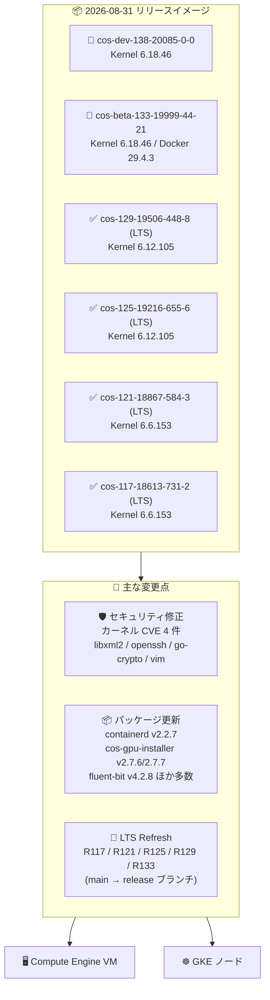

# Container-Optimized OS: 2026 年 8 月 31 日リリースの新イメージ (LTS x4 / Beta / Dev)

**リリース日**: 2026-08-31

**サービス**: Container-Optimized OS

**機能**: 新イメージリリース (cos-beta-133、cos-129 LTS、cos-dev-138、cos-125 LTS、cos-121 LTS、cos-117 LTS)

**ステータス**: GA (LTS) / Beta / Dev

📊 [このアップデートのインフォグラフィックを見る](https://takech9203.github.io/google-cloud-news-summary/20260831-container-optimized-os-image-updates.html)

## 概要

2026 年 8 月 31 日、Google Cloud はコンテナワークロード実行用の OS である Container-Optimized OS (COS) の新イメージを 6 つ同時にリリースしました。今回のリリースには、cos-beta-133-19999-44-21、cos-129-19506-448-8、cos-dev-138-20085-0-0、cos-125-19216-655-6、cos-121-18867-584-3、cos-117-18613-731-2 が含まれ、R117 / R121 / R125 / R129 / R133 の各マイルストーンで LTS Refresh (main ブランチから release ブランチへの更新) が実施されています。

今回のアップデートの中心は広範なセキュリティ修正です。Linux カーネルの CVE-2026-68293、CVE-2026-64371、CVE-2026-68142、CVE-2026-68432 の修正に加え、libxml2 v2.15.3 へのアップグレード (CVE-2026-0989 / 0990 / 0992 対応) が全マイルストーンに適用されました。さらに R117 では openssh の 7 件の CVE (CVE-2026-59995〜60002)、dev-go/crypto の 13 件の CVE、vim の CVE-2026-35177 も修正されています。あわせて containerd v2.2.7、cos-gpu-installer v2.7.6 / v2.7.7、fluent-bit v4.2.8 など多数のパッケージ更新が含まれます。

Compute Engine や GKE のノード OS として COS を利用しているすべてのユーザー、特に本番環境で cos-117 / cos-121 / cos-125 / cos-129 の LTS イメージファミリーを利用しているユーザーが対象です。

**アップデート前の課題**

- Linux カーネルに未修正の CVE (CVE-2026-68293、CVE-2026-64371、CVE-2026-68142、CVE-2026-68432) が存在していた
- libxml2 に CVE-2026-0989、CVE-2026-0990、CVE-2026-0992 の脆弱性が存在していた
- openssh に CVE-2026-59995 から CVE-2026-60002 に及ぶ複数の脆弱性が存在していた (R117)
- dev-go/crypto に CVE-2026-39827〜39835、CVE-2026-42508、CVE-2026-46595 / 46597 / 46598 の脆弱性が存在していた
- vim に CVE-2026-35177 の脆弱性が存在していた

**アップデート後の改善**

- Linux カーネル、libxml2、openssh、dev-go/crypto、vim の多数の CVE が修正され、OS 全体の攻撃対象領域が縮小された
- R117 / R121 / R125 / R129 / R133 の全マイルストーンで LTS Refresh が実施され、release ブランチベースの最新ビルドに更新された
- containerd v2.2.7 (R129 / R125)、cos-gpu-installer v2.7.6 / v2.7.7、fluent-bit v4.2.8 などランタイム・運用コンポーネントが最新化された
- Lustre クライアントドライバ (net-fs/lustre-client-drivers v2.14.0_p259) のサポートが追加された

## アーキテクチャ図



6 つのリリースイメージ (Dev / Beta / LTS x4) に対して、セキュリティ修正・パッケージ更新・LTS Refresh が適用され、Compute Engine VM と GKE ノードの OS として提供されます。

## サービスアップデートの詳細

### リリースされたイメージ

| イメージ | マイルストーン / チャネル | カーネル | Docker | Containerd |
|----------|--------------------------|---------|--------|-----------|
| cos-dev-138-20085-0-0 | R138 / Dev | COS-6.18.46 | v29.4.3 | v2.3.2 |
| cos-beta-133-19999-44-21 | R133 / Beta | COS-6.18.46 | v29.4.3 | v2.3.2 |
| cos-129-19506-448-8 | R129 / LTS | COS-6.12.105 | v27.5.1 | v2.2.7 |
| cos-125-19216-655-6 | R125 / LTS | COS-6.12.105 | v27.5.1 | v2.2.7 |
| cos-121-18867-584-3 | R121 / LTS | COS-6.6.153 | v27.5.1 | v2.0.10 |
| cos-117-18613-731-2 | R117 / LTS | COS-6.6.153 | v24.0.9 | v1.7.34 |

### マイルストーン別の主な変更点

| マイルストーン | 主なセキュリティ修正 | 主な変更 |
|---------------|---------------------|---------|
| R133 (Beta) | libxml2 v2.15.3 (CVE-2026-0989/0990/0992) | LTS Refresh (main-R133 → release-R133)、カーネル v6.18.46 更新、containerd v2.3.2 |
| R129 (LTS) | カーネル CVE-2026-68293、libxml2 v2.15.3 | LTS Refresh、containerd v2.2.7、cos-gpu-installer v2.7.7、fluent-bit v4.2.8、openssh 10.4_p1、Lustre クライアントドライバ対応 |
| R125 (LTS) | カーネル CVE-2026-68293、libxml2 v2.15.3 | LTS Refresh、cni-plugins v1.9.1、zstd v1.5.7-r1 ほかパッケージ更新、sysctl (net.ipv4.udp_mem) 調整 |
| R121 (LTS) | カーネル CVE-2026-64371 / CVE-2026-68142 / CVE-2026-68432、libxml2 v2.15.3 | LTS Refresh、cos-gpu-installer v2.7.7 |
| R117 (LTS) | openssh CVE-2026-59995〜60002 (7 件)、カーネル CVE-2026-68142 / CVE-2026-68432、libxml2 v2.15.3 | LTS Refresh |
| R138 (Dev) | dev-go/crypto CVE 13 件、libxml2 v2.15.3、vim CVE-2026-35177 | カーネル v6.18.46、nghttp2 v1.70.0、多数のパッケージ更新 |

### 主要機能

1. **セキュリティ修正 (CVE 対応)**
   - Linux カーネル: CVE-2026-68293 (R129 / R125)、CVE-2026-64371 (R121)、CVE-2026-68142 / CVE-2026-68432 (R121 / R117) を修正
   - libxml2 を v2.15.3 にアップグレードし、CVE-2026-0989、CVE-2026-0990、CVE-2026-0992 を修正 (全マイルストーン)
   - openssh の CVE-2026-59995、59996、59997、59999、60000、60001、60002 を修正 (R117)
   - dev-go/crypto の CVE-2026-39827〜39835、CVE-2026-42508、CVE-2026-46595 / 46597 / 46598 を修正
   - vim / vim-core を 9.2.0280 にアップグレードし、CVE-2026-35177 を修正

2. **LTS Refresh (全 LTS マイルストーン + Beta)**
   - R117 / R121 / R125 / R129 / R133 で main ブランチから release ブランチへの LTS Refresh を実施
   - 各マイルストーンに中・低優先度の修正とパッケージ更新をまとめて適用

3. **コンポーネント・パッケージ更新**
   - containerd / containerd-test を v2.2.7 に更新 (R129 / R125)
   - cos-gpu-installer を v2.7.6 / v2.7.7 に更新 (GPU ドライバインストールの改善)
   - fluent-bit v4.2.8、openssh 10.4_p1、node-problem-detector v0.8.25、docker-credential-helpers v0.9.9、cni-plugins v1.9.1、nghttp2 v1.70.0、sqlite v3.53.4、expat v2.8.3、e2fsprogs v1.47.4 など多数を更新
   - net-fs/lustre-client-drivers v2.14.0_p259 のサポートを追加 (高性能並列ファイルシステム Lustre への接続)
   - Runtime sysctl の調整: net.ipv4.udp_mem の値を変更

## 技術仕様

### COS リリースチャネルの位置づけ

| チャネル | イメージファミリー | 用途 |
|---------|-------------------|------|
| LTS | cos-117-lts、cos-121-lts、cos-125-lts、cos-129-lts | 本番ワークロード向け。約 6 か月ごとにリリースされ、2 年間のサポートとセキュリティ修正を提供 |
| Beta | cos-beta (COS 133) | 次期メジャーリリースの安定化フェーズ。継続テストでの検証用 |
| Dev | cos-dev (COS 138) | 開発中の最新リリース。実験・単発テスト用 |

## 設定方法

### 前提条件

1. Compute Engine または GKE を使用するプロジェクト
2. イメージは `cos-cloud` プロジェクトから取得

### 手順

#### ステップ 1: 新しいイメージの確認

```bash
gcloud compute images list --project=cos-cloud --no-standard-images \
  | grep -E "19999-44-21|19506-448-8|20085-0-0|19216-655-6|18867-584-3|18613-731-2"
```

リリースされたイメージが利用可能か確認します。

#### ステップ 2: 特定のイメージで VM を作成

```bash
gcloud compute instances create my-cos-vm \
  --image=cos-129-19506-448-8 \
  --image-project=cos-cloud \
  --zone=asia-northeast1-a
```

本番環境では、イメージファミリー API ではなく検証済みの特定イメージ名を指定することが推奨されています。

#### ステップ 3: GKE ノードプールの場合

GKE では COS イメージはノードの自動アップグレードにより GKE バージョンと連動して更新されます。特定の COS ビルドを直接指定するのではなく、リリースチャネルの設定を確認してください。

## メリット

### ビジネス面

- **セキュリティリスクの低減**: カーネル、openssh、libxml2、go-crypto など広範なコンポーネントの CVE が修正され、脆弱性スキャンの指摘事項やコンプライアンス要件への対応が容易になる
- **全 LTS 系列の同時更新**: R117 から R129 までの全 LTS マイルストーンが同日に更新されるため、複数バージョンを併用する組織でも一括でパッチ計画を立てられる

### 技術面

- **ランタイムの最新化**: containerd v2.2.7 への更新 (R129 / R125) により、コンテナランタイムの修正が取り込まれる
- **GPU ワークロードの改善**: cos-gpu-installer v2.7.6 / v2.7.7 への更新により、GPU ドライバインストールの品質が向上
- **ストレージ選択肢の拡大**: Lustre クライアントドライバ (v2.14.0_p259) のサポート追加により、HPC / AI 向け並列ファイルシステムとの統合が可能

## デメリット・制約事項

### 制限事項

- Beta (COS 133) / Dev (COS 138) イメージは本番利用非推奨
- 古いマイルストーン (R117 など) は新しいマイルストーンへの移行計画も並行して検討する必要がある

### 考慮すべき点

- 本番環境へのロールアウト前に、検証環境で新イメージの動作確認を行うことが推奨される
- LTS Refresh リリースには中・低優先度の修正も含まれるため、ロールアウト時はリグレッションに注意する
- イメージファミリー API (`getFromFamily`) を本番インスタンス作成に使用すると、未検証イメージが自動適用されるリスクがある

## ユースケース

### ユースケース 1: 本番 GKE / GCE 環境へのセキュリティパッチ適用

**シナリオ**: cos-121-lts または cos-129-lts を利用中の本番環境で、カーネルと libxml2 の CVE 修正を適用したい。

**実装例**:
```bash
# 検証環境で新イメージをテスト後、インスタンステンプレートを更新
gcloud compute instance-templates create my-template-v2 \
  --image=cos-121-18867-584-3 \
  --image-project=cos-cloud \
  --machine-type=e2-standard-4
```

**効果**: CVE-2026-64371 / 68142 / 68432 などのカーネル CVE と libxml2 の CVE 群が修正された状態で運用でき、脆弱性スキャンの指摘事項を解消できる。

### ユースケース 2: R117 環境での openssh 脆弱性対応

**シナリオ**: cos-117-lts を利用中の環境で、openssh の複数の CVE (CVE-2026-59995〜60002) への対応が必要になった。

**効果**: cos-117-18613-731-2 へ更新することで openssh の 7 件の CVE が修正され、SSH 経由の攻撃リスクを低減できる。

### ユースケース 3: GPU ノードのドライバインストール改善

**シナリオ**: GKE の GPU ノードプールで COS を利用しており、GPU ドライバのインストール品質を最新化したい。

**効果**: cos-gpu-installer v2.7.6 / v2.7.7 を含む新イメージにより、GPU ドライバインストールの修正が適用された状態で運用できる。

## 料金

Container-Optimized OS 自体は無料で提供され、追加のライセンス費用はありません。Compute Engine の VM インスタンスや GKE ノードの標準料金のみが適用されます。

- [Compute Engine 料金](https://cloud.google.com/compute/pricing)
- [GKE 料金](https://cloud.google.com/kubernetes-engine/pricing)

## 利用可能リージョン

COS イメージは `cos-cloud` プロジェクトからグローバルに提供され、すべての Compute Engine リージョンで利用可能です。

## 関連サービス・機能

- **Compute Engine**: COS を VM のブートイメージとして使用。コンテナワークロードの直接実行に対応
- **Google Kubernetes Engine (GKE)**: COS はデフォルトのノードイメージ (`cos_containerd`)。ノード自動アップグレードで COS が更新される
- **cos-gpu-installer / cos-extensions**: GPU ドライバなどのカーネルモジュールを COS にインストールする仕組み。今回 v2.7.6 / v2.7.7 に更新
- **node-problem-detector**: ノードの異常を検出して Kubernetes に報告するコンポーネント。v0.8.25 に更新

## 参考リンク

- 📊 [インフォグラフィック](https://takech9203.github.io/google-cloud-news-summary/20260831-container-optimized-os-image-updates.html)
- [公式リリースノート](https://docs.cloud.google.com/release-notes#August_31_2026)
- [COS リリースノート](https://cloud.google.com/container-optimized-os/docs/release-notes)
- [COS バージョニングとイメージファミリー](https://docs.cloud.google.com/container-optimized-os/docs/concepts/versioning)
- [COS サポートポリシー](https://docs.cloud.google.com/container-optimized-os/docs/resources/support-policy)

## まとめ

今回の COS リリースは、R117 から R133 までの全マイルストーンにわたる LTS Refresh と、カーネル・openssh・libxml2・go-crypto など広範な CVE 修正を含むセキュリティ中心のアップデートです。LTS 系 (COS 117 / 121 / 125 / 129) を本番利用しているユーザーは、検証環境でのテストを経て早期のロールアウトを検討することを推奨します。

---

**タグ**: Container-Optimized OS, COS, LTS, セキュリティ, CVE, カーネル, Docker, Containerd, openssh, libxml2, GKE, Compute Engine
