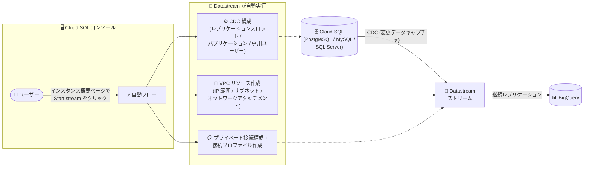

# Datastream: Cloud SQL インスタンス概要ページからの自動フローによるストリーム作成

**リリース日**: 2026-08-31

**サービス**: Datastream

**機能**: Cloud SQL ストリームの自動セットアップフロー (Automated Flow)

**ステータス**: 提供開始 (Feature)

📊 [このアップデートのインフォグラフィックを見る](https://takech9203.github.io/google-cloud-news-summary/20260831-datastream-cloud-sql-automated-flow.html)

## 概要

Cloud SQL インスタンスの概要ページから、自動フロー (automated flow) を使用して Datastream のストリームを直接作成できるようになりました。Cloud SQL コンソールの「Replicate data to BigQuery」セクションから「Start stream」をクリックするだけで、Cloud SQL のデータを BigQuery へレプリケーションするストリームを開始できます。

自動ストリームセットアップは、Google Cloud マネージドデータベースから BigQuery へデータを移動するプロセスを、必要な手順を削減することで簡素化するものです。Datastream が、ストリームとソースデータベース間の VPC 接続のセキュリティ確保、データベース構成の作成、ストリーム接続リソースの作成を自動化します。対象は Cloud SQL for PostgreSQL、Cloud SQL for MySQL、Cloud SQL for SQL Server の各ソースから BigQuery へのレプリケーションです。

Cloud SQL の運用データを BigQuery で分析したいものの、Datastream のネットワーク設定や CDC (変更データキャプチャ) の構成に不慣れなユーザーにとって、導入のハードルを大きく下げるアップデートです。なお、Datastream では Spanner についても同様の自動フローが先行して提供されており、今回のアップデートで Cloud SQL にも自動フローの入り口が広がりました。

**アップデート前の課題**

従来、Cloud SQL から BigQuery へのストリームを作成するには、Datastream コンソール側で複数の手動セットアップ手順が必要でした。

- プライベート接続構成 (内部 IP アドレス範囲、サブネットワーク、ネットワークアタッチメントなどの VPC リソース) を手動で作成・設定する必要があった
- ソース/宛先の接続プロファイルを個別に作成する必要があった
- CDC のためのデータベース側の構成 (レプリケーションスロット、パブリケーション、専用ユーザーの作成など) を手動で行う必要があった
- 作業の起点が Datastream コンソールであり、Cloud SQL の管理画面からシームレスにレプリケーションを開始できなかった

**アップデート後の改善**

- Cloud SQL インスタンスの概要ページから直接ストリームを作成・開始できるようになった
- Datastream が必要な VPC リソース (内部 IP アドレス範囲、サブネットワーク、ネットワークアタッチメント) を自動作成するようになった
- テーブルの CDC 構成、レプリケーションスロットの設定、データベース内全テーブルに対するパブリケーションの設定、Datastream 専用ユーザーの作成が自動化された
- プライベート接続構成とソース/宛先の接続プロファイルが自動作成されるようになった
- 設定をカスタマイズしない場合、ログイン中のユーザーの認証情報がデータベース構成に使用されるため、追加の IAM やデータベース認証情報の入力が不要になった

## アーキテクチャ図



ユーザーは Cloud SQL インスタンスの概要ページから「Start stream」をクリックするだけで、Datastream がネットワーク・CDC・接続プロファイルの構成を自動的に行い、BigQuery への継続的なレプリケーションを開始します。

## サービスアップデートの詳細

### 主要機能

1. **Cloud SQL 概要ページからのワンストップ作成**
   - Cloud SQL インスタンス概要ページの「Replicate data to BigQuery」セクションの「Start stream」からストリーム作成を開始
   - PostgreSQL / MySQL ソースではデフォルト設定を確認してそのまま「Start stream」で作成・開始が可能 (SQL Server はカスタマイズ画面で設定)
   - 「Create and start later」で作成のみ行い、後から Datastream 側で開始することも可能

2. **ネットワーク・接続構成の自動化**
   - 内部 IP アドレス範囲、サブネットワーク、ネットワークアタッチメントといった VPC リソースを Datastream が自動作成
   - プライベート接続構成と、ソースおよび宛先の接続プロファイルを自動作成
   - 接続タイプは Private Service Connect インターフェースを使用

3. **データベース側 CDC 構成の自動化**
   - テーブルの CDC 構成、レプリケーションスロットのセットアップ、データベース内全テーブルに対するパブリケーションの設定、Datastream 専用ユーザーの作成を自動実行
   - Cloud SQL for PostgreSQL では、論理レプリケーションが未有効の場合に Datastream が有効化 (この際ソースインスタンスが再起動される)
   - Cloud SQL for MySQL では GTID ベースのレプリケーションを使用

4. **カスタマイズオプション**
   - 「Customize」からストリーム名、認証方法 (IAM データベース認証または組み込みデータベース認証)、リージョン、暗号化、ラベルを変更可能
   - レプリケーション対象のデータベース・オブジェクトの選択、バックフィルモード、最大同時バックフィル接続数などの詳細設定にも対応
   - BigQuery 宛先設定の調整も可能

5. **概要ページからのモニタリング**
   - ソースインスタンスの概要ページから、ストリームのステータス、ストリーム名、宛先 BigQuery データセット、宛先プロジェクト ID などの基本情報を確認可能
   - 概要ページからストリームの開始・一時停止などの操作も実行可能
   - 詳細なモニタリングはストリーム名をクリックして Datastream に移動

## 技術仕様

### 対応ソースと前提条件

| 項目 | 詳細 |
|------|------|
| 対応ソース | Cloud SQL for PostgreSQL、Cloud SQL for MySQL、Cloud SQL for SQL Server |
| 宛先 | BigQuery のみ |
| ネットワーク要件 | プライベートサービスアクセスが有効なインスタンス。接続タイプは Private Service Connect インターフェース |
| PostgreSQL の要件 | 論理レプリケーションの事前有効化を推奨 (未有効の場合は Datastream が有効化し、インスタンスが再起動される) |
| MySQL の要件 | ポイントインタイムリカバリ (PITR) の有効化、データベースバージョン 8.0.14 以降。自動フローでは Standard バックアップ階層での PITR 有効化のみサポート |
| SQL Server の要件 | Datastream がサポートする SQL Server バージョンであること |
| 必要な API | Datastream API、Network Connectivity API、Compute Engine API |

### 必要な IAM ロール・権限

| 権限・ロール | 用途 |
|------|------|
| `serviceusage.services.enable`、`compute.networkAdmin` | 必要な API の有効化とネットワーク構成タスク |
| `cloudsql.admin` | インスタンス構成タスク |
| `datastream.admin` | Datastream がユーザーに代わって実行する管理タスク |

Cloud SQL for PostgreSQL では追加の考慮事項があります。自動フローはデフォルトでデータベース内のすべてのスキーマ・テーブルを対象に含めるため、選択したデータベース内のすべてのスキーマとテーブルへのアクセス権を `postgres` または `cloudsqlsuperuser` ロールに付与しておく必要があります。権限が不足しているスキーマ・テーブルがあると、ストリーム作成が失敗します。

設定をカスタマイズする場合、データベース管理者ユーザーには以下のような追加権限が必要です。

```sql
GRANT cloudsqlsuperuser TO "USER_NAME";
ALTER ROLE "USER_NAME" CREATEROLE;
GRANT SELECT on ALL TABLES IN SCHEMA "SCHEMA_NAME" to "USER_NAME" WITH GRANT OPTION;
ALTER DEFAULT PRIVILEGES IN SCHEMA "SCHEMA_NAME" GRANT SELECT ON TABLES TO "USER_NAME" WITH GRANT OPTION;
GRANT CREATE ON DATABASE "DATABASE_NAME" TO "USER_NAME";
```

## 設定方法

### 前提条件

1. Datastream、Network Connectivity、Compute Engine の各 API を有効化する
2. Datastream リソースの作成・管理に必要な IAM 権限を確保する
3. レプリケーション用のソース Cloud SQL データベースを作成・構成する
4. ソースデータベースがプライベートサービスアクセスを使用するように構成されていることを確認する
5. (PostgreSQL) 論理レプリケーションを事前に有効化しておく (推奨)。(MySQL) PITR を有効化し、バージョン 8.0.14 以降であることを確認する。(SQL Server) サポート対象バージョンであることを確認する

### 手順

#### ステップ 1: Cloud SQL 概要ページからストリーム作成を開始

1. Google Cloud コンソールで、ソースとなる Cloud SQL データベースインスタンスの概要ページに移動する
2. データをストリーミングしたいインスタンスを選択する
3. 「Replicate data to BigQuery」セクションで「Start stream」をクリックする
4. 「Start stream to replicate data」ペインが開く

#### ステップ 2: 設定の確認 (またはカスタマイズ)

1. PostgreSQL / MySQL ソースの場合、「Stream settings」でデフォルト設定を確認する (PostgreSQL ではデフォルトのデータベースが選択されており変更可能)
2. そのまま作成する場合は「Start stream」をクリックする。設定を変更したい場合は「Customize」をクリックし、ストリーム名、認証方法、対象オブジェクト、バックフィル設定、BigQuery 宛先設定などを調整する
3. カスタマイズしない場合は、ログイン中のユーザーの認証情報がすべてのデータベース構成に使用されるため、追加の認証情報の入力は不要

#### ステップ 3: ストリームの作成と開始

1. 「Create and start later」(作成して後で開始) または「Start」(すぐに作成・開始) を選択する
2. Datastream が自動実行するタスク (VPC リソース作成、CDC 構成、接続プロファイル作成など) が通知される
3. 内容を確認してストリームの作成 (または作成と開始) を確定する

**注意**: PostgreSQL インスタンスで論理デコーディングが未有効の場合、「Start」をクリックすると Datastream が有効化を行い、Cloud SQL インスタンスが再起動されます。

## メリット

### ビジネス面

- **分析基盤構築の高速化**: 運用データベースから BigQuery への CDC パイプラインを数クリックで構築でき、データ分析の立ち上げまでの時間を短縮できる
- **導入ハードルの低下**: ネットワークや CDC の専門知識がなくても、Cloud SQL の管理画面からレプリケーションを開始できるため、データベース管理者やアプリケーション開発者が自律的にデータ活用を進められる

### 技術面

- **構成ミスの削減**: VPC リソース、プライベート接続、レプリケーションスロット、パブリケーションなどの構成を Datastream が自動化するため、手動設定に起因するミスを減らせる
- **セキュアな接続の自動確保**: Private Service Connect インターフェースを利用した VPC 接続のセキュリティ確保が自動化される
- **一元的な運用**: ソースインスタンスの概要ページからストリームのステータス確認や開始・一時停止が行え、Cloud SQL と Datastream を行き来する手間が減る

## デメリット・制約事項

### 制限事項

- 自動フローは Google Cloud マネージドの Cloud SQL ソース (PostgreSQL、MySQL、SQL Server) から **BigQuery への** レプリケーションでのみ利用可能
- インスタンスはプライベートサービスアクセスが有効であり、Private Service Connect インターフェース接続タイプを使用する必要がある
- MySQL では、自動フローで PITR を有効化する場合 Standard バックアップ階層のみサポート。バージョンは 8.0.14 以降が必要
- PostgreSQL の自動フローはデフォルトでデータベース内の全スキーマ・全テーブルを対象とするため、自動作成されるデータベースユーザーに権限のないスキーマ・テーブルがあるとストリーム作成が失敗する

### 考慮すべき点

- PostgreSQL で論理レプリケーション (論理デコーディング) が未有効の場合、ストリーム開始時に Datastream が有効化し、**ソースインスタンスが再起動される**。本番環境では事前に有効化しておくことを推奨
- PostgreSQL では、自動フロー実行後に作成された新しいテーブルが自動的にストリームに追加されるのは、自動フローで認証に使用したユーザーが作成したテーブルのみ。別のユーザーが作成したテーブルは、そのユーザーが Datastream リーダーユーザーに明示的に SELECT 権限を付与する必要がある
- 自動フローで作成したストリームを削除すると、PostgreSQL のレプリケーションスロットなど一部リソースは自動削除されるが、以下は手動で削除する必要がある: パブリケーション (作成者のみ削除可能)、Datastream リーダーユーザー、ソース/宛先の接続プロファイル、プライベート接続リソース、サブネットワークやネットワークアタッチメントなど自動フローで作成されたネットワークリソース
- PostgreSQL の自動フローでは、Datastream が `cloudsqlsuperuser` と `postgres` ロールを持つデータベースユーザーを作成する点に留意する

## ユースケース

### ユースケース 1: 運用データベースのニアリアルタイム分析基盤の迅速な構築

**シナリオ**: EC サイトの注文データを Cloud SQL for PostgreSQL で管理しており、BigQuery でニアリアルタイムに売上分析を行いたい。ただしチームに Datastream やネットワーク構成の経験者がいない。

**実装例**:
```
1. Cloud SQL for PostgreSQL インスタンスで論理レプリケーションを事前に有効化
2. Cloud SQL コンソールのインスタンス概要ページで「Start stream」をクリック
3. デフォルト設定を確認して「Start stream」で作成・開始
4. 概要ページでストリームのステータスと宛先 BigQuery データセットを確認
```

**効果**: プライベート接続や CDC 構成を手動で行うことなく、数クリックで BigQuery への継続的なレプリケーションを開始でき、分析基盤の構築期間を大幅に短縮できる。

### ユースケース 2: 特定スキーマのみを対象にしたカスタマイズレプリケーション

**シナリオ**: Cloud SQL for MySQL に複数のアプリケーションのデータベースが同居しており、分析に必要なオブジェクトのみを選択して BigQuery にレプリケーションしたい。

**効果**: 自動フローの「Customize」から対象データベース・オブジェクトを選択し、バックフィルモードや最大同時バックフィル接続数を調整することで、ネットワーク・接続プロファイルの自動化の恩恵を受けつつ、レプリケーション範囲を必要最小限に制御できる。

## 料金

自動フロー自体に追加料金はなく、通常の Datastream の料金体系が適用されます。Datastream は、ソースから宛先へ処理されたデータ量 (GB) に基づいて課金され、宛先にストリーミングされたデータに対してのみ課金されます。BigQuery 側の費用 (CDC 適用処理など) は Datastream とは別に計算・請求されます。

最新の料金の詳細は [Datastream の料金ページ](https://cloud.google.com/datastream/pricing) を参照してください。

## 利用可能リージョン

リージョンごとの提供状況は公式ドキュメントで明示されていないため、[Datastream のドキュメント](https://docs.cloud.google.com/datastream/docs) および [IP 許可リストとリージョン](https://docs.cloud.google.com/datastream/docs/ip-allowlists-and-regions) を参照してください。

## 関連サービス・機能

- **Cloud SQL**: 本アップデートの対象ソース。PostgreSQL / MySQL / SQL Server の各エディションのインスタンス概要ページが自動フローの起点となる
- **BigQuery**: 自動フローの宛先。Storage Write API 経由で変更イベントが書き込まれ、テーブルの primary key に基づき変更が適用される
- **Private Service Connect インターフェース**: 自動フローで使用される接続タイプ。プロデューサー VPC からコンシューマー VPC のネットワークアタッチメントへの接続を実現する
- **Spanner**: Datastream では Spanner のインスタンス/データベース概要ページからの自動フローも提供されており、今回の Cloud SQL 対応と同様の体験が利用できる
- **Cloud Monitoring / Datastream モニタリング**: ストリームの詳細なモニタリングは Datastream 側の画面で行える

## 参考リンク

- 📊 [インフォグラフィック](https://takech9203.github.io/google-cloud-news-summary/20260831-datastream-cloud-sql-automated-flow.html)
- [公式リリースノート](https://docs.cloud.google.com/release-notes#August_31_2026)
- [Create a Cloud SQL stream using the automated flow (公式ドキュメント)](https://docs.cloud.google.com/datastream/docs/create-a-stream-automated)
- [Datastream ソースの構成](https://docs.cloud.google.com/datastream/docs/sources)
- [Private Service Connect インターフェースの構成](https://docs.cloud.google.com/datastream/docs/psc-interfaces)
- [料金ページ](https://cloud.google.com/datastream/pricing)

## まとめ

Cloud SQL インスタンスの概要ページから数クリックで BigQuery への CDC レプリケーションを開始できる自動フローは、Datastream 導入時の最大の障壁であったネットワーク構成とデータベース側の CDC 設定を自動化する実用的なアップデートです。Cloud SQL の運用データを BigQuery で分析したいチームは、プライベートサービスアクセスの有効化と必要な IAM 権限を確認のうえ、まずは検証環境で自動フローを試すことを推奨します。PostgreSQL では論理レプリケーション未有効時にインスタンスが再起動される点と、ストリーム削除時に手動クリーンアップが必要なリソースがある点には注意してください。

---

**タグ**: #Datastream #CloudSQL #BigQuery #CDC #データレプリケーション #PrivateServiceConnect #データ分析
