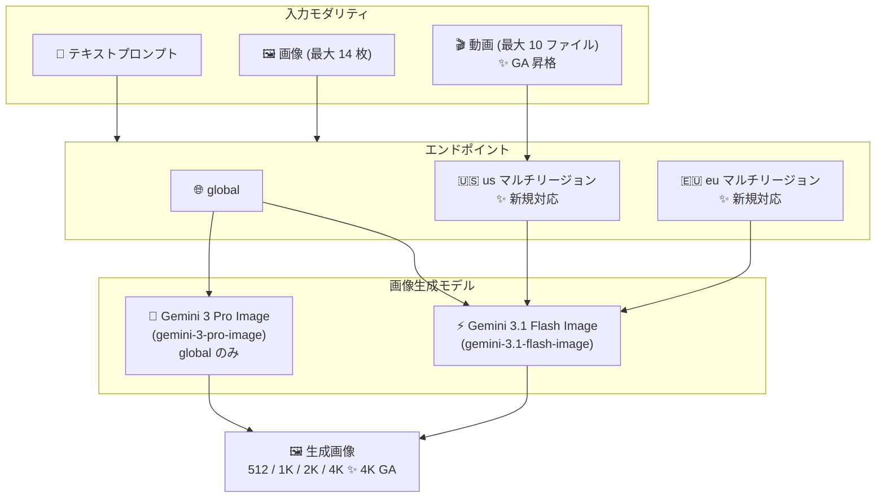

# Gemini Enterprise Agent Platform: Gemini 3.1 Flash Image / Gemini 3 Pro Image アップデート (マルチリージョン対応・4K 出力 GA・動画入力 GA)

**リリース日**: 2026-08-31

**サービス**: Gemini Enterprise Agent Platform

**機能**: Gemini 3.1 Flash Image / Gemini 3 Pro Image のマルチリージョンエンドポイント対応、4K 画像出力 GA、動画入力 GA

**ステータス**: GA (Generally Available)

📊 [このアップデートのインフォグラフィックを見る](https://takech9203.github.io/google-cloud-news-summary/20260831-gemini-agent-platform-image-models-update.html)

## 概要

Google Cloud は 2026 年 8 月 31 日、Gemini Enterprise Agent Platform の画像生成モデルである Gemini 3.1 Flash Image (Nano Banana 2) と Gemini 3 Pro Image (Nano Banana Pro) に対する 3 つの重要なアップデートを発表しました。(1) Gemini 3.1 Flash Image の US (`us`) / EU (`eu`) マルチリージョンエンドポイント対応、(2) 両モデルでの 4K 解像度画像出力の GA 昇格、(3) Gemini 3.1 Flash Image における動画入力からの画像生成の GA 昇格です。

Gemini 3.1 Flash Image は価格と性能のバランスに優れた画像理解・生成モデル、Gemini 3 Pro Image は高度な推論能力を組み込んだ複雑なマルチターン画像生成・編集向けのモデルです。今回のアップデートにより、データレジデンシー要件を持つエンタープライズユーザーが Gemini 3.1 Flash Image を US / EU リージョン内で利用できるようになり、また高解像度 (4K、約 16MP) の画像生成と動画コンテンツを起点とした画像生成を本番環境で利用できるようになりました。

対象ユーザーは、EU / US のデータ所在地要件を持つ規制業界の企業、印刷・大判ディスプレイ向けの高解像度アセットを必要とするクリエイティブ・マーケティング部門、動画コンテンツからサムネイルやポスターを自動生成するメディア企業などです。

**アップデート前の課題**

- Gemini 3.1 Flash Image はグローバルエンドポイント (`global`) でのみ提供されており、ML 処理を US / EU 域内に限定するデータレジデンシー要件を満たす構成でこのモデルを利用できなかった
- 4K 解像度の画像出力は GA ではなかったため、本番ワークロードでの利用にはプレビュー段階の機能を使う必要があった
- 動画入力からの画像生成も GA ではなく、動画を起点とした画像生成パイプラインを本番システムに組み込みにくかった

**アップデート後の改善**

- Gemini 3.1 Flash Image が US (`us`) / EU (`eu`) マルチリージョンエンドポイントで利用可能になり、モデル可用性・ML 処理・Provisioned Throughput・PayGo Standard のすべてでマルチリージョンを選択できるようになった
- 4K 解像度 (約 16MP) の画像出力が Gemini 3.1 Flash Image と Gemini 3 Pro Image の両方で GA となり、本番環境で高解像度アセットを生成できるようになった
- 動画入力からの画像生成が Gemini 3.1 Flash Image で GA となり、動画 (最大 10 ファイル、YouTube URL は 1 件) からポスターやサムネイルなどの画像を生成するワークフローを本番利用できるようになった

## アーキテクチャ図



Gemini 3.1 Flash Image は global に加えて us / eu マルチリージョンエンドポイントで利用可能になり、テキスト・画像・動画入力から最大 4K 解像度の画像を生成できます。Gemini 3 Pro Image は global エンドポイントで 4K 出力が GA になりました。

## サービスアップデートの詳細

### 主要機能

1. **マルチリージョンエンドポイント対応 (Gemini 3.1 Flash Image)**
   - `gemini-3.1-flash-image` が US (`us`) および EU (`eu`) マルチリージョンエンドポイントで利用可能に
   - 対応範囲はモデル可用性、ML 処理 (データレジデンシー)、Provisioned Throughput、PayGo Standard の 4 項目
   - ML 処理をマルチリージョン内に限定できるため、データ所在地要件のあるワークロードでも利用可能

2. **4K 画像出力の GA (両モデル)**
   - Gemini 3.1 Flash Image と Gemini 3 Pro Image の両方で 4K (約 16MP) 解像度の画像生成が GA に
   - Gemini 3.1 Flash Image の対応解像度: 512 (0.5K)、1K、2K、4K
   - Gemini 3 Pro Image の対応解像度: 1K、2K、4K
   - `generation_config` の `image_size` で解像度を指定 (大文字の "K" が必須。例: `"4K"`。小文字の `"4k"` は拒否される)

3. **動画入力からの画像生成の GA (Gemini 3.1 Flash Image)**
   - 動画ファイルを入力として画像を生成する機能が GA に
   - 1 プロンプトあたり最大 10 本の動画ファイル、YouTube URL は 1 件まで
   - 音声なし動画の最大長は約 25 分 (128K トークンのコンテキストウィンドウの範囲内)
   - 対応 MIME タイプ: `video/mp4`、`video/webm`、`video/quicktime`、`video/mpeg`、`video/wmv`、`video/3gpp` など

## 技術仕様

### モデル比較

| 項目 | Gemini 3.1 Flash Image | Gemini 3 Pro Image |
|------|------------------------|--------------------|
| モデル ID | `gemini-3.1-flash-image` | `gemini-3-pro-image` |
| 位置づけ | 価格と性能のバランス重視 (Nano Banana 2) | 高度な推論による複雑な画像生成・編集 (Nano Banana Pro) |
| コンテキストウィンドウ | 131,072 トークン | 65,536 トークン |
| 最大出力トークン | 32,768 | 32,768 |
| 対応解像度 | 512、1K、2K、4K | 1K、2K、4K |
| 動画入力 | 対応 (GA) | 非対応 (モダリティとして動画入力なし) |
| 入力画像数 | 最大 14 枚/プロンプト | 最大 14 枚/プロンプト |
| エンドポイント | global、us、eu | global |
| Provisioned Throughput | 対応 (global / us / eu) | 対応 |
| PayGo | Standard (global / us / eu)、Flex | Standard、Flex |
| バッチ推論 | 対応 | 対応 |
| Content Credentials (C2PA) | 対応 | 対応 |
| セキュリティ制御 | データレジデンシー、CMEK、VPC-SC、AXT | データレジデンシー、CMEK、VPC-SC、AXT |

### 画像生成のトークン消費量

| 解像度 | Gemini 3.1 Flash Image (出力) | Gemini 3 Pro Image (出力) |
|--------|------------------------------|---------------------------|
| 512 (約 0.25MP) | 747 トークン | 非対応 |
| 1K (約 1MP) | 1,120 トークン | 1,120 トークン |
| 2K (約 4MP) | 1,680 トークン | 1,120 トークン |
| 4K (約 16MP) | 2,520 トークン | 2,000 トークン |

入力画像は Gemini 3.1 Flash Image が 1 枚あたり 1,120 トークン、Gemini 3 Pro Image が 1 枚あたり 560 トークンを消費します。テキストや動画など他のモダリティの入出力トークンにも別途課金が発生します。

### 対応アスペクト比

両モデルとも 1:1、3:2、2:3、3:4、1:4、4:1、4:3、4:5、5:4、1:8、8:1、9:16、16:9、21:9、9:21 に対応しています。

## 設定方法

### 前提条件

1. 課金が有効な Google Cloud プロジェクト
2. Agent Platform API の有効化
3. Google Gen AI SDK のインストール (`pip install --upgrade google-genai`)

### 手順

#### ステップ 1: 環境変数の設定

```bash
export GOOGLE_CLOUD_PROJECT=YOUR_PROJECT_ID
export GOOGLE_CLOUD_LOCATION=global   # us / eu マルチリージョンも指定可能 (3.1 Flash Image)
export GOOGLE_GENAI_USE_ENTERPRISE=True
```

マルチリージョンエンドポイントを利用する場合は `GOOGLE_CLOUD_LOCATION` に `us` または `eu` を指定します。

#### ステップ 2: 画像生成の実行 (Python)

```python
from google import genai
from google.genai.types import GenerateContentConfig, Modality

client = genai.Client()
response = client.models.generate_content(
    model="gemini-3.1-flash-image",
    contents="Generate an image of the Eiffel tower with fireworks in the background.",
    config=GenerateContentConfig(
        response_modalities=[Modality.TEXT, Modality.IMAGE],
    ),
)
```

4K 解像度を指定する場合は、`generation_config` の `image_size` に `"4K"` (大文字の K) を指定します。デフォルトは 1K です。

#### ステップ 3: 動画入力からの画像生成 (REST の例)

```bash
curl -s -X POST \
  "https://generativelanguage.googleapis.com/v1/models/gemini-3.1-flash-image:generateContent" \
  -H "x-goog-api-key: $GEMINI_API_KEY" \
  -H "Content-Type: application/json" \
  -d '{
    "contents": [{
      "parts": [
        { "file_data": { "file_uri": "https://www.youtube.com/watch?v=EXAMPLE" },
          "video_metadata": { "fps": 0.5 } },
        { "text": "Generate a poster image that captures the key themes of this video." }
      ]
    }],
    "generationConfig": { "responseModalities": ["TEXT", "IMAGE"] }
  }'
```

動画を入力として渡し、その内容を反映したポスター画像などを生成できます。

## メリット

### ビジネス面

- **データレジデンシー要件への対応**: EU / US 域内での ML 処理が求められる規制業界 (金融、医療、公共など) でも Gemini 3.1 Flash Image を採用できる
- **高解像度アセットの本番利用**: 4K 出力が GA となったことで、印刷物や大型ディスプレイ向けのクリエイティブ制作を SLA のある本番環境で自動化できる
- **動画資産の再活用**: 既存の動画コンテンツからサムネイル・ポスター・キービジュアルを生成するワークフローを本番導入できる

### 技術面

- **柔軟な消費オプション**: マルチリージョンエンドポイントでも Provisioned Throughput と PayGo Standard の両方を選択でき、スループット保証とコスト最適化を使い分けられる
- **エンタープライズセキュリティ制御**: オンライン予測・バッチ推論・コンテキストキャッシュのすべてでデータレジデンシー、CMEK、VPC-SC、AXT (Access Transparency) に対応
- **C2PA Content Credentials 対応**: 生成画像の来歴情報を付与でき、AI 生成コンテンツの透明性を確保できる

## デメリット・制約事項

### 制限事項

- マルチリージョンエンドポイント (us / eu) 対応は Gemini 3.1 Flash Image のみで、Gemini 3 Pro Image は global エンドポイントのみの提供
- 動画入力の GA は Gemini 3.1 Flash Image のみが対象
- Gemini 3 Pro Image は 512 (0.5K) 解像度に非対応 (1K / 2K / 4K のみ)
- `image_size` の指定は大文字の "K" が必須 (例: `"4K"`)。小文字 (`"4k"`) はエラーになる
- 両モデルとも Structured Output、Function Calling、Code Execution、チューニングには非対応

### 考慮すべき点

- 4K 出力は 1K 出力に比べてトークン消費が増加する (Gemini 3.1 Flash Image で 1,120 → 2,520 トークン、Gemini 3 Pro Image で 1,120 → 2,000 トークン) ため、大量生成時のコスト影響を試算しておく
- 動画入力は 128K トークンのコンテキストウィンドウを消費するため、長尺動画 (最大約 25 分) を扱う場合はプロンプト全体のトークン量に注意が必要
- `gemini-3.1-flash-image` の廃止予定日は 2027 年 5 月 28 日以降とされており、モデルライフサイクルを踏まえた更新計画が必要

## ユースケース

### ユースケース 1: EU 域内でのマーケティング画像生成

**シナリオ**: EU のデータ所在地要件を持つ企業が、商品画像の生成・編集パイプラインを構築する。ML 処理を EU 域内に限定する必要がある。

**実装例**:
```bash
export GOOGLE_CLOUD_LOCATION=eu
# gemini-3.1-flash-image を eu マルチリージョンエンドポイントで呼び出す
```

**効果**: ML 処理が EU マルチリージョン内で実行されるため、データレジデンシー要件を満たしながら画像生成 AI を活用できる。Provisioned Throughput によりスループットの確保も可能。

### ユースケース 2: 動画からの高解像度ポスター自動生成

**シナリオ**: メディア企業が、公開済みの動画コンテンツから宣伝用ポスターやサムネイルを自動生成する。印刷にも耐える高解像度が必要。

**効果**: 動画入力 GA と 4K 出力 GA の組み合わせにより、動画の内容を反映した約 16MP の高解像度画像を本番パイプラインで生成できる。バッチ推論を使えば大量の動画アセットも一括処理できる。

## 料金

両モデルとも Standard PayGo / Flex PayGo (従量課金) と Provisioned Throughput (スループット予約) に対応しています。画像生成はトークンベースで課金され、出力解像度によって消費トークン数が異なります (4K は Gemini 3.1 Flash Image で 2,520 トークン、Gemini 3 Pro Image で 2,000 トークン)。テキスト・動画など他のモダリティの入出力トークンにも別途課金が発生します。

最新の単価は公式料金ページを参照してください: [Gemini Enterprise Agent Platform の生成 AI 料金](https://cloud.google.com/gemini-enterprise-agent-platform/generative-ai/pricing)

## 利用可能リージョン

| モデル | モデル可用性 | ML 処理 | Provisioned Throughput | Standard PayGo |
|--------|-------------|---------|------------------------|----------------|
| Gemini 3.1 Flash Image | global、us、eu | us、eu | global、us、eu | global、us、eu |
| Gemini 3 Pro Image | global | - | global | global |

詳細は [Model locations](https://docs.cloud.google.com/gemini-enterprise-agent-platform/resources/locations#multi-region) を参照してください。

## 関連サービス・機能

- **Agent Studio**: Google Cloud コンソール上で両モデルをプロンプト実行・検証できる開発環境
- **Provisioned Throughput**: マルチリージョンエンドポイントでもスループットを予約し、安定した本番運用を実現
- **バッチ推論 (Batch inference)**: 大量の画像生成リクエストを一括処理。データレジデンシー、CMEK、VPC-SC に対応
- **コンテキストキャッシュ (Implicit context caching)**: 繰り返し利用する入力のトークンコストを削減
- **Content Credentials (C2PA)**: 生成画像に来歴情報を付与し、AI 生成コンテンツの透明性を確保
- **Gemini 3.1 Flash-Lite Image**: 高速な生成・イテレーションに特化した軽量画像生成モデル (1K のみ対応)

## 参考リンク

- 📊 [インフォグラフィック](https://takech9203.github.io/google-cloud-news-summary/20260831-gemini-agent-platform-image-models-update.html)
- [公式リリースノート](https://docs.cloud.google.com/release-notes#August_31_2026)
- [Gemini 3.1 Flash Image モデルドキュメント](https://docs.cloud.google.com/gemini-enterprise-agent-platform/models/gemini/3-1-flash-image)
- [Gemini 3 Pro Image モデルドキュメント](https://docs.cloud.google.com/gemini-enterprise-agent-platform/models/gemini/3-pro-image)
- [Model locations (マルチリージョン)](https://docs.cloud.google.com/gemini-enterprise-agent-platform/resources/locations#multi-region)
- [Gemini による画像生成・編集](https://docs.cloud.google.com/gemini-enterprise-agent-platform/models/capabilities/image-generation)
- [料金ページ](https://cloud.google.com/gemini-enterprise-agent-platform/generative-ai/pricing)

## まとめ

今回のアップデートは、Gemini 画像生成モデルのエンタープライズ対応を大きく前進させるものです。US / EU マルチリージョン対応によりデータレジデンシー要件のある組織でも Gemini 3.1 Flash Image を採用できるようになり、4K 出力と動画入力の GA 昇格により高解像度アセット生成や動画起点の画像生成を本番環境に組み込めるようになりました。データ所在地要件で採用を見送っていた組織は、us / eu エンドポイントでの PoC を検討することをおすすめします。

---

**タグ**: #GeminiEnterpriseAgentPlatform #Gemini31FlashImage #Gemini3ProImage #ImageGeneration #GA #MultiRegion #4K #DataResidency
