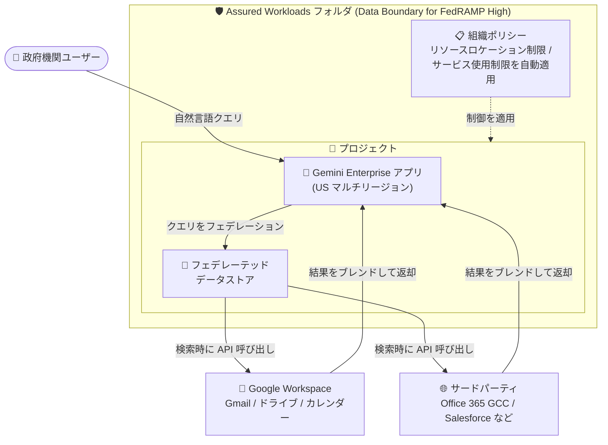

# Gemini Enterprise: Assured Workloads (FedRAMP High) でのフェデレーテッドデータストア対応

**リリース日**: 2026-08-31

**サービス**: Gemini Enterprise

**機能**: Assured Workloads フォルダ内プロジェクトへの Google Workspace / サードパーティフェデレーテッドデータストア接続 (FedRAMP High 準拠)

**ステータス**: 一般提供 (GA)

📊 [このアップデートのインフォグラフィックを見る](https://takech9203.github.io/google-cloud-news-summary/20260831-gemini-enterprise-assured-workloads-fedramp-high.html)

## 概要

Gemini Enterprise が、Assured Workloads フォルダ内のプロジェクトに対して Google Workspace およびサードパーティのフェデレーテッドデータストアを接続する機能を一般提供 (GA) しました。Assured Workloads フォルダは、Google Cloud リソースに対してセキュリティ・コンプライアンス制御を自動的に適用し、FedRAMP High 基準への準拠を支援する仕組みです。

FedRAMP High は米国連邦政府向けのクラウドセキュリティ認証プログラムにおける最高位の基準であり、米国連邦政府機関や国防総省 (DoD) 関連組織など、厳格なコンプライアンス要件を持つ組織が対象です。今回のアップデートにより、こうした組織が FedRAMP High 準拠の環境を維持したまま、Gmail・Google ドライブ・Google カレンダーといった Google Workspace のフェデレーテッドコネクタや、Microsoft Office 365 GCC (Government Community Cloud)・Office GCC High and DoD・Salesforce などのサードパーティフェデレーテッドコネクタを Gemini Enterprise から利用できるようになりました。

フェデレーテッドデータストアは、検索クエリを実行時にデータソースの API へ直接送信し、結果を他のデータソースの結果とブレンドして表示する方式です。データはソース側に留まるため、機密性の高いデータを扱う政府系ワークロードとの親和性が高い接続モデルです。

**アップデート前の課題**

- Gemini for Government の FedRAMP High 向けデプロイガイダンスでは、認可されたデータストアが Cloud Storage バケットと BigQuery データセットに限定されており、Google ドライブなどのフェデレーテッドデータソースへの接続は認可対象外だった
- FedRAMP High 準拠が必要な組織は、Google Workspace やサードパーティ SaaS に保存されたデータを Gemini Enterprise の検索・アシスタント機能から横断的に活用できなかった
- コンプライアンス境界の内側で利用できるデータソースが限られるため、エンタープライズ検索の網羅性が制限されていた

**アップデート後の改善**

- Google Workspace フェデレーテッドコネクタ (Gmail、Google ドライブ、Google カレンダー) を Assured Workloads フォルダ内のプロジェクトに接続できるようになった (FedRAMP High で Authorized)
- サードパーティフェデレーテッドコネクタ (Microsoft Office 365 GCC、Office GCC High and DoD、Salesforce など) も FedRAMP High で Authorized となり、GA として利用可能になった
- Assured Workloads フォルダの組織ポリシー (リソースロケーション制限、サービス使用制限) による自動的なコンプライアンス制御を維持したまま、フェデレーテッド検索を利用できるようになった

## アーキテクチャ図



Assured Workloads フォルダが FedRAMP High のセキュリティ・コンプライアンス制御を自動適用し、その内側のプロジェクトに作成した Gemini Enterprise アプリからフェデレーテッドデータストア経由で Google Workspace およびサードパーティのデータソースを検索時に直接照会します。データ自体はソース側に留まります。

## サービスアップデートの詳細

### 主要機能

1. **Google Workspace フェデレーテッドコネクタの FedRAMP High 対応 (GA)**
   - Gmail、Google ドライブ、Google カレンダーの各コネクタが FedRAMP High で Authorized
   - 検索クエリは実行時に各データソースの API (例: Gmail API) へ直接送信され、他のデータソースの結果とブレンドされて表示される
   - Google Workspace データストアの検索はユーザー認証情報で実行され、権限を考慮した (permission-aware) 検索が行われる

2. **サードパーティフェデレーテッドコネクタの FedRAMP High 対応 (GA)**
   - Microsoft Office 365 Government Community Cloud (GCC)、Office GCC High and DoD、Salesforce などのコネクタが FedRAMP High で Authorized
   - サードパーティデータソースを接続すると、Gemini Enterprise はデータストアを作成し、指定したエンティティ (例: Jira Cloud の課題・添付ファイル・コメントなど、データソース固有のエンティティ) ごとにエンティティデータストアを関連付ける

3. **Assured Workloads による自動コンプライアンス制御**
   - Data Boundary for FedRAMP High コントロールパッケージが、サポート対象プロダクトへのリソース使用制限 (`gcp.restrictServiceUsage`) と許可されたロケーションでのみリソース作成を許可する制限 (`gcp.resourceLocations`) を組織ポリシーとして自動適用
   - 組織ポリシー違反やリソース違反のモニタリングとメール通知に対応
   - Assured Support 利用時は、FedRAMP High 要件として 1 次・2 次サポート担当者が米国内に所在し、強化されたバックグラウンドチェックを満たすことが求められる

## 技術仕様

### コンプライアンス対応状況 (Gemini for Government デプロイガイダンスより)

| 機能 | FedRAMP High | IL4 |
|------|--------------|-----|
| Google Workspace フェデレーテッドコネクタ (Gmail、Google ドライブ、Google カレンダー) | Authorized | Submitted |
| サードパーティフェデレーテッドコネクタ (Office 365 GCC、Office GCC High and DoD、Salesforce など) | Authorized | Submitted |
| 認可済みデータストア (Cloud Storage、BigQuery) | Authorized | Authorized |

### フェデレーテッド検索の動作

| 項目 | 詳細 |
|------|------|
| クエリ実行 | 検索クエリを実行時にデータソースの API へ直接送信 |
| 結果表示 | 他の接続済みデータソースの結果とブレンドして表示 |
| データの所在 | データはソースシステム側に留まる (フェデレーション方式) |
| アクセス制御 | Google Workspace データストアはユーザー認証情報での検索のみサポート (サービスアカウント認証・個人 Gmail アカウントは非サポート) |
| ロケーション | Gemini Enterprise アプリは US マルチリージョンを選択 (Assured Workloads のデータレジデンシーポリシーにより強制) |

## 設定方法

### 前提条件

1. Data Boundary for FedRAMP High コントロールパッケージを使用する Assured Workloads フォルダを作成済みであること
2. そのフォルダ内に Google Cloud プロジェクトを作成済みであること
3. ユーザーとサービスアカウントに必要な IAM 権限が付与されていること
4. データソースのアクセス制御を有効にするため、ID プロバイダを構成済みであること

### 手順

#### ステップ 1: Assured Workloads 環境と Gemini Enterprise アプリの準備

1. Data Boundary for FedRAMP High の Assured Workloads フォルダを作成する
2. フォルダ内にプロジェクトを作成する
3. Gemini Enterprise アプリを作成する (ロケーションは US マルチリージョンを選択。Assured Workloads のデータレジデンシーポリシーにより強制される)

#### ステップ 2: データストアの作成

1. Google Cloud コンソールで「Gemini Enterprise」ページに移動する
2. ナビゲーションメニューで「Data stores」をクリックする
3. 「Create data store」をクリックし、接続するソース (例: Gmail、Google Drive、Salesforce) を検索して選択する
4. 必要に応じてコネクタで有効にするアクションを選択する
5. 「Configuration」セクションでマルチリージョン (ロケーション)、データコネクタ名、暗号化設定 (Google 管理の暗号鍵または Cloud KMS 鍵) を構成する
6. 「Create」をクリックする。データストアの状態が「Creating」から「Active」に変わればコネクタが利用可能になる

#### ステップ 3: アプリへの接続

作成したデータストアをアプリに接続し、検索を実行できるようにする。

```
Gemini Enterprise ページ → アプリを作成 → 既存のデータストアに接続
```

## メリット

### ビジネス面

- **政府系ワークロードでの AI 活用範囲の拡大**: FedRAMP High 準拠が必要な米国連邦政府機関や関連組織が、Google Workspace やサードパーティ SaaS のデータを Gemini Enterprise の検索・アシスタント機能から活用できる
- **コンプライアンス運用の自動化**: Assured Workloads フォルダが組織ポリシーによる制御を自動適用するため、準拠状態の維持にかかる運用負荷を軽減できる
- **GA による本番利用**: 一般提供のため、本番環境での利用に適したサポートレベルで導入できる

### 技術面

- **フェデレーション方式によるデータ最小化**: 検索時にソース API へ直接クエリを送信する方式のため、データをコンプライアンス境界の外へコピー・複製せずに横断検索できる
- **権限を考慮した検索**: ユーザー認証情報に基づく検索により、ソースシステム側のアクセス権限が検索結果に反映される
- **違反モニタリング**: Assured Workloads の組織ポリシー違反モニタリングと通知により、非準拠構成を早期に検出できる

## デメリット・制約事項

### 制限事項

- IL4 (DoD Impact Level 4) については、Google Workspace / サードパーティフェデレーテッドコネクタはいずれも「Submitted」ステータスであり、FedRAMP High のように Authorized ではない
- Google Workspace データストアの検索はユーザー認証情報が必須で、サービスアカウント認証情報や個人 Google アカウント (@gmail.com) はサポートされない
- FedRAMP High デプロイでは Gemini Enterprise アプリのロケーションとして US マルチリージョンが強制される

### 考慮すべき点

- FedRAMP High / IL4 で認可されていない機能 (例: Grounding with Google Search、Imagen による画像生成、Veo による動画生成、パーソナライゼーションなど) は Assured Workloads コントロールパッケージではブロックされないため、リスク評価に基づき手動で無効化する必要がある
- Google ドライブコネクタのフェデレーション検索は、検索を実行するユーザーのドメインが所有するドキュメントのみを検索対象とするため、事前にドキュメントのアクセス可否 (共有ドライブへの配置または所有権の設定) を確認する必要がある
- 組織で OAuth アプリのアクセスを制限している場合、Google Workspace 管理者が Google 管理の OAuth アプリを許可リストに追加する必要がある

## ユースケース

### ユースケース 1: 連邦政府機関における FedRAMP High 準拠のエンタープライズ検索

**シナリオ**: 米国連邦政府機関が、FedRAMP High 準拠を維持しながら、職員のメール (Gmail)、ドキュメント (Google ドライブ)、スケジュール (Google カレンダー) を Gemini Enterprise で横断検索できる環境を構築する。

**実装例**:
```
1. Data Boundary for FedRAMP High の Assured Workloads フォルダを作成
2. フォルダ内のプロジェクトに Gemini Enterprise アプリを作成 (US マルチリージョン)
3. Gmail / Google ドライブ / Google カレンダーのフェデレーテッドデータストアを作成してアプリに接続
4. 認可外機能 (Grounding with Google Search など) をリスク評価に基づき無効化
```

**効果**: コンプライアンス境界の外にデータをコピーすることなく、権限を考慮した横断検索を職員に提供でき、組織ポリシーによる制御でリソースロケーションやサービス使用が自動的に制限される。

### ユースケース 2: DoD 関連組織での Office 365 GCC High データの活用

**シナリオ**: DoD 向けの業務で Microsoft Office 365 GCC High を利用している組織が、FedRAMP High 準拠の Gemini Enterprise 環境から Office 365 GCC High のデータをフェデレーション検索する。

**効果**: 既存の Microsoft 環境のデータを移行せずに Gemini Enterprise の自然言語検索・アシスタント機能から活用でき、Cloud Storage / BigQuery の認可済みデータストアと組み合わせた包括的な検索体験を構築できる。

## 料金

Gemini Enterprise はエディションベースのサブスクリプションモデル (Business / Standard / Plus / Pay-as-you-go / Frontline) で提供されます。エンタープライズグレードのセキュリティ・コンプライアンス機能は Standard、Plus、Pay-as-you-go、Frontline の各エディションで利用できます。

Pay-as-you-go エディションではストレージ + データインデックス作成が $5 / GiB / 月で課金されます (フェデレーテッドデータストアはデータをソース側に保持するフェデレーション方式です)。

詳細は以下の公式ページを参照してください。

- [Gemini Enterprise のエディション](https://docs.cloud.google.com/gemini/enterprise/docs/editions)
- [Gemini Enterprise のライセンス](https://docs.cloud.google.com/gemini/enterprise/docs/licenses)

## 利用可能リージョン

FedRAMP High デプロイでは、Gemini Enterprise アプリのロケーションとして **US マルチリージョン** を選択します。Assured Workloads のデータレジデンシーポリシーによりこの選択が強制されます。

## 関連サービス・機能

- **Assured Workloads**: コントロールパッケージ (Data Boundary for FedRAMP High など) に基づき、組織ポリシーによるセキュリティ・コンプライアンス制御をフォルダ単位で自動適用するサービス。違反モニタリングや鍵管理の制御も提供
- **Gemini for Government**: 米国連邦政府機関・DoD 向けの Gemini デプロイメント。FedRAMP High / IL4 準拠のデプロイガイダンスが提供されており、Assured Workloads の利用が前提
- **Cloud KMS / CMEK**: データストア作成時に Google 管理の暗号鍵に代えて顧客管理の暗号鍵 (CMEK) を選択可能
- **Sensitive Data Protection**: データストアに Sensitive Data Protection ポリシーを適用し、Gemini Enterprise が取得するデータの検査・匿名化が可能
- **Cloud Storage / BigQuery**: FedRAMP High / IL4 の両方で Authorized となっている第一者データストア。フェデレーテッドコネクタと組み合わせて利用可能

## 参考リンク

- 📊 [インフォグラフィック](https://takech9203.github.io/google-cloud-news-summary/20260831-gemini-enterprise-assured-workloads-fedramp-high.html)
- [公式リリースノート](https://docs.cloud.google.com/release-notes#August_31_2026)
- [Gemini Enterprise リリースノート](https://docs.cloud.google.com/gemini/enterprise/docs/release-notes)
- [Google データソースへの接続 (Connect a Google data source)](https://docs.cloud.google.com/gemini/enterprise/docs/connectors/create-data-store)
- [サードパーティデータソースへの接続 (Connect a third-party data source)](https://docs.cloud.google.com/gemini/enterprise/docs/connectors/connect-third-party-data-source)
- [Gemini for Government のデプロイガイダンス](https://docs.cloud.google.com/docs/security/compliance/deploy-gemini-gov)
- [Assured Workloads の概要](https://docs.cloud.google.com/assured-workloads/docs/overview)
- [Gemini Enterprise のコンプライアンスとセキュリティ制御](https://docs.cloud.google.com/gemini/enterprise/docs/compliance-security-controls)
- [Gemini Enterprise のエディション (料金)](https://docs.cloud.google.com/gemini/enterprise/docs/editions)

## まとめ

FedRAMP High 準拠が必要な政府系組織にとって、Gemini Enterprise で利用できるデータソースが Cloud Storage / BigQuery から Google Workspace およびサードパーティのフェデレーテッドデータストアへと大きく拡大する重要なアップデートです。Assured Workloads の自動コンプライアンス制御とフェデレーション方式の組み合わせにより、データをコンプライアンス境界外へ複製することなく横断検索を実現できます。該当する組織は、Gemini for Government のデプロイガイダンスを確認し、認可外機能の無効化を含めたリスク評価とあわせて導入を検討することを推奨します。

---

**タグ**: Gemini Enterprise, Assured Workloads, FedRAMP High, コンプライアンス, フェデレーテッド検索, Google Workspace, GA, 公共部門
