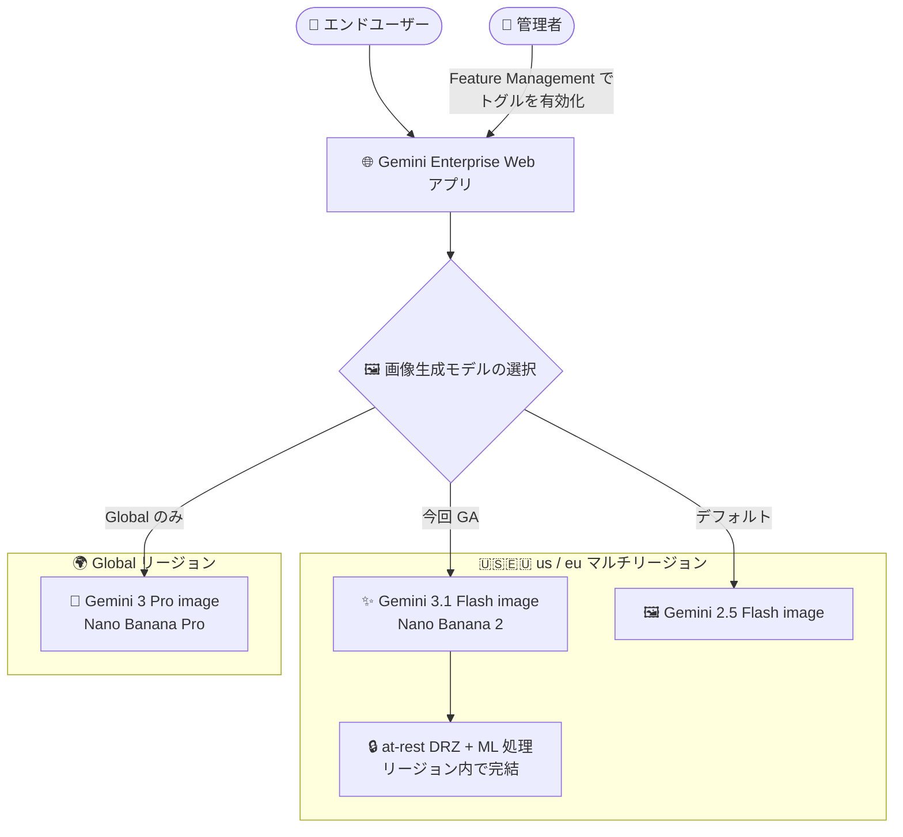

# Gemini Enterprise: Gemini 3.1 Flash image (Nano Banana 2) が US / EU マルチリージョンで GA

**リリース日**: 2026-08-31

**サービス**: Gemini Enterprise

**機能**: Gemini 3.1 Flash image (Nano Banana 2) の US / EU マルチリージョン対応

**ステータス**: GA (一般提供)

📊 [このアップデートのインフォグラフィックを見る](https://takech9203.github.io/google-cloud-news-summary/20260831-gemini-enterprise-gemini-3-1-flash-image-multiregion.html)

## 概要

Gemini Enterprise において、画像生成モデル **Gemini 3.1 Flash image (Nano Banana 2)** が **us および eu マルチリージョンで一般提供 (GA)** になりました。これにより、データレジデンシー (データ所在地) 要件を持つ米国・EU 域内の組織でも、最新世代の画像生成モデルを Gemini Enterprise の Web アプリで利用できるようになります。

公式ドキュメントのロケーション情報によると、Gemini 3.1 Flash image は US / EU マルチリージョンにおいて **保存時データレジデンシー (at-rest DRZ) と ML 処理 (MLP) の両方をサポート**します。つまり、画像生成に伴う機械学習処理も指定したマルチリージョン内で実行されるため、規制やコンプライアンス上の理由でデータを米国内・EU 域内に留める必要がある企業 (金融、公共、医療など) にとって重要なアップデートです。

管理者は Gemini Enterprise アプリの「Feature Management」設定で Gemini 3.1 Flash image のトグルを有効化することで、エンドユーザーに本モデルを提供できます。なお、Public Preview 期間中に管理者がこのモデルを有効化していた場合、GA 後もその設定は維持されます。

**アップデート前の課題**

- Gemini 3.1 Flash image (Nano Banana 2) は Gemini Enterprise では Public Preview として提供されており、本番利用に向けた SLA を伴う GA ステータスではなかった
- US / EU マルチリージョンでデータレジデンシーを構成している組織では、最新の画像生成モデルを利用する場合にリージョン外 (global) への処理経路を考慮する必要があった
- データ所在地要件のある環境では、従来の Gemini 2.5 Flash image (Nano Banana) が実質的な選択肢だった

**アップデート後の改善**

- Gemini 3.1 Flash image が GA となり、本番環境での利用が可能になった
- us / eu マルチリージョンで at-rest DRZ と MLP の両方がサポートされ、画像生成処理をマルチリージョン内に留めたまま最新モデルを利用できるようになった
- Public Preview 中に有効化していた設定は GA 後も引き継がれるため、管理者による再設定は不要

## アーキテクチャ図



Gemini Enterprise の画像生成モデルの提供リージョン構成を示しています。今回の GA により、Gemini 3.1 Flash image は us / eu マルチリージョン内でデータ保存と ML 処理の両方を完結できるようになりました (Gemini 3 Pro image は引き続き Global リージョンのみ)。

## サービスアップデートの詳細

### 主要機能

1. **US / EU マルチリージョンでの GA 提供**
   - Gemini 3.1 Flash image (Nano Banana 2) が us / eu マルチリージョンで一般提供 (GA)
   - at-rest DRZ (保存時データレジデンシー) と MLP (ML 処理) の両方をマルチリージョン内でサポート
   - in-country リージョン (CA、IN、JP、SG、UK) では引き続き global リージョンのみでの提供

2. **管理者によるモデル制御**
   - Feature Management の「Enable image generation」設定でモデルを選択可能
   - Gemini 3.1 Flash image は GA だがデフォルトではオフ。管理者がトグルを有効化する必要がある
   - Public Preview 中に有効化していた場合、GA 後も有効状態が維持される
   - モデル未選択の場合、システムは Gemini 2.5 Flash image をデフォルトとして使用

3. **Nano Banana 2 の画像生成能力**
   - 画像の生成と編集 (マルチターン編集を含む)、画像とテキストの交互出力 (インターリーブ) に対応
   - 価格と性能のバランスに優れ、画像理解と生成に最適化されたモデル
   - Content Credentials (C2PA) による生成画像の来歴証明をサポート

## 技術仕様

### 画像生成モデルのリージョン対応比較 (Gemini Enterprise)

| モデル | US / EU マルチリージョン | in-country リージョン (CA, IN, JP, SG, UK) | 備考 |
|------|------|------|------|
| Gemini 3.1 Flash image (Nano Banana 2) | at-rest DRZ + MLP サポート (**今回 GA**) | global リージョンのみ | 管理者によるトグル有効化が必要 |
| Gemini 3 Pro image (Nano Banana Pro) | global リージョンのみ | global リージョンのみ | リージョン外利用時は警告ダイアログの確認が必要 |
| Gemini 2.5 Flash image | at-rest DRZ + MLP サポート | DRZ / MLP 非サポート | モデル未選択時のデフォルト |

### Gemini 3.1 Flash image のモデル仕様 (参考)

Gemini Enterprise Agent Platform のモデルカードに基づく仕様です。

| 項目 | 詳細 |
|------|------|
| モデル ID | `gemini-3.1-flash-image` |
| 入力モダリティ | テキスト、画像、動画 (音声は非対応) |
| 出力モダリティ | テキスト、画像 |
| コンテキストウィンドウ | 131,072 トークン |
| 最大出力トークン | 32,768 トークン |
| 対応解像度 | 512 (0.25MP)、1K (1MP)、2K (4MP)、4K (16MP) |
| 対応アスペクト比 | 1:1, 3:2, 2:3, 3:4, 4:3, 4:5, 5:4, 1:4, 4:1, 1:8, 8:1, 9:16, 16:9, 21:9, 9:21 |
| プロンプトあたり最大入力画像数 | 14 枚 |
| セキュリティコントロール | Data residency、CMEK、VPC-SC、AXT |

## 設定方法

### 前提条件

1. Gemini Enterprise Admin IAM ロール (`roles/discoveryengine.agentspaceAdmin`) を保有していること
2. 既存の Gemini Enterprise Web アプリがあること

### 手順

#### ステップ 1: Feature Management 設定を開く

1. Google Cloud コンソールで **Gemini Enterprise** ページに移動
2. 設定するアプリの名前をクリック
3. **Configurations** > **Feature Management** タブをクリック

#### ステップ 2: 画像生成モデルを有効化する

1. **Enable image generation** を有効にする
2. ユーザーに利用させる画像モデルとして **Gemini 3.1 Flash image (Nano Banana 2)** のトグルをオンにする

Public Preview 期間中に本モデルを有効化していた場合は、GA 後も設定が引き継がれるため追加の操作は不要です。

## メリット

### ビジネス面

- **コンプライアンス要件との両立**: 金融・公共・医療など、データを米国内・EU 域内に留める必要がある組織でも最新の画像生成モデルを利用できる
- **本番利用の安心感**: GA ステータスとなったことで、本番業務 (マーケティング素材作成、資料作成など) への組み込みが正当化しやすくなる

### 技術面

- **ML 処理までリージョン内で完結**: at-rest DRZ に加え MLP もサポートされるため、画像生成の推論処理自体がマルチリージョン内で実行される
- **移行の容易さ**: Preview 時の有効化設定が GA 後も維持され、管理者の再設定作業が不要
- **モデル選択の柔軟性**: 管理者がユーザーに提供する画像モデルを Feature Management で一元管理できる

## デメリット・制約事項

### 制限事項

- Gemini 3.1 Flash image は GA でも**デフォルトはオフ**。利用には管理者によるトグル有効化が必要
- in-country リージョン (カナダ、インド、日本、シンガポール、英国) では global リージョンのみの提供で、in-country の DRZ / MLP は非サポート
- 上位モデルの Gemini 3 Pro image (Nano Banana Pro) は引き続き Global リージョンのみの提供

### 考慮すべき点

- モデルを選択しない場合はデフォルトで Gemini 2.5 Flash image が使用されるため、Nano Banana 2 を使わせたい場合は明示的な有効化が必要
- データレジデンシー要件がない組織には、応答速度・最新機能の観点から global ロケーションの利用が推奨されている (公式ドキュメントの一般的な推奨事項)

## ユースケース

### ユースケース 1: EU 域内のデータレジデンシー要件下でのマーケティング素材生成

**シナリオ**: GDPR や社内規程により顧客データと生成コンテンツを EU 域内に留める必要がある企業が、Gemini Enterprise でキャンペーン用のビジュアル素材を生成したい。

**実装例**:
```
1. eu マルチリージョンで Gemini Enterprise アプリを作成済み
2. Feature Management で「Enable image generation」を有効化
3. Gemini 3.1 Flash image (Nano Banana 2) のトグルをオン
4. エンドユーザーが Web アプリのチャットから画像生成・編集を実行
```

**効果**: 保存データと ML 処理の両方が EU マルチリージョン内で完結し、コンプライアンスを維持しながら最新モデルの画質・編集能力を活用できる。

### ユースケース 2: 米国の規制業種における社内資料のビジュアル作成

**シナリオ**: 米国の金融機関が、データ所在地を米国内に限定した環境で、社内向けプレゼン資料や提案書に使うイメージ図を Gemini Enterprise で生成する。

**効果**: us マルチリージョン構成のまま、従来の Gemini 2.5 Flash image から Nano Banana 2 に切り替えることで、アスペクト比の忠実性や画質、テキストレンダリングが改善された画像生成を利用できる。

## 料金

Gemini Enterprise の画像生成機能は Gemini Enterprise のライセンス体系の中で提供されます。詳細は料金ページを参照してください。

- [Gemini Enterprise 料金](https://cloud.google.com/gemini/enterprise/pricing)

## 利用可能リージョン

Gemini Enterprise における Gemini 3.1 Flash image (Nano Banana 2) の提供ロケーション:

| ロケーション | 提供状況 |
|------|------|
| global | 提供 |
| us マルチリージョン | **GA (今回のアップデート)** — at-rest DRZ + MLP サポート |
| eu マルチリージョン | **GA (今回のアップデート)** — at-rest DRZ + MLP サポート |
| in-country リージョン (CA, IN, JP, SG, UK) | global リージョンのみで提供 |

詳細は [Gemini Enterprise のロケーション](https://docs.cloud.google.com/gemini/enterprise/docs/locations) を参照してください。

## 関連サービス・機能

- **Gemini Enterprise Agent Platform**: Gemini 3.1 Flash Image モデル自体は Agent Platform 経由の API 利用も可能で、CMEK / VPC-SC / AXT などのセキュリティコントロールに対応
- **Gemini 3 Pro image (Nano Banana Pro)**: より高品質な画像生成向けの上位モデル。ただし Global リージョンのみの提供
- **Gemini 2.5 Flash image**: 従来からのデフォルト画像生成モデル。US / EU マルチリージョンで DRZ / MLP をサポート
- **CMEK (顧客管理の暗号鍵)**: Gemini Enterprise で CMEK を使用するには US または EU マルチリージョンの選択が必要であり、今回の GA でマルチリージョン構成のまま最新画像モデルを利用可能に

## 参考リンク

- 📊 [インフォグラフィック](https://takech9203.github.io/google-cloud-news-summary/20260831-gemini-enterprise-gemini-3-1-flash-image-multiregion.html)
- [公式リリースノート](https://docs.cloud.google.com/release-notes#August_31_2026)
- [Manage features on the web app (Gemini Enterprise)](https://docs.cloud.google.com/gemini/enterprise/docs/manage-web-app-features)
- [Gemini Enterprise のロケーションとデータレジデンシー](https://docs.cloud.google.com/gemini/enterprise/docs/locations)
- [Gemini 3.1 Flash Image モデルカード (Agent Platform)](https://docs.cloud.google.com/gemini-enterprise-agent-platform/models/gemini/3-1-flash-image)
- [料金ページ](https://cloud.google.com/gemini/enterprise/pricing)

## まとめ

Gemini 3.1 Flash image (Nano Banana 2) が US / EU マルチリージョンで GA となり、データレジデンシー要件を持つ組織でも保存データと ML 処理をマルチリージョン内に留めたまま最新世代の画像生成を利用できるようになりました。デフォルトではオフのため、利用を開始するには管理者が Feature Management で Gemini 3.1 Flash image のトグルを有効化してください。現在デフォルトの Gemini 2.5 Flash image を利用中の組織は、画質やアスペクト比忠実性が向上した本モデルへの切り替えを検討する価値があります。

---

**タグ**: #GeminiEnterprise #NanoBanana2 #画像生成 #データレジデンシー #マルチリージョン #GA
