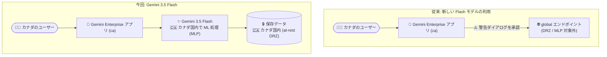

# Gemini Enterprise: Gemini 3.5 Flash がカナダ (ca) リージョンで利用可能に (DRZ / MLP 対応)

**リリース日**: 2026-08-31

**サービス**: Gemini Enterprise

**機能**: Gemini 3.5 Flash のカナダ国内リージョン対応 (リージョン内データレジデンシーおよび ML 処理)

**ステータス**: GA (国内リージョンの利用は許可リスト制)

📊 [このアップデートのインフォグラフィックを見る](https://takech9203.github.io/google-cloud-news-summary/20260831-gemini-enterprise-gemini-3-5-flash-canada.html)

## 概要

Gemini Enterprise において、Gemini 3.5 Flash モデルがカナダ国内リージョン (`ca`) で利用可能になりました。このアップデートの重要な点は、単なるリージョン追加ではなく、**リージョン内での保存時データレジデンシー (at-rest DRZ: Data Residency Zone)** と **機械学習処理 (MLP: Machine Learning Processing)** の両方がカナダ国内で完結することです。

これにより、カナダのデータ主権要件やコンプライアンス要件 (金融、公共、医療など規制産業のデータ所在地要件) を持つ組織が、データをカナダ国外に出すことなく Gemini 3.5 Flash を使ったエンタープライズ検索・アシスタント機能を利用できるようになります。

Gemini Enterprise の国内リージョン (CA、IN、JP、SG、UK) は許可リスト付きの GA として提供されており、利用にはGoogle アカウントチームへの連絡が必要です。

**アップデート前の課題**

- 国内リージョンでは、新しい Flash 系モデル (Gemini 3.7 Flash / 3.6 Flash) は `global` リージョン経由でのみ利用可能であり、DRZ / MLP の対象外だった (未対応リージョンでは警告ダイアログを承認してグローバルエンドポイントにトラフィックをルーティングする必要がある)
- Gemini 3.1 Pro は国内リージョンで at-rest DRZ にも MLP にも対応していない
- データレジデンシー要件のあるカナダの組織は、DRZ / MLP を維持したまま利用できるモデルの選択肢が限られていた (Gemini 2.5 Pro は CA / JP で対応)

**アップデート後の改善**

- Gemini 3.5 Flash がカナダ (`ca`) リージョンで、at-rest DRZ と MLP の両方に対応した状態で利用可能になった
- 保存データの所在と ML 推論処理の両方がカナダ国内に留まるため、データ主権・コンプライアンス要件を満たしながら新しい世代の Flash モデルを利用できる
- グローバルエンドポイントへのルーティング (および警告ダイアログの承認) が不要になった

## アーキテクチャ図

従来、国内リージョンで新しい Flash 系モデルを使うにはグローバルエンドポイントへのルーティングが必要でしたが、Gemini 3.5 Flash はカナダ国内で保存 (DRZ) と ML 処理 (MLP) が完結します。

## サービスアップデートの詳細

### 主要機能

1. **カナダ (`ca`) リージョンでの Gemini 3.5 Flash 提供**
   - Gemini Enterprise の国内リージョン `ca` で Gemini 3.5 Flash が利用可能
   - 公式ドキュメントの Locations ページに記載のとおり、Gemini 3.5 Flash は US/EU マルチリージョンと国内リージョンの両方で at-rest DRZ と MLP に対応

2. **リージョン内保存時データレジデンシー (at-rest DRZ)**
   - 顧客データの保存 (at-rest) がカナダ国内に留まることが保証される
   - データ所在地に関する規制要件への対応が可能

3. **リージョン内機械学習処理 (MLP)**
   - モデルによる推論などの ML 処理がリージョン内で実行される
   - 保存だけでなく処理段階でもデータがカナダ国外に出ない

## 技術仕様

### Gemini Enterprise の国内リージョン

| 国・地域 | リージョン名 |
|------|------|
| カナダ | `ca` |
| インド | `in` |
| 日本 | `asia-northeast1` |
| シンガポール | `sg` |
| 英国 | `europe-west2` |

国内リージョンの利用は許可リスト付き GA であり、アクセスには Google アカウントチームへの連絡が必要です。

### 国内リージョンにおける主要モデルの DRZ / MLP 対応状況 (公式 Locations ドキュメントより)

| モデル | 国内リージョン (CA/IN/JP/SG/UK) での対応 |
|------|------|
| Gemini 3.7 Flash | `global` リージョンのみ (DRZ / MLP 対象外) |
| Gemini 3.6 Flash | `global` リージョンのみ (DRZ / MLP 対象外) |
| **Gemini 3.5 Flash** | **at-rest DRZ / MLP 対応 (今回カナダで提供開始)** |
| Gemini 3.1 Pro | at-rest DRZ / MLP 非対応 (Limited Availability) |
| Gemini 2.5 Pro | CA / JP で at-rest DRZ / MLP 対応 (IN / SG / UK では非提供) |

## 設定方法

### 前提条件

1. Gemini Enterprise のサブスクリプション (Standard / Plus など、要件に応じたエディション)
2. 国内リージョン (`ca`) の利用には許可リストへの登録が必要 — Google アカウントチームに連絡する

### 手順

#### ステップ 1: 国内リージョンへのアクセスをリクエスト

Gemini Enterprise で `ca` リージョンを利用するため、Google アカウントチームに連絡して許可リストへの登録を依頼します。

#### ステップ 2: `ca` リージョンでアプリを構成

Gemini Enterprise アプリのロケーションとして `ca` を指定します。これにより、対象データの at-rest DRZ と MLP がカナダ国内で適用されます。

**注意**: セキュリティ・規制上の理由でデータ所在地の制約がない場合、Google は `global` ロケーションの利用を推奨しています (応答速度、最新モデル、最新機能の面で有利なため)。

## メリット

### ビジネス面

- **データ主権要件への対応**: カナダの規制産業 (金融、公共、医療など) がデータをカナダ国内に留めたまま Gemini 3.5 Flash を利用できる
- **コンプライアンス監査の簡素化**: 保存 (DRZ) と処理 (MLP) の両方がリージョン内で完結するため、データフローの説明責任を果たしやすい

### 技術面

- **グローバルルーティング不要**: 警告ダイアログの承認やグローバルエンドポイントへのトラフィックルーティングなしで新しい Flash モデルを利用可能
- **モデル選択肢の拡大**: 国内リージョンで DRZ / MLP を維持できるモデルとして、Gemini 2.5 Pro に加えて Gemini 3.5 Flash が選択可能に

## デメリット・制約事項

### 制限事項

- 国内リージョンの利用は許可リスト制であり、Google アカウントチームへの連絡が必要
- Gemini 3.7 Flash / 3.6 Flash などの最新 Flash モデルは引き続き `global` リージョンのみの提供で、国内リージョンの DRZ / MLP 対象外
- 国内リージョンでは一部機能に制限がある。例: Web Grounding for Enterprise (DRZ / MLP 非対応)、画像生成 (DRZ / MLP 非対応)、動画生成・Grounding with Google Search (`global` のみ)、CMEK (US / EU マルチリージョンのみ)

### 考慮すべき点

- データ所在地の要件がない場合は、応答速度・最新モデル・最新機能の観点から `global` ロケーションの利用が公式に推奨されている
- 国内リージョンは US / EU マルチリージョンと同様の制限を持ち、機能面でより制約が大きい場合がある

## ユースケース

### ユースケース 1: カナダの金融機関における社内ナレッジアシスタント

**シナリオ**: カナダの金融機関が、社内文書・ナレッジベースを対象とした Gemini Enterprise の検索・アシスタント機能を導入したいが、顧客関連データをカナダ国外に保存・処理できない規制要件がある。

**効果**: `ca` リージョンで Gemini 3.5 Flash を利用することで、保存データ (DRZ) と ML 処理 (MLP) の両方をカナダ国内に留めたまま、生成 AI アシスタントを展開できる。

### ユースケース 2: グローバルエンドポイント利用からの移行

**シナリオ**: これまでカナダ拠点で新しい Flash モデルを使うために警告を承認してグローバルエンドポイントにルーティングしていた組織が、データレジデンシーポリシーを厳格化したい。

**効果**: Gemini 3.5 Flash に切り替えることで、グローバルルーティングを排除し、リージョン内処理に統一できる。

## 料金

Gemini 3.5 Flash のカナダ提供自体による追加料金は Release Notes に記載されていません。Gemini Enterprise はエディション (Business / Standard / Plus / Pay-as-you-go / Frontline) ごとのサブスクリプションモデルで提供されます。

- Pay-as-you-go エディションの例: ストレージ + データインデキシングが $5 / GiB / 月、アシスタントやエージェント利用は Agent Platform の料金に準拠
- 詳細は公式のエディション比較・料金ページを参照してください

## 利用可能リージョン

今回のアップデート対象はカナダ (`ca`) 国内リージョンです。Gemini Enterprise の国内リージョンは CA、IN、JP (asia-northeast1)、SG、UK (europe-west2) で提供されており (許可リスト付き GA)、Gemini 3.5 Flash は公式ドキュメント上、US / EU マルチリージョンおよび国内リージョンで at-rest DRZ / MLP に対応しています。

最新の対応状況は [Locations ドキュメント](https://docs.cloud.google.com/gemini/enterprise/docs/locations) を参照してください。

## 関連サービス・機能

- **Assured Workloads**: 同日の Release Notes で、FedRAMP High 準拠の Assured Workloads フォルダー内プロジェクトへのフェデレーテッドデータストア接続対応も GA になっており、コンプライアンス強化の流れが継続している
- **Model Armor**: 国内リージョンで at-rest DRZ / MLP に対応するプロンプト・レスポンス保護機能 (ただし `global` リージョンでは利用不可)
- **CMEK (顧客管理暗号鍵)**: US / EU マルチリージョンのみ対応で、国内リージョンでは利用不可の点に注意
- **Gemini Notebook Enterprise**: 同じ Locations ドキュメントで DRZ / MLP 対応が定義されており、基本機能は国内リージョンでも DRZ / MLP に対応

## 参考リンク

- 📊 [インフォグラフィック](https://takech9203.github.io/google-cloud-news-summary/20260831-gemini-enterprise-gemini-3-5-flash-canada.html)
- [公式リリースノート](https://docs.cloud.google.com/release-notes#August_31_2026)
- [Gemini Enterprise Locations (データレジデンシー)](https://docs.cloud.google.com/gemini/enterprise/docs/locations)
- [Gemini Enterprise エディション比較](https://docs.cloud.google.com/gemini/enterprise/docs/editions)
- [Gemini Enterprise クォータと超過利用](https://docs.cloud.google.com/gemini/enterprise/docs/quotas-and-overages)

## まとめ

Gemini 3.5 Flash がカナダ (`ca`) リージョンで at-rest DRZ / MLP 対応となり、データ主権要件を持つカナダの組織が国内完結で新世代 Flash モデルを利用できるようになりました。カナダでデータレジデンシー要件を抱える組織は、Google アカウントチームに国内リージョンの許可リスト登録を相談し、Locations ドキュメントで対象機能の制限事項を確認することを推奨します。

---

**タグ**: Gemini Enterprise, Gemini 3.5 Flash, データレジデンシー, DRZ, MLP, カナダ, コンプライアンス, 生成AI
