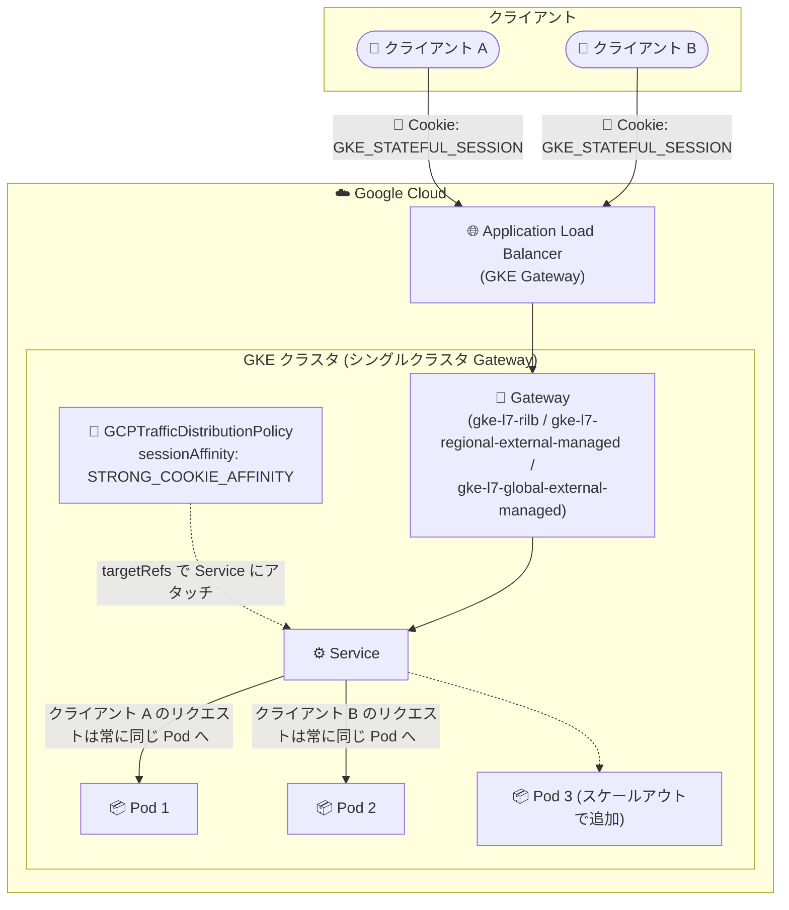

# Google Kubernetes Engine: GKE Gateway における GCPTrafficDistributionPolicy を使用したセッションアフィニティが GA

**リリース日**: 2026-08-31

**サービス**: Google Kubernetes Engine (GKE)

**機能**: GCPTrafficDistributionPolicy によるセッションアフィニティ

**ステータス**: GA (一般提供)

📊 [このアップデートのインフォグラフィックを見る](https://takech9203.github.io/google-cloud-news-summary/20260831-gke-gateway-session-affinity-ga.html)

## 概要

GKE Gateway において、`GCPTrafficDistributionPolicy` リソースを使用したセッションアフィニティのサポートが一般提供 (GA) となりました。本リリースでは、シングルクラスタの GKE Gateway ロードバランサー (GatewayClass: `gke-l7-rilb`、`gke-l7-regional-external-managed`、`gke-l7-global-external-managed`) がサポート対象です。

`GCPTrafficDistributionPolicy` は GKE ネイティブなリソースであり、ロードバランシングアルゴリズムとセッションアフィニティ設定を統一的に管理できます。Preview 時点で利用可能だったセッションアフィニティタイプ (CLIENT_IP、HEADER_FIELD、GENERATED_COOKIE、HTTP_COOKIE) に加え、今回新たに **STRONG_COOKIE_AFFINITY** が利用可能になりました。STRONG_COOKIE_AFFINITY は、Google Cloud Application Load Balancer で利用可能なセッションアフィニティタイプの中で最も永続性の高いセッションスティッキネスを提供し、バックエンドのスケーリングイベントや Pod プールのリサイズ時にもセッションの固定を維持します。

E コマースのショッピングカートやゲームセッションなど、同一クライアントからのリクエストを一貫して同じバックエンド Pod にルーティングする必要があるステートフルなワークロードを GKE 上で運用するユーザーにとって重要なアップデートです。

**アップデート前の課題**

- `GCPBackendPolicy` によるセッションアフィニティ設定は `CLIENT_IP` と `GENERATED_COOKIE` のみに対応しており、`HEADER_FIELD` や `HTTP_COOKIE` は使用できなかった
- Preview で提供されていたセッションアフィニティタイプは、ロードバランサーのスケーリングイベントや Pod プールのリサイズをまたいだ強固なセッション永続性を保証するものではなかった
- ステートフルな Cookie ベースのセッション永続化 (STRONG_COOKIE_AFFINITY) は GKE Gateway では利用できなかった

**アップデート後の改善**

- `GCPTrafficDistributionPolicy` によるセッションアフィニティ設定が GA となり、本番環境で利用できるようになった
- Google Cloud Application Load Balancer で利用可能なすべてのセッションアフィニティタイプ (STRONG_COOKIE_AFFINITY、HTTP_COOKIE、GENERATED_COOKIE、HEADER_FIELD、CLIENT_IP) を GKE Gateway で利用できるようになった
- 新たに追加された STRONG_COOKIE_AFFINITY により、スケーリングイベントや Pod プールのリサイズをまたいだ強固なセッションスティッキネスを実現できるようになった

## アーキテクチャ図



`GCPTrafficDistributionPolicy` を Service にアタッチすることで、GKE Gateway 経由のトラフィックにセッションアフィニティが適用されます。STRONG_COOKIE_AFFINITY ではステートフルな Cookie により、Pod のスケールアウト後も既存セッションは同じ Pod にルーティングされ続けます。

## サービスアップデートの詳細

### 主要機能

1. **GCPTrafficDistributionPolicy によるセッションアフィニティの GA**
   - シングルクラスタ GKE Gateway ロードバランサーで一般提供
   - サポート対象 GatewayClass: `gke-l7-rilb` (リージョン内部)、`gke-l7-regional-external-managed` (リージョン外部)、`gke-l7-global-external-managed` (グローバル外部)
   - `GCPTrafficDistributionPolicy` を使用したセッションアフィニティ設定が、デフォルトかつ推奨の方法となる

2. **STRONG_COOKIE_AFFINITY の新規サポート**
   - ステートフルな Cookie ベースのセッション永続化
   - スケーリングイベントや Pod プールのリサイズをまたいで強固なセッションスティッキネスを維持
   - Google Cloud Application Load Balancer のセッションアフィニティタイプの中で最も永続性が高い
   - `cookie.name` フィールドの設定が必須。`cookie.path` と `cookie.ttl` は任意
   - `localityLbAlgorithm` の設定値を問わず動作する (デフォルトは `ROUND_ROBIN`)

3. **カスタム HTTP ヘッダー・Cookie ベースのきめ細かなルーティング制御**
   - `HEADER_FIELD` により、特定の HTTP ヘッダーに基づくアフィニティを設定可能 (A/B テストなどに有用)
   - `HTTP_COOKIE` により、アプリケーション固有の名前付き Cookie に基づくアフィニティを設定可能
   - `GCPBackendPolicy` では非対応だったこれらのタイプが `GCPTrafficDistributionPolicy` で利用可能

### サポートされるセッションアフィニティタイプ

| アフィニティタイプ | 説明 | localityLbAlgorithm の要件 |
|------|------|------|
| STRONG_COOKIE_AFFINITY | ステートフルな Cookie ベースのセッション永続化。スケーリングイベントをまたいで強固なスティッキネスを維持 | 任意 (デフォルト ROUND_ROBIN で動作) |
| HTTP_COOKIE | 名前付き HTTP Cookie に基づくアフィニティ。初回応答時にロードバランサーが Set-Cookie で Cookie を発行 | MAGLEV または RING_HASH が必須 |
| GENERATED_COOKIE | ロードバランサーが自動生成する Cookie で追跡。Cookie 名はグローバル外部 ALB では GCLB、リージョン ALB では GCILB | MAGLEV または RING_HASH が必須 |
| HEADER_FIELD | 特定の HTTP ヘッダーに基づくアフィニティ | MAGLEV または RING_HASH が必須 |
| CLIENT_IP | クライアント IP アドレスに基づくベストエフォートのアフィニティ | MAGLEV または RING_HASH が必須 |
| NONE | セッションアフィニティを無効化 | - |

## 技術仕様

### 最小 GKE バージョン要件

| セッションアフィニティタイプ | 最小 GKE バージョン |
|------|------|
| CLIENT_IP、HEADER_FIELD、GENERATED_COOKIE、HTTP_COOKIE | 1.35.2-gke.1269001 以降 |
| STRONG_COOKIE_AFFINITY | 1.36.3-gke.1767000 以降 |

### GCPTrafficDistributionPolicy マニフェスト例 (STRONG_COOKIE_AFFINITY)

```yaml
apiVersion: networking.gke.io/v1
kind: GCPTrafficDistributionPolicy
metadata:
  name: strong-cookie-affinity-policy
  namespace: default
spec:
  default:
    sessionAffinity:
      type: STRONG_COOKIE_AFFINITY
      cookie:
        name: "GKE_STATEFUL_SESSION"
        path: "/"
        ttl: "24h"
  targetRefs:
    - group: ""
      kind: Service
      name: my-stateful-service
```

### Cookie の TTL に関する動作

- Cookie ベースのアフィニティ (STRONG_COOKIE_AFFINITY、HTTP_COOKIE、GENERATED_COOKIE) はすべて `ttl` 属性を持つ
- TTL を 0 秒に設定すると、ロードバランサーは Cookie に Expires 属性を付与せず、クライアントはセッション Cookie として扱う
- GENERATED_COOKIE の TTL は最大 2 週間 (336h) まで設定可能

## 設定方法

### 前提条件

1. サポート対象の GatewayClass (`gke-l7-rilb`、`gke-l7-regional-external-managed`、`gke-l7-global-external-managed`) を使用したシングルクラスタ GKE Gateway が構成されていること
2. 使用するセッションアフィニティタイプに応じた最小 GKE バージョンを満たしていること (上記の表を参照)

### 手順

#### ステップ 1: ポリシーマニフェストの作成と適用

```bash
# 選択したセッションアフィニティ設定のマニフェストを policy.yaml として保存し、適用する
kubectl apply -f policy.yaml
```

HTTP_COOKIE、GENERATED_COOKIE、HEADER_FIELD、CLIENT_IP を使用する場合は、`localityLbAlgorithm` フィールドに `MAGLEV` または `RING_HASH` を設定する必要があります。

#### ステップ 2: ポリシーのステータス確認

```bash
kubectl describe gcptrafficdistributionpolicy POLICY_NAME
```

出力の `Conditions` セクションで、ステータスが `True`、理由が `Attached` であれば設定が有効でアクティブです。

## メリット

### ビジネス面

- **ステートフルワークロードの GKE 移行を促進**: ショッピングカートやゲームセッションなどセッション状態に依存するアプリケーションを、GKE Gateway 上で安心して本番運用できる
- **GA によるプロダクション利用の安心感**: Preview から GA に昇格したことで、本番環境での採用判断がしやすくなった

### 技術面

- **スケーリング耐性のあるセッション永続化**: STRONG_COOKIE_AFFINITY により、オートスケーリングや Pod プールのリサイズ発生時にもセッションの固定が維持される
- **統一されたポリシー管理**: `GCPTrafficDistributionPolicy` 1 つでロードバランシングアルゴリズムとセッションアフィニティを一元管理できる
- **柔軟なアフィニティ制御**: カスタム HTTP ヘッダーや任意の名前の Cookie に基づくルーティングなど、`GCPBackendPolicy` より粒度の高い制御が可能

## デメリット・制約事項

### 制限事項

- `GCPTrafficDistributionPolicy` によるセッションアフィニティは**シングルクラスタ Gateway のみ**サポート (マルチクラスタ Gateway は対象外)
- クラシック Application Load Balancer に対するセッションアフィニティおよびロケリティロードバランシングポリシーの設定は非対応
- InferencePool リソースとは互換性がない (InferencePool は専用のロケリティロードバランシングアルゴリズムを使用するため)
- STRONG_COOKIE_AFFINITY 以外のタイプ (NONE を除く) は `localityLbAlgorithm` を `MAGLEV` または `RING_HASH` に設定する必要がある
- STRONG_COOKIE_AFFINITY にはより新しい GKE バージョン (1.36.3-gke.1767000 以降) が必要

### 考慮すべき点

- `GCPBackendPolicy` と `LbPolicy` によるセッションアフィニティ設定は既存構成向けに引き続きサポートされるが、新規設定では `GCPTrafficDistributionPolicy` の使用が推奨される
- `GCPTrafficDistributionPolicy` と `GCPBackendPolicy` の両方が同じ Service をターゲットにしている場合、`GCPTrafficDistributionPolicy` の設定が優先される
- STRONG_COOKIE_AFFINITY では `cookie.name` の設定が必須
- GENERATED_COOKIE では `cookie.name` と `cookie.path` は設定不可 (Cookie 名は GCLB / GCILB 固定、パスは `/` 固定)

## ユースケース

### ユースケース 1: E コマースサイトのショッピングカート

**シナリオ**: セッション状態を Pod のメモリに保持する E コマースアプリケーションを GKE で運用しており、セール時のオートスケーリングでセッションが失われる問題を回避したい。

**実装例**:
```yaml
apiVersion: networking.gke.io/v1
kind: GCPTrafficDistributionPolicy
metadata:
  name: cart-session-policy
  namespace: shop
spec:
  default:
    sessionAffinity:
      type: STRONG_COOKIE_AFFINITY
      cookie:
        name: "CART_SESSION"
        path: "/"
        ttl: "24h"
  targetRefs:
    - group: ""
      kind: Service
      name: cart-service
```

**効果**: スケールアウト/スケールインが発生しても、既存ユーザーのリクエストは同じ Pod にルーティングされ続け、カート内容の消失を防止できる。

### ユースケース 2: HTTP ヘッダーによる A/B テストのルーティング固定

**シナリオ**: クライアントが送信するユーザーグループ識別ヘッダー (例: `X-User-Group-ID`) に基づき、同一グループのリクエストを一貫して同じバックエンドにルーティングしたい。Cookie が使用できないクライアント環境にも対応する必要がある。

**実装例**:
```yaml
apiVersion: networking.gke.io/v1
kind: GCPTrafficDistributionPolicy
metadata:
  name: header-affinity-policy
  namespace: default
spec:
  default:
    sessionAffinity:
      type: HEADER_FIELD
      httpHeaderName: "X-User-Group-ID"
    localityLbAlgorithm: MAGLEV
  targetRefs:
    - group: ""
      kind: Service
      name: ab-test-service
```

**効果**: Cookie に依存せず、任意の HTTP ヘッダーで一貫したルーティングを実現でき、A/B テストの結果の一貫性を確保できる。

## 料金

`GCPTrafficDistributionPolicy` 自体に個別の追加料金の記載はありません。GKE Gateway が構成する Cloud Load Balancing (Application Load Balancer) の料金と、GKE クラスタの料金が適用されます。詳細は各料金ページを参照してください。

- [Cloud Load Balancing の料金](https://cloud.google.com/vpc/network-pricing)
- [GKE の料金](https://cloud.google.com/kubernetes-engine/pricing)

## 関連サービス・機能

- **Cloud Load Balancing (Application Load Balancer)**: GKE Gateway のバックエンドとなるロードバランサー。セッションアフィニティは ALB の機能を GKE ネイティブリソースから設定するもの
- **GKE Gateway API**: Kubernetes Gateway API の GKE 実装。`GCPTrafficDistributionPolicy` は Gateway API を拡張する GKE 固有のポリシーリソース
- **GCPBackendPolicy**: 従来のセッションアフィニティ設定方法 (CLIENT_IP、GENERATED_COOKIE のみ対応)。既存構成向けに引き続きサポート
- **Cloud Monitoring**: `GCPTrafficDistributionPolicy` の WEIGHTED_ROUND_ROBIN で使用するカスタムメトリクスのレポート先 (dryRun 時)

## 参考リンク

- 📊 [インフォグラフィック](https://takech9203.github.io/google-cloud-news-summary/20260831-gke-gateway-session-affinity-ga.html)
- [公式リリースノート](https://docs.cloud.google.com/release-notes#August_31_2026)
- [ドキュメント: Configure Gateway resources (セッションアフィニティの設定)](https://docs.cloud.google.com/kubernetes-engine/docs/how-to/configure-gateway-resources)
- [Cloud Load Balancing の料金ページ](https://cloud.google.com/vpc/network-pricing)

## まとめ

GKE Gateway のセッションアフィニティが `GCPTrafficDistributionPolicy` により GA となり、特に新規サポートされた STRONG_COOKIE_AFFINITY はスケーリングイベントをまたぐ強固なセッション永続化を実現します。GKE 上でステートフルなワークロードを運用しているチームは、まず GKE バージョン要件 (STRONG_COOKIE_AFFINITY は 1.36.3-gke.1767000 以降) を確認し、既存の `GCPBackendPolicy` ベースの設定から推奨方式である `GCPTrafficDistributionPolicy` への移行を検討することをお勧めします。

---

**タグ**: #GKE #GatewayAPI #SessionAffinity #LoadBalancing #GA #Networking #Kubernetes
