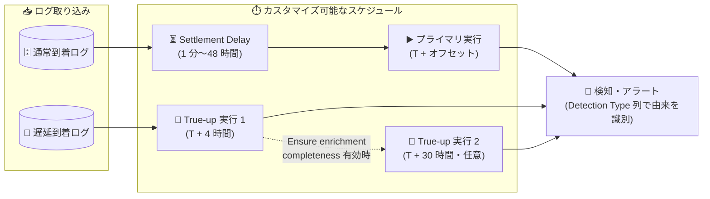

# Google SecOps: マルチイベントルールのカスタマイズ可能なスケジュールが GA

**リリース日**: 2026-08-31

**サービス**: Google SecOps (Google Security Operations)

**機能**: マルチイベントルールのカスタマイズ可能なスケジュール (Customizable schedules for multi-event rules)

**ステータス**: GA (一般提供、Spotlight Feature)

📊 [このアップデートのインフォグラフィックを見る](https://takech9203.github.io/google-cloud-news-summary/20260831-google-secops-multi-event-rule-custom-schedules-ga.html)

## 概要

Google SecOps において、マルチイベントルールの実行スケジュールをカスタマイズできる機能が一般提供 (GA) になりました。本機能は 2026 年 7 月 26 日にパブリックプレビューとして公開されており、今回 Spotlight Feature として GA に昇格しました。

マルチイベントルールは、複数のイベントを時間ウィンドウ内で相関させて脅威を検出するルールです。ログソースによっては取り込み (インジェスト) に遅延が発生するため、ルール実行のタイミングによっては遅延到着したログを評価できず、偽陰性 (検知漏れ) の原因となっていました。本機能により、セキュリティチームはルール実行タイミングをきめ細かく制御し、検知の適時性とデータの完全性を両立できるようになります。

対象ユーザーは、Google SecOps で検知ルールを設計・運用するセキュリティアナリスト、ディテクションエンジニア、プラットフォーム管理者です。

**アップデート前の課題**

- ログの取り込み遅延が既知のログソースであっても、ルール実行タイミングをシステムデフォルトに委ねるしかなく、遅延到着ログが初回評価に含まれないことによる偽陰性が発生し得た
- 遅延到着ログやエンリッチメント (メタデータ付加) の完了を待ってルールを再評価するには、手動での対応 (リトロハントなど) が必要だった
- マルチイベントルールの実行スケジュールに対する透明性・制御性が限定的だった

**アップデート後の改善**

- **Settlement delay (セトルメント遅延) の設定**: 初回実行の遅延オフセットを 1 分から最大 48 時間まで設定でき、ログ取り込み遅延を考慮して偽陰性を削減できる
- **自動 True-up 実行**: プライマリ実行の 4 時間後 (オプションで 30 時間後も追加) に同じ時間ウィンドウを自動的に再評価し、遅延到着ログやエンリッチメント完了後のデータを捕捉できる
- **レガシールールの移行**: 既存のカスタムマルチイベントルールを、Rules Dashboard から直接カスタマイズ可能なスケジュールへアップグレードできる

## アーキテクチャ図



セトルメント遅延を経てプライマリ実行が行われ、その後 4 時間後 (および任意で 30 時間後) の True-up 実行が同じ時間ウィンドウを再評価し、遅延到着ログやエンリッチメント完了後のデータによる検知漏れを防ぎます。

## サービスアップデートの詳細

### 主要機能

1. **Settlement delay (セトルメント遅延) の構成**
   - 初回実行 (プライマリ実行) に遅延オフセット (T + offset) を追加し、遅延到着ログの処理完了を待ってからルール評価を開始できる
   - 設定可能な範囲は 1 分から最大 48 時間
   - 配信遅延が既知のログソースに対して、プライマリ実行に期待されるすべてのイベントを含められる

2. **自動 True-up 実行**
   - **True-up 実行 1**: プライマリ実行の 4 時間後に、同じ時間ウィンドウをバックグラウンドで自動再スキャンし、見逃したデータや遅延データを捕捉する
   - **True-up 実行 2**: 「Ensure enrichment completeness」トグルを有効にした場合のみ、プライマリ実行の 30 時間後に最終スキャンを実行し、最大限のデータ忠実性を確保する
   - エンリッチメント完全性を有効にすると、True-up 実行 1 も関連するエンリッチメントデータの処理完了を待機する

3. **実行頻度の選択**
   - 「Every 10 min」(マッチウィンドウ 60 分未満のルール向け) や「Every 1 Hour」などの実行頻度を選択可能
   - デフォルトの 1 時間間隔を待たずに、ブルートフォース攻撃のような時間依存性の高い脅威をより迅速に検知できる

4. **レガシールールの移行**
   - 本機能が有効になると、既存のマルチイベントルールのスケジュールはすべて「legacy」としてラベル付けされる
   - カスタムルールのレガシースケジュールは Rules Dashboard から新しいカスタマイズ可能なシステムへ移行できる
   - **移行は一方向であり、移行後にレガシースケジュールへ戻すことはできない**

5. **スケジュールの可視性と検知由来の識別**
   - Rules Dashboard の「Rule schedule」列に、各アクティブルールに割り当てられた実行スケジュールが表示される
   - Alerts ページと Rules Dashboard の「Detection Type」列で、検知がプライマリ実行由来か、True-up 実行・遅延データ (30 分超の遅延到着)・再処理・リトロハント由来か (電球アイコン) を識別できる

## 技術仕様

### 対象ルールと制約

| 項目 | 詳細 |
|------|------|
| 対象ルール | マッチウィンドウが 48 時間以下のカスタムマルチイベントルール |
| シングルイベントルール | ほぼリアルタイムで評価されるため、スケジュールのカスタマイズ対象外 (standard、windowed、reference-based を含む) |
| キュレートされたルール | 固定のシステムスケジュールを使用するため対象外 |
| マッチウィンドウ 48 時間超のルール | `match_window / 10` の頻度で自動実行され、カスタマイズ不可。True-up 実行も行われない |
| Settlement delay | 1 分〜48 時間 |
| True-up 実行 1 | プライマリ実行の 4 時間後 (自動) |
| True-up 実行 2 | プライマリ実行の 30 時間後 (「Ensure enrichment completeness」有効時のみ) |
| 移行 | レガシースケジュールからの移行は一方向 (不可逆) |

### 必要な IAM 権限

カスタム IAM ロールでルールスケジュールを管理するには、以下の権限が必要です。

| 権限 | 用途 |
|------|------|
| `chronicle.ruleDeployments.update` | API による個別のスケジュール更新 |
| `chronicle.rules.modifyRules` | バッチ API 更新および UI での操作 |

Chronicle API Admin (`roles/chronicle.admin`) や Chronicle API Editor (`roles/chronicle.editor`) などの事前定義ロールには、これらの権限が自動的に含まれます。

## 設定方法

### 前提条件

1. 上記の IAM 権限 (`chronicle.rules.modifyRules` および `chronicle.ruleDeployments.update`) を持つこと。事前定義ロール (Chronicle API Admin / Editor) を使用している場合は自動的に含まれる
2. 対象ルールがマッチウィンドウ 48 時間以下のカスタムマルチイベントルールであること

### 手順

#### ステップ 1: Rules Dashboard でルールを開く

1. Google SecOps で **Detection > Rules & Detections** に移動する
2. **Rules Dashboard** をクリックする
3. ルールテーブルで対象ルールを見つけ、その他アイコン (⋮) をクリックして **Run schedule** を選択する

#### ステップ 2: プライマリ実行を構成する

**Rule schedule** タブの **Primary Run** セクションで以下を設定します。

1. **Set Frequency** リストで実行頻度 (例: Every 10 min、Every 1 Hour) を選択する
2. (任意) 遅延到着データを考慮する場合、**Settlement delay** トグルを有効にする
3. **Delay** フィールドに遅延値を入力し、**Unit** メニューで単位 (Minutes または Hours) を選択する

#### ステップ 3: True-up 実行を構成して保存する

1. **True-up run** セクションで、(任意) **Ensure enrichment completeness** トグルを有効にする
   - 有効にすると、外部コンテキストソースの処理に時間がかかる場合、アラートがイベントタイムスタンプより大幅に遅れて表示されることがある
   - コンテキストの忠実性を即時アラートより優先する、クリティカルでないコンプライアンス・フォレンジック用途のルールでのみ使用することが推奨されている
2. **Primary Run** と **True-up run** の実行タイムラインを確認する
3. **Save** をクリックする

#### ステップ 4: 検証

1. **Rules Dashboard** で対象ルールを選択し、**Detections** タブを表示する
2. **Detection Type** 列を確認し、電球アイコンでフィルタして、True-up 実行がプライマリ実行で見逃したデータを捕捉しているかを検証する
3. 結果に応じて Settlement delay を調整する (例: ログが 15 分遅延して到着するのに Settlement delay が 10 分の場合は延長する)

## メリット

### ビジネス面

- **偽陰性 (検知漏れ) の削減**: ログ取り込み遅延に起因する検知漏れを、セトルメント遅延と自動 True-up 実行で体系的に防止でき、セキュリティリスクを低減できる
- **運用負荷の軽減**: 遅延到着ログを捕捉するための手動介入 (手動での再評価など) が不要になり、SOC チームの運用負荷を軽減できる
- **透明性の向上**: Rules Dashboard でルールごとの実行スケジュールと検知の由来 (プライマリ実行か True-up 実行か) を可視化でき、検知運用の説明責任を果たしやすくなる

### 技術面

- **検知レイテンシの最適化**: マッチウィンドウ 60 分未満のルールを 10 分間隔で実行するなど、脅威の性質に応じて検知の適時性をチューニングできる
- **データ完全性の担保**: 4 時間後・30 時間後の自動再評価により、遅延ログとエンリッチメント完了後のコンテキストを含めた評価が可能になる
- **既存資産の活用**: 既存のカスタムマルチイベントルールを Rules Dashboard から新スケジュール体系へ移行でき、ルールロジックの書き直しは不要

## デメリット・制約事項

### 制限事項

- カスタマイズ対象はマッチウィンドウ 48 時間以下のカスタムマルチイベントルールのみ。シングルイベントルールとキュレートされたルールは対象外
- マッチウィンドウが 48 時間を超えるマルチイベントルールは `match_window / 10` の頻度で自動実行され、カスタマイズも True-up 実行も行われない
- レガシースケジュールから新スケジュールへの移行は一方向であり、移行後は元に戻せない
- イベント間の相関や集計 (count、sum など) を伴うマルチイベントルールはスケジュールバッチクエリエンジンを必要とするため、ニアリアルタイムのストリーミング実行は選択できない

### 考慮すべき点

- **Ensure enrichment completeness** を有効にすると、外部コンテキストの処理待ちによりアラートがイベント発生時刻より大幅に遅れる可能性がある。即時性が求められる重要ルールでは使用を避け、コンプライアンス・フォレンジック用途に限定することが推奨されている
- Settlement delay を長く設定するほど初回検知は遅くなるため、ログソースの実際の取り込み遅延に合わせた値を設定する必要がある (Detections タブでの検証結果に基づく調整が有効)
- 本機能の有効化により既存のマルチイベントルールスケジュールが「legacy」ラベル付けされるため、移行計画を立てて段階的に移行することが望ましい

## ユースケース

### ユースケース 1: 短いウィンドウでの相関検知の高速化

**シナリオ**: ブルートフォース攻撃のような時間依存性の高い脅威を、マッチウィンドウ 60 分未満のマルチイベントルールで検知したい。デフォルトの 1 時間間隔では検知が遅すぎる。

**実装例**:
```
Rules Dashboard > 対象ルール > Run schedule
- Set Frequency: Every 10 min
- Settlement delay: 無効 (即時性を優先)
```

**効果**: デフォルトの 1 時間間隔を待たず 10 分間隔でルールが実行され、時間依存性の高い攻撃をより迅速に検知できる。

### ユースケース 2: 取り込み遅延が既知のログソースへの対応

**シナリオ**: 特定のログソースの配信に既知の遅延があり、プライマリ実行時点でログが揃わず検知漏れが発生している。

**実装例**:
```
Rules Dashboard > 対象ルール > Run schedule
- Settlement delay: 有効
- Delay: 実測の取り込み遅延に合わせた値 (例: 30 Minutes)
- 検証: Detections タブの Detection Type 列 (電球アイコン) で
  True-up 実行由来の検知が減っているか確認し、必要に応じて調整
```

**効果**: プライマリ実行に期待されるすべてのイベントが含まれ、偽陰性を削減できる。

### ユースケース 3: コンプライアンス・フォレンジックルールのコンテキスト完全性確保

**シナリオ**: エンティティやアセットの完全なメタデータ解決を前提とする、即時性が要求されないコンプライアンス・フォレンジック用のルールを運用している。

**実装例**:
```
Rules Dashboard > 対象ルール > Run schedule
- True-up run: Ensure enrichment completeness を有効化
  (True-up 実行 1 がエンリッチメント完了を待機し、
   30 時間後の True-up 実行 2 が追加される)
```

**効果**: すべての外部メタデータの結合完了後に最終評価が行われ、最大限のデータ忠実性を持つ検知結果が得られる。

## 料金

本機能に固有の追加料金に関する公式情報は Release Notes には記載されていません。Google SecOps の料金の詳細は公式ページを参照してください。

- [Google Security Operations](https://cloud.google.com/security/products/security-operations)

## 関連サービス・機能

- **Rules Dashboard**: ルールごとの実行スケジュールの表示・変更、レガシースケジュールの移行、検知由来 (Detection Type) の確認を行う UI
- **ルールリプレイと MTTD**: 自動 True-up 実行は、遅延到着データやコンテキスト更新の処理を通じて Mean Time to Detect (MTTD) 指標に影響する
- **IAM (Identity and Access Management)**: カスタムロールでのスケジュール管理には `chronicle.rules.modifyRules` と `chronicle.ruleDeployments.update` が必要
- **リトロハント**: 過去データに対する手動の再評価手段。True-up 実行はこれを補完し、直近の時間ウィンドウの再評価を自動化する

## 参考リンク

- 📊 [インフォグラフィック](https://takech9203.github.io/google-cloud-news-summary/20260831-google-secops-multi-event-rule-custom-schedules-ga.html)
- [公式リリースノート](https://docs.cloud.google.com/release-notes#August_31_2026)
- [Configure customized schedules for rules](https://docs.cloud.google.com/chronicle/docs/detection/set-customized-schedule)
- [Understand rule run scheduling](https://docs.cloud.google.com/chronicle/docs/detection/rule-execution-frequency)
- [Understand rule replays and MTTD](https://docs.cloud.google.com/chronicle/docs/detection/rule-replays)
- [Understand rule detection delays](https://docs.cloud.google.com/chronicle/docs/detection/detection-delays)

## まとめ

Google SecOps のマルチイベントルールに対するカスタマイズ可能なスケジュールが GA になり、セトルメント遅延・自動 True-up 実行・レガシールール移行により、ログ取り込み遅延に起因する偽陰性を体系的に削減できるようになりました。Google SecOps を運用しているチームは、まず Rules Dashboard で既存ルールのスケジュールと Detection Type (True-up 由来の検知の有無) を確認し、取り込み遅延が既知のログソースに対応するルールから優先的に移行・チューニングすることを推奨します。移行は不可逆のため、対象ルールの棚卸しと段階的な適用計画を立てた上で進めてください。

---

**タグ**: #GoogleSecOps #Chronicle #SecurityOperations #DetectionEngineering #SIEM #GA
