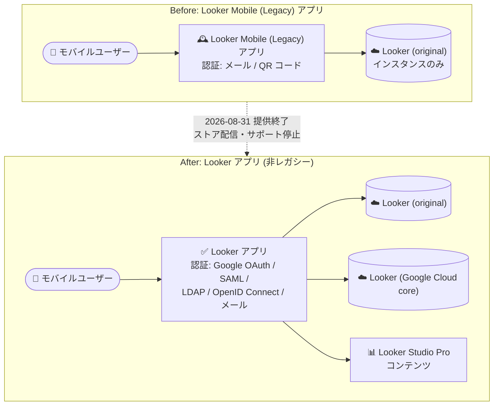

# Looker: Looker Mobile (Legacy) アプリの提供終了

**リリース日**: 2026-08-31

**サービス**: Looker

**機能**: Looker Mobile (Legacy) アプリの提供終了 (Deprecated)

**ステータス**: Deprecated

📊 [このアップデートのインフォグラフィックを見る](https://takech9203.github.io/google-cloud-news-summary/20260831-looker-mobile-legacy-app-discontinued.html)

## 概要

2026 年 8 月 31 日をもって、Looker Mobile (Legacy) アプリケーションの提供が終了しました。同アプリは App Store および Play Store からダウンロードできなくなり、アプリに対するサポートも打ち切られています。すでにインストール済みのユーザーは引き続きアプリを利用できますが、Google は後継である非レガシー版の Looker モバイルアプリへの移行を推奨しています。

Looker Mobile (Legacy) アプリは、最近閲覧したコンテンツやお気に入りの Look・ダッシュボードの表示、フォロー中のボードの閲覧、フォルダに保存されたコンテンツのブラウズ、モバイルデバイスからのコンテンツ共有を提供してきたアプリです。後継の Looker アプリは、Looker (Google Cloud core) インスタンスへの対応や Google OAuth / SAML / LDAP / OpenID Connect といった多様な認証方式のサポートなど、レガシー版にはない機能を備えています。

モバイルデバイスから Looker コンテンツにアクセスしているユーザーを抱える組織の管理者は、この提供終了を踏まえ、利用者への周知と新アプリへの移行を計画する必要があります。

**アップデート前の課題**

- Looker Mobile (Legacy) アプリは App Store / Play Store からダウンロード可能で、既存ユーザーの利用が継続していた
- レガシーアプリは Looker (Google Cloud core) インスタンスのコンテンツにアクセスできず、認証方式もメールと QR コードのみに限定されていた
- レガシー版と非レガシー版の 2 つのモバイルアプリが並存し、どちらを利用すべきか分かりにくい状態だった

**アップデート後の改善**

- 2026 年 8 月 31 日以降、Looker Mobile (Legacy) アプリは App Store / Play Store からダウンロード不可となり、サポートも終了した
- インストール済みユーザーは当面利用を継続できるが、非レガシー版 Looker モバイルアプリのインストールが推奨される
- 移行先の Looker アプリは、Looker (Google Cloud core) と Looker (original) の両インスタンスタイプ、Looker Studio Pro (Data Studio Pro) コンテンツ、Google OAuth / SAML / LDAP / OpenID Connect / メール認証に対応する

## アーキテクチャ図

Looker Mobile (Legacy) アプリはストア配信とサポートが終了し、Looker (Google Cloud core) や Looker Studio Pro コンテンツにも対応する非レガシー版 Looker アプリへの移行が推奨されます。

## サービスアップデートの詳細

### 主要な変更点

1. **ストアからのダウンロード提供終了**
   - Looker Mobile (Legacy) アプリは App Store (iOS) および Play Store (Android) からダウンロードできなくなった
   - 新規ユーザーがレガシーアプリを入手する手段はなくなった

2. **サポートの終了**
   - 2026 年 8 月 31 日をもってレガシーアプリのサポートが打ち切られた
   - 今後、不具合修正やアップデートは提供されない

3. **既存インストールの扱いと推奨移行先**
   - すでにインストール済みのユーザーは、当面レガシーアプリを利用し続けることが可能
   - ただし Google は非レガシー版 Looker モバイルアプリのインストールを推奨している

## 技術仕様

### Looker アプリと Looker Mobile (Legacy) アプリの比較

公式ドキュメントに記載されている両アプリの主な違いは以下の通りです。

| 機能 | Looker アプリ (移行先) | Looker Mobile (Legacy) アプリ |
|------|------------------------|-------------------------------|
| 対応インスタンスタイプ | Looker (Google Cloud core)、Looker (original) | Looker (original) のみ |
| Data Studio Pro (Looker Studio Pro) コンテンツ | 対応 | 非対応 |
| 認証方式 | Google OAuth、SAML、LDAP、OpenID Connect、メール | メール、QR コード |
| 生体認証 | 対応 | 対応 |
| ドリル | 対応 | iOS デバイスのみ対応 |
| アラート | 対応 | iOS デバイスのみ対応 |
| コンテンツ検索 | 非対応 | 対応 |
| ダッシュボード / Look のモバイル向けレンダリング | 対応 | 対応 |
| IP アドレスによるアクセス制限 | 非対応 | 非対応 |

### デバイス要件 (Looker アプリ)

| 項目 | 要件 |
|------|------|
| iOS | iOS 13 以上 |
| Android | Android 8 以上 |

## 設定方法 (移行手順)

### 前提条件

1. Looker インスタンスで Mobile Application Access (モバイルアプリケーションアクセス) が有効化されていること (管理者による設定)
2. モバイルデバイスが上記のデバイス要件 (iOS 13 以上 / Android 8 以上) を満たしていること

### 手順

#### ステップ 1: インスタンスでモバイルアプリアクセスを有効化する (管理者)

管理者は、ユーザーがモバイルアプリからインスタンスにサインインできるよう、[モバイルアプリの有効化ドキュメント](https://docs.cloud.google.com/looker/docs/mobile-app-enablement)に従って設定を確認・有効化します。

#### ステップ 2: 非レガシー版 Looker アプリをインストールする (ユーザー)

Apple App Store または Google Play Store で「Looker」を検索するか、以下のリンクからダウンロードします。

- iOS: [App Store の Looker アプリ](https://apps.apple.com/us/app/looker-studio/id1644381985)
- Android: [Play Store の Looker アプリ](https://play.google.com/store/apps/details?id=com.google.android.apps.cloud.cloudbi)

#### ステップ 3: 新アプリにサインインして利用を開始する

インストール後、[サインイン手順](https://docs.cloud.google.com/looker/docs/mobile-app-sign-in)に従ってインスタンスにサインインし、お気に入り・最近閲覧した Look やダッシュボード、ボード、フォルダ内コンテンツの閲覧、コンテンツ共有を行えます。動作確認後、レガシーアプリをアンインストールします。

## メリット

### ビジネス面

- **単一アプリへの統合**: 非レガシー版 Looker アプリは Looker と Looker Studio Pro (Data Studio Pro) のコンテンツに単一のアプリからアクセスでき、モバイル BI 環境を統一できる
- **サポート継続性の確保**: サポートが終了したレガシーアプリから移行することで、今後の不具合修正や機能改善を受けられる状態を維持できる

### 技術面

- **エンタープライズ認証への対応**: Google OAuth、SAML、LDAP、OpenID Connect に対応しており、組織の既存 ID 基盤と統合したサインインが可能
- **Looker (Google Cloud core) 対応**: レガシーアプリではアクセスできなかった Looker (Google Cloud core) インスタンスのコンテンツをモバイルから閲覧できる
- **Android でのドリル・アラート対応**: レガシーアプリで iOS のみ対応だったドリルとアラートが、新アプリでは対応している

## デメリット・制約事項

### 制限事項

- 非レガシー版 Looker アプリはコンテンツ検索に対応していない (レガシーアプリでは対応していた)
- 新アプリ・レガシーアプリともに IP アドレスによるアクセス制限には対応していない

### 考慮すべき点

- インストール済みのレガシーアプリは当面動作するが、サポートは終了しており、将来的な動作保証はないため早期の移行が望ましい
- 端末の機種変更や再インストール時にはレガシーアプリを入手できないため、その時点で新アプリへの移行が必須になる
- レガシーアプリでメール / QR コード認証を利用していた場合、新アプリでの認証方式 (Google OAuth、SAML など) の運用を確認する必要がある

## ユースケース

### ユースケース 1: レガシーアプリ利用者の計画的な移行

**シナリオ**: 営業部門のメンバーが Looker Mobile (Legacy) アプリで外出先からダッシュボードを確認している。サポート終了に伴い、管理者が全ユーザーを新アプリへ移行させたい。

**効果**: インスタンスの Mobile Application Access 設定を確認した上で、利用者に新アプリのインストールリンクを周知することで、サポート切れアプリの利用を計画的に解消できる。

### ユースケース 2: Looker (Google Cloud core) 環境のモバイル活用

**シナリオ**: Looker (Google Cloud core) インスタンスを利用している組織で、レガシーアプリではコンテンツにアクセスできなかったため、モバイル閲覧を諦めていた。

**効果**: 非レガシー版 Looker アプリへの移行により、Looker (Google Cloud core) のダッシュボードや Look をモバイルデバイスから閲覧・共有できるようになる。

## 関連サービス・機能

- **Looker (Google Cloud core)**: 非レガシー版 Looker アプリが対応するフルマネージドの Looker インスタンスタイプ。レガシーアプリからはアクセス不可
- **Looker (original)**: レガシーアプリ・新アプリの両方が対応する従来型の Looker インスタンス
- **Looker Studio Pro**: 非レガシー版 Looker アプリから Data Studio Pro (Looker Studio Pro) コンテンツにアクセス可能

## 参考リンク

- 📊 [インフォグラフィック](https://takech9203.github.io/google-cloud-news-summary/20260831-looker-mobile-legacy-app-discontinued.html)
- [公式リリースノート](https://docs.cloud.google.com/release-notes#August_31_2026)
- [Looker モバイルアプリのインストール (移行先)](https://docs.cloud.google.com/looker/docs/mobile-app-installation)
- [Looker Mobile (Legacy) アプリの概要と提供終了について](https://docs.cloud.google.com/looker/docs/mobile-app-legacy)
- [Looker モバイルアプリの概要](https://docs.cloud.google.com/looker/docs/looker-core-mobile-app)
- [モバイルアプリアクセスの有効化 (管理者向け)](https://docs.cloud.google.com/looker/docs/mobile-app-enablement)

## まとめ

Looker Mobile (Legacy) アプリは 2026 年 8 月 31 日をもってストア配信とサポートが終了しました。インストール済みの環境では引き続き動作しますが、今後の修正やサポートは提供されないため、Looker (Google Cloud core) 対応やエンタープライズ認証を備えた非レガシー版 Looker アプリへ早期に移行することを推奨します。管理者はインスタンスのモバイルアプリアクセス設定を確認し、利用者への周知と移行計画の策定を進めてください。

---

**タグ**: #Looker #Deprecated #MobileApp #BI #Migration
