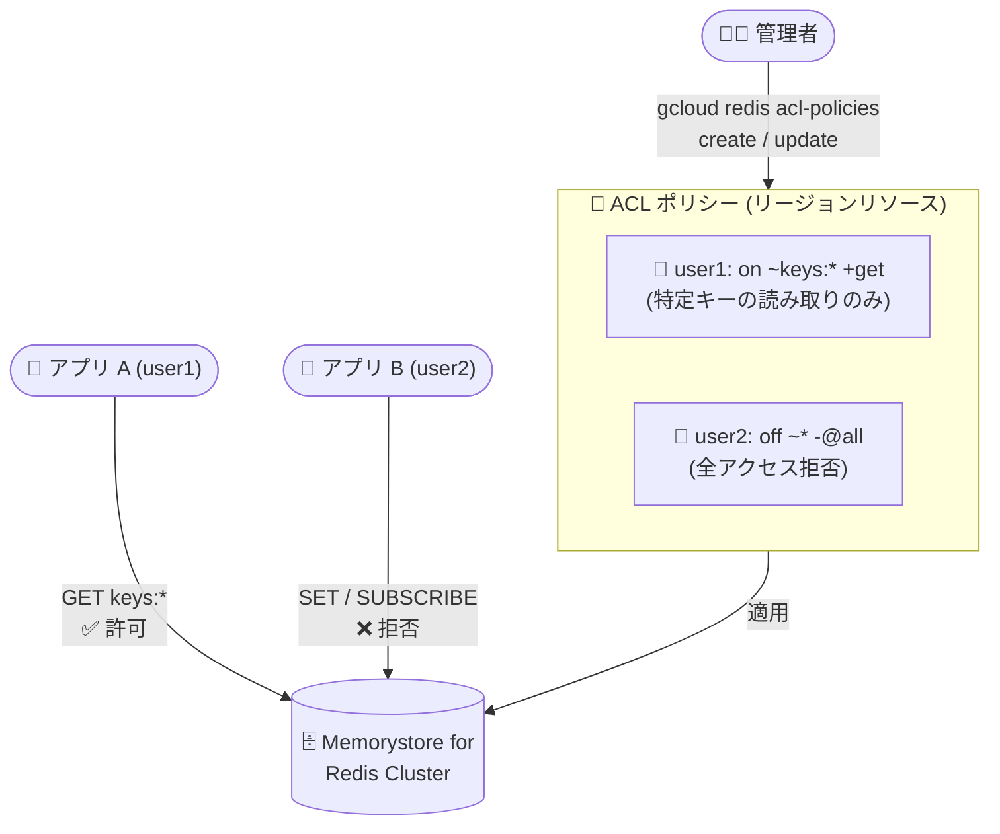

# Memorystore for Redis Cluster: アクセス制御リスト (ACL) ポリシーが GA に

**リリース日**: 2026-08-31

**サービス**: Memorystore for Redis Cluster

**機能**: アクセス制御リスト (ACL) ポリシーによるクラスタアクセスの保護

**ステータス**: GA (一般提供)

📊 [このアップデートのインフォグラフィックを見る](https://takech9203.github.io/google-cloud-news-summary/20260831-memorystore-redis-cluster-acl-ga.html)

## 概要

Memorystore for Redis Cluster で、アクセス制御リスト (ACL) ポリシーを使用してクラスタへのアクセスを保護する機能が一般提供 (GA) になりました。ACL ポリシーを定義することで、ユーザーやサービスアカウントがアクセスできる対象を特定のキー、コマンド、操作、Pub/Sub チャネルに制限する、きめ細かなセキュリティ制御を実現できます。

ACL ポリシーは `gcloud redis acl-policies` コマンドグループ (redis/v1 API) で管理するリージョンスコープのリソースです。ポリシーには「ユーザー名 + ACL ルール文字列」の組み合わせを複数登録でき、ルールの記法は Redis OSS の ACL 仕様に準拠します。ユーザー名には IAM ユーザーまたはサービスアカウントを指定でき、指定したユーザー名がそのまま Redis 側に設定されます。

複数のアプリケーションやチームが 1 つのクラスタを共有する環境で、最小権限の原則に基づいたデータプレーンのアクセス制御を求めるユーザーに特に有用なアップデートです。なお、同日に Memorystore for Valkey でも同様の ACL 機能が GA になっています (別レポートで解説)。

**アップデート前の課題**

- IAM によるアクセス制御は管理プレーン (クラスタの作成・更新・接続など) が中心で、データプレーンでキー単位・コマンド単位のきめ細かな制限を行う仕組みがなかった
- 公式のセキュリティベストプラクティスでは、ACL の実装をアプリケーション側の仲介レイヤーで行うことが推奨されており、ユーザー自身で制御ロジックを構築・運用する必要があった
- 接続を許可されたクライアントは、クラスタ内の広範なキーやコマンドにアクセスできてしまい、共有クラスタでの最小権限の徹底が困難だった

**アップデート後の改善**

- ACL ポリシーをマネージドなリソースとして作成し、ユーザーごとにアクセス可能なキーパターン、コマンド、操作、Pub/Sub チャネルを制限できるようになった
- Redis OSS 準拠の ACL ルール記法 (`on ~keys:* +get` など) をそのまま使用でき、既存の Redis 運用知識を活かせる
- `gcloud redis acl-policies` の create / update (add-rules / remove-rules / clear-rules) / delete / describe / list コマンドとリビジョン管理 (`revisions`) により、ポリシーのライフサイクルを CLI で一元管理できるようになった
- GA となったことで、本番ワークロードでの利用が可能になった

## アーキテクチャ図



管理者が ACL ポリシーにユーザーごとのルールを定義してクラスタに適用することで、各アプリケーション・サービスのアクセスを特定のキー、コマンド、操作、Pub/Sub チャネルに制限できます。

## サービスアップデートの詳細

### 主要機能

1. **きめ細かなアクセス制限**
   - ユーザーおよびサービスのアクセスを、特定のキー、コマンド、操作、Pub/Sub チャネルに制限可能
   - Redis OSS の ACL ルール記法に準拠したルール文字列で権限を表現 (例: `on ~keys:* +get`)

2. **ACL ポリシーのライフサイクル管理**
   - `gcloud redis acl-policies` コマンドグループで作成・更新・削除・一覧・詳細表示が可能
   - 更新時は `--rules` (全置換) に加え、`--add-rules` / `--remove-rules` / `--clear-rules` による差分更新に対応
   - `gcloud redis acl-policies revisions` によるポリシーリビジョンの管理に対応

3. **IAM ユーザー / サービスアカウントとの統合**
   - ルールの `username` には IAM ユーザーまたはサービスアカウントを指定
   - 指定したユーザー名は Redis OSS 側にそのまま設定される

## 技術仕様

### ACL ポリシーの構成要素

| 項目 | 詳細 |
|------|------|
| リソーススコープ | リージョン (`--region` で指定) |
| ルールの構成 | `username` (IAM ユーザー / サービスアカウント) + `rule` (ACL ルール文字列) |
| ルール記法 | Redis OSS の ACL 仕様に準拠 |
| 制限対象 | キー、コマンド、操作、Pub/Sub チャネル |
| 管理 API | redis/v1 API (GA)。beta / alpha 版コマンドも利用可能 |
| 冪等性 | `--request-id` による冪等なリクエストに対応 |

### ACL ルールの例

| ルール | 意味 |
|--------|------|
| `on ~keys:* +get` | ユーザーを有効化し、`keys:` プレフィックスのキーに対する GET コマンドのみ許可 |
| `off ~* -@all` | ユーザーを無効化し、すべてのコマンドを拒否 |

## 設定方法

### 前提条件

1. Memorystore for Redis Cluster のクラスタが作成済みであること
2. gcloud CLI が利用可能で、対象プロジェクト・リージョンに対する適切な IAM 権限があること

### 手順

#### ステップ 1: ACL ポリシーを作成する

```bash
gcloud redis acl-policies create my-acl-policy \
  --region=us-east1 \
  --rules="username=user1,rule='on ~keys:* +get'" \
  --rules="username=user2,rule='off ~* -@all'"
```

ユーザーごとのルールを含む ACL ポリシーを作成します。`--rules` フラグを複数回指定することで、複数のルールを 1 つのポリシーに登録できます。

#### ステップ 2: ACL ポリシーを確認する

```bash
# ポリシーの一覧
gcloud redis acl-policies list --region=us-east1

# ポリシーの詳細 (メタデータ) を表示
gcloud redis acl-policies describe my-acl-policy --region=us-east1
```

作成したポリシーの内容とメタデータを確認します。

#### ステップ 3: ACL ポリシーを更新する

```bash
# ルールを追加
gcloud redis acl-policies update my-acl-policy \
  --region=us-east1 \
  --add-rules="username=user3,rule='on ~cache:* +@read'"

# ルールを削除
gcloud redis acl-policies update my-acl-policy \
  --region=us-east1 \
  --remove-rules="username=user2,rule='off ~* -@all'"
```

運用中のポリシーに対して、ルールの追加・削除・全置換 (`--rules`)・全クリア (`--clear-rules`) が可能です。

## メリット

### ビジネス面

- **コンプライアンス対応の強化**: データプレーンでの最小権限の原則を実現でき、監査・セキュリティ要件への対応が容易になる
- **クラスタ共有によるコスト効率**: アクセス境界をポリシーで分離できるため、複数チーム・アプリケーションで 1 つのクラスタを安全に共有しやすくなる

### 技術面

- **アプリケーション側の実装不要**: 従来ベストプラクティスとして推奨されていた「アプリケーション仲介レイヤーでの ACL 実装」を、マネージドな ACL ポリシーで代替できる
- **Redis OSS 互換の記法**: 標準的な Redis ACL ルールをそのまま利用でき、学習コストが低い
- **宣言的な管理とリビジョン**: CLI / API でポリシーを宣言的に管理でき、リビジョン管理にも対応

## デメリット・制約事項

### 考慮すべき点

- ACL ポリシーはリージョンスコープのリソースであり、リージョンごとに管理が必要
- ルール文字列は Redis OSS の ACL 仕様に準拠するため、正しい権限設計には Redis ACL 記法の理解が必要
- ACL はネットワーク分離 (Private Service Connect) や IAM による管理プレーン制御を置き換えるものではなく、これらと組み合わせた多層防御として利用する

## ユースケース

### ユースケース 1: マルチテナントの共有キャッシュクラスタ

**シナリオ**: 複数のマイクロサービスが 1 つの Redis Cluster をキャッシュとして共有しており、各サービスが自分のキー空間 (プレフィックス) のみにアクセスできるようにしたい。

**実装例**:
```bash
gcloud redis acl-policies create shared-cache-policy \
  --region=asia-northeast1 \
  --rules="username=svc-a@project.iam.gserviceaccount.com,rule='on ~svc-a:* +@read +@write'" \
  --rules="username=svc-b@project.iam.gserviceaccount.com,rule='on ~svc-b:* +@read +@write'"
```

**効果**: サービス間のキー空間の分離が強制され、あるサービスの不具合や侵害が他サービスのデータに波及するリスクを低減できる。

### ユースケース 2: 読み取り専用アクセスの提供

**シナリオ**: 分析用のバッチジョブやダッシュボードには、特定のキーに対する読み取り専用アクセスのみを許可したい。

**効果**: 読み取り専用ユーザーによる誤った書き込みや危険なコマンド (FLUSHALL など) の実行を ACL レベルで防止できる。

## 料金

ACL ポリシー機能自体に関する追加料金の記載はリリースノートにはありません。Memorystore for Redis Cluster の料金の詳細は、公式の料金ページを参照してください。

- [Memorystore for Redis Cluster 料金ページ](https://cloud.google.com/memorystore/docs/cluster/pricing)

## 利用可能リージョン

ACL ポリシーはリージョンリソースとして作成します。Memorystore for Redis Cluster が利用可能なリージョンについては、[公式ドキュメント](https://cloud.google.com/memorystore/docs/cluster)を参照してください。

## 関連サービス・機能

- **Memorystore for Valkey**: 同日 (2026-08-31) に同様の ACL ポリシー機能が GA になっている (別レポートで解説)
- **IAM (Identity and Access Management)**: 管理プレーン (クラスタの作成・更新・接続権限など) のアクセス制御を担う。ACL はデータプレーンのきめ細かな制御を補完する
- **Private Service Connect**: クラスタへのネットワークアクセスを制限する接続基盤。ACL と組み合わせることで多層防御を構成できる
- **トークンベース認証 (Preview)**: 2026-08-10 に Google Cloud コンソールからの基本的なトークンベース認証が Preview として発表されており、認証・認可機能の強化が続いている

## 参考リンク

- 📊 [インフォグラフィック](https://takech9203.github.io/google-cloud-news-summary/20260831-memorystore-redis-cluster-acl-ga.html)
- [公式リリースノート](https://docs.cloud.google.com/release-notes#August_31_2026)
- [Memorystore for Redis Cluster リリースノート](https://docs.cloud.google.com/memorystore/docs/cluster/release-notes)
- [gcloud redis acl-policies リファレンス](https://docs.cloud.google.com/sdk/gcloud/reference/redis/acl-policies)
- [Memorystore for Redis Cluster セキュリティ概要](https://docs.cloud.google.com/memorystore/docs/cluster/security-overview)
- [Access control with IAM (Memorystore for Redis Cluster)](https://docs.cloud.google.com/memorystore/docs/cluster/access-control)
- [Redis OSS ACL ドキュメント](https://redis.io/docs/latest/operate/oss_and_stack/management/security/acl/)
- [料金ページ](https://cloud.google.com/memorystore/docs/cluster/pricing)

## まとめ

Memorystore for Redis Cluster の ACL ポリシーが GA となり、これまでアプリケーション側で実装する必要があったキー・コマンド単位のきめ細かなアクセス制御を、マネージドなポリシーとして本番環境で利用できるようになりました。共有クラスタを運用しているチームは、`gcloud redis acl-policies` でポリシーを定義し、最小権限の原則に基づいたデータプレーンのアクセス制御への移行を検討することを推奨します。

---

**タグ**: #Memorystore #Redis #ACL #セキュリティ #アクセス制御 #GA
