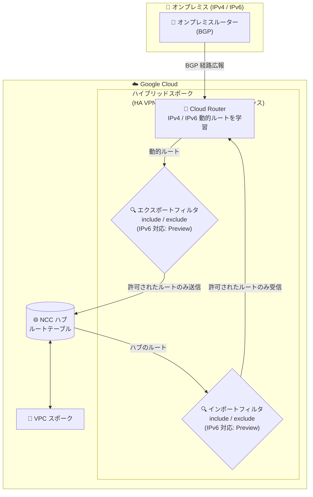

# Network Connectivity Center: ハイブリッドスポークのスポークフィルタが IPv6 動的ルートをサポート (Preview)

**リリース日**: 2026-08-31

**サービス**: Network Connectivity Center

**機能**: ハイブリッドスポークの include / exclude スポークフィルタにおける IPv6 動的ルートサポート

**ステータス**: Preview

📊 [このアップデートのインフォグラフィックを見る](https://takech9203.github.io/google-cloud-news-summary/20260831-network-connectivity-center-ipv6-spoke-filters.html)

## 概要

Network Connectivity Center (NCC) のハイブリッドスポーク (Cloud VPN トンネル、Cloud Interconnect VLAN アタッチメント、Router アプライアンス) において、include / exclude スポークフィルタが IPv6 動的ルートをサポートするようになりました。本機能は Preview として提供されます。

スポークフィルタは、同一のハブに接続されたスポーク間で NCC が交換できるルートを管理する仕組みです。エクスポートフィルタは、スポークがハブに送信できるサブネットまたはルートを制御し、インポートフィルタは、スポークがハブから受け入れられるサブネットまたはルートを制御します。今回のアップデートにより、これらのフィルタリング制御を IPv6 の動的ルートに対しても適用できるようになりました。

このアップデートは、オンプレミス環境と Google Cloud をハイブリッド接続で結び、デュアルスタック (IPv4/IPv6) 環境への移行や IPv6 ネットワークの運用を進めているネットワーク管理者にとって重要な機能強化です。

**アップデート前の課題**

これまでハイブリッドスポークのスポークフィルタは IPv4 のみに対応していました。

- ハイブリッドスポークのエクスポートフィルタは IPv4 動的ルートのみをサポートしており、BGP で学習した IPv6 動的ルートのハブへの伝播を選択的に制御できなかった
- ハイブリッドスポークのインポートフィルタは IPv4 アドレス範囲のみをサポートしており、ハブから受け入れる IPv6 ルートを絞り込めなかった
- IPv6 を含むハイブリッド環境では、ルート交換の粒度の高い制御が IPv4 に限定されていた

**アップデート後の改善**

- ハイブリッドスポークの include / exclude エクスポートフィルタで、ハブに送信する IPv6 動的ルートを制御できるようになった (Preview)
- ハイブリッドスポークの include / exclude インポートフィルタで、ハブから受け入れる IPv6 ルートを制御できるようになった (Preview)
- IPv4 と IPv6 の両方について、ハイブリッド環境でのルート交換ポリシーを一貫して定義できるようになった

## アーキテクチャ図



ハイブリッドスポークで BGP により学習した IPv4/IPv6 動的ルートは、エクスポートフィルタを通過したものだけが NCC ハブのルートテーブルに送信され、ハブからのルートはインポートフィルタを通過したものだけがスポーク側で受け入れられます。

## サービスアップデートの詳細

### 主要機能

1. **IPv6 動的ルートのエクスポートフィルタ (Preview)**
   - ハイブリッドスポークが BGP で学習した IPv6 動的ルートのうち、NCC ハブのルートテーブルに送信するものを include / exclude で制御できる
   - これまでハイブリッドスポークのエクスポートフィルタは IPv4 動的ルートのみをサポートしていた

2. **IPv6 動的ルートのインポートフィルタ (Preview)**
   - ハブのルートテーブルからハイブリッドスポークのルーティング VPC ネットワークが受け入れる IPv6 ルートを include / exclude で制御できる
   - これまでハイブリッドスポークのインポートフィルタは IPv4 アドレス範囲のみをサポートしていた

3. **ハイブリッドスポーク全種別への適用**
   - ハイブリッドスポークには HA VPN トンネル、Cloud Interconnect VLAN アタッチメント、Router アプライアンスの各スポークタイプが含まれる
   - VPC スポークのエクスポートフィルタは従来から IPv4 / IPv6 サブネット範囲の両方をサポートしている (インポートフィルタは VPC スポーク非対応)

## 技術仕様

### スポークフィルタの構成要素

| 項目 | 詳細 |
|------|------|
| include export ranges | ハブに送信を許可するルート範囲。`--include-export-ranges` フラグ / `includeExportRanges` フィールドで指定 |
| exclude export ranges | ハブへの送信を禁止するルート範囲。`--exclude-export-ranges` フラグ / `excludeExportRanges` フィールドで指定 |
| include import ranges | ハブから受け入れを許可するルート範囲。`--include-import-ranges` フラグ / `includeImportRanges` フィールドで指定 |
| exclude import ranges | ハブからの受け入れを禁止するルート範囲。`--exclude-import-ranges` フラグ / `excludeImportRanges` フィールドで指定 |
| CIDR 数の上限 | 各リストにつき最大 16 個の一意で重複しない CIDR (リスト内の CIDR は相互に包含・一致不可) |
| exclude と include の関係 | exclude ranges に指定する CIDR は、include ranges (または既定の include ranges) に完全に包含されている必要がある。exclude が include より優先される |

### ハイブリッドスポークのエクスポートフィルタ評価ルール

動的ルートがハブに送信されるかどうかは、以下のルールで決まります。

| シナリオ | 結果 |
|------|------|
| 動的ルートが include export ranges のいずれにも完全に包含されない | ハブに送信されない |
| 動的ルートが include export ranges と交差するが完全には包含されない | ハブに送信されない |
| 動的ルートが include export ranges に完全に包含され、exclude export ranges と交差しない | ハブに送信される |
| 動的ルートが include export ranges に包含されるが、exclude export ranges と交差する | ハブに送信されない |

### 必要な IAM 権限

| 項目 | 詳細 |
|------|------|
| 権限 | `networkconnectivity.spokes.update` (スポークの更新時) |
| ロール | Spoke Admin (`roles/networkconnectivity.spokeAdmin`) または Hub & Spoke Admin (`roles/networkconnectivity.hubAdmin`) |

## 設定方法

### 前提条件

1. Network Connectivity API が有効化されていること
2. NCC ハブおよびハイブリッドスポーク (HA VPN トンネル / VLAN アタッチメント / Router アプライアンス) が構成されている、または新規作成すること
3. スポークの作成・更新に必要な IAM ロール (Spoke Admin または Hub & Spoke Admin) が付与されていること

### 手順

#### ステップ 1: フィルタを指定してハイブリッドスポークを作成する

```bash
# 例: HA VPN トンネルを含むスポークをフィルタ付きで作成
gcloud network-connectivity spokes linked-vpn-tunnels create SPOKE_NAME \
    --hub=HUB_NAME \
    --vpn-tunnels=TUNNEL_NAME,TUNNEL_NAME_2 \
    --region=REGION \
    --include-export-ranges=[INCLUDE_EXPORT_RANGES,...] \
    --exclude-export-ranges=[EXCLUDE_EXPORT_RANGES,...] \
    --include-import-ranges=[INCLUDE_IMPORT_RANGES,...] \
    --exclude-import-ranges=[EXCLUDE_IMPORT_RANGES,...]
```

VLAN アタッチメントの場合は `linked-interconnect-attachments create`、Router アプライアンスの場合は `linked-router-appliances create` コマンドを使用します。

#### ステップ 2: 既存のハイブリッドスポークのフィルタを更新する

```bash
# 例: Router アプライアンススポークのフィルタを更新
gcloud network-connectivity spokes linked-router-appliances update SPOKE_NAME \
    --region=LOCATION \
    --include-export-ranges=[INCLUDE_EXPORT_RANGES,...] \
    --exclude-export-ranges=[EXCLUDE_EXPORT_RANGES,...] \
    --include-import-ranges=[INCLUDE_IMPORT_RANGES,...] \
    --exclude-import-ranges=[EXCLUDE_IMPORT_RANGES,...]
```

IPv6 動的ルートに対するフィルタ指定の詳細な構文や Preview 機能の利用条件は、最新の公式ドキュメント ([スポークフィルタの概要](https://cloud.google.com/network-connectivity/docs/network-connectivity-center/concepts/spoke-filters-overview)) を確認してください。

## メリット

### ビジネス面

- **IPv6 移行の推進**: デュアルスタック環境やIPv6 ネットワークへの移行時にも、IPv4 と同等のルート制御ポリシーを維持でき、ハイブリッドクラウド全体での IPv6 採用を進めやすくなる
- **セキュリティとコンプライアンスの向上**: 必要な IPv6 ルートのみをハブと交換することで、意図しないネットワーク到達性を防ぎ、最小権限のネットワーク設計を IPv6 にも適用できる

### 技術面

- **粒度の高いルート制御**: include / exclude の組み合わせにより、特定の IPv6 プレフィックスのみを許可またはブロックする柔軟なフィルタリングが可能
- **IPv4 / IPv6 で一貫した運用**: 同一のフィルタ機構 (同じ gcloud フラグ / API フィールド) で IPv4 と IPv6 の両方を管理でき、運用の複雑さを抑えられる
- **ルートテーブルの肥大化抑制**: 不要な IPv6 動的ルートのハブへの伝播を抑えることで、ハブあたりの動的ルート数クォータの消費を管理しやすくなる

## デメリット・制約事項

### 制限事項

- 本機能は Preview であり、GA 前の機能には SLA が適用されない場合がある
- 各フィルタリスト (include / exclude、export / import) には最大 16 個の一意で重複しない CIDR という上限がある
- exclude ranges の CIDR は include ranges に完全に包含されている必要があり、exclude ranges ではキーワードを使用できない
- 動的ルートは include export range に「完全に包含」されている場合のみ送信対象となり、部分的に交差するだけのルートは送信されない

### 考慮すべき点

- ハイブリッドスポークのインポートフィルタの既定値は、サイト間データ転送の有効/無効によって異なるため、明示的に include import ranges を指定することが推奨されている
- Preview 段階では機能仕様が変更される可能性があるため、本番環境への適用前に最新ドキュメントで挙動を確認する必要がある
- フィルタ設定を誤ると必要なルートが交換されず接続断が発生するため、既存環境への適用時は影響範囲の事前確認が重要

## ユースケース

### ユースケース 1: デュアルスタック環境でのオンプレミス IPv6 ルートの選択的広報

**シナリオ**: オンプレミスデータセンターが IPv4 / IPv6 のデュアルスタックで運用されており、Cloud Interconnect 経由で NCC ハブに接続している。オンプレミス側の多数の IPv6 プレフィックスのうち、Google Cloud との通信に必要なプレフィックスのみをハブに広報したい。

**実装例**:
```bash
gcloud network-connectivity spokes linked-interconnect-attachments update onprem-spoke \
    --region=asia-northeast1 \
    --include-export-ranges=<許可する IPv6 プレフィックス>
```

**効果**: 必要な IPv6 ルートのみがハブのルートテーブルに登録され、他のスポークから到達可能な範囲を最小化できる。

### ユースケース 2: 特定 IPv6 セグメントのハブからの受け入れ制限

**シナリオ**: 複数拠点を NCC ハブで接続しているマルチサイト構成で、特定拠点のハイブリッドスポークには本番系の IPv6 セグメントのルートだけを受け入れさせ、開発系セグメントへの到達性を持たせたくない。

**効果**: インポートフィルタの include / exclude により、拠点ごとに受け入れる IPv6 ルートを制御し、環境分離をネットワークルーティングレベルで実現できる。

## 料金

NCC の料金は、スポークがアクティブな時間に基づくスポークアワー課金と、スポークから発信されるアウトバウンドトラフィックに対する課金で構成されます。スポークアワーはスポークリソースが存在するプロジェクトに課金され、スポークが ACTIVE 状態の場合にのみ発生します。

スポークフィルタの IPv6 対応自体に固有の追加料金が発生するかどうかは、リリースノートおよびドキュメントに記載がありません。詳細は [NCC 料金ページ](https://cloud.google.com/network-connectivity/pricing#ncc-pricing) を参照してください。

## 利用可能リージョン

リリースノートにはリージョンに関する記載はありません。最新の対応状況は[公式ドキュメント](https://cloud.google.com/network-connectivity/docs/network-connectivity-center/concepts/spoke-filters-overview)を参照してください。

## 関連サービス・機能

- **Cloud Router**: ハイブリッドスポークで BGP により動的ルートを学習・広報するコンポーネント。スポークフィルタは Cloud Router が学習した動的ルートに対して適用される
- **Cloud VPN (HA VPN)**: ハイブリッドスポークの接続手段の 1 つ。VPN トンネルをスポークとしてハブに接続する
- **Cloud Interconnect**: VLAN アタッチメントをハイブリッドスポークとしてハブに接続し、オンプレミスとの専用線接続を提供する
- **Router アプライアンス**: サードパーティ製ネットワーク仮想アプライアンスをスポークとして NCC に統合する機能
- **VPC (Virtual Private Cloud)**: VPC スポークとしてハブに接続。VPC スポークのエクスポートフィルタは従来から IPv4 / IPv6 サブネット範囲に対応している

## 参考リンク

- 📊 [インフォグラフィック](https://takech9203.github.io/google-cloud-news-summary/20260831-network-connectivity-center-ipv6-spoke-filters.html)
- [公式リリースノート](https://docs.cloud.google.com/release-notes#August_31_2026)
- [スポークフィルタの概要](https://cloud.google.com/network-connectivity/docs/network-connectivity-center/concepts/spoke-filters-overview)
- [ハブとスポークの操作](https://cloud.google.com/network-connectivity/docs/network-connectivity-center/how-to/working-with-hubs-spokes)
- [料金ページ](https://cloud.google.com/network-connectivity/pricing#ncc-pricing)

## まとめ

このアップデートにより、NCC のハイブリッドスポークにおけるルート交換制御が IPv6 動的ルートにも拡張され、デュアルスタック / IPv6 環境のハイブリッドクラウド設計で IPv4 と一貫したルーティングポリシーを適用できるようになりました。IPv6 を利用中または導入予定のハイブリッド接続環境では、Preview 段階で挙動を検証し、スポークフィルタによる最小権限のルート交換設計を検討することを推奨します。

---

**タグ**: Network Connectivity Center, NCC, IPv6, スポークフィルタ, ハイブリッド接続, Cloud Router, ネットワーキング, Preview
