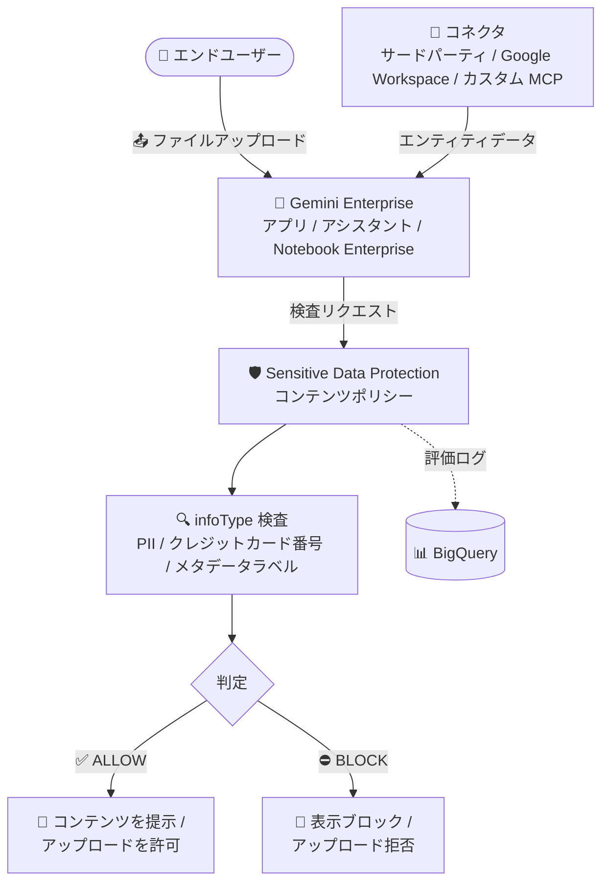

# Sensitive Data Protection: コンテンツポリシーが GA (Gemini Enterprise 統合対応)

**リリース日**: 2026-08-31

**サービス**: Sensitive Data Protection / Gemini Enterprise

**機能**: コンテンツポリシー (Content Policies) の一般提供開始と Gemini Enterprise 統合

**ステータス**: GA (General Availability)

📊 [このアップデートのインフォグラフィックを見る](https://takech9203.github.io/google-cloud-news-summary/20260831-sensitive-data-protection-content-policies-ga.html)

## 概要

Sensitive Data Protection の**コンテンツポリシー (Content Policies)** が一般提供 (GA) になりました。コンテンツポリシーは再利用可能なリソースで、コンテンツを検査してデータの機微性に基づき **ALLOW (許可)** または **BLOCK (ブロック)** の単一の判定 (verdict) を返します。従来の `content.inspect` 呼び出しや検査ジョブが検出結果 (findings) のリストを返すのに対し、コンテンツポリシーは即座にアクション可能な判定を返すため、リアルタイムのデータ保護チェックをワークフローに直接組み込めます。

同日、コンテンツポリシーの **Gemini Enterprise 統合**も GA として発表されました。Sensitive Data Protection のコンテンツポリシーを Gemini Enterprise のコネクタ、アプリ、および Gemini Notebook Enterprise のノートブックに適用できます。これにより、アプリが機密情報をユーザーに提示することをブロックし、エンドユーザーが機密情報を含むファイルをアップロードすることを防止できます。

対象ユーザーは、生成 AI アプリケーションや社内チャットボット、Gemini Enterprise を利用する組織のセキュリティ管理者・データガバナンス担当者です。クレジットカード番号や個人識別情報 (PII) などの機密データが AI システムに取り込まれたりユーザーに表示されたりすることを、ポリシーベースで自動的に防げます。

**アップデート前の課題**

- Sensitive Data Protection の検査 (content.inspect や検査ジョブ) は検出結果のリストを返すのみで、許可/ブロックの判断ロジックはクライアントアプリケーション側で個別に実装する必要があった
- チャットボットの応答やファイルアップロードに含まれる機密情報を同期的に検査し、その場でブロックする標準化された仕組みがなかった
- Gemini Enterprise のコネクタやファイルアップロードに対して、機密データの流入・表示をポリシーで一元的に制御する統合機能がなかった

**アップデート後の改善**

- コンテンツポリシーが単一の ALLOW / BLOCK 判定を返すため、クライアントアプリケーションは判定に従って許可・ブロックするだけでよくなった
- チャットボット応答やファイルアップロード、AI モデルのトレーニングデータセットへのデータ投入可否など、同期的な判定が必要なユースケースに標準機能で対応できるようになった
- Gemini Enterprise のコネクタ・アプリ・Gemini Notebook Enterprise にコンテンツポリシーを適用し、機密データの表示防止とアップロードブロックを実現できるようになった
- ポリシー評価結果を BigQuery テーブルにログとして記録できるようになった

## アーキテクチャ図



Gemini Enterprise のコネクタデータやユーザーのファイルアップロードを Sensitive Data Protection のコンテンツポリシーが検査し、最初にマッチしたルールに基づいて ALLOW または BLOCK の判定を返すフローです。判定結果はオプションで BigQuery にログ記録できます。

## サービスアップデートの詳細

### 主要機能

1. **ALLOW / BLOCK の単一判定 (verdict)**
   - 検出結果のリストではなく、単一の ALLOW または BLOCK 判定を返す
   - クライアントアプリケーションは判定に基づいてコンテンツの許可・ブロックを即座に実行できる
   - 組織のデータポリシーを同期的に強制できる

2. **コンテンツポリシーの構成要素**
   - **検査構成 (Inspection configuration)**: 組み込みまたはカスタムの infoType 検出器を使用して、スキャン対象の機密データを定義
   - **ポリシールールのリスト**: 順序付きのルールリスト。各ルールは条件とアクション (判定) を指定し、最初にマッチしたルールが判定を決定する
   - **デフォルトアクション**: ファイルがスキャンできない場合や、どのルールにもマッチしなかった場合の判定を指定 (デフォルトはいずれも ALLOW)
   - **ロギング構成 (オプション)**: ポリシー評価の結果を BigQuery テーブルに記録 (スキーマは `ContentPolicyActionLog`)

3. **Gemini Enterprise 統合 (GA)**
   - コネクタへの適用: 機密コンテンツを含むエンティティデータを Gemini Enterprise が返すことを防止
   - ファイルアップロードへの適用: ローカルドライブ、Google Drive、Microsoft OneDrive からアシスタントや Gemini Notebook Enterprise へのアップロード時にスキャンし、ポリシー違反のファイルをブロック
   - メタデータラベル検査: Microsoft の秘密度ラベル (MSIP/AIP/MIP) や Google Workspace ラベルに基づく検出に対応

4. **Model Armor との多層防御**
   - Sensitive Data Protection は**流入データ (inbound data)** を保護し、機密データの取り込み・インデックス化・表示を防止
   - Model Armor は**サービングパス**を保護し、LLM 処理前のプロンプトとユーザーへの配信前のモデル応答をスクリーニング (プロンプトインジェクションや悪意ある URL への対策)
   - 両者を組み合わせることで Gemini Enterprise に多層的なセキュリティ防御を構成できる

## 技術仕様

### コンテンツポリシーの制限 (ファイルサイズ上限)

| ファイル種別 | 最大サイズ |
|------|------|
| PDF (単一ファイル) | 50 MB |
| Microsoft Word (単一ファイル) | 30 MB |
| Microsoft PowerPoint (単一ファイル) | 30 MB |
| Microsoft Excel (単一ファイル) | 30 MB |
| プレーンテキスト / 画像 (単一ファイル) | 10 MB |

サイズ超過ファイルに割り当てる判定 (ALLOW / BLOCK) はポリシー構成で指定できます。デフォルトでは大きなファイルのコンテンツは許可されますが、ブロックするよう構成することも可能です。

### Gemini Enterprise 統合で検査可能なソース

| ソース | 詳細 |
|------|------|
| サードパーティコネクタ | インジェスト型・フェデレーション型の両方に対応 |
| カスタム MCP サーバー | カスタム Model Context Protocol (MCP) サーバーのコンテンツに対応 |
| Google Workspace コネクタ | Google Calendar、Google Chat、Google Drive、Gmail |
| メタデータラベル | Microsoft 秘密度ラベル (SharePoint、OneDrive、Outlook、Teams など)、Google Workspace ラベル |
| ファイルアップロード | PDF、HTML、プレーンテキスト、JSON、DOCX、PPTX、XLSX、XLSM、XML、画像 (BMP/GIF/JPEG/PNG/TIFF/SVG)、CSV、TSV |

### コンテンツポリシー作成の REST API 例

リージョナルエンドポイント (`dlp.REGION.rep.googleapis.com`) に対して `projects.locations.contentPolicies.create` メソッドを呼び出します。以下はクレジットカード番号を検出した場合に BLOCK を返すポリシーの例です。

```json
{
  "contentPolicy": {
    "displayName": "block-credit-cards",
    "inspectConfig": {
      "infoTypes": [{ "name": "CREDIT_CARD_NUMBER" }]
    },
    "rules": [
      {
        "conditions": [{ "infoTypeCondition": { "anyInfoType": {} } }],
        "action": { "returnVerdict": "BLOCK" }
      }
    ],
    "unsupportedFileType": { "returnVerdict": "BLOCK" },
    "inputTooLarge": { "returnVerdict": "BLOCK" },
    "failedToScanSupportedFileType": { "returnVerdict": "BLOCK" },
    "defaultAction": { "returnVerdict": "ALLOW" },
    "loggingConfigs": [
      {
        "logToBigQuery": {
          "projectId": "LOG_PROJECT_ID",
          "datasetId": "LOG_DATASET_ID",
          "tableId": "LOG_TABLE_ID"
        }
      }
    ]
  },
  "contentPolicyId": "block-credit-cards-policy"
}
```

## 設定方法

### 前提条件 (Gemini Enterprise 統合の場合)

1. **Gemini Enterprise Admin** ロールが付与されていること
2. Gemini Enterprise のサービスアカウントに **DLP User (`roles/dlp.user`)** ロールが付与されていること
3. Gemini Enterprise アプリが作成済み、または Gemini Notebook Enterprise が構成済みであること
4. コンテンツポリシーは、適用先のアプリと**同じリージョン**に作成すること

### 手順

#### ステップ 1: コンテンツポリシーを作成する

```bash
# ポリシー定義を content-policy-create-request.json に保存し、REST API で作成
curl -X POST \
  -H "Authorization: Bearer $(gcloud auth print-access-token)" \
  -H "x-goog-user-project: PROJECT_ID" \
  -H "Content-Type: application/json; charset=utf-8" \
  -d @content-policy-create-request.json \
  "https://dlp.REGION.rep.googleapis.com/v2/projects/PROJECT_ID/locations/REGION/contentPolicies"
```

Google Cloud コンソールからも作成できます。検査構成 (infoType)、ポリシールール (Allow / Block とその条件)、デフォルトアクション、BigQuery へのロギング構成をウィザード形式で設定します。

#### ステップ 2: Gemini Enterprise コネクタにポリシーを適用する

1. Google Cloud コンソールで **Gemini Enterprise** ページに移動し、**Data Stores** をクリック
2. ポリシーを適用するコネクタの名前をクリック
3. **Content policy** フィールドに、ポリシーの完全なリソース名 (`projects/PROJECT_ID/locations/LOCATION/contentPolicies/POLICY_ID`) を入力

入力するとポリシーは即座に適用されます。解除する場合は同フィールドを空にします。

#### ステップ 3: (オプション) ポリシーの動作をテストする

コネクタ内にポリシー違反のデータがある場合、アシスタントにそのデータについて質問し、ブロックされることを確認します。

## メリット

### ビジネス面

- **コンプライアンスの強化**: PII やクレジットカード番号などの機密データが AI アプリ経由でユーザーに露出したり、システムに取り込まれたりすることをポリシーで防止できる
- **責任ある AI 運用**: Gemini Enterprise アプリのセキュリティと安全性を高め、機密・不適切なソース素材をブロックすることで責任ある AI プラクティスを実現できる
- **追加コストなし**: Gemini Enterprise での Sensitive Data Protection 利用に追加コストはかからない

### 技術面

- **同期的な判定**: findings のリストではなく単一の ALLOW / BLOCK 判定が返るため、クライアント側の判断ロジック実装が不要になる
- **再利用可能なリソース**: 1 つのポリシーを複数のコネクタやアプリに適用でき、ポリシー管理を一元化できる
- **監査可能性**: ポリシー評価結果を BigQuery にログ記録し、ブロック状況の分析・監査に活用できる
- **豊富な検査対象**: テキスト (画像の OCR を含む)、画像オブジェクト検出、画像の安全性、埋め込み画像を含むリッチドキュメント (PDF/DOCX/PPTX/XLSX)、メタデータラベルまで検査できる

## デメリット・制約事項

### 制限事項

- コンテンツポリシーは旧タイプのデータストア (Cloud Storage、BigQuery、ウェブサイトのデータ) には適用できない。エンティティデータを含むコネクタのみが保護対象
- 別プロジェクトのポリシーを Gemini Enterprise に適用する場合、両プロジェクトは同一の VPC Service Controls 境界内にある必要がある
- Gemini Notebook Enterprise ノートブックへのアップロードでは、Google Workspace ラベルとコンテンツスキャンはサポートされない
- 動画・音声ファイルはアシスタントにアップロードできるが、Sensitive Data Protection はスキャンしない
- Microsoft コネクタ内の暗号化ファイルは復号できないためスキャンされない
- Gemini Enterprise の Business エディションでは利用できない (それ以外のエディションで利用可能)

### 考慮すべき点

- コンテンツポリシーの適用によりレイテンシが増加する可能性がある
- ルールは順序評価であり、最初にマッチしたルールが判定を決定するため、ルールの順序設計が重要
- スキャン不能ファイル (非対応形式、サイズ超過、破損、暗号化) のデフォルト判定は ALLOW のため、厳格な運用ではこれらを BLOCK に変更する検討が必要

## ユースケース

### ユースケース 1: チャットボット応答・ファイルアップロードの機密データブロック

**シナリオ**: 社内チャットボットや Gemini Enterprise アシスタントで、クレジットカード番号や PII を含む応答やファイルアップロードを自動的にブロックしたい。

**実装例**:
```text
1. CREDIT_CARD_NUMBER や PII 系 infoType を検査構成に指定したコンテンツポリシーを作成
2. ポリシールールで「任意の infoType 検出時に BLOCK」を設定
3. Gemini Enterprise のコネクタ / アプリにポリシーのリソース名を設定
4. BigQuery ロギングを有効化してブロック状況をモニタリング
```

**効果**: 機密情報を含むコンテンツの表示・アップロードが自動的にブロックされ、情報漏えいリスクを低減できる。

### ユースケース 2: AI モデルのトレーニングデータセットのゲートキーピング

**シナリオ**: AI モデルのトレーニングデータセットに特定の種類のデータを含めてよいかを、投入前に判定したい。

**効果**: データセットへの投入可否を ALLOW / BLOCK の判定で自動化でき、機密データの混入をパイプラインの入口で防止できる。

### ユースケース 3: Microsoft 秘密度ラベル・Google Workspace ラベルに基づく制御

**シナリオ**: SharePoint や OneDrive、Google Drive 上の「Highly Confidential」「Internal Only」などのラベルが付与されたファイルを、Gemini Enterprise が参照・提示しないようにしたい。

**効果**: コンテンツの中身だけでなくメタデータラベルに基づいた検出・ブロックが可能になり、既存のデータ分類体系をそのまま AI ガバナンスに活用できる。

## 料金

Gemini Enterprise での Sensitive Data Protection コンテンツポリシーの利用に**追加コストはかかりません** (Gemini Enterprise Business エディションを除く全エディションで利用可能)。

Sensitive Data Protection 自体の料金の詳細は、公式の料金ページを参照してください。

- [Sensitive Data Protection の料金](https://cloud.google.com/sensitive-data-protection/pricing)

## 利用可能リージョン

- コンテンツポリシーは Sensitive Data Protection のリージョナルエンドポイント (`dlp.REGION.rep.googleapis.com`) で作成します。対応リージョンは [Sensitive Data Protection のロケーション](https://docs.cloud.google.com/sensitive-data-protection/docs/locations)を参照してください
- Gemini Enterprise 統合では、**global、EU、US のマルチリージョン**がサポートされます
- コンテンツポリシーは適用先のアプリと同じリージョンに作成する必要があります

## 関連サービス・機能

- **Gemini Enterprise**: コネクタ・アプリ・Gemini Notebook Enterprise にコンテンツポリシーを適用し、機密データの表示・アップロードをブロックする統合先
- **Model Armor**: サービングパス (プロンプトとモデル応答) を保護する補完サービス。Sensitive Data Protection の流入データ保護と組み合わせて多層防御を構成
- **BigQuery**: ポリシー評価結果 (ALLOW / BLOCK の判定ログ) の記録先
- **VPC Service Controls**: プロジェクトをまたいでポリシーを適用する場合に同一境界内であることが必要
- **infoType 検出器**: 組み込み・カスタムの infoType 検出器を検査構成で使用 (例: `CREDIT_CARD_NUMBER`、カスタムメタデータラベル検出器)

## 参考リンク

- 📊 [インフォグラフィック](https://takech9203.github.io/google-cloud-news-summary/20260831-sensitive-data-protection-content-policies-ga.html)
- [公式リリースノート](https://docs.cloud.google.com/release-notes#August_31_2026)
- [コンテンツポリシーの概要](https://docs.cloud.google.com/sensitive-data-protection/docs/content-policy)
- [コンテンツポリシーの作成と管理](https://docs.cloud.google.com/sensitive-data-protection/docs/manage-content-policies)
- [Gemini Enterprise: ソース内の機密データの保護](https://docs.cloud.google.com/gemini/enterprise/docs/protect-sensitive-data)
- [Gemini Notebook Enterprise: ソース内の機密データの保護](https://docs.cloud.google.com/gemini/enterprise/notebooklm-enterprise/docs/protect-sensitive-data)
- [コンテンツポリシーの制限](https://docs.cloud.google.com/sensitive-data-protection/limits#content-policy-limits)
- [料金ページ](https://cloud.google.com/sensitive-data-protection/pricing)

## まとめ

Sensitive Data Protection のコンテンツポリシーが GA となり、機密データの検査結果を単一の ALLOW / BLOCK 判定として返すリアルタイムのデータ保護が標準機能で実現できるようになりました。同時に GA となった Gemini Enterprise 統合により、コネクタ経由の機密データ表示やポリシー違反ファイルのアップロードをポリシーベースで自動的にブロックできます。Gemini Enterprise を運用する組織は、追加コストなしで利用できるこの機能と Model Armor を組み合わせた多層防御の導入を検討することを推奨します。

---

**タグ**: #SensitiveDataProtection #DLP #GeminiEnterprise #GA #セキュリティ #データ保護 #コンテンツポリシー #生成AI
