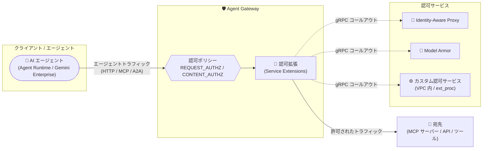

# Service Extensions: Agent Gateway の認可委譲サポートが一般提供 (GA)

**リリース日**: 2026-08-31

**サービス**: Service Extensions

**機能**: Agent Gateway における Service Extensions を使った認可委譲

**ステータス**: GA (一般提供)

📊 [このアップデートのインフォグラフィックを見る](https://takech9203.github.io/google-cloud-news-summary/20260831-service-extensions-agent-gateway-ga.html)

## 概要

Agent Gateway が Service Extensions をサポートし、エージェントトラフィックのリクエストを評価して、認可判断を Google サービス (Identity-Aware Proxy や Model Armor など) またはカスタム認可サービスに委譲できる機能が一般提供 (GA) になりました。

Agent Gateway は、AI エージェント通信のための集中型ネットワーキングとガバナンスを提供するコンポーネントで、エージェントとツール (サードパーティの MCP サーバーなど) 間のトラフィックにアクセス制御とセキュリティポリシーを適用できます。今回 GA となった認可拡張 (authorization extension) は、Agent Gateway デプロイメントを通過するリクエストをインターセプトして評価し、ユーザーが管理する外部サービスへリアルタイムの gRPC 呼び出しを行うことで、トラフィックが宛先に到達する前に検査・変更・ブロックを可能にします。

エージェントプラットフォームを運用するプラットフォームチームやセキュリティチームが対象で、アプリケーションコードを変更することなく、エージェントトラフィックに対する集中的なアクセス制御とコンテンツセーフティ (プロンプトガードレール、機密データのサニタイズなど) を実現できます。

**アップデート前の課題**

- 認可ポリシー (authorization policy) の宣言的な記述だけでは表現できない複雑な認可判断 (外部の認可エンジンによる動的な判定など) を Agent Gateway 上で実装する標準的な手段がなかった
- エージェントと MCP サーバー間のトラフィックに対して、Model Armor によるコンテンツ検査や IAP によるアクセス判定をゲートウェイレイヤーで一元的に組み込むには、個々のエージェントやアプリケーション側での対応が必要だった

**アップデート後の改善**

- 認可拡張により、Agent Gateway を通過するリクエストの認可判断を IAP・Model Armor などの Google サービス、または独自のカスタム認可サービスに委譲できるようになった
- 外部サービスへのリアルタイム gRPC コールアウトにより、エージェントトラフィックを宛先到達前に検査・変更・ブロックできるようになった
- リクエストベース (`REQUEST_AUTHZ`) とコンテンツベース (`CONTENT_AUTHZ`) の認可ポリシーそれぞれに拡張を構成でき、両方を組み合わせた多層的なセキュリティも可能になった

## アーキテクチャ図



エージェントトラフィックは Agent Gateway の認可ポリシーで評価され、認可拡張が IAP・Model Armor・カスタム認可サービスへリアルタイムに判断を委譲し、許可されたトラフィックのみが MCP サーバーなどの宛先に転送されます。

## サービスアップデートの詳細

### 主要機能

1. **認可拡張 (Authorization Extensions) による認可判断の委譲**
   - 認可ポリシーだけでは表現しにくい複雑な認可判断を、外部の認可エンジンに委譲できる
   - Agent Gateway デプロイメントを通過するリクエストをインターセプトし、外部サービスへリアルタイムの gRPC 呼び出しを実行
   - トラフィックが宛先に到達する前に、検査・変更・ブロックが可能

2. **Google サービスへの委譲 (IAP / Model Armor)**
   - **Identity-Aware Proxy (IAP)**: リクエストベースの認可拡張 (`service: iap.googleapis.com`) でアクセス判断を IAP に委譲。ポリシーを強制せずに検証できる Dry Run (監査のみ) モード (`iamEnforcementMode: "DRY_RUN"`) もサポート
   - **Model Armor**: コンテンツセキュリティの判断を Model Armor に委譲 (`service: modelarmor.LOCATION.rep.googleapis.com`)。Model Armor テンプレートを使い、プロンプトインジェクション対策や機密データ漏えい防止をゲートウェイレイヤーで適用

3. **カスタム認可サービスへの委譲**
   - FQDN (完全修飾ドメイン名) をターゲットとして独自の認可サービスを指定可能
   - Envoy の `ext_proc` プロトコル (`FULL_DUPLEX_STREAMED` ボディ処理モード) を実装したサーバーに委譲
   - ポート 443 で TLS 暗号化された HTTP/2 により通信

4. **2 種類のポリシープロファイルへの対応**
   - `REQUEST_AUTHZ`: HTTP リクエストヘッダーの情報に基づいてトラフィックを許可/拒否
   - `CONTENT_AUTHZ`: リクエスト/レスポンスのペイロード (ヘッダーとボディ) を深く検査し、ディープコンテンツインスペクション、プロンプトガードレール、データサニタイズを実現
   - 両プロファイルに拡張を個別に構成することも、併用して包括的なセキュリティを構成することも可能

5. **MCP 属性ベースの認可との組み合わせ**
   - Agent Gateway は MCP トラフィックのリクエストデータをパースして属性を抽出でき、特定のツールへのアクセス制限など、属性ベースの条件を持つ認可ポリシーを作成できる
   - CEL によるマッチング条件 (`httpRules`) で、Model Armor などへ転送するトラフィックを content-type などで絞り込み可能

## 技術仕様

### 認可拡張の構成要素

| 項目 | 詳細 |
|------|------|
| 対象リソース | Agent Gateway (`projects/*/locations/*/agentGateways/*`) |
| ポリシープロファイル | `REQUEST_AUTHZ` (ヘッダーベース) / `CONTENT_AUTHZ` (ペイロード検査) |
| 委譲先 (Google サービス) | IAP (`iap.googleapis.com`)、Model Armor (`modelarmor.LOCATION.rep.googleapis.com`) |
| 委譲先 (カスタム) | FQDN ターゲットのみ。HTTP/2 + TLS (ポート 443)、`ext_proc` プロトコル (`FULL_DUPLEX_STREAMED`) |
| 呼び出し方式 | 外部サービスへのリアルタイム gRPC 呼び出し |
| 対応プロトコル | Agent Gateway はすべての HTTP ベーストラフィック (MCP、A2A を含む) をサポート |
| デプロイメントモード | Client-to-Agent (ingress) / Agent-to-Anywhere (egress) |
| 必要な IAM 権限 | ゲートウェイへのポリシーアタッチには `agentGateway.use` 権限が必要 |

### 認可拡張の定義例 (カスタム認可サービス)

```yaml
name: my-custom-authz-ext
service: mycustomauthz.internal.net
failOpen: false
timeout: 1s
```

### 認可ポリシーの定義例 (CONTENT_AUTHZ + カスタム拡張)

```yaml
name: authz-with-extension
target:
  resources:
  - "projects/PROJECT_ID/locations/LOCATION/agentGateways/AGENT_GATEWAY_NAME"
policyProfile: CONTENT_AUTHZ
action: CUSTOM
customProvider:
  authzExtension:
    resources:
    - "projects/PROJECT_ID/locations/LOCATION/authzExtensions/custom-authz-extension"
```

## 設定方法

### 前提条件

1. Agent Gateway がデプロイ済みであること
2. デプロイ済みの Agent Gateway リソースに対する `agentGateway.use` IAM 権限を持っていること (認可ポリシーのアタッチに必要)
3. Model Armor に委譲する場合: Model Armor テンプレートを作成し、Agent Gateway のサービスアカウント (`service-PROJECT_NUMBER@gcp-sa-dep.iam.gserviceaccount.com`) に `roles/modelarmor.calloutUser`、`roles/serviceusage.serviceUsageConsumer` (ゲートウェイのプロジェクト)、`roles/modelarmor.user` (テンプレートのプロジェクト) を付与すること
4. カスタム認可サービスに委譲する場合: 解決されるエンドポイントを VPC ネットワーク内に配置し、Agent Gateway プロジェクトと VPC ネットワーク間の DNS ピアリングを設定すること

### 手順

#### ステップ 1: 認可拡張の定義とインポート

```bash
# 例: IAP に委譲するリクエスト認可拡張を定義
cat >iap-request-authz-extension.yaml <<EOF
name: my-iap-request-authz-ext
service: iap.googleapis.com
failOpen: false
timeout: 1s
metadata:
  iapPolicyVersion: "V1"
EOF

# 認可拡張をインポート
gcloud service-extensions authz-extensions import my-iap-request-authz-ext \
  --source=iap-request-authz-extension.yaml \
  --location=LOCATION
```

委譲先 (IAP、Model Armor、カスタムサービス) に応じて `service` フィールドと `metadata` を設定します。Dry Run モードで検証したい場合は `metadata` に `iamEnforcementMode: "DRY_RUN"` を追加します。

#### ステップ 2: 認可ポリシーの定義とインポート

```bash
# 拡張を Agent Gateway に関連付ける認可ポリシーを定義
cat >iap-request-authz-policy.yaml <<EOF
name: my-iap-request-authz-policy
target:
  resources:
  - "projects/PROJECT_ID/locations/LOCATION/agentGateways/AGENT_GATEWAY_NAME"
policyProfile: REQUEST_AUTHZ
action: CUSTOM
customProvider:
  authzExtension:
    resources:
    - "projects/PROJECT_ID/locations/LOCATION/authzExtensions/my-iap-request-authz-ext"
EOF

# 認可ポリシーをインポート
gcloud network-security authz-policies import my-iap-request-authz-policy \
  --source=iap-request-authz-policy.yaml \
  --location=LOCATION
```

ペイロード検査が必要な場合は `policyProfile: CONTENT_AUTHZ` を指定します。`httpRules` の CEL 条件で、拡張に転送するトラフィック (例: `content-type` が `application/json` のもの) を絞り込むことが推奨されています。

## メリット

### ビジネス面

- **ガバナンスの一元化**: エージェントトラフィックに対するアクセス制御とコンテンツセーフティのポリシーをゲートウェイレイヤーで集中管理でき、アプリケーションコードの変更が不要
- **GA による本番利用**: 一般提供となったことで、本番環境のエージェントプラットフォームのガバナンス基盤として採用しやすくなった
- **段階的な導入**: IAP 委譲の Dry Run (監査のみ) モードにより、トラフィックを妨げるリスクを抑えながらポリシーを検証してから強制に移行できる

### 技術面

- **柔軟な委譲先**: IAP・Model Armor といった Google マネージドサービスに加え、`ext_proc` プロトコルを実装した独自の認可エンジンにも委譲可能
- **リアルタイムの検査・変更・ブロック**: gRPC コールアウトにより、宛先到達前にトラフィックを検査・変更・ブロックできる
- **2 段階の検査粒度**: ヘッダーベース (`REQUEST_AUTHZ`) とペイロード検査 (`CONTENT_AUTHZ`) を使い分け、または併用でき、MCP 属性ベースの条件とも組み合わせられる

## デメリット・制約事項

### 制限事項

- カスタム認可拡張のターゲットは FQDN のみで、拡張はサーバー証明書を検証しない。そのため、解決されるエンドポイントは VPC ネットワーク内に配置し、Agent Gateway プロジェクトと VPC 間の DNS ピアリングを設定する必要がある
- Agent Gateway 自体の制限として、VPC Service Controls をサポートしない、Gemini Enterprise では Client-to-Agent モードが利用不可、1 ゲートウェイあたり Agent Registry 登録リソースは最大 5,000、自己署名証明書チェーンの宛先には接続不可、などがある

### 考慮すべき点

- `CONTENT_AUTHZ` プロファイルではリクエスト/レスポンスのボディを含めて拡張が呼び出されるため、評価対象を CEL の `httpRules` で関連トラフィック (LLM API、MCP、A2A など) に限定し、内部の gRPC 呼び出しなどを除外することが推奨されている
- `failOpen` と `timeout` の設定は、認可サービス障害時の挙動 (フェイルオープン/フェイルクローズ) と遅延に直結するため、要件に応じて慎重に設計する必要がある
- Model Armor 委譲では、ゲートウェイとテンプレートが同一プロジェクトであってもサービスアカウントへのロール付与が必要

## ユースケース

### ユースケース 1: エージェントから MCP サーバーへのアクセスを IAP で制御

**シナリオ**: Agent Runtime 上のエージェントが社内外の MCP サーバーやツールにアクセスする際、Agent-to-Anywhere (egress) モードの Agent Gateway で IAM ベースのアクセス判定を適用したい。

**実装例**:
```yaml
# IAP へ委譲するリクエスト認可拡張 (Dry Run で検証後、本番強制へ)
name: my-iap-request-authz-ext
service: iap.googleapis.com
failOpen: false
timeout: 1s
metadata:
  iapPolicyVersion: "V1"
  iamEnforcementMode: "DRY_RUN"
```

**効果**: エージェントごとの IAM egress ポリシーに基づくアクセス判定をゲートウェイで一元適用でき、Dry Run により本番影響なしでポリシーを検証してから強制できる。

### ユースケース 2: Model Armor によるプロンプトインジェクション対策とデータ漏えい防止

**シナリオ**: エージェントとクライアント、エージェントとツール間のトラフィックに含まれる LLM プロンプト/レスポンスを検査し、プロンプトインジェクションや機密データ漏えいをブロックしたい。

**効果**: `CONTENT_AUTHZ` プロファイルの認可ポリシーと Model Armor テンプレートにより、アプリケーションコードを変更せずに、ingress (エージェント宛て) と egress (エージェント発) の両経路でインライン検査とブロックを適用できる。

### ユースケース 3: 独自の認可エンジンによるカスタム判定

**シナリオ**: 組織固有の認可ロジック (独自のポリシーエンジンや外部 IdP との連携など) をエージェントトラフィックに適用したい。

**効果**: VPC 内にデプロイした `ext_proc` (FULL_DUPLEX_STREAMED) 実装のカスタムサービスに認可判断を委譲し、ヘッダー/ボディの検査・変更・ブロックを独自ロジックで実現できる。

## 料金

今回の Release Notes およびドキュメントでは本機能固有の料金情報は確認できませんでした。最新の料金は以下の公式ページを参照してください。

- [Service Extensions の料金](https://cloud.google.com/service-extensions/pricing)
- [Model Armor の料金 (Model Armor 委譲を使用する場合)](https://cloud.google.com/security-command-center/pricing)

## 利用可能リージョン

リージョンごとの提供状況は公式ドキュメントで確認してください。認可拡張と認可ポリシーは Agent Gateway と同じロケーションに作成します。

- [Agent Gateway の概要](https://docs.cloud.google.com/gemini-enterprise-agent-platform/govern/gateways/agent-gateway-overview)

## 関連サービス・機能

- **Agent Gateway (Gemini Enterprise Agent Platform)**: AI エージェント通信の集中型ネットワーキングとガバナンスを提供。本アップデートの認可拡張のアタッチ先
- **Identity-Aware Proxy (IAP)**: リクエストベースの認可判断の委譲先。IAM ベースのアクセス制御を提供
- **Model Armor**: コンテンツセキュリティ判断の委譲先。プロンプトインジェクション対策、有害コンテンツ検出、機密データ保護を提供
- **Agent Registry / Agent Runtime**: Agent Gateway で統治するエージェント・ツール・エンドポイントの登録と実行基盤
- **Cloud Load Balancing (認可ポリシー)**: `REQUEST_AUTHZ` / `CONTENT_AUTHZ` のポリシープロファイルの基盤となる認可ポリシーの仕組み
- **Sensitive Data Protection**: Model Armor と組み合わせて機密データの検出・保護に利用

## 参考リンク

- 📊 [インフォグラフィック](https://takech9203.github.io/google-cloud-news-summary/20260831-service-extensions-agent-gateway-ga.html)
- [公式リリースノート](https://docs.cloud.google.com/release-notes#August_31_2026)
- [Agent Gateway の概要](https://docs.cloud.google.com/gemini-enterprise-agent-platform/govern/gateways/agent-gateway-overview)
- [Service Extensions と Google サービスの統合 (Agent Gateway)](https://docs.cloud.google.com/service-extensions/docs/integration-with-google-services#integration-with-agent-gateway)
- [Service Extensions による認可の委譲](https://docs.cloud.google.com/gemini-enterprise-agent-platform/govern/gateways/delegate-authorization)
- [認可ポリシーの概要](https://docs.cloud.google.com/load-balancing/docs/auth-policy/auth-policy-overview)

## まとめ

Agent Gateway における Service Extensions を使った認可委譲の GA により、AI エージェントトラフィックに対するアクセス制御とコンテンツセーフティを、IAP・Model Armor・カスタム認可サービスへの委譲という形でゲートウェイレイヤーに一元化できるようになりました。エージェントプラットフォームを運用しているチームは、まず Dry Run モードでの IAP 委譲や `httpRules` で対象を絞った Model Armor 委譲から検証を始め、本番環境のガバナンス基盤への組み込みを検討することを推奨します。

---

**タグ**: #ServiceExtensions #AgentGateway #GA #IAP #ModelArmor #AIエージェント #MCP #セキュリティ #GeminiEnterprise
