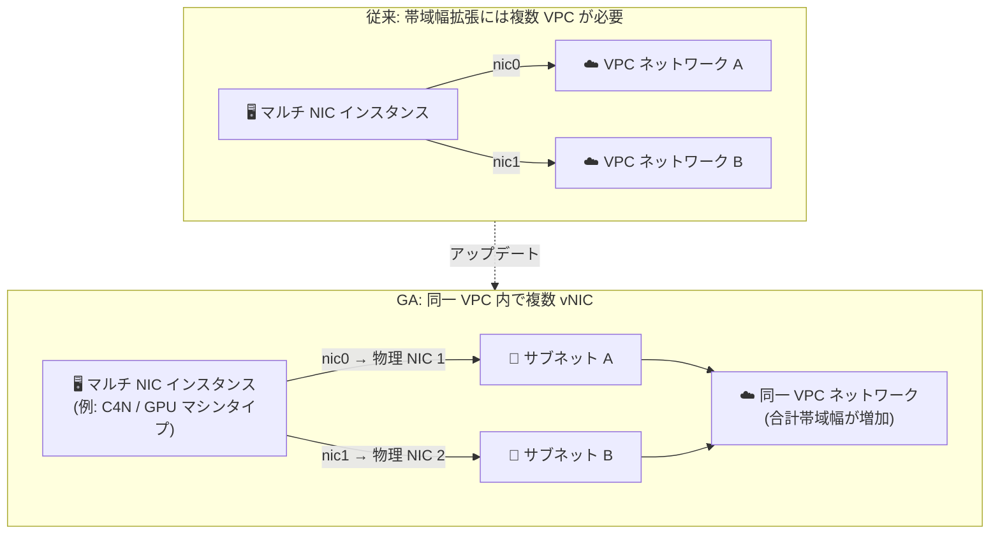

# Virtual Private Cloud: 同一 VPC ネットワーク内での複数 vNIC 構成が GA

**リリース日**: 2026-08-31

**サービス**: Virtual Private Cloud (VPC)

**機能**: 同一 VPC ネットワークへの複数仮想ネットワークインターフェース (vNIC) 接続

**ステータス**: 一般提供 (GA)

📊 [このアップデートのインフォグラフィックを見る](https://takech9203.github.io/google-cloud-news-summary/20260831-vpc-multiple-vnics-same-network-ga.html)

## 概要

Google Cloud は、同一の VPC ネットワークに複数の仮想ネットワークインターフェース (vNIC) を接続した Compute Engine インスタンスを作成する機能を一般提供 (GA) にしました。従来、マルチ NIC インスタンスの各ネットワークインターフェースは、それぞれ異なる VPC ネットワークに接続することが基本でしたが、今回の GA により、追加の vNIC を nic0 と同じ VPC ネットワークに接続する構成が正式にサポートされます。

この機能の主なユースケースは、単一の VPC ネットワークにおけるインスタンスのネットワーク帯域幅の拡張です。C4N マシンタイプや GPU マシンタイプなど、ホストサーバー上の複数の物理 NIC に支えられた一部のマシンタイプでは、各 vNIC を異なる物理 NIC にマッピングすることで、同一 VPC ネットワークに対するインスタンスの合計ネットワーク帯域幅を引き上げることができます。

ネットワーク帯域幅がボトルネックとなりやすい HPC、大規模データ処理、高スループットが要求されるワークロードを運用するインフラエンジニアや Solutions Architect にとって、ネットワーク設計の選択肢を広げるアップデートです。

**アップデート前の課題**

- マルチ NIC インスタンスの各ネットワークインターフェースは、それぞれ別の VPC ネットワークに接続する構成が前提であり、単一の VPC ネットワーク内で複数 vNIC による帯域幅拡張を行う構成は一般提供されていなかった
- 複数の物理 NIC を持つマシンタイプ (C4N、GPU マシンタイプなど) の帯域幅を単一 VPC ネットワーク向けに最大限活用するには、複数の VPC ネットワークに分割して接続する必要があり、ネットワーク設計が複雑になっていた

**アップデート後の改善**

- 追加の vNIC を nic0 と同じ VPC ネットワークに接続する構成が GA となり、本番環境で正式に利用できるようになった
- 複数の物理 NIC を持つマシンタイプでは、各 vNIC を異なる物理 NIC にマッピングすることで、単一 VPC ネットワークに対するインスタンスの合計ネットワーク帯域幅を増やせるようになった
- 帯域幅拡張のためだけに VPC ネットワークを分割する必要がなくなり、シンプルなネットワークトポロジを維持できるようになった

## アーキテクチャ図



従来はネットワーク帯域幅を拡張する場合でも vNIC ごとに異なる VPC ネットワークへの接続が基本でしたが、今回の GA により、同一 VPC ネットワーク内の異なるサブネットに複数の vNIC を接続し、複数の物理 NIC を活用した帯域幅拡張が可能になりました。

## サービスアップデートの詳細

### 主要機能

1. **同一 VPC ネットワークへの複数 vNIC 接続 (GA)**
   - インスタンスの追加 vNIC を、nic0 と同じ VPC ネットワークに接続できる
   - 各ネットワークインターフェースは、VPC ネットワーク内の一意のサブネットを使用する必要がある

2. **物理 NIC を活用した帯域幅拡張**
   - C4N マシンタイプや GPU マシンタイプなど、複数の物理 NIC を持つホストサーバーで実行される一部のマシンタイプでは、各 vNIC が異なる物理 NIC にマッピングされる
   - 各 vNIC を異なる物理 NIC で動作させることで、その VPC ネットワークに対するインスタンスの合計ネットワーク帯域幅が増加する
   - 大多数のマシンタイプは単一の物理 NIC に支えられており、その場合は vNIC を追加しても帯域幅は増加しない点に注意

3. **既存のマルチ NIC 機能との整合**
   - vNIC の最大数はマシンタイプ (vCPU 数) に依存し、ほとんどのマシンタイプで最大 10 個の vNIC を構成可能 (vCPU 数に応じてスケール)
   - RDMA ネットワークプロファイルで作成された VPC ネットワークでは、従来から複数の RDMA NIC が同一 VPC ネットワークを使用可能であり、今回の GA は通常の VPC ネットワークにおける vNIC 構成を対象とする

## 技術仕様

### 要件と仕様

| 項目 | 詳細 |
|------|------|
| 対象インターフェース | 仮想ネットワークインターフェース (vNIC) |
| 接続先 | 追加の vNIC は nic0 と同じ VPC ネットワークに接続する必要がある |
| サブネット要件 | 各ネットワークインターフェースは一意のサブネットを使用する必要がある |
| 帯域幅拡張の条件 | 複数の物理 NIC に支えられたマシンタイプ (例: C4N、GPU マシンタイプ) が必要 |
| vNIC の最大数 | vCPU 数に応じてスケール (2 vCPU 以下: 2、4 vCPU: 4、…、22 vCPU 以上: 10)。ベアメタルインスタンスは 1 vNIC のみ。A3/A4/A4X などアクセラレータ最適化マシンタイプは別途規定 |
| vNIC の構成タイミング | vNIC はインスタンス作成時にのみ構成可能 |
| デフォルトルート | DHCP により nic0 にデフォルトルートが関連付けられる。追加インターフェースを使うにはゲスト OS 内でルーティング設定が必要 |

### サポートされない構成 (同一 VPC ネットワーク内の複数インターフェース)

- **Dynamic NIC**: 同一インスタンスにおいて、Dynamic NIC を他のインターフェースと同じ VPC ネットワークに接続することはサポートされない (Dynamic NIC は一意の VPC ネットワークに接続する必要がある)
- **Private Service Connect インターフェース**: サポートされない
- **リンクアグリゲーションによる NIC ボンディング**: サポートされない

### Cloud Load Balancing・静的ルートに関する制限

- 同一 VPC ネットワークに複数の vNIC を接続したインスタンスは、インスタンスグループまたはゾーン NEG のバックエンドに追加できるが、同一 VPC ネットワークに接続された vNIC のうちトラフィックが分散されるのは **nic0 のみ**
- 静的ルートでは、名前とゾーンで指定するネクストホップインスタンス (`next-hop-instance`) を使って非 nic0 インターフェースにパケットを送信できない。代わりにアドレス指定のネクストホップ (`next-hop-address`) を使用する

## 設定方法

### 前提条件

1. VPC ネットワークとサブネットは、インスタンス作成前に存在している必要がある (各 vNIC 用に同一 VPC ネットワーク内へ一意のサブネットを用意する)
2. 帯域幅拡張が目的の場合は、複数の物理 NIC に支えられたマシンタイプ (例: C4N) を選択する (マシンシリーズのドキュメントで「Physical NIC count」列を確認)
3. スタンドアロンプロジェクトの場合、各インターフェースが使用するサブネットはインスタンスと同じプロジェクトに存在する必要がある

### 手順

#### ステップ 1: 同一 VPC ネットワーク内にサブネットを用意する

```bash
gcloud compute networks subnets create subnet-a \
    --network=my-vpc --region=REGION --range=10.0.1.0/24

gcloud compute networks subnets create subnet-b \
    --network=my-vpc --region=REGION --range=10.0.2.0/24
```

各ネットワークインターフェースは一意のサブネットを使用する必要があるため、vNIC の数に応じたサブネットを同一 VPC ネットワーク内に作成します。

#### ステップ 2: 複数の vNIC を持つインスタンスを作成する

```bash
gcloud compute instances create multi-nic-instance \
    --zone=ZONE \
    --machine-type=MACHINE_TYPE \
    --network-interface subnet=subnet-a \
    --network-interface subnet=subnet-b,no-address
```

`--network-interface` フラグをインターフェースごとに指定します。vNIC はインスタンス作成時にのみ構成できる点に注意してください。

#### ステップ 3: ゲスト OS 内でルーティングを構成する

デフォルトルートは nic0 に関連付けられるため、追加インターフェースを活用するにはゲスト OS 内でポリシールーティングの設定 (Linux では `/etc/iproute2/rt_tables`、`ip rule`、`ip route` コマンドなど) が必要です。詳細は公式チュートリアル「[追加のインターフェースのルーティングを構成する](https://docs.cloud.google.com/vpc/docs/configure-routing-additional-interface)」を参照してください。

## メリット

### ビジネス面

- **ネットワーク設計の簡素化**: 帯域幅拡張のためだけに VPC ネットワークを分割する必要がなくなり、単一 VPC のシンプルなトポロジを維持したままスループット要件を満たせる
- **高性能ワークロードへの対応**: HPC・大規模データ処理など、単一ネットワーク内で高いスループットを要するワークロードを GA 品質の構成で本番運用できる

### 技術面

- **帯域幅のスケールアウト**: 複数の物理 NIC を持つマシンタイプで各 vNIC を異なる物理 NIC にマッピングすることで、同一 VPC ネットワークに対する合計帯域幅を増加できる
- **既存機能との統合**: インスタンスグループ・ゾーン NEG のバックエンドへの追加や、Shared VPC 環境での利用など、既存のマルチ NIC 関連機能と組み合わせて利用できる

## デメリット・制約事項

### 制限事項

- 追加のインターフェースは nic0 と同じネットワークに接続する必要がある
- 非 nic0 インターフェースで帯域幅を拡張するには、複数の物理 NIC に支えられたマシンタイプが必須。単一物理 NIC のマシンタイプ (大多数) では vNIC を追加しても帯域幅は増加しない
- Dynamic NIC、Private Service Connect インターフェース、リンクアグリゲーションによる NIC ボンディングはサポートされない
- Cloud Load Balancing では、同一 VPC ネットワークに接続された vNIC のうちトラフィック分散の対象は nic0 のみ
- 静的ルートで非 nic0 インターフェースをネクストホップにする場合、`next-hop-instance` は使用できず `next-hop-address` を使用する必要がある

### 考慮すべき点

- ほとんどのユースケースでは、各ネットワークインターフェースを一意の VPC ネットワークに接続する構成が引き続き推奨される。同一 VPC への複数 vNIC 接続は、帯域幅拡張などユースケース上必要な場合に採用する
- Compute Engine の内部 DNS レコード (A/PTR) は nic0 のプライマリ内部 IPv4 アドレスに対してのみ作成される
- 追加インターフェースの利用にはゲスト OS 内のルートポリシー設定が必要であり、OS レベルの運用手順を整備する必要がある

## ユースケース

### ユースケース 1: 単一 VPC ネットワークでの帯域幅拡張

**シナリオ**: C4N マシンタイプで大規模なデータ転送・分散処理を行っており、単一 vNIC の帯域幅が上限に達している。VPC ネットワークを分割せずにインスタンスのスループットを高めたい。

**実装例**:
```bash
# 同一 VPC 内の一意のサブネットを各 vNIC に割り当てて作成
gcloud compute instances create high-bw-instance \
    --zone=ZONE \
    --machine-type=c4n-standard-XX \
    --network-interface subnet=subnet-a \
    --network-interface subnet=subnet-b,no-address
```

**効果**: 各 vNIC が異なる物理 NIC にマッピングされ、同一 VPC ネットワークに対するインスタンスの合計ネットワーク帯域幅が増加する。ネットワークトポロジを複雑化せずにスループット要件を満たせる。

### ユースケース 2: トラフィック用途ごとのインターフェース分離 (同一 VPC 内)

**シナリオ**: 同一 VPC ネットワーク内で、データプレーンのトラフィックと管理系トラフィックを別々のサブネット・インターフェースに分離して運用したい。

**効果**: 同一 VPC 内の異なるサブネットに vNIC を分けて接続することで、ファイアウォールルールやルーティングをインターフェース単位で設計しやすくなる。ゲスト OS 内のポリシールーティングと組み合わせて、用途別のトラフィック制御を実現できる。

## 料金

同一 VPC ネットワーク内での複数 vNIC 構成に固有の追加料金は、リリースノートおよび参照ドキュメントには記載されていません。Compute Engine インスタンスおよび VPC のデータ転送に関する通常の料金が適用されます。詳細は以下の料金ページを参照してください。

- [Compute Engine の料金](https://cloud.google.com/compute/all-pricing)
- [VPC の料金](https://cloud.google.com/vpc/pricing)

## 利用可能リージョン

リリースノートにリージョン制限の記載はありません。ただし、帯域幅拡張には複数の物理 NIC を持つマシンタイプ (C4N など) が必要であり、マシンタイプごとの提供リージョンは [リージョンとゾーン](https://cloud.google.com/compute/docs/regions-zones) を参照してください。

## 関連サービス・機能

- **Compute Engine**: マルチ NIC インスタンスの作成・管理の基盤。マシンタイプにより物理 NIC 数と vNIC の最大数が決まる
- **Cloud Load Balancing**: 同一 VPC に複数 vNIC を持つインスタンスをインスタンスグループ・ゾーン NEG のバックエンドとして利用可能 (分散対象は nic0 のみ)
- **Shared VPC**: ホストプロジェクト・サービスプロジェクトにおけるマルチ NIC インスタンスのサブネット利用をサポート
- **Dynamic NIC**: 既存インスタンスに再起動なしで追加できるサブインターフェース。ただし同一 VPC ネットワークへの接続はサポートされない
- **ネットワーク帯域幅**: インスタンスの egress/ingress 帯域幅の仕組み。物理 NIC と vNIC のマッピングが帯域幅に影響する

## 参考リンク

- 📊 [インフォグラフィック](https://takech9203.github.io/google-cloud-news-summary/20260831-vpc-multiple-vnics-same-network-ga.html)
- [公式リリースノート](https://docs.cloud.google.com/release-notes#August_31_2026)
- [ドキュメント: Multiple network interfaces in the same VPC network](https://docs.cloud.google.com/vpc/docs/multiple-interfaces-concepts#same-vpc)
- [ドキュメント: 複数のネットワークインターフェースの概要](https://docs.cloud.google.com/vpc/docs/multiple-interfaces-concepts)
- [ドキュメント: 複数のネットワークインターフェースを持つ VM インスタンスの作成](https://docs.cloud.google.com/vpc/docs/create-use-multiple-interfaces)
- [ドキュメント: ネットワーク帯域幅](https://docs.cloud.google.com/compute/docs/network-bandwidth)
- [料金ページ (VPC)](https://cloud.google.com/vpc/pricing)

## まとめ

同一 VPC ネットワーク内での複数 vNIC 構成の GA により、VPC ネットワークを分割することなく、複数の物理 NIC を持つマシンタイプの帯域幅を単一ネットワーク向けに最大限活用できるようになりました。高スループットが求められるワークロードを運用している場合は、C4N などのマシンタイプと組み合わせた帯域幅拡張の検討を推奨します。採用時は、Dynamic NIC 非対応やロードバランシングの nic0 制限、ゲスト OS 内のルーティング設定などの制約を事前に確認してください。

---

**タグ**: #VPC #ComputeEngine #ネットワーキング #マルチNIC #vNIC #帯域幅 #GA
