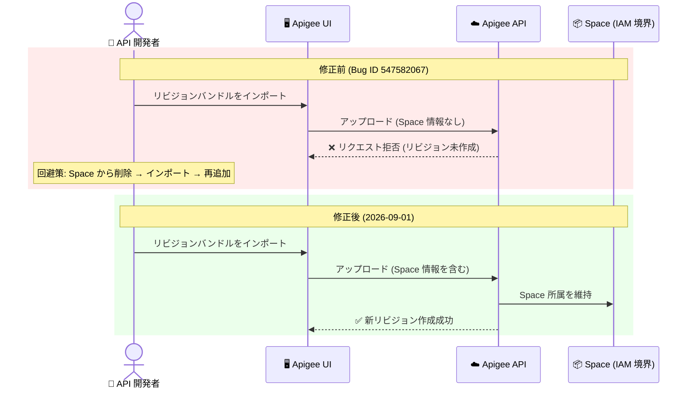

# Apigee UI: Space 所属の API プロキシ / 共有フローでリビジョンインポートが可能に (Bug ID 547582067 修正)

**リリース日**: 2026-09-01

**サービス**: Apigee UI

**機能**: Space に関連付けられた API プロキシ / 共有フローのリビジョンインポート修正

**ステータス**: Announcement / Fixed (バグ修正)

📊 [このアップデートのインフォグラフィックを見る](https://takech9203.github.io/google-cloud-news-summary/20260901-apigee-ui-spaces-revision-import-fix.html)

## 概要

2026 年 9 月 1 日、Apigee UI の更新バージョンがリリースされ、Bug ID 547582067 の修正が含まれました。この修正により、Apigee Spaces (Space) に関連付けられた API プロキシおよび共有フロー (Shared Flow) に対して、Apigee UI からリビジョンのインポートが正常に行えるようになりました。

Apigee Spaces は、Apigee 組織内の API プロキシ、共有フロー、API プロダクトをチームやプロジェクト単位でグルーピングし、Space 単位で granular な IAM 制御を実現する機能です。従来、Space に所属するリソースに対して UI からリビジョンバンドルをアップロードすると、UI がリクエストに Space 情報を含めなかったため、インポートリクエストが拒否され、新しいリビジョンが作成されないという問題がありました。今回の修正でこの問題が解消され、従来必要だった回避策 (Space からの一時的な削除と再追加) が不要になりました。

Apigee Spaces を利用してマルチチームで API 管理を行っている組織にとって、日常的なプロキシ開発ワークフローの摩擦が解消される修正です。

**アップデート前の課題**

- Space に関連付けられた API プロキシや共有フローに対して、Apigee UI からリビジョンをインポートすると、UI がリビジョンバンドルのアップロード時に Space 情報を含めなかったため、インポートリクエストが拒否されていた
- その結果、新しいリビジョンが作成されず、UI 経由でのリビジョン更新ができなかった
- 回避策として「API プロキシ / 共有フローを Space から削除 → リビジョンをインポート → Space に再追加」という手動の 3 ステップ操作が必要だった
- この問題は API プロキシと共有フローの両方に影響していた

**アップデート後の改善**

- Space に関連付けられた API プロキシ / 共有フローに対しても、Apigee UI からリビジョンのインポートが正常に動作するようになった
- Space からの削除・再追加という回避策が不要になり、通常のインポート操作だけで完結するようになった
- Space の IAM 分離・グルーピングを維持したまま、リビジョン管理のワークフローを UI 上で運用できるようになった

## アーキテクチャ図

修正前は Apigee UI がアップロードリクエストに Space 情報を含めずインポートが拒否されていましたが、修正後は Space 情報が正しく付与され、Space 所属を維持したままリビジョンが作成されます。

## サービスアップデートの詳細

### 主要機能

1. **Space 所属リソースへのリビジョンインポート対応 (Bug ID 547582067)**
   - Space に関連付けられた API プロキシに対する UI からのリビジョンインポートが正常に動作
   - Space に関連付けられた共有フローに対する UI からのリビジョンインポートも同様に修正
   - UI がリビジョンバンドルのアップロード時に Space 情報を正しく含めるように修正された

2. **回避策の廃止**
   - 従来の「Space から削除 → リビジョンインポート → Space へ再追加」という回避策は不要
   - リソースを一時的に Space の IAM 境界の外に出す必要がなくなり、運用上のリスクも低減

## 技術仕様

### Apigee Spaces の概要

| 項目 | 詳細 |
|------|------|
| 対象リソース | API プロキシ、共有フロー、API プロダクト |
| 主な用途 | チーム / プロジェクト / 環境単位でのリソースのグルーピングと IAM 分離 |
| IAM 制御 | Space 単位で IAM ポリシーを適用し、配下のリソースが継承 |
| 対応組織 | Subscription / Pay-as-you-go 組織 (Apigee hybrid 対応組織を含む) |
| Apigee hybrid 要件 | hybrid バージョン 1.13 以上 |
| Space 数の上限 | 1 Apigee 組織あたり最大 20 Space |
| list 操作の制限 | API プロキシ / API プロダクト / 共有フローの list エンドポイントで 10 QPS |

### 修正の対象

| 項目 | 詳細 |
|------|------|
| Bug ID | 547582067 |
| 影響範囲 | Space に関連付けられた API プロキシおよび共有フローのリビジョンインポート (Apigee UI 経由) |
| 修正内容 | UI がリビジョンバンドルアップロード時に Space 情報を含めるように修正 |
| ユーザー側の対応 | 不要 (UI 側の修正のため、自動的に適用される) |

## メリット

### ビジネス面

- **運用効率の向上**: 回避策として必要だった 3 ステップの手動操作が不要になり、API 開発チームの作業時間を削減できる
- **Spaces 導入の障壁解消**: マルチチーム運用のための Spaces 導入時に、リビジョン管理ワークフローが阻害されなくなる

### 技術面

- **IAM 境界の一貫性**: 回避策ではリソースを一時的に Space から外す必要があり、その間 Space の IAM 分離が適用されない状態が生じ得たが、修正後はこの操作自体が不要になった
- **UI と API の整合性**: UI からのインポート操作が Apigee API の Space 対応と整合し、期待どおりに新リビジョンが作成される

## デメリット・制約事項

### 考慮すべき点

- 本修正は Apigee UI 側の修正であり、Apigee Spaces 自体の機能追加ではない
- Apigee Spaces の既存の制限 (組織あたり最大 20 Space、list 操作 10 QPS、Apigee hybrid は 1.13 以上が必要) は引き続き適用される
- Apigee Edge には Spaces 機能はなく、本修正は Apigee および Apigee hybrid が対象

## ユースケース

### ユースケース 1: マルチチーム組織での API プロキシのリビジョン更新

**シナリオ**: 複数の開発チームが 1 つの Apigee 組織を共有し、チームごとの Space で API プロキシを管理している。ローカルや CI で作成したプロキシバンドル (zip) を UI からインポートして新リビジョンを作成したい。

**効果**: 修正前は Space からプロキシを外してからインポートし再度 Space に追加する必要があったが、修正後は Space 所属のまま通常のインポート操作 1 回で新リビジョンを作成できる。

### ユースケース 2: 共通処理を実装した共有フローの更新

**シナリオ**: 認証やロギングなどの共通処理を共有フローとして Space 内で管理しており、修正版の共有フローバンドルを UI からインポートしてリビジョンを更新したい。

**効果**: 共有フローについても API プロキシと同様に、Space 所属を維持したままリビジョンインポートが完結し、共通コンポーネントの更新サイクルが簡素化される。

## 関連サービス・機能

- **Apigee Spaces**: Apigee 組織内のリソース (API プロキシ、共有フロー、API プロダクト) を Space 単位でグルーピングし、granular な IAM 制御を実現する機能。今回の修正はこの機能と UI の連携部分に関するもの
- **Identity and Access Management (IAM)**: Space 単位で IAM ポリシーを適用でき、Space 配下のリソースはそのポリシーを継承する
- **Apigee hybrid**: Spaces を利用するには hybrid バージョン 1.13 以上が必要

## 参考リンク

- 📊 [インフォグラフィック](https://takech9203.github.io/google-cloud-news-summary/20260901-apigee-ui-spaces-revision-import-fix.html)
- [公式リリースノート](https://docs.cloud.google.com/release-notes#September_01_2026)
- [Apigee Spaces overview](https://docs.cloud.google.com/apigee/docs/api-platform/system-administration/spaces/apigee-spaces-overview)
- [Create and manage Apigee Spaces](https://docs.cloud.google.com/apigee/docs/api-platform/system-administration/spaces/create-spaces)
- [Manage API resources in Apigee Spaces](https://docs.cloud.google.com/apigee/docs/api-platform/system-administration/spaces/manage-space-resources)

## まとめ

Apigee Spaces を利用する組織で発生していた、Space 所属の API プロキシ / 共有フローに対する UI からのリビジョンインポート不具合が修正されました。UI 側の修正のためユーザーの対応は不要ですが、これまで「Space から削除 → インポート → 再追加」の回避策を運用手順に組み込んでいたチームは、手順を通常のインポート操作に簡素化することを推奨します。

---

**タグ**: #Apigee #ApigeeUI #ApigeeSpaces #BugFix #APIProxy #SharedFlow #IAM
