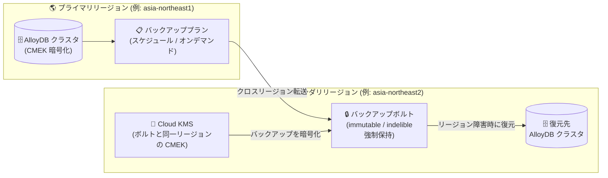

# Backup and DR: AlloyDB for PostgreSQL の CMEK バックアップボルト対応とクロスリージョンバックアップが GA

**リリース日**: 2026-09-01

**サービス**: Backup and DR

**機能**: AlloyDB for PostgreSQL 向け CMEK バックアップボルト対応 / クロスリージョンバックアップ

**ステータス**: GA (一般提供)

📊 [このアップデートのインフォグラフィックを見る](https://takech9203.github.io/google-cloud-news-summary/20260901-backup-and-dr-alloydb-cmek-cross-region-ga.html)

## 概要

Google Cloud Backup and DR において、AlloyDB for PostgreSQL に関する 2 つの機能が一般提供 (GA) になりました。1 つ目は、顧客管理暗号鍵 (CMEK) で暗号化された AlloyDB for PostgreSQL インスタンスのバックアップボルト対応です。CMEK を利用するクラスタのバックアップを、改ざん不可 (immutable) かつ削除不可 (indelible) なストレージに、強制保持期間 (enforced retention) 付きで保存できます。2 つ目は、AlloyDB for PostgreSQL クラスタのクロスリージョンバックアップの GA です。任意のセカンダリリージョンにバックアップを保存することで、リージョン障害からデータを保護できます。

Backup and DR のバックアップボルトは、ランサムウェアや悪意ある削除からバックアップを守るための Google 管理のストレージであり、AlloyDB では「拡張バックアップ (Enhanced backups)」として統合されています。今回の GA により、CMEK による鍵管理の統制が求められる規制業界のワークロードや、リージョン障害への耐性が求められるミッションクリティカルなデータベースにおいて、AlloyDB を安心して採用できるようになります。

Backup and DR では、Cloud SQL の CMEK 対応 (2026 年 6 月 18 日 GA)、Compute Engine / Filestore のクロスリージョンバックアップ (2026 年 6 月 23 日 GA)、Filestore の CMEK 対応 (2026 年 8 月 24 日 GA) と対応ワークロードを順次拡大しており、今回 AlloyDB がこれに加わった形です。

**アップデート前の課題**

- CMEK で暗号化された AlloyDB クラスタのバックアップを、CMEK 対応のバックアップボルトで保護する機能は一般提供ではなく、鍵管理要件の厳しい本番ワークロードでの採用が難しかった
- AlloyDB の拡張バックアップ (バックアップボルト) は同一リージョンでの保存が前提であり、クロスリージョンバックアップは AlloyDB 標準バックアップ機能側でのみ提供されていた
- リージョン障害に備えつつ、改ざん不可・削除不可・強制保持というボルトの保護特性を両立させる手段がなかった

**アップデート後の改善**

- CMEK 対応バックアップボルトへの AlloyDB バックアップが GA となり、GMEK (Google 管理鍵) 暗号化クラスタ・CMEK 暗号化クラスタの双方をボルトで保護できるようになった
- AlloyDB クラスタのバックアップを任意のセカンダリリージョンのバックアップボルトに保存でき、リージョン障害時にも復元可能になった
- 改ざん不可・削除不可・強制保持というボルトの保護と、クロスリージョンの災害対策、CMEK による鍵管理統制を組み合わせて利用できるようになった

## アーキテクチャ図



プライマリリージョンの AlloyDB クラスタをバックアッププラン経由でセカンダリリージョンのバックアップボルトに保存するフローです。ボルトのバックアップはボルト側の CMEK 鍵 (ボルトと同一リージョンの Cloud KMS 鍵) で暗号化され、リージョン障害時にはボルトから新しいクラスタへ復元できます。

## サービスアップデートの詳細

### 主要機能

1. **CMEK 対応バックアップボルトによる AlloyDB バックアップの保護 (GA)**
   - CMEK で暗号化された AlloyDB for PostgreSQL インスタンスのバックアップを、CMEK 対応バックアップボルトに保存可能
   - GMEK 暗号化クラスタ・CMEK 暗号化クラスタの両方をサポート
   - バックアップは改ざん不可・削除不可で、強制保持期間中は誰も削除できない

2. **ボルト鍵によるバックアップ暗号化**
   - AlloyDB クラスタのバックアップは、ソースクラスタの鍵ではなく**バックアップボルトの CMEK 鍵**で暗号化される (Compute Engine ディスクや Cloud SQL がソース側の鍵を使うのとは異なる方式)
   - バックアップは増分方式のため、鍵ローテーションが行われた場合、1 つのバックアップが複数の Cloud KMS 鍵バージョンで暗号化されることがある
   - Cloud KMS のキートラッキングページで、各バックアップに使用された鍵バージョンを監視・追跡できる

3. **クロスリージョンバックアップ (GA)**
   - ソースクラスタとは異なる任意のセカンダリリージョンにバックアップボルトを作成し、バックアップを保存できる
   - リージョン障害に対する保護を提供し、復元先のロケーションに Backup and DR 側の制限はない
   - データレジデンシー要件や、特定の DR サイトを指定したい場合に有効 (マルチリージョンボルトと異なり、保存先リージョンを明示的に制御できる)

## 技術仕様

### AlloyDB バックアップボルトの仕様

| 項目 | 詳細 |
|------|------|
| バックアップ方式 | 拡張バックアップ (Backup and DR 管理) / スケジュール (時間・日・週・月・年単位) とオンデマンドに対応 |
| 暗号化に使用する鍵 | バックアップボルトの CMEK 鍵 (ソースクラスタの鍵ではない) |
| 対応クラスタ | GMEK 暗号化クラスタおよび CMEK 暗号化クラスタ |
| ボルトのロケーション | リージョン、クロスリージョンに対応 (AlloyDB は**マルチリージョンボルト非対応**) |
| CMEK の設定タイミング | ボルト作成時のみ (既存ボルトでの有効化・無効化・変更は不可) |
| KMS 鍵のロケーション | バックアップボルトと同一リージョンの鍵が必須 (クロスリージョンバックアップでもボルトと同一リージョンの鍵を使用) |
| PITR (ポイントインタイムリカバリ) | 対応 (gcloud CLI でプラン作成時は `--log-retention-days` の明示指定が必要。コンソールは既定で 13 日のログ保持を推奨設定) |
| CSEK (顧客提供鍵) | 非対応 |
| デフォルトボルト / デフォルトプラン | Google 管理暗号化を使用。CMEK 利用には新規ボルトの作成と明示的な CMEK 有効化が必要 |

### 鍵アクセスと復元性

- Backup and DR サービスエージェントには、ボルト鍵に対する **Cloud KMS CryptoKey Encrypter/Decrypter** (`roles/cloudkms.cryptoKeyEncrypterDecrypter`) が必要
- サービスエージェントが鍵の権限を持たない場合、バックアッププラン関連付け (BPA) の作成は事前にブロックされる
- サービスエージェントの鍵アクセスを取り消すと、新規バックアップの作成と既存バックアップの復元ができなくなる
- 復号権限はボルトプロジェクトのサービスエージェントに紐付くため、元のワークロードプロジェクトが削除されてもバックアップは復元可能

### 標準バックアップと拡張バックアップの比較

| 機能 | 標準バックアップ (AlloyDB 管理) | 拡張バックアップ (Backup and DR 管理) |
|------|------|------|
| 不正な削除・変更からの保護 | 改ざん不可 (immutable) | 改ざん不可かつ削除不可 (immutable + indelible) |
| 自動バックアップ頻度 | 日次 + 継続的ログアーカイブ、時間/日/週単位 | 時間/日/週/月/年単位 |
| ソースプロジェクト削除からの保護 | – | 対応 |
| 一元的なバックアップ管理 | – | 対応 |
| ソースクラスタ削除からの保護 | 対応 | 対応 |
| ログによる PITR | 対応 | 対応 |

## 設定方法

### 前提条件

1. AlloyDB for PostgreSQL クラスタが存在するロケーションで Backup and DR API を有効化する
2. バックアップボルトを作成する (CMEK を使う場合は作成時に CMEK を有効化し、ボルトと同一リージョンの Cloud KMS 鍵を指定)
3. バックアッププランを作成する (PITR を使う場合、gcloud CLI では `--log-retention-days=13` など有効な値を指定)
4. バックアップユーザーに IAM ロールを付与する (ボルトプロジェクトに対して `roles/backupdr.backupUser` と `roles/viewer`)
5. AlloyDB プロジェクトでバックアップボルトへのアクセスを許可する

### 手順

#### ステップ 1: サービスエージェントへの鍵権限付与 (CMEK 利用時)

Backup and DR サービスエージェントに、ボルトの CMEK 鍵への Encrypter/Decrypter 権限を付与します。

```bash
gcloud kms keys add-iam-policy-binding KEY_NAME \
  --keyring=KEYRING_NAME \
  --location=VAULT_REGION \
  --member="serviceAccount:BACKUP_DR_SERVICE_AGENT" \
  --role="roles/cloudkms.cryptoKeyEncrypterDecrypter"
```

#### ステップ 2: バックアッププランの関連付けとバックアップ

Google Cloud コンソールの Backup and DR ページから、AlloyDB クラスタにバックアッププランを適用します。スケジュールバックアップに加え、オンデマンドバックアップも実行できます。プランの解除は次のコマンドで行えます (解除しても既存バックアップは保持期限まで残ります)。

```bash
gcloud backup-dr backup-plan-associations delete BACKUP_PLAN_ASSOCIATION_NAME \
  --project=PROJECT_ID \
  --location=LOCATION
```

## メリット

### ビジネス面

- **コンプライアンス対応**: CMEK による鍵管理統制と、強制保持付きの削除不可ストレージを組み合わせ、金融・医療などの規制要件やサイバーレジリエンス要件に対応できる
- **DR 体制の強化**: セカンダリリージョンを明示的に選択してバックアップを保存でき、データレジデンシー法制や社内 DR ポリシーに沿ったリージョンペアリングを構成できる
- **ランサムウェア対策**: バックアップボルト内のバックアップは強制保持期間中は誰も削除できず、ソースプロジェクトが侵害・削除されても復元可能

### 技術面

- **一元管理**: AlloyDB、Cloud SQL、Compute Engine、Filestore などのバックアップを Backup and DR で統一的に監視・管理できる
- **鍵バージョンの追跡性**: Cloud KMS キートラッキングにより、増分バックアップに使用された鍵バージョンを監視でき、鍵ローテーション運用と両立できる
- **柔軟なスケジューリング**: 時間・日・週・月・年単位のスケジュールとオンデマンドバックアップ、ログ保持による PITR に対応

## デメリット・制約事項

### 制限事項

- CMEK はバックアップボルトの**作成時にのみ**設定可能で、既存ボルトでの有効化・変更・無効化はできない
- Cloud KMS 鍵はバックアップボルトと同一ロケーションである必要があり、クロスリージョンバックアップでもボルトと同一リージョンの鍵を使用する
- AlloyDB クラスタはマルチリージョンのバックアップボルトに非対応 (リージョン / クロスリージョンのみ)
- CSEK (顧客提供暗号鍵) は非対応
- デフォルトのバックアップボルト・バックアッププランは Google 管理暗号化を使用するため、CMEK 利用には新規ボルト作成が必要

### 考慮すべき点

- クロスリージョンバックアップではリージョン間データ転送料金が発生する (バックアップストレージ料金・管理料金に加算)
- CMEK 鍵 (該当バージョン) を無効化・削除すると、その鍵で暗号化されたバックアップは復元不能になるため、鍵のライフサイクル管理を慎重に行う必要がある
- gcloud CLI でバックアッププランを作成する場合、`--log-retention-days` を指定しないと PITR 用のログ保持が無効のままになる (コンソールは既定で 13 日を推奨設定)
- 2026 年 11 月 1 日以降、強制保持付きバックアップを含むボルトがあるプロジェクトには、プロジェクトレベルのリーエン (lien) が自動適用される点にも留意する

## ユースケース

### ユースケース 1: 規制業界における CMEK 統制下の AlloyDB バックアップ

**シナリオ**: 金融機関が CMEK で暗号化した AlloyDB クラスタを運用しており、バックアップにも自社管理鍵による暗号化と、監査要件を満たす削除不可の保持ポリシーが求められる。

**実装例**: ボルトと同一リージョンの Cloud KMS 鍵を指定して CMEK 対応バックアップボルトを作成し、強制保持期間を設定したバックアッププランを AlloyDB クラスタに関連付ける。キートラッキングで鍵バージョンの利用状況を監査する。

**効果**: 鍵管理の主導権を保持したまま、強制保持期間中は管理者でも削除できないバックアップを実現し、監査・コンプライアンス要件を満たせる。

### ユースケース 2: リージョン障害に備えたクロスリージョン DR

**シナリオ**: asia-northeast1 (東京) で稼働する基幹データベース (AlloyDB) について、リージョン全体の障害が発生してもデータを復元できる体制を整えたい。

**効果**: asia-northeast2 (大阪) など任意のセカンダリリージョンにバックアップボルトを作成してバックアップを保存することで、プライマリリージョンの障害時にもセカンダリリージョンから新しいクラスタへ復元できる。マルチリージョンボルトと異なり保存先リージョンを明示的に制御できるため、データレジデンシー要件にも対応しやすい。

## 料金

Backup and DR は CMEK の利用自体に追加料金を課しません。ただし、Cloud KMS の鍵利用料金は別途発生します。クロスリージョンバックアップでは、バックアップストレージ料金と管理料金に加えて、リージョン間データ転送料金が発生します。

また、Backup and DR には 30 日間の導入トライアルがあり、期間中はバックアップ管理料金とボルトストレージ料金なしで機能を評価できます。

詳細な単価は料金ページを参照してください。

- [Backup and DR 料金](https://cloud.google.com/backup-disaster-recovery/pricing)
- [Cloud KMS 料金](https://docs.cloud.google.com/kms/pricing)

## 利用可能リージョン

バックアップボルトは北米・南米・欧州・アジア・中東・アフリカ・オセアニアの多数のリージョンで作成できます (AlloyDB クラスタはマルチリージョンボルト非対応)。対応リージョンの一覧は [バックアップボルトのドキュメント](https://docs.cloud.google.com/backup-disaster-recovery/docs/concepts/backup-vault#regions) を参照してください。

## 関連サービス・機能

- **AlloyDB for PostgreSQL**: 保護対象のワークロード。標準バックアップ (AlloyDB 管理) と拡張バックアップ (Backup and DR 管理) を切り替えて利用できる
- **Cloud KMS**: バックアップボルトの CMEK 鍵を管理。キートラッキングでバックアップに使用された鍵バージョンを追跡可能
- **AlloyDB クロスリージョンレプリケーション**: セカンダリクラスタによる継続的レプリケーション。バックアップベースの DR と組み合わせて RPO/RTO 要件に応じた構成が可能
- **Privileged Access Manager (PAM)**: 強制保持付きボルトを含むプロジェクトのリーエン削除を多者承認で保護する構成に利用
- **Cloud SQL / Filestore / Compute Engine**: 同じバックアップボルトの仕組みで保護できる他のワークロード。Backup and DR で一元管理できる

## 参考リンク

- 📊 [インフォグラフィック](https://takech9203.github.io/google-cloud-news-summary/20260901-backup-and-dr-alloydb-cmek-cross-region-ga.html)
- [公式リリースノート](https://docs.cloud.google.com/release-notes#September_01_2026)
- [ドキュメント: AlloyDB クラスタバックアップの暗号化](https://docs.cloud.google.com/backup-disaster-recovery/docs/cloud-console/alloydb/alloydb-backup#alloydb-encryption-context)
- [ドキュメント: 改ざん不可・削除不可バックアップのためのバックアップボルト](https://docs.cloud.google.com/backup-disaster-recovery/docs/concepts/backup-vault)
- [ドキュメント: Backup and DR における CMEK の概要](https://docs.cloud.google.com/backup-disaster-recovery/docs/concepts/cmek)
- [ドキュメント: AlloyDB バックアップの概要 (標準 / 拡張バックアップ)](https://docs.cloud.google.com/alloydb/docs/backup/overview)
- [料金ページ](https://cloud.google.com/backup-disaster-recovery/pricing)

## まとめ

AlloyDB for PostgreSQL の CMEK バックアップボルト対応とクロスリージョンバックアップの GA により、鍵管理統制・改ざん/削除不可の保持・リージョン障害対策という 3 つの要件を Backup and DR で同時に満たせるようになりました。CMEK や DR 要件のある AlloyDB ワークロードを運用している場合は、CMEK 対応ボルトの新規作成 (作成時のみ設定可能) とセカンダリリージョンの選定を含めたバックアップ設計の見直しを推奨します。

---

**タグ**: Backup and DR, AlloyDB, CMEK, バックアップボルト, クロスリージョン, 災害復旧, GA, セキュリティ
