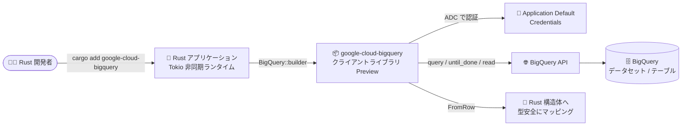

# BigQuery: Rust SDK が Preview に

**リリース日**: 2026-09-01

**サービス**: BigQuery

**機能**: Rust SDK for BigQuery

**ステータス**: Preview

📊 [このアップデートのインフォグラフィックを見る](https://takech9203.github.io/google-cloud-news-summary/20260901-bigquery-rust-sdk-preview.html)

## 概要

BigQuery 用の Rust SDK (クライアントライブラリ) が Preview として公開されました。crates.io で提供される `google-cloud-bigquery` クレートを `cargo add google-cloud-bigquery` で追加するだけで、Rust アプリケーションから BigQuery へのクエリ実行や結果の読み取りを、Rust らしい (idiomatic な) API で記述できるようになります。

このライブラリは Google Cloud が公式に開発する Rust SDK ファミリー ([google-cloud-rust](https://github.com/googleapis/google-cloud-rust)) の一部です。Google Cloud の Rust SDK は Cloud Storage、Vertex AI、Secret Manager をはじめ 150 以上のサービスに対応しており、今回 BigQuery がそのラインナップに加わった形です。async/await と Tokio ランタイムを前提とした非同期 API、ビルダーパターンによるクライアント構築、`FromRow` 派生マクロによる行データの構造体へのマッピングなど、Rust エコシステムの流儀に沿った設計になっています。

メモリ安全性・高い並行性・低いランタイムオーバーヘッドという Rust の特長を活かして、BigQuery と連携するデータ処理サービスやバックエンドを構築したい開発者が主な対象です。なお、Preview 機能は Pre-GA Offerings Terms の対象であり、サポートが限定される点に注意が必要です。

**アップデート前の課題**

- BigQuery の公式クライアントライブラリは C#、Go、Java、Node.js、PHP、Python、Ruby が対象で、Rust は公式サポートの対象外だった
- Rust から BigQuery を利用するには、REST API を直接呼び出すか、サードパーティ製クレートに依存する必要があった
- 認証 (Application Default Credentials) やクエリ結果のページング処理などを自前で実装する必要があった

**アップデート後の改善**

- `cargo add google-cloud-bigquery` だけで Google 公式の BigQuery クライアントライブラリを導入できるようになった
- ビルダーパターンのクライアント (`BigQuery::builder().build()`) と `query()` メソッドで、クエリ実行から結果の逐次読み取りまでを少ないコードで記述できるようになった
- `FromRow` 派生マクロにより、クエリ結果の行を Rust の構造体へ型安全にマッピングできるようになった
- Application Default Credentials による認証がライブラリに組み込まれ、他言語の Cloud クライアントライブラリと同じ認証フローを利用できるようになった

## アーキテクチャ図



Rust アプリケーションが `google-cloud-bigquery` クレートを通じて BigQuery API にクエリを発行し、結果を `FromRow` マクロで Rust の構造体として受け取るまでの流れを示しています。

## サービスアップデートの詳細

### 主要機能

1. **idiomatic な Rust API によるクエリ実行**
   - `BigQuery::builder().build().await?` でクライアントを構築し、`client.query(...)` でクエリを発行
   - `with_project_id()`、`set_location()`、`set_max_results()` などのメソッドチェーンでクエリオプションを指定
   - `until_done()` でジョブ完了を待機し、`read()` で結果行をストリームとして逐次読み取り

2. **`FromRow` 派生マクロによる型安全な行マッピング**
   - `#[derive(FromRow)]` を付けた構造体にクエリ結果の行を `try_into()` で変換可能
   - `row.get("column_name")?` による列名指定の値取得にも対応

3. **Rust エコシステムとの統合**
   - Tokio ランタイムによる async/await ベースの非同期処理
   - Cargo による依存関係管理 (`cargo add google-cloud-bigquery`)
   - API リファレンスは [docs.rs](https://docs.rs/google-cloud-bigquery) で公開

### コード例 (公式クイックスタートより)

```rust
use google_cloud_bigquery::client::BigQuery;
use google_cloud_bigquery::query::FromRow;

pub async fn sample(project_id: &str) -> anyhow::Result<()> {
    let client = BigQuery::builder().build().await?;
    let query = r#"
        SELECT CONCAT('https://stackoverflow.com/questions/', CAST(id as STRING)) as url,
               view_count
        FROM `bigquery-public-data.stackoverflow.posts_questions`
        WHERE tags like '%google-bigquery%'
        ORDER BY view_count DESC
        LIMIT 10;
    "#;
    let mut rows = client
        .query(query)
        .with_project_id(project_id)
        .until_done()
        .await?
        .read();

    #[derive(FromRow, Debug)]
    struct StackOverflowRow {
        url: String,
        view_count: i64,
    }

    while let Some(row) = rows.next().await.transpose()? {
        let row: StackOverflowRow = row.try_into()?;
        println!("url: {} views: {}", row.url, row.view_count);
    }
    Ok(())
}
```

## 技術仕様

| 項目 | 詳細 |
|------|------|
| クレート名 | `google-cloud-bigquery` |
| インストール | `cargo add google-cloud-bigquery` (Tokio が必要: `cargo add tokio --features macros`) |
| ランタイム | Tokio (async/await ベース) |
| 認証 | Application Default Credentials (`gcloud auth application-default login`) |
| API リファレンス | https://docs.rs/google-cloud-bigquery |
| ソースコード | https://github.com/googleapis/google-cloud-rust |
| ライセンス条件 | Pre-GA Offerings Terms (Service Specific Terms) の対象 |
| フィードバック窓口 | cloud-sdk-rust@google.com |

## 設定方法

### 前提条件

1. Rust / Cargo のインストール (`cargo --version` で確認)
2. Google Cloud CLI のインストールと Application Default Credentials の設定
3. Google Cloud プロジェクトで BigQuery API が有効であること

### 手順

#### ステップ 1: Rust プロジェクトの作成とライブラリの追加

```bash
cargo new bigquery-rust-quickstart --bin
cd bigquery-rust-quickstart
cargo add google-cloud-bigquery
cargo add tokio --features macros
```

BigQuery クライアントライブラリと Tokio ランタイムをプロジェクトに追加します。

#### ステップ 2: 認証の設定と実行

```bash
gcloud auth application-default login
cargo run
```

Application Default Credentials を設定した上でプログラムを実行します。Cloud Shell には rustup がプリインストールされており、そのまま試すことも可能です。

## メリット

### ビジネス面

- **公式サポートによる安心感**: サードパーティ製クレートではなく Google 公式のライブラリを利用でき、GitHub の Issue Tracker やフィードバック窓口を通じたサポートパスが用意されている
- **インフラコスト削減の可能性**: Rust のゼロコスト抽象化ときめ細かなメモリ管理により、リソース効率の高いアプリケーションを構築でき、インフラコストの低減につながり得る

### 技術面

- **型安全性**: Rust の所有権モデルと型システムに加え、`FromRow` による型安全な行マッピングで実行時エラーを減らせる
- **高い並行性**: Tokio ベースの非同期 API により、多数のクエリ・リクエストを効率的に並行処理できる
- **他の Google Cloud Rust SDK との一貫性**: Cloud Storage や Secret Manager など既存の Rust クライアントライブラリと同じ認証・設計パターンで利用できる

## デメリット・制約事項

### 制限事項

- Preview 段階のため Pre-GA Offerings Terms が適用され、「現状有姿 (as is)」での提供となりサポートが限定される
- GA までに API が変更される可能性がある

### 考慮すべき点

- 本番ワークロードでの採用は GA を待つか、Pre-GA 条件を理解した上で判断する必要がある
- サポート依頼やフィードバックはメール (cloud-sdk-rust@google.com) または GitHub Issue Tracker 経由となる

## ユースケース

### ユースケース 1: 高スループットなデータ処理バックエンド

**シナリオ**: Cloud Run や GKE 上で稼働する Rust 製 API サーバーから、BigQuery のデータを直接クエリして分析結果を返す。

**効果**: Rust の低レイテンシ・低メモリフットプリントと Tokio の並行処理を活かし、リソース効率の高い分析 API を公式ライブラリだけで構築できる。

### ユースケース 2: 既存 Rust サービスへの分析機能の追加

**シナリオ**: すでに Rust で構築されたマイクロサービス群に、BigQuery 公開データセットや自社データセットへのクエリ機能を追加する。

**実装例**:
```bash
cargo add google-cloud-bigquery
cargo add tokio --features macros
```

**効果**: REST API の自前実装やサードパーティ依存を排除し、認証・ページングが組み込まれた公式クライアントで保守性を高められる。

## 料金

Rust SDK 自体の利用は無料です (オープンソースのクライアントライブラリ)。実行するクエリやストレージには通常の BigQuery 料金が適用されます。詳細は [BigQuery 料金ページ](https://cloud.google.com/bigquery/pricing) を参照してください。

## 関連サービス・機能

- **Cloud Client Libraries (C#/Go/Java/Node.js/PHP/Python/Ruby)**: BigQuery で従来から提供されている公式クライアントライブラリ群。Rust が新たに加わった
- **Google Cloud Rust SDK**: Cloud Storage、Vertex AI、Secret Manager など 150 以上のサービスに対応する Rust SDK ファミリー。BigQuery クライアントもこの一部
- **Cloud Run / GKE / Compute Engine**: Rust アプリケーションのデプロイ先として公式ドキュメントで推奨される実行環境
- **Cloud Shell**: rustup がプリインストールされており、SDK をすぐに試せる環境

## 参考リンク

- 📊 [インフォグラフィック](https://takech9203.github.io/google-cloud-news-summary/20260901-bigquery-rust-sdk-preview.html)
- [公式リリースノート](https://docs.cloud.google.com/release-notes#September_01_2026)
- [BigQuery API クライアントライブラリ](https://docs.cloud.google.com/bigquery/docs/reference/libraries)
- [クイックスタート: クライアントライブラリを使用した BigQuery](https://docs.cloud.google.com/bigquery/docs/quickstarts/quickstart-client-libraries)
- [Rust on Google Cloud 概要](https://docs.cloud.google.com/rust/docs/overview)
- [Get started with Rust](https://docs.cloud.google.com/rust/docs/quickstart)
- [API リファレンス (docs.rs)](https://docs.rs/google-cloud-bigquery)
- [ソースコード (GitHub)](https://github.com/googleapis/google-cloud-rust)
- [BigQuery 料金ページ](https://cloud.google.com/bigquery/pricing)

## まとめ

BigQuery の公式クライアントライブラリに Rust が加わり、Rust 開発者はサードパーティ依存なしに型安全・非同期な BigQuery アクセスを実装できるようになりました。Preview 段階のため本番採用は Pre-GA 条件を踏まえて判断しつつ、まずは Cloud Shell やローカル環境でクイックスタートを試し、GA に向けてフィードバックを送ることをおすすめします。

---

**タグ**: BigQuery, Rust, SDK, クライアントライブラリ, Preview, google-cloud-rust, Tokio
