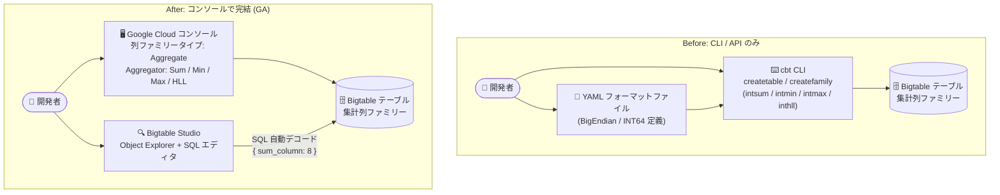

# Bigtable: Google Cloud コンソールでの集計列ファミリー (Aggregate Column Families) の作成・管理が GA

**リリース日**: 2026-09-01

**サービス**: Bigtable

**機能**: Google Cloud コンソールおよび Bigtable Studio での集計列ファミリーの作成・管理・クエリ

**ステータス**: GA (一般提供)

📊 [このアップデートのインフォグラフィックを見る](https://takech9203.github.io/google-cloud-news-summary/20260901-bigtable-aggregate-column-families-console-ga.html)

## 概要

Google Cloud コンソールを使用して、Bigtable テーブルの集計列ファミリー (aggregate column families) を作成・管理できるようになりました。また、Bigtable Studio で集計列ファミリーを表示・クエリすることも可能です。この機能は一般提供 (GA) となりました。

集計列ファミリーは、書き込み時にデータを自動集計する列ファミリーで、Sum (合計)、Min (最小値)、Max (最大値)、HyperLogLog (近似カーディナリティ) の 4 種類の集計タイプをサポートします。集計セルは CRDT (Conflict-free Replicated Data Type) 構造で増分更新に最適化されており、Apache Cassandra、Redis、Valkey などにおける「カウンター」に相当します。広告インプレッション数、週間アクティブユーザー数、メディアストリーミング数といった運用メトリクスを、ETL やストリーム処理ソフトウェアを介さずに書き込み時に集計できます。

今回の GA により、テーブル作成時・作成後の集計列ファミリーの追加、集計タイプやガベージコレクションポリシーの設定を GUI で完結できるようになり、Bigtable Studio の Object Explorer では集計列ファミリーが関数アイコンと集計タイプ付きで識別でき、SQL クエリ実行時には集計セルが自動でデコードされて表示されます。CLI やクライアントライブラリに慣れていない開発者・運用者でも、カウンター用途のスキーマ設計と検証をコンソールだけで行えます。

**アップデート前の課題**

- 集計列ファミリーの作成・管理は cbt CLI (`cbt createtable` / `cbt createfamily` の `intsum`、`intmin`、`intmax`、`inthll` 指定) やクライアントライブラリ経由で行う必要があった (gcloud CLI は列ファミリーの追加・削除に非対応)
- cbt CLI で集計セルの値を整数として読み取るには、エンコーディング (BigEndian/INT64) を定義した YAML フォーマットファイルを別途用意する必要があった
- コンソール上で列ファミリーが集計タイプかどうかを視覚的に確認する手段が限られていた

**アップデート後の改善**

- Google Cloud コンソールの「テーブルを作成」「編集」画面で、列ファミリータイプに「Aggregate」を選択し、Aggregator (Sum / Min / Max / HyperLogLog) とガベージコレクションポリシーを GUI で設定できるようになった
- Bigtable Studio の Object Explorer で集計列ファミリーが関数アイコンと集計タイプ (Sum など) 付きで表示され、ホバーで詳細を確認できるようになった
- Bigtable Studio のクエリエディタで SQL を実行すると、GoogleSQL が集計セルを自動デコードし、Sum / Min / Max の値を `{ "sum_column": 8 }` のような構造化 JSON として表示できるようになった

## アーキテクチャ図



従来は cbt CLI やクライアントライブラリが必須だった集計列ファミリーの作成・管理・読み取りが、コンソールと Bigtable Studio の GUI で完結するようになりました。

## サービスアップデートの詳細

### 主要機能

1. **コンソールでの集計列ファミリーの作成・管理**
   - テーブル作成時、または既存テーブルの編集時に「Add a column family」から列ファミリータイプとして「Aggregate」を選択可能
   - Aggregator フィールドで Sum / Min / Max / HyperLogLog の 4 種類から集計タイプを選択
   - 集計に応じたガベージコレクションポリシー (タイムバケットなどのデータ保持ポリシー) を設定可能

2. **Bigtable Studio での集計列ファミリーの表示**
   - Object Explorer のツリーで、集計列ファミリーは関数 (functions) アイコンと集計タイプ (Sum など) 付きで表示される
   - 列ファミリー名にホバーすると集計設定の詳細を確認できる
   - Explorer からテーブルへの列ファミリー追加、ガベージコレクションポリシーの編集も可能

3. **Bigtable Studio でのクエリと自動デコード**
   - クエリエディタで `SELECT * FROM \`table\`` などの SQL を実行すると、GoogleSQL が集計セルの型情報を自動で解釈
   - Sum / Min / Max の値は `{ "sum_column": 8 }` のような構造化 JSON オブジェクトとして結果テーブルに表示される
   - HyperLogLog (HLL) の値は確率的集合を表すため raw バイト / base64 で返され、カーディナリティ推定には GoogleSQL の HLL++ 関数 (`HLL_COUNT.EXTRACT`、`HLL_COUNT.MERGE` など) を使用する

## 技術仕様

### 集計タイプと動作

| 集計タイプ | 動作 | 入力型 | エンコーディング |
|-----------|------|--------|------------------|
| Sum | セル値を「既存値 + 新規値」の合計に置き換え | Int64 | BigEndianBytes |
| Min | 既存値と新規値の小さい方に置き換え | Int64 | BigEndianBytes |
| Max | 既存値と新規値の大きい方に置き換え | Int64 | BigEndianBytes |
| HyperLogLog (HLL) | 直近のリセット以降に追加された値の確率的集合に追加 | Bytes | Zetasketch HLL++ |

### 集計セルへの書き込み

集計セルの作成・更新には Data API のミューテーションタイプ `AddToCell` および `MergeToCell` を使用します。cbt CLI では以下のように書き込みます。

```bash
# 集計セルに値を加算 (row-key1 の sum_column に 5 を書き込み)
cbt addtocell counters_quickstart_table row-key1 sum_family:sum_column=5@0
```

## 設定方法

### 前提条件

1. Bigtable インスタンスが作成済みであること
2. Bigtable Studio でテーブルをクエリするには、対象インスタンスに対する `roles/bigtable.reader` (Bigtable 読み取り) などの IAM ロールが必要

### 手順

#### ステップ 1: コンソールで集計列ファミリーを持つテーブルを作成

1. Google Cloud コンソールの左ナビゲーションで「Tables」をクリックし、「Create table」を選択
2. テーブル ID を入力し、「Add a column family」をクリック
3. 列ファミリー名を入力し、「Column family type」で「Aggregate」を選択
4. 「Aggregator」リストから Sum / Min / Max / HyperLogLog を選択
5. ガベージコレクションポリシーを設定して「Done」→「Create」をクリック

既存テーブルへ追加する場合は、Tables ページで対象テーブルの「Edit」から同様に列ファミリーを追加できます。

#### ステップ 2: Bigtable Studio で確認・クエリ

1. ナビゲーションメニューで「Bigtable Studio」をクリック
2. Object Explorer で Tables → 対象テーブル → Column Families を展開し、関数アイコンと集計タイプを確認
3. エディタタブで SQL を実行

```sql
SELECT * FROM `counters_quickstart_table`
```

結果テーブルには集計セルが自動デコードされ、`{ "sum_column": 8 }` のような JSON 形式で表示されます。

## メリット

### ビジネス面

- **導入ハードルの低下**: CLI やクライアントライブラリの知識がなくても、GUI でカウンター用途のスキーマを設計・検証でき、リアルタイム集計機能の採用が容易になる
- **運用の効率化**: スキーマの確認・変更やデータの検証をコンソールで完結でき、チーム内での情報共有やトラブルシューティングが迅速になる

### 技術面

- **手動デコードが不要**: SQL クエリでは型情報が自動で解釈されるため、cbt CLI で必要だった YAML フォーマットファイルの定義や、アプリケーション側での BigEndianBytes デコードなしに値を確認できる
- **視認性の向上**: Object Explorer 上で集計列ファミリーがアイコンと集計タイプ付きで識別でき、標準列ファミリーとの混在環境でもスキーマを把握しやすい

## デメリット・制約事項

### 制限事項

- 非集計データを含む列ファミリーを集計列ファミリーに変換することはできない
- 集計列ファミリーの列に非集計セルを含めることはできず、標準列ファミリーに集計セルを含めることもできない
- Sum / Min / Max の入力型は Int64 のみ、HLL の入力型は Bytes のみ
- gcloud CLI では列ファミリーの追加・削除はできない (コンソール、cbt CLI、クライアントライブラリを使用)

### 考慮すべき点

- Data API の `ReadRows` メソッドで集計セルを読み取る場合はバイト列が返されるため、アプリケーション側でエンコーディング (BigEndianBytes など) に従ったデコードが必要 (SQL クエリでは自動デコード)
- HLL 値を SQL で選択すると raw バイト / base64 で返されるため、カウント推定には HLL++ 関数の使用が必須
- Bigtable Studio のクエリエディタでは Data Boost アプリプロファイルは使用できない

## ユースケース

### ユースケース 1: 広告インプレッションカウンターの GUI 管理

**シナリオ**: 広告配信システムで広告ごとのインプレッション数を Bigtable でリアルタイム集計している。運用チームが新しいメトリクス用の集計列ファミリーを追加し、値を確認したい。

**実装例**:
1. コンソールで対象テーブルの「Edit」を開き、「Aggregate」タイプ・Aggregator「Sum」の列ファミリーを追加
2. アプリケーションから `AddToCell` ミューテーションでインプレッションを加算
3. Bigtable Studio のクエリエディタで SQL を実行し、デコード済みのカウント値を確認

**効果**: CLI 環境のセットアップなしに、スキーマ変更から値の検証までをコンソールで完結できる。

### ユースケース 2: 週間アクティブユーザー数 (WAU) の近似カウント

**シナリオ**: サービスのユニークユーザー数を追跡したいが、正確なカウントは大規模データではコストが高い。HyperLogLog 集計列ファミリーでユーザー ID の近似カーディナリティを保持する。

**効果**: コンソールで HLL 集計列ファミリーを作成し、Bigtable Studio で `HLL_COUNT.EXTRACT` などの HLL++ 関数を使ってユニーク数を推定できる。ETL やストリーム処理基盤を追加せずに書き込み時集計が完結する。

## 料金

このアップデート (コンソール / Bigtable Studio での管理機能) 自体に追加料金はありません。集計列ファミリーを含む Bigtable の利用には、通常の Bigtable 料金 (ノード、ストレージ、ネットワーク) が適用されます。詳細は料金ページを参照してください。

- [Bigtable 料金ページ](https://cloud.google.com/bigtable/pricing)

## 関連サービス・機能

- **GoogleSQL for Bigtable**: Bigtable Studio のクエリエディタで使用する SQL。集計セルの型情報を自動で解釈し、HLL++ 関数によるカーディナリティ推定もサポート
- **Bigtable 連続マテリアライズドビュー**: 書き込み時集計のもう 1 つの手段。クエリ定義に基づいてデータを継続的に集計する読み取り専用リソース
- **ReadModifyWriteRow (Data API)**: セル値のインクリメントや追記をトランザクショナルに行う従来からの集計手段。CRDT ベースの集計セルと使い分ける
- **Dataflow**: 従来 Bigtable 書き込み前のストリーミング集計に使われることが多いが、集計セルを使えばデータを直接 Bigtable に送信して書き込み時集計が可能

## 参考リンク

- 📊 [インフォグラフィック](https://takech9203.github.io/google-cloud-news-summary/20260901-bigtable-aggregate-column-families-console-ga.html)
- [公式リリースノート (2026 年 9 月 1 日)](https://docs.cloud.google.com/release-notes#September_01_2026)
- [Aggregating values at write time (集計列ファミリーの概要)](https://docs.cloud.google.com/bigtable/docs/aggregates)
- [Create and manage tables (列ファミリーの追加)](https://docs.cloud.google.com/bigtable/docs/managing-tables#add-column-families)
- [Manage your data using Bigtable Studio](https://docs.cloud.google.com/bigtable/docs/manage-data-using-console)
- [Create and update counters in Bigtable (クイックスタート)](https://docs.cloud.google.com/bigtable/docs/create-update-counters)
- [Bigtable 料金ページ](https://cloud.google.com/bigtable/pricing)

## まとめ

Bigtable の集計列ファミリー (カウンター) が Google Cloud コンソールと Bigtable Studio から作成・管理・クエリできるようになり、GA として提供されました。これまで cbt CLI やクライアントライブラリが必要だったスキーマ管理と値の検証が GUI で完結し、SQL クエリでは集計セルが自動デコードされます。リアルタイムメトリクス集計を Bigtable で行っている、または検討しているチームは、まずコンソールから集計列ファミリーを作成し、Bigtable Studio でのクエリ体験を試すことをお勧めします。

---

**タグ**: Bigtable, Aggregate Column Families, Counters, Bigtable Studio, Google Cloud Console, GA, NoSQL, CRDT, HyperLogLog
