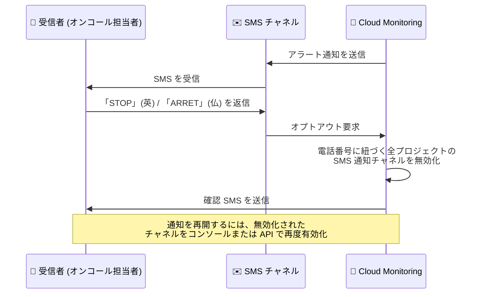

# Cloud Monitoring: SMS 通知チャネルのテキストメッセージによるオプトアウト

**リリース日**: 2026-09-01

**サービス**: Cloud Monitoring

**機能**: SMS 通知のオプトアウト (テキストメッセージによる配信停止)

**ステータス**: プレビュー (Preview)

📊 [このアップデートのインフォグラフィックを見る](https://takech9203.github.io/google-cloud-news-summary/20260901-cloud-monitoring-sms-opt-out.html)

## 概要

Cloud Monitoring の SMS 通知チャネルにおいて、通知の受信者が受け取った SMS に対してテキストメッセージを返信するだけで、アラート通知の受信を停止 (オプトアウト) できる機能が追加されました。受信者は「STOP」(英語) または「ARRET」(フランス語) と返信することで通知を停止でき、「HELP」(英語)、「AIDE」「INFO」(フランス語) と返信することでオプトアウト方法に関する情報を取得できます。

オプトアウトのメッセージを送信すると、Cloud Monitoring はその電話番号に関連付けられた **すべての Google Cloud プロジェクトにまたがるすべての通知チャネル** を無効化し、確認の SMS メッセージを送信します。英語とフランス語の 2 言語に対応しているのは、米国およびカナダの規制へのコンプライアンス要件によるものです。

この機能は、アラート通知の受信者 (オンコール担当者や運用チームのメンバーなど) が、Google Cloud コンソールへのアクセス権を持たない場合や、担当変更・退職などで通知が不要になった場合でも、自分自身で即座に通知を停止できるようにするものです。公式ドキュメントによると、本機能はプレビュー段階 (Pre-GA Offerings Terms が適用) です。

**アップデート前の課題**

- SMS 通知の受信を停止するには、Google Cloud コンソールまたは Cloud Monitoring API を使用して通知チャネルを編集・削除する必要があった
- 通知の受信者本人が Google Cloud プロジェクトへのアクセス権を持たない場合、管理者に依頼しない限り通知を止める手段がなかった
- 電話番号が複数プロジェクトの通知チャネルに登録されている場合、プロジェクトごとに個別の対応が必要だった

**アップデート後の改善**

- 受信した SMS に「STOP」(英語) または「ARRET」(フランス語) と返信するだけで通知をオプトアウトできるようになった
- 電話番号に関連付けられたすべての Google Cloud プロジェクトの通知チャネルが一括で無効化され、確認 SMS が送信されるようになった
- 「HELP」「AIDE」「INFO」の返信により、オプトアウト方法の案内を SMS で受け取れるようになった
- 米国・カナダの SMS 関連規制へのコンプライアンス対応が容易になった

## アーキテクチャ図



受信者が SMS 通知に「STOP」と返信すると、Cloud Monitoring がその電話番号に関連付けられたすべての通知チャネルを無効化し、確認メッセージを返す流れを示しています。

## サービスアップデートの詳細

### 主要機能

1. **テキストメッセージによるオプトアウト**
   - 受信した SMS 通知への返信として「STOP」(英語) または「ARRET」(フランス語) を送信すると、通知の受信を停止できる
   - Cloud Monitoring は、その電話番号に関連付けられた通知チャネルを **すべての Google Cloud プロジェクトにわたって** 無効化する
   - 無効化の完了後、確認の SMS メッセージが送信される

2. **オプトアウト方法の情報リクエスト**
   - 受信した SMS 通知への返信として「HELP」(英語)、「AIDE」または「INFO」(フランス語) を送信すると、オプトアウト方法に関する情報を取得できる

3. **オプトイン (通知の再開)**
   - オプトアウトにより無効化されたチャネルは、Google Cloud コンソールまたは Cloud Monitoring API で編集して再度有効化することで、通知の受信を再開できる
   - API の場合は `notificationChannels.patch` メソッド、gcloud CLI の場合は `gcloud beta monitoring channels update --enabled` で有効化できる

## 技術仕様

### オプトアウト用キーワード

| 操作 | 英語 | フランス語 |
|------|------|-----------|
| 通知のオプトアウト | STOP | ARRET |
| オプトアウト情報のリクエスト | HELP | AIDE / INFO |

- 対応言語が英語とフランス語であるのは、米国およびカナダの規制へのコンプライアンスのため
- オプトアウトの影響範囲は、その電話番号に関連付けられた **すべての Google Cloud プロジェクトの通知チャネル**

### 通知チャネルの再有効化 (gcloud CLI)

```bash
# 無効化された通知チャネルを再度有効化する
gcloud beta monitoring channels update \
  projects/PROJECT_ID/notificationChannels/CHANNEL_ID \
  --enabled
```

## 設定方法

### 前提条件

1. Cloud Monitoring で SMS 通知チャネルが設定済みで、電話番号の検証が完了していること
2. アラートポリシーの通知チャネルとして SMS が選択されていること

### 手順

#### オプトアウトする (受信者側の操作)

受信した SMS 通知に対して、以下のいずれかのメッセージを返信します。

- 英語: `STOP`
- フランス語: `ARRET`

Cloud Monitoring がその電話番号に関連付けられたすべての通知チャネルを無効化し、確認 SMS を送信します。

#### 通知を再開する (管理者側の操作)

無効化された通知チャネルを再度有効化します。

```bash
gcloud beta monitoring channels update \
  projects/PROJECT_ID/notificationChannels/CHANNEL_ID \
  --enabled
```

Google Cloud コンソールの場合は、「アラート」ページの「Edit notification channels」から対象の SMS チャネルを編集して有効化します。

## メリット

### ビジネス面

- **コンプライアンス対応**: 米国・カナダの SMS 関連規制で求められるオプトアウト手段 (STOP/ARRET キーワード対応) を標準機能として提供
- **問い合わせ対応の削減**: 受信者が自分で通知を停止できるため、「通知を止めてほしい」という管理者への依頼が不要になる

### 技術面

- **セルフサービスでの配信停止**: Google Cloud プロジェクトへのアクセス権を持たない受信者でも、SMS の返信だけで通知を停止できる
- **プロジェクト横断での一括無効化**: 電話番号に紐づく全プロジェクトの通知チャネルが一括で無効化されるため、プロジェクトごとの個別対応が不要

## デメリット・制約事項

### 制限事項

- プレビュー段階の機能であり、Pre-GA Offerings Terms が適用される (サポートが限定される可能性がある)
- オプトアウト用のテキストメッセージは英語またはフランス語のみに対応 (米国・カナダの規制対応のため)
- オプトアウトすると、その電話番号に関連付けられた **すべての Google Cloud プロジェクト** の通知チャネルが無効化される (特定プロジェクトのみの停止はできない)

### 考慮すべき点

- オンコール担当者が誤って「STOP」と返信すると、全プロジェクトのアラート通知が届かなくなるため、運用チーム内での周知が必要
- 通知の再開には、無効化されたチャネルをコンソールまたは API で再度有効化する管理者側の操作が必要
- 公式ドキュメントでは、SMS は信頼性の高い通知チャネルではなく、一部リージョンでは利用できない可能性があるため、SMS のみに依存せずメールなど追加の通知チャネルを設定することが推奨されている

## ユースケース

### ユースケース 1: 担当変更に伴う通知の即時停止

**シナリオ**: オンコールローテーションの変更や退職により、以前の担当者の電話番号にアラート SMS が届き続けている。担当者は Google Cloud コンソールへのアクセス権を持っていない。

**実装例**:
```text
受信した SMS 通知に「STOP」と返信
→ 電話番号に紐づく全プロジェクトの通知チャネルが無効化
→ 確認 SMS を受信
```

**効果**: 管理者への依頼やコンソール操作なしで、不要になった通知を受信者自身が即座に停止できる。

### ユースケース 2: 規制コンプライアンスを満たした SMS アラート運用

**シナリオ**: 米国・カナダのユーザーに SMS でアラート通知を送信しており、SMS メッセージング規制で求められるオプトアウト手段の提供が必要。

**効果**: STOP/ARRET キーワードによるオプトアウトと HELP/AIDE/INFO による情報提供が標準機能として組み込まれているため、追加の実装なしで規制要件に対応した SMS 通知運用ができる。

## 料金

このアップデートに伴う料金情報は Release Notes およびドキュメントに記載されていません。Cloud Monitoring の料金の詳細は [Google Cloud Observability の料金ページ](https://cloud.google.com/stackdriver/pricing) を参照してください。なお、SMS 通知にはメッセージ数の上限 (クォータ) があります。詳細は [Cloud Monitoring のクォータと上限](https://docs.cloud.google.com/monitoring/quotas) を参照してください。

## 関連サービス・機能

- **Cloud Monitoring 通知チャネル**: SMS のほか、メール、Slack、PagerDuty、Google Cloud コンソール モバイルアプリ、Webhook、Pub/Sub などの通知チャネルを提供。ドキュメントでは SMS のみに依存せず複数チャネルの併用が推奨されている
- **Cloud Monitoring API (notificationChannels)**: `notificationChannels.patch` メソッドで通知チャネルの有効化・無効化をプログラムから制御可能。オプトアウトで無効化されたチャネルの再有効化に使用する
- **Cloud Logging (Logs Explorer)**: 通知チャネルのエラーログ (SMS クォータ超過の「Denied quota token」など) を確認できる

## 参考リンク

- 📊 [インフォグラフィック](https://takech9203.github.io/google-cloud-news-summary/20260901-cloud-monitoring-sms-opt-out.html)
- [公式リリースノート](https://docs.cloud.google.com/release-notes#September_01_2026)
- [ドキュメント: Opt out of SMS notifications](https://docs.cloud.google.com/monitoring/alerts/sms-opt-out)
- [ドキュメント: 通知チャネルの作成と管理](https://docs.cloud.google.com/monitoring/support/notification-options)
- [ドキュメント: API による通知チャネルの作成と管理](https://docs.cloud.google.com/monitoring/alerts/using-channels-api)
- [料金ページ](https://cloud.google.com/stackdriver/pricing)

## まとめ

SMS 通知チャネルの受信者が「STOP」の返信だけでアラート通知をオプトアウトできるようになり、コンソールへのアクセス権を持たない受信者のセルフサービスでの配信停止と、米国・カナダの SMS 規制へのコンプライアンス対応が実現しました。オプトアウトは電話番号に紐づく全プロジェクトの通知チャネルを一括無効化するため、SMS を通知手段として利用しているチームは、誤操作時の再有効化手順の整備と、メールなど代替チャネルの併用を検討することを推奨します。

---

**タグ**: Cloud Monitoring, SMS, アラート通知, 通知チャネル, オプトアウト, Observability, プレビュー
