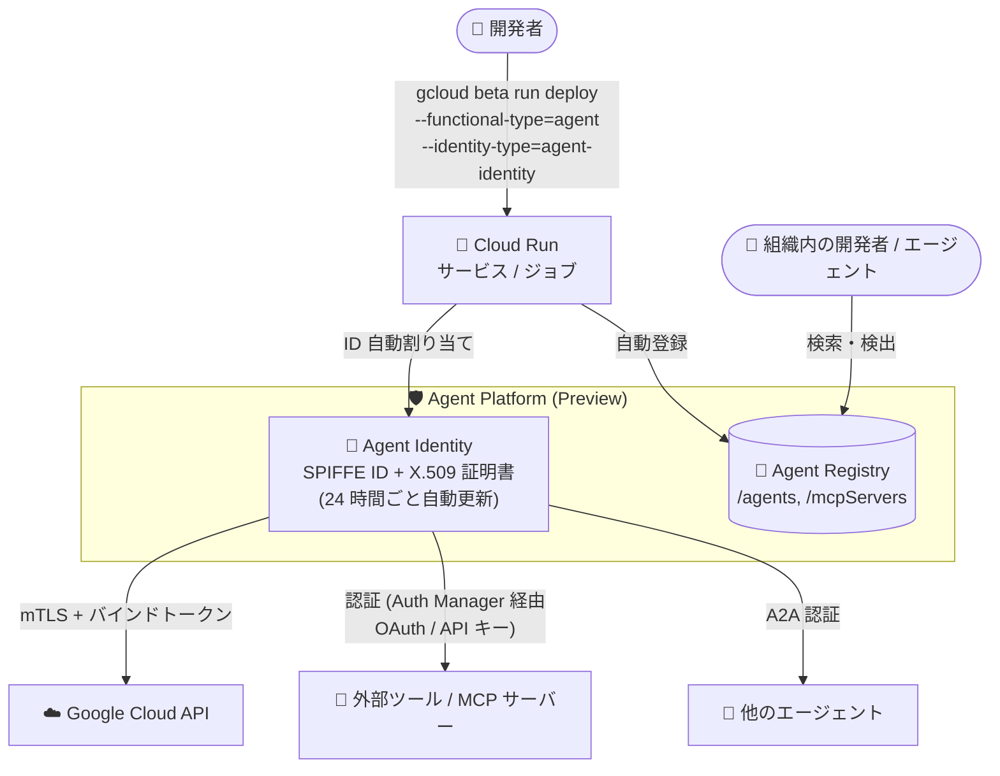

# Cloud Run: Agent Platform 機能 (Agent Identity / Agent Registry) のサポート (Preview)

**リリース日**: 2026-09-01

**サービス**: Cloud Run

**機能**: Agent Platform 機能の構成 (Agent Identity による認証と Agent Registry への自動登録)

**ステータス**: Preview

📊 [このアップデートのインフォグラフィックを見る](https://takech9203.github.io/google-cloud-news-summary/20260901-cloud-run-agent-platform-agent-identities.html)

## 概要

Cloud Run のサービスおよびジョブで、Gemini Enterprise Agent Platform の機能を構成できるようになりました (Preview)。システム管理型の **Agent Identity** を使用して AI エージェントや MCP サーバーを安全に認証できるほか、デプロイしたワークロードが **Agent Registry** に自動登録され、組織内での検出 (ディスカバリー) が可能になります。

Agent Identity は SPIFFE 標準に基づく暗号学的に検証可能な一意の ID をワークロードに割り当てる仕組みです。エージェントはこの ID を使って、他のエージェント、ツール、Google Cloud API に対して自身の権限で、またはエンドユーザーの代理として安全に認証できます。サービスアカウントと異なり、Agent Identity はデフォルトで複数ワークロード間で共有されず、権限借用 (impersonation) ができず、長期有効なキーの生成も許可されないため、エージェントワークロードに適したセキュリティ特性を持ちます。

対象ユーザーは、Cloud Run 上で AI エージェントや MCP サーバーをホストする開発者・プラットフォームチームです。`gcloud beta run deploy` に `--functional-type` と `--identity-type` フラグを指定するだけで、エージェントの ID 管理とカタログ登録が自動化されます。

**アップデート前の課題**

- Cloud Run 上のエージェントや MCP サーバーは標準のサービスアカウントで認証する必要があり、複数ワークロードでの共有や権限借用、長期有効なサービスアカウントキーの生成といったリスクを個別に管理する必要があった
- 組織内にデプロイされたエージェントや MCP サーバーを一元的に把握・検出する仕組みが Cloud Run に組み込まれておらず、ツールアクセスの分断や重複実装が発生しやすかった
- エージェントごとの最小権限の実現には、ワークロード単位でサービスアカウントを分離するなどの運用負荷が伴った

**アップデート後の改善**

- `--identity-type=agent-identity` を指定するだけで、ワークロードのライフサイクルに紐付いたシステム管理型の一意な ID (SPIFFE ID) と X.509 証明書が自動的に割り当てられ、mTLS による強力な認証が利用できるようになった
- `--functional-type=agent` または `--functional-type=mcp-server` を指定してデプロイすると、組織の Agent Registry (エージェントカタログ `/agents`、MCP サーバーカタログ `/mcpServers`) に自動登録され、組織内の他の開発者やエージェントから検出可能になった
- Google Cloud 向けのアクセストークンはエージェント固有の X.509 証明書に暗号学的にバインドされ、トークン窃取への耐性が向上した
- Identity-Aware Proxy を認証ポリシーとして使用した MCP サーバーの保護にも対応した

## アーキテクチャ図



開発者が functional type と identity type を指定して Cloud Run にデプロイすると、システム管理型の Agent Identity が割り当てられ、Agent Registry に自動登録されます。エージェントは mTLS と証明書バインドトークンで Google Cloud API や他のエージェント・ツールに安全に認証します。

## サービスアップデートの詳細

### 主要機能

1. **Agent Identity (システム管理型エージェント ID)**
   - SPIFFE 標準に基づく一意の ID 文字列 (`spiffe://TRUST_DOMAIN/resources/SERVICE/RESOURCE_PATH`) をワークロードに割り当て
   - X.509 証明書が自動プロビジョニングされ、有効期間 24 時間で自動更新される。Google Cloud API との直接通信ではデフォルトで mTLS を使用
   - `agent-identity` でのデプロイ時は ID 証明書がデフォルトで有効。オプトアウトは `--no-identity-certificate` フラグまたは `run.googleapis.com/identity-certificate-enabled: "false"` アノテーションで可能
   - IAM allow ポリシーでは `principal://agents.global.org-ORGANIZATION_ID.system.id.goog/resources/run/projects/PROJECT_NUMBER/locations/REGION/services/SERVICE_NAME` 形式のプリンシパルとして直接権限を付与

2. **Agent Registry への自動登録 (Preview)**
   - `--functional-type=agent` でデプロイしたワークロードはエージェントカタログ (`/agents`) に、`--functional-type=mcp-server` は MCP サーバーカタログ (`/mcpServers`) に自動登録
   - A2A (Agent2Agent) プロトコルを実装するエージェントについては、Agent Card から A2A スキルと機能が自動抽出される
   - 組織内の開発者やオーケストレーターエージェントがキーワード検索・プレフィックス検索でエージェントやツールを検出可能

3. **functional type と identity type による構成**
   - **functional type**: ワークロードの主目的を宣言 (`agent` または `mcp-server`)。一度設定すると変更・解除は不可
   - **identity type**: ワークロードに割り当てる ID の種類 (`agent-identity` または `service-account`)。こちらも一度設定すると変更・解除は不可
   - `functional-type=agent` の場合は `identity-type=agent-identity` が必須。`mcp-server` はどちらの identity type も使用可能 (未指定時は service-account)

4. **MCP サーバーのセキュリティ強化**
   - Identity-Aware Proxy (IAP) を認証ポリシーとして使用し、MCP サーバーを保護可能
   - Cloud Run サービスのみ MCP サーバーとして公開可能 (Cloud Run ジョブは `agent` functional type のみサポート)

## 技術仕様

### functional type と identity type の組み合わせ

| functional type | identity type | 動作 |
|------|------|------|
| `agent` | `agent-identity` | Agent Registry にエージェントとして登録され、システム管理型 Agent Identity が割り当てられる |
| `agent` | それ以外 / 未指定 | エラー (`agent` には `agent-identity` が必須) |
| `mcp-server` | `agent-identity` / `service-account` / 未指定 | Agent Registry に MCP サーバー (`/mcpServers`) として登録。未指定時はサービスアカウント ID がデフォルト |
| 未指定 | `service-account` | 従来どおりの標準的な Cloud Run サービス / ジョブとして動作 |

### 前提となる API と IAM ロール

| 項目 | 詳細 |
|------|------|
| 必要な API | Cloud Run Admin API、Identity and Access Management API、Agent Registry API、App Hub API |
| Cloud Run リソースのデプロイ・管理 | Cloud Run Admin (`roles/run.admin`) |
| App Hub リソースの管理 | App Hub Admin (`roles/apphub.admin`) または Agent Registry API Admin (`roles/apiregistry.admin`) |
| 特定 ID でのデプロイ | IAM Service Account User (`roles/iam.serviceAccountUser`) または IAM Service Account Admin (`roles/iam.serviceAccountAdmin`) |
| その他の前提 | プロジェクトまたは組織で Agent Registry のセットアップが完了していること |

## 設定方法

### 前提条件

1. Cloud Run Admin API、IAM API、Agent Registry API、App Hub API を有効化する
2. プロジェクトまたは組織で Agent Registry をセットアップする
3. gcloud CLI をインストールし、`gcloud components update` で最新化する

### 手順

#### ステップ 1: エージェントとしてサービスをデプロイ

```bash
gcloud beta run deploy SERVICE_NAME \
  --image=IMAGE_URL \
  --functional-type=agent \
  --identity-type=agent-identity
```

エージェントとして Agent Registry に登録され、システム管理型の Agent Identity が割り当てられます。

#### ステップ 2: MCP サーバーとしてサービスをデプロイ (任意)

```bash
gcloud beta run deploy SERVICE_NAME \
  --image=IMAGE_URL \
  --functional-type=mcp-server \
  --identity-type=IDENTITY_TYPE   # agent-identity または service-account (省略時は service-account)
```

MCP サーバーとして Agent Registry の `/mcpServers` カタログに登録されます。

#### ステップ 3: エージェントジョブの作成 (任意)

```bash
gcloud beta run jobs create JOB_NAME \
  --image=IMAGE_URL \
  --functional-type=agent \
  --identity-type=agent-identity
```

#### ステップ 4: 割り当てられた ID の確認

```bash
# サービスの場合 (リビジョンを確認)
gcloud beta run revisions describe REVISION_NAME

# ジョブの場合 (実行を確認)
gcloud beta run jobs executions describe EXECUTION_NAME
```

出力に割り当てられた Agent Identity が表示されます。コンソールではサービスのリビジョンの「Security」タブでも確認できます。

## メリット

### ビジネス面

- **ガバナンスの強化**: 組織内のエージェントと MCP サーバーが Agent Registry に一元的にカタログ化され、どのエージェントがどのデータにアクセスできるかを統制しやすくなる
- **開発の加速**: 既存のエージェント・ツール・スキルを組織内で検出・再利用でき、重複実装やプロセスごとのカスタム統合が不要になる
- **監査性の向上**: エージェントが自身として行動する場合もユーザーの代理で行動する場合も、明確な監査ログが記録される

### 技術面

- **強力な分離**: Agent Identity はデフォルトで複数ワークロード間で共有されず、権限借用や長期有効キーの生成ができないため、過剰権限のエージェントを排除できる
- **認証情報の保護**: アクセストークンがエージェント固有の X.509 証明書にバインドされ、Context-Aware Access ポリシーによりトークンのリプレイが防止される
- **運用の自動化**: X.509 証明書は自動プロビジョニング・自動更新 (24 時間有効) され、証明書管理の運用負荷がない
- **ポリシー統合**: IAM の allow/deny ポリシー、Principal Access Boundary (PAB)、VPC Service Controls と統合されている

## デメリット・制約事項

### 制限事項

- Preview 機能であり、Pre-GA Offerings Terms が適用される (サポートが限定される可能性がある)
- functional type と identity type は一度設定すると変更・解除ができない
- Cloud Run ジョブは MCP サーバーとして公開できない (`agent` functional type のみサポート)
- Agent Identity には Cloud Storage のレガシーバケットロール (例: `storage.legacyBucketReader`) を付与できない
- Agent Registry の自動登録は単一プロジェクトのスコープで動作する (マルチプロジェクトの一元管理には手動登録が必要)

### 考慮すべき点

- 既存サービスをサービスアカウントから `agent-identity` に更新すると、新しいプリンシパルが割り当てられ、従来のサービスアカウントの権限を引き継がない。接続断を避けるには、Policy Analyzer で必要なロールを特定して事前に新プリンシパルへ付与するか、`--no-traffic` で更新して権限設定後にトラフィックを移行する
- 事前に組織 / プロジェクトで Agent Registry のセットアップが必要
- gcloud の beta コンポーネント (`gcloud beta run`) を使用する必要がある

## ユースケース

### ユースケース 1: 社内向け AI エージェントの安全な Google Cloud API アクセス

**シナリオ**: Cloud Run 上にホストした AI エージェントが、BigQuery や Cloud Storage などの Google Cloud サービスに自身の権限でアクセスする。共有サービスアカウントによる過剰権限を避けたい。

**実装例**:
```bash
gcloud beta run deploy my-agent \
  --image=us-docker.pkg.dev/PROJECT/repo/agent:latest \
  --functional-type=agent \
  --identity-type=agent-identity

# エージェント固有のプリンシパルに最小権限を付与
gcloud projects add-iam-policy-binding PROJECT_ID \
  --member="principal://agents.global.org-ORG_ID.system.id.goog/resources/run/projects/PROJECT_NUMBER/locations/REGION/services/my-agent" \
  --role="roles/bigquery.dataViewer"
```

**効果**: エージェントごとに一意な ID に対して直接権限を付与でき、最小権限の原則を実現。トークンは証明書にバインドされ、窃取されても再利用できない。

### ユースケース 2: 組織内 MCP サーバーのカタログ化と検出

**シナリオ**: 複数チームがそれぞれ Cloud Run 上に MCP サーバー (社内 API のツール群) をホストしており、他チームのオーケストレーターエージェントから検出・再利用できるようにしたい。

**効果**: `--functional-type=mcp-server` でデプロイするだけで Agent Registry の `/mcpServers` カタログに自動登録され、組織内の開発者やエージェントが検索ツール (search_mcp_servers など) で検出可能になる。重複実装を削減し、IAP による認証ポリシーで安全に公開できる。

## 料金

Agent Platform 機能を利用する Cloud Run ワークロード自体には、Cloud Run の標準料金 (CPU、メモリ、ネットワーク下り) が適用されます。詳細は各料金ページを参照してください。

- [Cloud Run の料金](https://cloud.google.com/run/pricing)
- [Gemini Enterprise Agent Platform の料金](https://cloud.google.com/products/agent-builder/pricing)

## 利用可能リージョン

公式ドキュメントにリージョン制限の記載は確認できませんでした。最新情報は [Agent Platform 機能のドキュメント](https://docs.cloud.google.com/run/docs/ai/agent-platform-features) を参照してください。

## 関連サービス・機能

- **Gemini Enterprise Agent Platform**: Agent Identity と Agent Registry を提供するプラットフォーム。エージェントの構築・デプロイ・ガバナンスの基盤
- **Agent Registry**: エージェント、MCP サーバー、スキル、エンドポイントを一元管理するカタログ。GKE や Agent Runtime からの自動登録にも対応
- **Agent Identity auth manager**: エージェントの外部ツール認証 (API キー、2-legged/3-legged OAuth) を仲介する認証情報ボールト
- **Identity-Aware Proxy (IAP)**: MCP サーバーの認証ポリシーとして利用可能
- **Policy Analyzer**: 既存サービスを agent-identity に移行する際、必要なロールの特定に使用
- **Agent Development Kit (ADK)**: カスタムエージェントを構築し Agent Registry に登録するためのフレームワーク
- **VPC Service Controls / Principal Access Boundary**: Agent Identity と統合されたセキュリティ境界・アクセス制御

## 参考リンク

- 📊 [インフォグラフィック](https://takech9203.github.io/google-cloud-news-summary/20260901-cloud-run-agent-platform-agent-identities.html)
- [公式リリースノート](https://docs.cloud.google.com/release-notes#September_01_2026)
- [ドキュメント: Configure Agent Platform features for Cloud Run](https://docs.cloud.google.com/run/docs/ai/agent-platform-features)
- [ドキュメント: Agent Identity overview](https://docs.cloud.google.com/gemini-enterprise-agent-platform/govern/agent-identity-overview)
- [ドキュメント: Agent Registry overview](https://docs.cloud.google.com/agent-registry/overview)
- [ドキュメント: AI agents on Cloud Run](https://docs.cloud.google.com/run/docs/ai-agents)
- [料金ページ](https://cloud.google.com/run/pricing)

## まとめ

Cloud Run 上のエージェントと MCP サーバーに、SPIFFE ベースのシステム管理型 Agent Identity と Agent Registry への自動登録が組み込まれ、エージェントワークロードのセキュリティとガバナンスがプラットフォームレベルで強化されました。Cloud Run で AI エージェントをホストしているチームは、Preview 段階から `--functional-type` / `--identity-type` フラグを試し、サービスアカウント共有から per-agent の最小権限モデルへの移行を検討することを推奨します。既存サービスの移行時は権限の引き継ぎがない点に注意し、Policy Analyzer と `--no-traffic` を活用した段階的な移行を計画してください。

---

**タグ**: `Cloud Run`, `Agent Identity`, `Agent Registry`, `Gemini Enterprise Agent Platform`, `MCP`, `AI エージェント`, `SPIFFE`, `セキュリティ`, `Preview`
