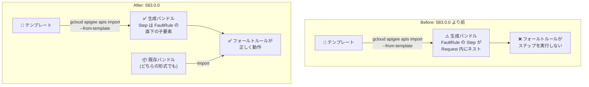

# Cloud SDK (gcloud): バージョン 583.0.0 リリース

**リリース日**: 2026-09-01

**サービス**: Cloud SDK (gcloud CLI)

**機能**: Cloud SDK 583.0.0 リリース (AlloyDB PostgreSQL 19 対応、Apigee フォールトルール修正ほか)

**ステータス**: Change (リリース)

📊 [このアップデートのインフォグラフィックを見る](https://takech9203.github.io/google-cloud-news-summary/20260901-cloud-sdk-583-0-0.html)

## 概要

2026 年 9 月 1 日、Google Cloud CLI (gcloud) のバージョン 583.0.0 がリリースされた。本リリースには AlloyDB、Apigee、BigQuery、Cloud Composer、Cloud Run、Compute Engine など、多数のサービスにまたがるコマンドの追加・修正・昇格が含まれている。

主なハイライトは 2 点。1 つ目は AlloyDB で、`alloydb clusters create` および `alloydb clusters migrate-cloud-sql` コマンドの alpha / beta トラックにおいて、データベースバージョンとして `POSTGRES_19` の指定がサポートされた。2 つ目は Apigee で、`gcloud apigee apis import --from-template` が `<FaultRule>` / `<DefaultFaultRule>` のステップを `<Request>` 要素の内側にネストして出力してしまい、生成されたフォールトルールがステップを一切実行しないという不具合が修正された。ステップはフォールトルールの直下の子要素として出力されるようになり、バンドルのインポート時にはどちらの形式でもフォールトルールが正しく読み取られる。

そのほか、Cloud Composer 環境のハイバネート/再開コマンド (beta) の追加、Compute Engine のリカバラブルスナップショット関連コマンドの beta 昇格、Cluster Director の GA 昇格、Cloud Bigtable Emulator の CVE-2026-27140 対応など、gcloud CLI を日常的に利用するすべてのエンジニアに関係する更新が含まれる。

**アップデート前の課題**

- AlloyDB のクラスタ作成・Cloud SQL からの移行コマンドで、`POSTGRES_19` をバージョンとして指定できなかった
- `gcloud apigee apis import --from-template` が生成するプロキシバンドルでは、フォールトルールのステップが `<Request>` 要素内にネストされてしまい、生成されたフォールトルールがステップを実行しない状態になっていた
- フォールトルールに `mode` フィールドが設定されている場合の扱いが不明確だった (このフィールドはフローにのみ適用される)
- Cloud Composer 環境を一時停止・再開する gcloud コマンドが存在しなかった
- Compute Engine のリカバラブルスナップショット (削除済みスナップショットの復元) 関連コマンドは beta 未満のトラックにとどまっていた

**アップデート後の改善**

- `alloydb clusters create` / `alloydb clusters migrate-cloud-sql` (alpha / beta) で `POSTGRES_19` を指定できるようになった
- Apigee のテンプレートインポートでフォールトルールのステップが直下の子要素として正しく出力され、既存のどちらの形式のバンドルでもインポート時に正しく読み取られるようになった
- フォールトルールに `mode` フィールドが設定されている場合は無視し、警告をログ出力するようになった
- `gcloud beta composer environments hibernate` / `resume` により Composer 環境の休止・再開が CLI から可能になった
- `gcloud compute recoverable-snapshots` 系コマンド (recover / delete / describe / list / set-iam-policy / test-iam-permissions) が beta に昇格した

## アーキテクチャ図



Apigee のフォールトルール生成不具合の Before/After。583.0.0 ではステップがフォールトルール直下に出力され、インポート時はいずれの形式のバンドルも正しく読み取られる。

## サービスアップデートの詳細

### 主要機能

1. **AlloyDB: `POSTGRES_19` バージョンのサポート (alpha / beta)**
   - `alloydb clusters create` でクラスタ作成時のバージョンとして `POSTGRES_19` を指定可能に
   - `alloydb clusters migrate-cloud-sql` での Cloud SQL からの移行時にも `POSTGRES_19` を指定可能に
   - いずれも alpha および beta トラックでの対応

2. **Apigee: `apis import --from-template` のフォールトルール修正**
   - `<FaultRule>` / `<DefaultFaultRule>` のステップが `<Request>` 要素内にネストされ、生成されたフォールトルールがステップを実行しない不具合を修正
   - ステップはフォールトルールの直下の子要素として出力されるようになった
   - バンドルのインポート時には、どちらの形式でもフォールトルールを正しく読み取る
   - フォールトルールに `mode` フィールドが設定されている場合は無視して警告をログ出力する (同フィールドはフローにのみ適用)

3. **BigQuery: 接続・予約関連の bq コマンド強化**
   - `bq mk --connection` / `bq update --connection` に Azure 接続向けの `--service_directory_service` フラグを追加
   - `--s3_service_directory_service` フラグを非推奨化 (AWS 接続でも `--service_directory_service` を使用)
   - `bq show` で予約グループの `creationTime` / `updateTime` を表示
   - 予約割り当て向けに `bq mk` / `bq update` へ `--precedence` / `--condition` フラグを追加

4. **Cloud Composer: 環境のハイバネート/再開 (beta)**
   - `gcloud beta composer environments hibernate` / `resume` コマンドを追加
   - `gcloud beta composer environments create` に `--enable-development-mode` フラグを追加

5. **Cloud Run: Agent Registry / Agent Identity 対応フラグ (beta)**
   - `gcloud run deploy` / `gcloud run services update` の beta トラックに `--identity-certificate`、`--identity-type`、`--functional-type` フラグを追加
   - `gcloud beta run jobs` コマンドグループにも同フラグを追加
   - GPU 構成かつタスクタイムアウトが 1 時間超の Cloud Run ジョブ作成・更新時に対話型プロンプトを表示 (`gcloud beta run jobs`)

6. **Compute Engine: リカバラブルスナップショットの beta 昇格ほか**
   - `gcloud compute recoverable-snapshots` の recover / delete / describe / list / set-iam-policy / test-iam-permissions が beta に昇格
   - `gcloud compute snapshot-recycle-bin-policy describe` / `patch`、`snapshots get-effective-recycle-bin-rule` も beta に昇格
   - MIG の stop-instances / delete-instances / recreate-instances / delete コマンドに `--no-graceful-shutdown` フラグを全リリーストラックで追加
   - `backend-services create` / `update` に外れ値検出を構成する `--outlier-detection-*` フラグを追加

7. **その他の注目更新**
   - **Cluster Director**: `gcloud cluster-director` が GA に昇格。リファレンスアーキテクチャ使用時にカスタムストレージ構成 (`--filestores` など) を明示指定してもデフォルトストレージが自動注入される問題を修正
   - **Cloud Bigtable Emulator**: Go 1.25.9 で再ビルドし CVE-2026-27140 を修正
   - **Cloud SQL**: `cloud-sql-proxy` パッケージコンポーネントを Cloud SQL Proxy 2.25.3 に更新
   - **Cloud Storage**: `gcloud storage` の RAPID storage 向け gRPC 双方向ストリーミングのダウンロード性能を調整
   - **Kubernetes Engine**: デフォルト kubectl を 1.35.6 から 1.35.7 に更新 (追加バージョン: 1.31.14 / 1.32.13 / 1.33.13 / 1.34.11 / 1.35.8 / 1.36.4)
   - **Cloud Access Context Manager**: `lookup-configured-perimeter` が beta / GA に昇格
   - **Distributed Cloud Edge**: `gcloud edge-cloud` の zones / services / projects / service-accounts / api-keys 系コマンドが GA に昇格
   - **Transfer**: `transfer jobs create` / `update` の `--match-glob` フラグが GA に昇格
   - **Database Migration**: クイックスタート移行向けに同種 MySQL 宛先接続プロファイルをサポート
   - **Network Services**: `telemetry-policies` の delete / describe / list / export / import が beta に昇格
   - **Orchestration Pipelines**: `gcloud orchestration-pipelines deploy` でパイプライン構成から動的参照できるデフォルト変数 `BUNDLE_ID` を追加

## 技術仕様

### リリース情報

| 項目 | 詳細 |
|------|------|
| バージョン | 583.0.0 |
| リリース日 | 2026-09-01 |
| 対象コンポーネント | gcloud、bq、gcloud storage、cbt エミュレータ、kubectl、cloud-sql-proxy など |
| セキュリティ修正 | Cloud Bigtable Emulator: CVE-2026-27140 (Go 1.25.9 で再ビルド) |
| アナウンス購読 | google-cloud-sdk-announce Google グループ |

## 設定方法

### 前提条件

1. gcloud CLI がインストール済みであること
2. パッケージマネージャー (apt / yum) 経由でインストールした場合はコンポーネントマネージャーが無効のため、パッケージマネージャーで更新すること

### 手順

#### ステップ 1: 現在のバージョンを確認

```bash
gcloud version
```

現在インストールされている gcloud CLI およびコンポーネントのバージョンを確認する。

#### ステップ 2: 583.0.0 へ更新

```bash
gcloud components update
```

インタラクティブインストーラーなどでインストールした場合は上記コマンドで最新版 (583.0.0) に更新できる。特定バージョンを指定する場合は `gcloud components update --version 583.0.0` を使用する。

#### ステップ 3: 新機能の利用例

```bash
# AlloyDB クラスタを PostgreSQL 19 で作成 (beta)
gcloud beta alloydb clusters create my-cluster \
  --database-version=POSTGRES_19 \
  --region=asia-northeast1 \
  --password=PASSWORD

# Cloud Composer 環境のハイバネートと再開 (beta)
gcloud beta composer environments hibernate my-env --location=asia-northeast1
gcloud beta composer environments resume my-env --location=asia-northeast1
```

## メリット

### ビジネス面

- **不具合修正の早期適用**: Apigee のフォールトルールがステップを実行しない不具合は API の障害処理に直結するため、テンプレートからプロキシを生成しているチームは更新によりリスクを排除できる
- **セキュリティ対応**: Cloud Bigtable Emulator の CVE-2026-27140 修正により、ローカル開発環境の脆弱性を解消できる

### 技術面

- **新バージョンへの追随**: AlloyDB で PostgreSQL 19 を CLI から指定でき、新バージョンの検証を早期に開始できる (alpha / beta)
- **運用の自動化**: Composer のハイバネート/再開、MIG の `--no-graceful-shutdown`、リカバラブルスナップショット操作などが CLI で完結し、スクリプトや CI/CD への組み込みが容易になる

## デメリット・制約事項

### 制限事項

- AlloyDB の `POSTGRES_19` サポートは alpha / beta トラックのみで、GA トラックの `gcloud alloydb` コマンドでは未対応
- `--s3_service_directory_service` フラグは非推奨となったため、`--service_directory_service` への移行が必要
- Apigee のフォールトルールで `mode` フィールドは無視され警告が出る (同フィールドはフロー専用)

### 考慮すべき点

- パッケージマネージャー (apt / yum) でインストールした環境では `gcloud components update` が使えないため、パッケージマネージャー経由で更新する
- 583.0.0 より前のバージョンで `--from-template` から生成した Apigee プロキシバンドルは、フォールトルールが機能していない可能性があるため再生成・再確認を推奨
- beta / alpha コマンドの利用には `beta` / `alpha` コンポーネントのインストールが必要

## ユースケース

### ユースケース 1: Apigee プロキシテンプレートからの再生成

**シナリオ**: テンプレートから `gcloud apigee apis import --from-template` で API プロキシを生成しており、フォールトルールによるエラーハンドリングを構成している。

**実装例**:
```bash
# gcloud を 583.0.0 に更新後、テンプレートから再生成してインポート
gcloud components update
gcloud apigee apis import my-proxy --from-template=TEMPLATE_PATH
```

**効果**: フォールトルールのステップが正しく直下の子要素として出力され、エラー発生時に意図したステップが実行されるようになる。

### ユースケース 2: AlloyDB での PostgreSQL 19 の早期検証

**シナリオ**: AlloyDB で PostgreSQL 19 の新機能や互換性を本番導入前に検証したい。あるいは Cloud SQL から AlloyDB への移行時に PostgreSQL 19 を採用したい。

**効果**: `gcloud beta alloydb clusters create --database-version=POSTGRES_19` や `alloydb clusters migrate-cloud-sql` で新バージョンのクラスタを CLI から作成・移行でき、検証環境の構築を自動化できる。

## 料金

gcloud CLI (Cloud SDK) 自体の利用は無料。CLI から操作する各 Google Cloud サービス (AlloyDB、Apigee、BigQuery など) の利用には各サービスの料金が適用される。

## 利用可能リージョン

gcloud CLI はローカルツールのためリージョンの制約はない。各コマンドが操作するサービスのリージョン可用性は各サービスのドキュメントを参照。

## 関連サービス・機能

- **AlloyDB for PostgreSQL**: `POSTGRES_19` バージョン指定の対象サービス
- **Apigee**: `apis import --from-template` のフォールトルール修正の対象サービス
- **Cloud Composer**: ハイバネート/再開コマンド (beta) の対象サービス
- **Compute Engine**: リカバラブルスナップショット、MIG、バックエンドサービス関連フラグの対象サービス
- **Cloud SQL Proxy**: パッケージコンポーネントが 2.25.3 に更新

## 参考リンク

- 📊 [インフォグラフィック](https://takech9203.github.io/google-cloud-news-summary/20260901-cloud-sdk-583-0-0.html)
- [Cloud SDK リリースノート](https://cloud.google.com/sdk/docs/release-notes)
- [Google Cloud リリースノート (2026-09-01)](https://docs.cloud.google.com/release-notes#September_01_2026)
- [google-cloud-sdk-announce (アナウンス購読)](https://groups.google.com/forum/#!forum/google-cloud-sdk-announce)
- [gcloud CLI コンポーネントの管理](https://docs.cloud.google.com/sdk/docs/components)
- [gcloud components update リファレンス](https://docs.cloud.google.com/sdk/gcloud/reference/components/update)

## まとめ

Cloud SDK 583.0.0 は、AlloyDB の PostgreSQL 19 対応 (alpha / beta) と Apigee のフォールトルール生成不具合の修正を筆頭に、多数のサービスにわたる CLI 強化を含むリリースである。特に `--from-template` で Apigee プロキシを生成しているチームは、旧バージョンで生成したバンドルのフォールトルールが機能していない可能性があるため、早めの更新と再生成を推奨する。`gcloud components update` で 583.0.0 への更新を行い、CVE 修正を含む最新のコンポーネントを適用してほしい。

---

**タグ**: Cloud SDK, gcloud, AlloyDB, Apigee, BigQuery, Cloud Composer, Cloud Run, Compute Engine, CLI, リリース
