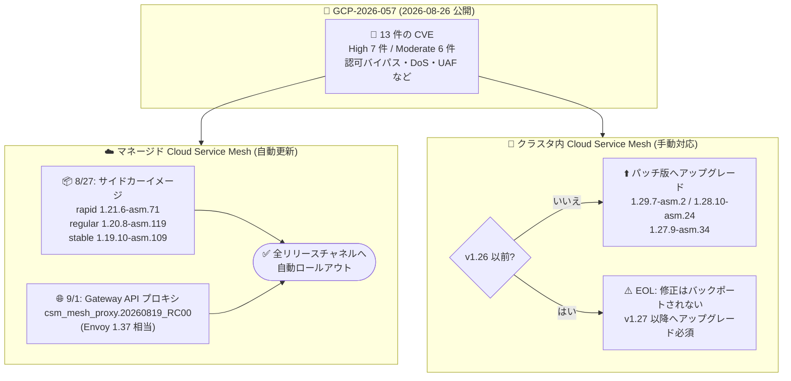

# Cloud Service Mesh: Gateway API 向けプロキシ更新 (GCP-2026-057 脆弱性修正)

**リリース日**: 2026-09-01

**サービス**: Cloud Service Mesh

**機能**: Gateway API 向け新プロキシバージョン csm_mesh_proxy.20260819_RC00 のロールアウト (セキュリティ修正)

**ステータス**: Security (全リリースチャネルにロールアウト中)

📊 [このアップデートのインフォグラフィックを見る](https://takech9203.github.io/google-cloud-news-summary/20260901-cloud-service-mesh-gcp-2026-057.html)

## 概要

マネージド Cloud Service Mesh が、GKE クラスタ上の Gateway API 向けに新しいプロキシバージョン **csm_mesh_proxy.20260819_RC00** の使用を開始します。このプロキシバージョンは **Envoy バージョン 1.37** に最も近いバージョンに対応します。この変更はすべてのリリースチャネル (rapid / regular / stable) にロールアウトされており、セキュリティ情報 **GCP-2026-057** に記載されたマネージド Cloud Service Mesh の脆弱性に対する修正が含まれています。

GCP-2026-057 (公開日: 2026-08-26) は、Envoy ベースのプロキシに存在する **13 件の CVE** (重要度 High が 7 件、Moderate が 6 件) をまとめたセキュリティ情報です。HTTP/2 のストリーム状態破壊による異常終了、RBAC ポリシーのフェイルオープン (認可バイパス)、QUIC/HTTP3 での use-after-free、パス正規化不備による認可ポリシーバイパスなど、サービスメッシュのデータプレーンに影響する脆弱性が修正されています。

なお、GCP-2026-057 への対応としては、2026 年 8 月 27 日にサイドカー用イメージ (rapid: 1.21.6-asm.71、regular: 1.20.8-asm.119、stable: 1.19.10-asm.109) のロールアウトが先行して発表されており、今回のアップデートは Gateway API で使用されるプロキシに対する修正のロールアウトにあたります。マネージド Cloud Service Mesh のユーザーは自動的に更新されるため、原則として追加のアクションは不要です。一方、**クラスタ内 (in-cluster) Cloud Service Mesh** のユーザーは、パッチ適用済みバージョンへの手動アップグレードが必要です。

**アップデート前の課題**

- GKE クラスタ上の Gateway API で使用されるマネージド Cloud Service Mesh のプロキシに、GCP-2026-057 に記載された 13 件の CVE (High 7 件、Moderate 6 件) の脆弱性が存在していた
- 非 UTF-8 の HTTP ヘッダーバイトや、パスパラメータを含む URL の正規化不備により、RBAC / 認可ポリシーがバイパスされる (フェイルオープンする) 可能性があった (CVE-2026-73552、CVE-2026-48521、CVE-2026-73550 など)
- 不正な HTTP/2 / HTTP/3 / QUIC トラフィックにより、プロキシプロセスが異常終了 (DoS) する可能性があった (CVE-2026-73513、CVE-2026-73512 など)

**アップデート後の改善**

- Gateway API 向けプロキシが csm_mesh_proxy.20260819_RC00 (Envoy 1.37 相当) に更新され、GCP-2026-057 に記載された全 CVE の修正が適用される
- すべてのリリースチャネル (rapid / regular / stable) に自動的にロールアウトされるため、マネージド Cloud Service Mesh のユーザーは手動対応なしで保護される
- RBAC / 認可ポリシーのパスマッチングとルーティングのパスパラメータ処理が一貫化され、認可バイパスのリスクが解消される

## アーキテクチャ図



GCP-2026-057 の脆弱性修正は、マネージド Cloud Service Mesh では自動ロールアウト (サイドカーイメージと Gateway API プロキシの 2 経路)、クラスタ内 Cloud Service Mesh ではパッチ版への手動アップグレードで適用されます。

## サービスアップデートの詳細

### 主要機能

1. **Gateway API 向け新プロキシバージョンのロールアウト**
   - GKE クラスタ上の Gateway API 向けに csm_mesh_proxy.20260819_RC00 の使用を開始
   - Envoy バージョン 1.37 に最も近いバージョンに対応
   - すべてのリリースチャネル (rapid / regular / stable) が対象

2. **GCP-2026-057 に記載された 13 件の CVE の修正**
   - 重要度 High: 7 件、Moderate: 6 件
   - すべての Cloud Service Mesh バージョンが影響を受ける
   - 認可バイパス、プロセス異常終了 (DoS)、use-after-free、レスポンスポイズニング、XSS などを修正

3. **マネージド版は自動更新、クラスタ内版は手動アップグレード**
   - マネージド Cloud Service Mesh: 数週間かけてシステムが自動的に更新される (すべてのバージョンがサポート対象)
   - クラスタ内 Cloud Service Mesh: 1.29.7-asm.2 / 1.28.10-asm.24 / 1.27.9-asm.34 へのアップグレードが必要
   - v1.26 以前は EOL (サポート終了) のため修正はバックポートされず、v1.27 以降へのアップグレードが必須

## 技術仕様

### GCP-2026-057 で修正される CVE 一覧

| CVE | 重要度 | 内容 |
|------|--------|------|
| CVE-2026-73513 | High | 信頼できないアップストリームが END_STREAM フラグなしの HTTP/2 レスポンストレーラーを oghttp2 インスタンスに送信すると、ストリーム状態が破壊されプロセスが異常終了する問題を修正 |
| CVE-2026-73552 | High | safe_regex マッチングが非 UTF-8 の HTTP ヘッダーバイトを通常の不一致として扱い、否定マッチングロジックを使用する RBAC ポリシーがフェイルオープンする問題を修正 |
| CVE-2026-73512 | High | Capsule Protocol を使用するリクエストで、遅延した HTTP/3 データグラムが破棄済みのストリームデコーダーを参照する QUIC HTTP データグラムハンドラの use-after-free を修正 |
| CVE-2026-73547 | High | :path 疑似ヘッダーのない CONNECT リクエスト処理時の ext_authz フィルタでのプロセス異常終了を修正 |
| CVE-2026-73549 | Moderate | HTTP/3 リクエストにおける original DST クラスタでのスコープ付き IPv6 アドレス処理中のプロセス異常終了を修正 |
| CVE-2026-50572 | Moderate | ローカル拒否応答で認可リクエストを完了する際の ext_authz raw HTTP クライアントでの use-after-free を修正 |
| CVE-2026-73546 | Moderate | HTML 統計インターフェース (/stats?format=html) の格納型クロスサイトスクリプティング (XSS) を修正 |
| CVE-2026-48521 | Moderate | null のトランスポートソケットオプション参照に起因する、ALPN ベースの HTTP/3 コネクションプール選択時のプロセス異常終了を修正 |
| CVE-2026-73551 | Moderate | パラメータを含むドット / ドットドットパスセグメントの URL 正規化不備による、パスベースの認可ポリシーバイパスを修正 |
| CVE-2026-73511 | Moderate | セグメント単位のマトリックスパラメータを含むパスに対し、パラメータ除去を全セグメントで一貫適用するようパスマッチングを修正 |
| CVE-2026-73548 | High | WebSocket 以外の汎用 HTTP アップグレードにおけるユーザー間レスポンスポイズニングを、アップグレード受理までペイロードを一時停止することで修正 |
| CVE-2026-73550 | High | 破棄された重複 Host ヘッダーがリクエストヘッダー制限に含まれない HTTP/2 メモリ枯渇問題を修正し、プロキシ停止の可能性を防止 |
| CVE-2026-73553 | High | ignore_path_parameters_in_path_matching 有効時に、RBAC パスマッチャーがルーティングと同一のパスパラメータ処理を適用するよう修正し、認可バイパスを解消 |

### ロールアウト対象バージョン

| 項目 | 詳細 |
|------|------|
| セキュリティ情報 | GCP-2026-057 (公開日: 2026-08-26) |
| 影響範囲 | すべての Cloud Service Mesh バージョン |
| Gateway API プロキシ (マネージド) | csm_mesh_proxy.20260819_RC00 (Envoy 1.37 相当)、全リリースチャネル |
| サイドカー (マネージド、8/27 発表) | rapid: 1.21.6-asm.71 / regular: 1.20.8-asm.119 / stable: 1.19.10-asm.109 |
| クラスタ内版のパッチバージョン | 1.29.7-asm.2 / 1.28.10-asm.24 / 1.27.9-asm.34 |
| クラスタ内版 v1.26 以前 | EOL のため修正なし。v1.27 以降へのアップグレードが必須 |

## 設定方法

### 前提条件

1. GKE クラスタで Cloud Service Mesh を使用していること (マネージド版またはクラスタ内版)
2. 自身の環境がマネージド版かクラスタ内版か、および使用中のバージョン / リリースチャネルを把握していること

### 手順

#### ステップ 1: マネージド Cloud Service Mesh の場合 — 対応不要 (自動更新)

マネージド Cloud Service Mesh を使用している場合、すべてのバージョンがサポート対象であり、今後数週間かけてシステムが自動的に更新されます。管理者による手動アップグレードは不要です。

#### ステップ 2: クラスタ内 Cloud Service Mesh の場合 — パッチ版へアップグレード

クラスタ内 Cloud Service Mesh を使用している場合は、以下のいずれかのパッチ適用済みバージョンへクラスタをアップグレードします。

- 1.29.7-asm.2
- 1.28.10-asm.24
- 1.27.9-asm.34

アップグレード手順は [Upgrade Cloud Service Mesh](https://docs.cloud.google.com/service-mesh/docs/upgrade/upgrade) を参照してください。

#### ステップ 3: v1.26 以前を使用している場合 — メジャーアップグレード

Cloud Service Mesh v1.26 以前はサポート終了 (EOL) となっており、本 CVE の修正はバックポートされません。v1.27 以降へのアップグレードが必須です。

## メリット

### ビジネス面

- **セキュリティリスクの低減**: 認可バイパスや DoS につながる 13 件の CVE (High 7 件を含む) が修正され、サービスメッシュを経由するトラフィックの安全性が向上する
- **運用負荷ゼロでの脆弱性対応 (マネージド版)**: マネージド Cloud Service Mesh では全リリースチャネルに自動ロールアウトされるため、パッチ適用のための計画・作業コストが発生しない

### 技術面

- **認可ポリシーの堅牢化**: 非 UTF-8 ヘッダーやパスパラメータを悪用した RBAC / 認可ポリシーのバイパス (フェイルオープン) が解消される
- **データプレーンの安定性向上**: HTTP/2、HTTP/3 / QUIC の不正トラフィックに起因するプロキシの異常終了 (use-after-free、null 参照、メモリ枯渇) が修正される
- **Envoy 1.37 相当への追随**: Gateway API 向けプロキシが最新の Envoy 1.37 に最も近いバージョンに保たれる

## デメリット・制約事項

### 制限事項

- クラスタ内 Cloud Service Mesh v1.26 以前には修正がバックポートされない (EOL のため)
- マネージド版の自動更新は数週間かけて段階的に行われるため、即時に全クラスタへ適用されるわけではない

### 考慮すべき点

- クラスタ内 Cloud Service Mesh のユーザーは自動更新されないため、パッチ適用済みバージョンへの計画的なアップグレードが必要
- すべての Cloud Service Mesh バージョンが本 CVE 群の影響を受けるため、対応の要否ではなく対応方法 (自動 / 手動) を確認する必要がある
- プロキシバージョンの更新に伴う動作変更の有無を、rapid チャネルなど先行環境で確認することが望ましい

## ユースケース

### ユースケース 1: マネージド Cloud Service Mesh + Gateway API 利用環境の確認

**シナリオ**: GKE 上でマネージド Cloud Service Mesh と Gateway API を使用してトラフィック管理を行っている。GCP-2026-057 への対応状況を確認したい。

**効果**: 本ロールアウトにより csm_mesh_proxy.20260819_RC00 が自動適用されるため、手動対応は不要。数週間の自動ロールアウト期間中であることを認識し、完了を待てばよい。

### ユースケース 2: クラスタ内 Cloud Service Mesh の計画的アップグレード

**シナリオ**: クラスタ内 Cloud Service Mesh 1.28 系を運用しており、セキュリティポリシー上、High 重要度の CVE には速やかなパッチ適用が求められている。

**実装例**:
```
1. 現在のバージョンを確認 (例: 1.28.x)
2. パッチ適用済みバージョン 1.28.10-asm.24 へのアップグレードを計画
3. 公式アップグレードガイドに従い、検証環境 → 本番環境の順に適用
```

**効果**: RBAC フェイルオープンやプロキシ異常終了などの脆弱性を解消し、コンプライアンス要件を満たせる。

## 料金

このアップデートはセキュリティ修正のロールアウトであり、追加料金は発生しません。Cloud Service Mesh の料金については公式の料金ページを参照してください。

- [Cloud Service Mesh の料金](https://cloud.google.com/service-mesh/pricing)

## 利用可能リージョン

すべてのリリースチャネル (rapid / regular / stable) のマネージド Cloud Service Mesh (GKE クラスタ上の Gateway API) にロールアウトされます。リージョン固有の制限は Release Notes に記載されていません。

## 関連サービス・機能

- **Google Kubernetes Engine (GKE)**: 本プロキシ更新の対象となる Gateway API が動作するプラットフォーム。GKE のリリースチャネルと合わせた運用管理が重要
- **GKE Gateway API**: 今回更新されるプロキシ (csm_mesh_proxy) が処理する Ingress / トラフィック管理の仕組み
- **Envoy**: Cloud Service Mesh のデータプレーンを構成するプロキシ。今回のバージョンは Envoy 1.37 相当で、修正された CVE は Envoy 由来
- **Istio**: クラスタ内 Cloud Service Mesh のベースとなる OSS。パッチバージョン (1.29.7-asm.2 など) は Istio ベースのリリース

## 参考リンク

- 📊 [インフォグラフィック](https://takech9203.github.io/google-cloud-news-summary/20260901-cloud-service-mesh-gcp-2026-057.html)
- [公式リリースノート (2026-09-01)](https://docs.cloud.google.com/release-notes#September_01_2026)
- [セキュリティ情報 GCP-2026-057](https://docs.cloud.google.com/service-mesh/docs/security-bulletins#gcp-2026-057)
- [Cloud Service Mesh リリースノート](https://docs.cloud.google.com/service-mesh/docs/release-notes)
- [Cloud Service Mesh のアップグレード](https://docs.cloud.google.com/service-mesh/docs/upgrade/upgrade)
- [Cloud Service Mesh の料金](https://cloud.google.com/service-mesh/pricing)

## まとめ

GCP-2026-057 は High 7 件を含む 13 件の CVE をまとめた重要なセキュリティ情報であり、すべての Cloud Service Mesh バージョンが影響を受けます。マネージド Cloud Service Mesh のユーザーは自動更新されるため対応不要ですが、クラスタ内 Cloud Service Mesh のユーザーは 1.29.7-asm.2 / 1.28.10-asm.24 / 1.27.9-asm.34 への速やかなアップグレードを計画してください。特に v1.26 以前は EOL で修正が提供されないため、v1.27 以降への移行が必須です。

---

**タグ**: #CloudServiceMesh #Security #GCP-2026-057 #Envoy #GatewayAPI #GKE #CVE
