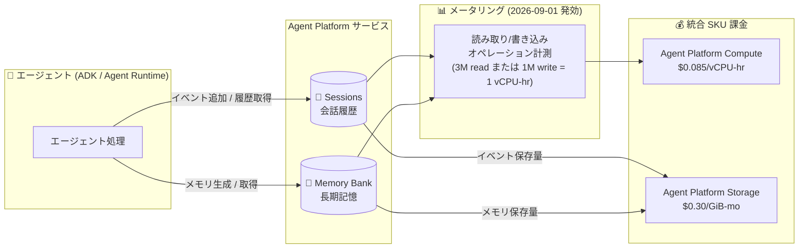

# Gemini Enterprise Agent Platform: エージェントメータリングの料金アップデート (Sessions / Memory Bank のコンピュートメータリング開始)

**リリース日**: 2026-09-01

**サービス**: Gemini Enterprise Agent Platform

**機能**: エージェントメータリングの料金アップデート (Session / Memory Bank コンピュートメータリング)

**ステータス**: 変更 (料金アップデート、2026 年 9 月 1 日発効)

📊 [このアップデートのインフォグラフィックを見る](https://takech9203.github.io/google-cloud-news-summary/20260901-gemini-agent-platform-agent-metering-pricing.html)

## 概要

2026 年 9 月 1 日より、Gemini Enterprise Agent Platform の **Sessions** および **Memory Bank** に対するコンピュートメータリング (compute metering) が発効しました。これは 2026 年に実施された Agent Platform の SKU 統合 (SKU Consolidation) の一環であり、Sessions と Memory Bank の読み取り / 書き込みオペレーションが、統合 SKU である **Agent Platform Compute SKU** ($0.085/vCPU-hr) で課金されるようになります。

SKU 統合では、Runtime、Code Execution Sandbox、Sessions、Memory Bank の課金が、従来の個別のプロダクト SKU から **Compute / Memory / Storage の 3 つの統合 SKU** に移行されます。新 SKU は 2026 年 6 月 17 日から Google Cloud Platform SKUs に掲載されており、今回の 9 月 1 日をもって Sessions と Memory Bank のオペレーションに対するコンピュート課金が実際に適用開始となりました。

このアップデートは、Agent Development Kit (ADK) や Agent Runtime 上でエージェントを運用し、会話履歴 (Sessions) や長期記憶 (Memory Bank) を利用しているすべてのユーザーに影響します。コスト管理を担当する Solutions Architect や FinOps 担当者は、課金モデルの変化を理解し、9 月分以降の請求への影響を確認する必要があります。

**アップデート前の課題**

このアップデート以前は、Sessions と Memory Bank は機能ごとに異なる単位で課金されており、課金モデルが複雑でした。

- Sessions は $0.25/1,000 イベントというイベント数ベースの課金だった
- Memory Bank のメモリ保存は $0.25/1,000 memories stored-month、メモリ取得は $0.5/1,000 memories retrieved という件数ベースの課金だった
- Runtime ($0.0864/vCPU-hr) と Sessions / Memory Bank で課金単位 (vCPU 時間、イベント数、メモリ件数) がバラバラで、エージェント全体のコストを統一的に把握しにくかった

**アップデート後の改善**

- Sessions と Memory Bank の読み取り / 書き込みオペレーションが、統合された **Agent Platform Compute SKU ($0.085/vCPU-hr)** でメータリングされるようになった (1 vCPU-hr あたり読み取り 300 万オペレーションまたは書き込み 100 万オペレーションを処理)
- Sessions のイベント保存と Memory Bank のメモリ保存は **Agent Platform Storage SKU ($0.30/GiB-mo)** に統合され、実データ量ベースの課金になった
- Runtime / Code Execution Sandbox / Sessions / Memory Bank のコストが Compute / Memory / Storage の 3 SKU に集約され、コスト構造がシンプルになった
- Runtime Compute の単価は $0.0864/vCPU-hr から $0.085/vCPU-hr にわずかに引き下げられた

## アーキテクチャ図

エージェントが Sessions / Memory Bank に対して行う読み取り・書き込みオペレーションがコンピュートメータリングの対象となり、統合された Agent Platform Compute SKU で課金されます。保存データは Storage SKU で課金されます。

## サービスアップデートの詳細

### 主要機能

1. **Sessions / Memory Bank のコンピュートメータリング発効 (2026 年 9 月 1 日)**
   - Sessions と Memory Bank の読み取り / 書き込みオペレーションが Agent Platform Compute SKU ($0.085/vCPU-hr) で計測・課金される
   - 1 vCPU-hr あたり、読み取り 300 万オペレーションまたは書き込み 100 万オペレーションを処理できる換算レート

2. **3 つの統合 SKU への移行 (2026 SKU Consolidation)**
   - Runtime、Code Execution Sandbox、Sessions、Memory Bank の課金が、個別のプロダクト SKU から統合 SKU に移行
   - Agent Platform Compute ($0.085/vCPU-hr)、Agent Platform Memory ($0.009/GiB-hr)、Agent Platform Storage ($0.30/GiB-mo) の 3 本立て

3. **Memory Bank Embedding Usage の課金開始**
   - 従来は課金対象外だった Memory Bank の埋め込み (Embedding) 利用が、選択した埋め込みモデルの既存 SKU / 既存料金で課金されるようになる

## 技術仕様

### SKU 移行の対応表

| 従来の Agent Engine SKU | 従来の料金 | 新 SKU | 新料金 |
|------|------|------|------|
| Runtime Compute | $0.0864/vCPU-hr | Compute Unit | $0.085/vCPU-hr |
| Runtime Memory | $0.009/GiB-hr | Memory Unit | $0.009/GiB-hr |
| Compute | $0.0864/vCPU-hr | Compute Unit | $0.085/vCPU-hr |
| Memory | $0.009/GiB-hr | Memory Unit | $0.009/GiB-hr |
| Sessions | $0.25/1K イベント | Storage Unit + Compute Unit | $0.30/GiB-mo + $0.085/vCPU-hr |
| Memory Bank Memory Stored | $0.25/1K memories stored-month | Storage Unit | $0.30/GiB-mo |
| Memory Bank Memory Retrieved | $0.5/1K memories retrieved | Compute Unit | $0.085/vCPU-hr |
| Memory Bank Embedding Usage | 課金対象外 | 選択モデルの既存 SKU | 選択した埋め込みモデルの既存料金 |

### コンピュートメータリングの換算レート

| 項目 | 詳細 |
|------|------|
| 対象サービス | Agent Platform Sessions、Agent Platform Memory Bank |
| 課金 SKU | Agent Platform Compute ($0.085/vCPU-hr) |
| 読み取りオペレーション | 1 vCPU-hr あたり 300 万オペレーション |
| 書き込みオペレーション | 1 vCPU-hr あたり 100 万オペレーション |
| 発効日 | 2026 年 9 月 1 日 |
| 新 SKU の掲載開始 | 2026 年 6 月 17 日 (Google Cloud Platform SKUs) |

## メリット

### ビジネス面

- **コスト構造の簡素化**: Runtime / Sessions / Memory Bank / Code Execution Sandbox のコストが Compute / Memory / Storage の 3 SKU に集約され、エージェントワークロード全体のコスト把握と予算策定が容易になる
- **使用量に比例した公平な課金**: イベント件数・メモリ件数ベースから、実際のオペレーション量とデータ量に基づく課金に変わり、実利用に即したコスト負担になる

### 技術面

- **Runtime コンピュート単価の引き下げ**: $0.0864/vCPU-hr から $0.085/vCPU-hr へとわずかに低減
- **統一メトリクスでの最適化**: vCPU-hr と GiB という統一単位でコストを分析できるため、読み書きオペレーションの削減 (バッチ化、キャッシュ活用など) がそのままコスト削減に直結する

## デメリット・制約事項

### 制限事項

- 従来課金対象外だった Memory Bank の埋め込み利用が、選択した埋め込みモデルの既存料金で課金されるようになる
- 読み取りと書き込みで換算レートが異なる (読み取り 3M ops/vCPU-hr、書き込み 1M ops/vCPU-hr) ため、書き込みが多いワークロードは相対的にコンピュートコストが高くなる

### 考慮すべき点

- Sessions のイベント数課金 ($0.25/1K イベント) からストレージ + コンピュート課金への移行により、イベントあたりのデータサイズやアクセス頻度によって月額コストが増減する可能性があるため、9 月分以降の請求を確認することを推奨
- Memory Bank へのメモリ生成・取得の頻度 (例: 毎ターンでの GenerateMemories 呼び出し) がコンピュート課金に直結するため、メモリ生成のトリガー条件 (イベント数、アイドル時間など) を見直す価値がある
- Cloud Billing のレポートやアラートを新 SKU (Agent Platform Compute / Memory / Storage) に合わせて更新する必要がある

## ユースケース

### ユースケース 1: カスタマーサポートエージェントのコスト見積もり

**シナリオ**: ADK で構築したサポートエージェントが、ユーザーごとに Sessions で会話履歴を管理し、Memory Bank でユーザーの嗜好を記憶している。月間で Sessions / Memory Bank への読み取り 300 万オペレーション、書き込み 100 万オペレーションが発生する。

**効果**: 読み取り 300 万 ops = 1 vCPU-hr、書き込み 100 万 ops = 1 vCPU-hr で、コンピュート課金は合計 2 vCPU-hr × $0.085 = 約 $0.17/月 (別途ストレージ課金 $0.30/GiB-mo が保存データ量に応じて発生)。統一単位により見積もりが単純化される。

### ユースケース 2: 課金モデル移行に伴う FinOps レビュー

**シナリオ**: 既存の Agent Engine ワークロードで Sessions のイベント数課金を前提にコスト予測をしていたチームが、新 SKU 体系への移行に合わせてコストモデルを再構築する。

**効果**: SKU 移行対応表に基づいて新旧料金を突き合わせ、Cloud Billing のコストレポートで Agent Platform Compute / Storage SKU の実績を監視することで、移行後のコスト変動を早期に検知できる。

## 料金

Agent Platform の統合 SKU 料金は以下のとおりです (2026 SKU Consolidation)。

| SKU | 料金 |
|--------|-----------------|
| Agent Platform Compute | $0.085/vCPU-hr |
| Agent Platform Memory | $0.009/GiB-hr |
| Agent Platform Storage | $0.30/GiB-mo |

Sessions / Memory Bank のオペレーションは、1 vCPU-hr = 読み取り 300 万オペレーションまたは書き込み 100 万オペレーションとして Compute SKU で計上されます (2026 年 9 月 1 日発効)。

最新の詳細は [Gemini Agent Platform Pricing PDF](https://services.google.com/fh/files/emails/b_502770571_gemini_enterprise_agent_platform_pricing.pdf) および[料金ページ](https://cloud.google.com/products/gemini-enterprise-agent-platform/pricing)を参照してください。

## 利用可能リージョン

リージョンごとの提供状況は[エージェントのサポートロケーション](https://docs.cloud.google.com/gemini-enterprise-agent-platform/resources/agent-locations)を参照してください。Sessions と Memory Bank はマルチリージョン / グローバルエンドポイントにも対応しています (2026 年 6 月 GA)。

## 関連サービス・機能

- **Agent Platform Sessions**: ユーザーとエージェント間のやり取り (イベント) を時系列で保持する会話履歴管理サービス。今回のコンピュートメータリングの対象
- **Agent Platform Memory Bank**: セッションをまたいでユーザーの長期記憶を生成・保存・取得するサービス。メモリの取得・生成オペレーションがコンピュートメータリングの対象
- **Agent Runtime (旧 Agent Engine)**: エージェントのデプロイ / 実行環境。同じ Compute / Memory SKU で課金される
- **Agent Development Kit (ADK)**: Sessions / Memory Bank への呼び出しを自動オーケストレーションするエージェント開発フレームワーク
- **Cloud Billing**: 新 SKU でのコスト監視・予算アラート設定に使用

## 参考リンク

- 📊 [インフォグラフィック](https://takech9203.github.io/google-cloud-news-summary/20260901-gemini-agent-platform-agent-metering-pricing.html)
- [公式リリースノート](https://docs.cloud.google.com/release-notes#September_01_2026)
- [Gemini Agent Platform Pricing PDF (2026 SKU Consolidation)](https://services.google.com/fh/files/emails/b_502770571_gemini_enterprise_agent_platform_pricing.pdf)
- [Agent Platform Sessions ドキュメント](https://docs.cloud.google.com/gemini-enterprise-agent-platform/scale/sessions)
- [Agent Platform Memory Bank ドキュメント](https://docs.cloud.google.com/gemini-enterprise-agent-platform/scale/memory-bank)
- [料金ページ](https://cloud.google.com/products/gemini-enterprise-agent-platform/pricing)

## まとめ

2026 年 9 月 1 日をもって、Sessions と Memory Bank の読み書きオペレーションが統合 Agent Platform Compute SKU ($0.085/vCPU-hr) でのメータリング対象となり、2026 SKU Consolidation による Compute / Memory / Storage の 3 SKU 体系への移行が実運用フェーズに入りました。Sessions / Memory Bank を利用しているチームは、SKU 移行対応表をもとに新旧課金モデルの差分を確認し、Cloud Billing のレポート・アラートを新 SKU に合わせて更新することを推奨します。

---

**タグ**: `Gemini Enterprise Agent Platform`, `Sessions`, `Memory Bank`, `Pricing`, `SKU Consolidation`, `Agent Runtime`, `FinOps`
