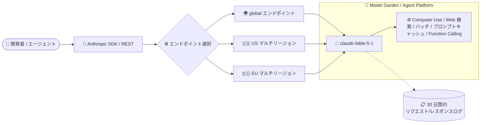

# Gemini Enterprise Agent Platform: Anthropic Claude Fable 5.1 が Model Garden で利用可能に

**リリース日**: 2026-09-01

**サービス**: Gemini Enterprise Agent Platform

**機能**: Claude Fable 5.1 on Google Cloud (Model Garden)

**ステータス**: GA (Generally Available)

📊 [このアップデートのインフォグラフィックを見る](https://takech9203.github.io/google-cloud-news-summary/20260901-gemini-agent-platform-claude-fable-5-1.html)

## 概要

Anthropic の最新モデル **Claude Fable 5.1** が、Gemini Enterprise Agent Platform の Model Garden で一般提供 (GA) として利用可能になりました。モデル ID は `claude-fable-5-1` で、リリース日は 2026 年 9 月 1 日、リタイア日は 2027 年 3 月 1 日以降とされています。

Claude Fable 5.1 は、**自律的なナレッジワークとコーディングに最適化**されたモデルで、長時間実行される複雑な非同期タスクの処理を得意とします。最大入力 100 万トークン・最大出力 12.8 万トークンという大規模なコンテキストを備え、Computer Use、Web 検索、バッチ予測、プロンプトキャッシュ、Function Calling などのケイパビリティをサポートします。

なお、Claude Fable 5.1 は Google Cloud の **Advanced AI Safety Addendum** の適用対象です。悪用監視のみを目的として、すべてのプロンプトとレスポンスが最大 30 日間保存されます。エンタープライズでの採用時にはこの点の確認が必要です。

**アップデート前の課題**

- Agent Platform 上で利用できる Fable 系モデルは Claude Fable 5 (2026 年 6 月 9 日 GA) までで、Anthropic の最新版 Fable モデルを Google Cloud のガバナンス・課金体系の中で利用できなかった
- Claude Fable 5 のプロンプトキャッシュのキャッシュヒット料金はグローバルエンドポイントで $1.00/100 万トークンであり、長いシステムプロンプトやツール定義を繰り返し参照するエージェントワークロードではキャッシュ読み取りコストが相対的に高かった

**アップデート後の改善**

- Anthropic の最新 Fable モデルを Model Garden から有効化し、Agent Platform のエンドポイント経由でそのまま利用できるようになった (FedRAMP High 境界内での利用にも対応)
- 入出力の基本料金は Claude Fable 5 と同額のまま、キャッシュヒット料金がグローバルエンドポイントで $0.25/100 万トークン (Fable 5 は $1.00) となり、プロンプトキャッシュを活用するエージェントワークロードのコスト効率が向上した
- グローバルエンドポイントに加えて、US / EU のマルチリージョンエンドポイントでも利用でき、Provisioned Throughput にも対応する

## アーキテクチャ図



Model Garden でモデルを有効化した後、Anthropic SDK または REST 経由で Agent Platform のグローバル / マルチリージョンエンドポイントに `claude-fable-5-1` を指定してリクエストを送信する構成です。Advanced AI Safety Addendum に基づき、プロンプトとレスポンスは悪用監視のため最大 30 日間保存されます。

## サービスアップデートの詳細

### 主要機能

1. **自律的なナレッジワークとコーディングへの最適化**
   - 長時間実行 (long-running)、複雑、非同期のタスク処理に最適化
   - エージェント型ワークフローでの利用を想定したモデル特性

2. **大規模コンテキストとマルチモーダル入力**
   - 最大入力トークン: 1,000,000 / 最大出力トークン: 128,000
   - 入力: テキスト、画像、PDF / 出力: テキスト
   - 画像・PDF の制限事項は Anthropic ドキュメント (Vision / PDF support) に準拠

3. **豊富なケイパビリティ**
   - Computer Use、Web 検索、バッチ予測、プロンプトキャッシュ、Function Calling (ツール使用)、トークンカウントをサポート
   - 利用形態として Shared Model Lineage Quota と Provisioned Throughput をサポート

## 技術仕様

### モデル仕様

| 項目 | 詳細 |
|------|------|
| モデル ID | `claude-fable-5-1` |
| ローンチステージ | GA (Generally Available) |
| リリース日 | 2026 年 9 月 1 日 |
| リタイア日 | 2027 年 3 月 1 日以降 |
| 入力 | テキスト、画像、PDF |
| 出力 | テキスト |
| 最大入力トークン | 1,000,000 |
| 最大出力トークン | 128,000 |
| ケイパビリティ | Computer Use、Web 検索、バッチ予測、プロンプトキャッシュ、Function Calling、トークンカウント |
| 利用形態 | Shared Model Lineage Quota、Provisioned Throughput |
| 準拠 | FedRAMP High 境界内で動作 (Agent Platform 経由の Claude モデル) |

### エンドポイントとリージョン

| 区分 | 提供ロケーション |
|------|------------------|
| モデル可用性 (固定クォータ / Provisioned Throughput) | US マルチリージョン、EU マルチリージョン、global エンドポイント |
| ML 処理 | US マルチリージョン、EU マルチリージョン、asia-southeast1 |

## 設定方法

### 前提条件

1. Agent Platform API (`aiplatform.googleapis.com`) が有効なプロジェクト
2. パートナーモデルの有効化・使用に必要な IAM 権限

### 手順

#### ステップ 1: Advanced AI Safety Addendum への同意

Model Garden で Advanced AI Safety Addendum に同意します (プロジェクトごとに 1 回)。

#### ステップ 2: モデルの有効化

- **オンライン規約のユーザー**: Model Garden のモデルカードで「有効化」をクリックし、会社情報・ユースケースの質問に回答のうえ、Cloud Marketplace で Anthropic および Marketplace の利用規約に同意します
- **Private Offer のユーザー**: Cloud Marketplace で Private Offer を承諾し (請求先アカウントごとに 1 回)、`enableModel` API でモデルロケーションを有効化します

#### ステップ 3: プロンプト・レスポンス共有の有効化

Anthropic の Service Specific Terms (Section F) の要件に基づき、各モデルロケーションで Anthropic とのプロンプト・レスポンス共有 (Request-Response Logging and Sharing) を有効化します。

#### ステップ 4: リクエストの送信

Anthropic SDK または curl から、モデル名に `claude-fable-5-1` を指定して Agent Platform エンドポイントへリクエストを送信します。

## メリット

### ビジネス面

- **最新モデルへのアクセス**: Anthropic の最新 Fable モデルを、Google Cloud の契約・課金・ガバナンス (FedRAMP High 境界を含む) の中で利用できる
- **キャッシュコストの削減**: キャッシュヒット料金が Fable 5 の $1.00 から $0.25 (グローバル、/100 万トークン) に下がり、システムプロンプトやツール定義を再利用するエージェント運用のコスト効率が向上

### 技術面

- **大規模コンテキスト**: 100 万トークン入力により、大規模コードベースや長大なドキュメント群を扱う自律エージェントを構築しやすい
- **エージェント向けケイパビリティ**: Computer Use、Web 検索、Function Calling、バッチ予測、プロンプトキャッシュを標準サポート
- **エンドポイントの柔軟性**: global エンドポイントに加え US / EU マルチリージョンを選択でき、データロケーション要件に対応しやすい

## デメリット・制約事項

### 制限事項

- 出力はテキストのみ (画像・音声出力は非対応)
- リタイア日が「2027 年 3 月 1 日以降」と明示されており、長期利用ではモデル移行計画が必要
- ML 処理のアジアリージョンは asia-southeast1 のみで、日本リージョン (asia-northeast1) での ML 処理は記載されていない

### 考慮すべき点

- Advanced AI Safety Addendum の対象であり、悪用監視のためプロンプトとレスポンスが最大 30 日間保存される。データ取り扱いポリシーとの整合を事前に確認する必要がある
- Anthropic の Service Specific Terms に基づき、モデルロケーションごとにプロンプト・レスポンス共有の有効化が求められる
- 入力 $10 / 出力 $50 (/100 万トークン) は Claude Sonnet 5 ($2 / $10) や Claude Opus 5 ($5 / $25) より高価であり、タスクの複雑さに応じたモデルの使い分けが重要

## ユースケース

### ユースケース 1: 大規模コードベースに対する自律コーディングエージェント

**シナリオ**: 大規模リポジトリのマイグレーションやリファクタリングを、長時間実行の自律エージェントに委任したい。

**実装例**:
```python
# Anthropic SDK から Agent Platform エンドポイントを利用
from anthropic import AnthropicVertex

client = AnthropicVertex(region="global", project_id="YOUR_PROJECT")
message = client.messages.create(
    model="claude-fable-5-1",
    max_tokens=64000,
    messages=[{"role": "user", "content": "リポジトリ全体を解析し、移行計画を立ててから実装してください"}],
)
```

**効果**: 100 万トークンの入力コンテキストで大規模コードベースを俯瞰しつつ、Function Calling と長時間タスク処理により多段階の実装作業を自律的に進められる。

### ユースケース 2: ドキュメント大量処理のバッチ分析

**シナリオ**: PDF を含む大量のドキュメントを非同期で分析・要約したい。

**効果**: バッチ予測ではオンラインの半額 (入力 $5 / 出力 $25、グローバル) で処理でき、プロンプトキャッシュ (キャッシュヒット $0.25) の併用で共通コンテキストのコストをさらに圧縮できる。

## 料金

Claude Fable 5.1 はトークン従量課金です。200K 入力トークン以下と超過で料金列が分かれていますが、Fable 5.1 は両者とも同額が記載されています。以下はグローバルエンドポイントおよび US/EU マルチリージョンの料金 (USD、100 万トークンあたり) です。

### 料金例

| 項目 | Global | US / EU マルチリージョン |
|--------|-----------------|-----------------|
| 入力 | $10.00 | $11.00 |
| 出力 | $50.00 | $55.00 |
| バッチ入力 | $5.00 | $5.50 |
| バッチ出力 | $25.00 | $27.50 |
| キャッシュ書き込み (5 分) | $12.50 | $13.75 |
| キャッシュ書き込み (1 時間) | $20.00 | $22.00 |
| キャッシュヒット | $0.25 | $0.275 |

参考: Claude Fable 5 のキャッシュヒットは $1.00 (グローバル) であり、Fable 5.1 ではキャッシュ読み取りが 1/4 の料金になっています。最新の料金は [料金ページ](https://cloud.google.com/gemini-enterprise-agent-platform/generative-ai/pricing) を参照してください。

## 利用可能リージョン

- **モデル可用性 (固定クォータ / Provisioned Throughput)**: US マルチリージョン、EU マルチリージョン、global エンドポイント
- **ML 処理**: US マルチリージョン、EU マルチリージョン、asia-southeast1

## 関連サービス・機能

- **Model Garden**: Claude Fable 5.1 の有効化・モデルカードの確認を行う入口。Anthropic のほか各社パートナーモデルを提供
- **Agent Studio**: コンソール上でモデルを試すことができる (Try in Agent Studio)
- **Provisioned Throughput**: 安定したスループットが必要な本番エージェント向けの購入オプション
- **Request-Response Logging**: 30 日間のプロンプト・完了ログを有効化してモデルの誤用を追跡
- **Cloud Marketplace**: Anthropic 利用規約への同意、Private Offer の承諾を行う

## 参考リンク

- 📊 [インフォグラフィック](https://takech9203.github.io/google-cloud-news-summary/20260901-gemini-agent-platform-claude-fable-5-1.html)
- [公式リリースノート](https://docs.cloud.google.com/release-notes#September_01_2026)
- [Claude Fable 5.1 on Google Cloud (モデルページ)](https://docs.cloud.google.com/gemini-enterprise-agent-platform/models/partner-models/claude/fable-5-1)
- [Claude モデル一覧 (Agent Platform)](https://docs.cloud.google.com/gemini-enterprise-agent-platform/models/partner-models/claude)
- [Claude モデルの使用方法](https://docs.cloud.google.com/gemini-enterprise-agent-platform/models/partner-models/claude/use-claude)
- [料金ページ](https://cloud.google.com/gemini-enterprise-agent-platform/generative-ai/pricing)

## まとめ

Anthropic の最新モデル Claude Fable 5.1 が Agent Platform の Model Garden で GA となり、自律的なコーディングやナレッジワークを担うエージェントを Google Cloud のガバナンスの中で構築できるようになりました。特にキャッシュヒット料金が Fable 5 の 1/4 に下がった点は、長いコンテキストを繰り返し参照するエージェントワークロードで効果が大きいため、既存の Fable 5 利用者はコストと性能の両面から移行を検討する価値があります。

---

**タグ**: #GeminiEnterpriseAgentPlatform #ModelGarden #Anthropic #Claude #ClaudeFable51 #生成AI #GA
