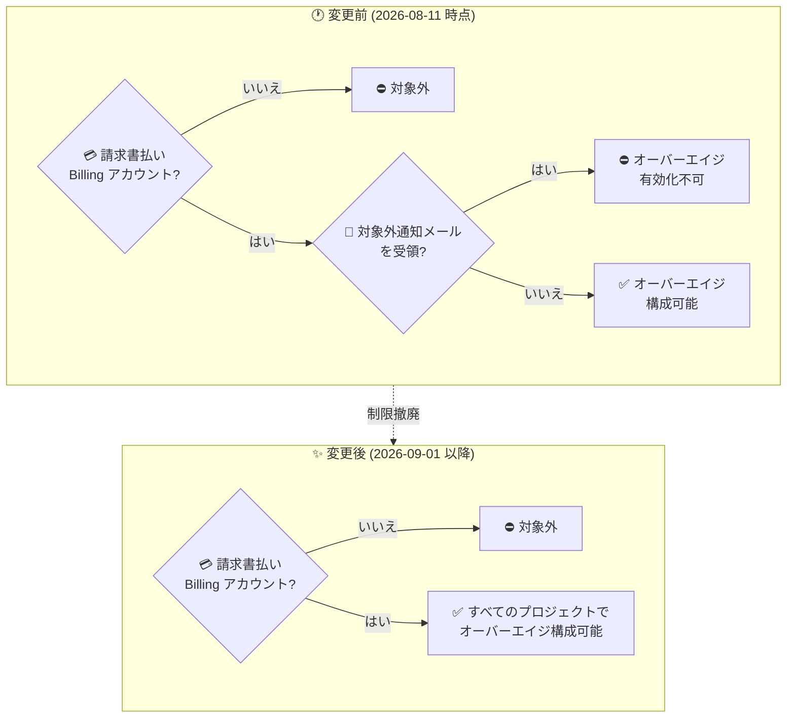

# Gemini Enterprise: オーバーエイジ管理機能がすべての請求書払いアカウントで利用可能に

**リリース日**: 2026-09-01

**サービス**: Gemini Enterprise

**機能**: オーバーエイジ管理機能の対象拡大 (すべての請求書払い Cloud Billing アカウントに対応)

**ステータス**: Feature

📊 [このアップデートのインフォグラフィックを見る](https://takech9203.github.io/google-cloud-news-summary/20260901-gemini-enterprise-overage-controls.html)

## 概要

Gemini Enterprise のオーバーエイジ (超過利用) 管理機能の構成が、請求書払い (invoiced) の Cloud Billing アカウントにリンクされた **すべてのプロジェクト** で利用可能になりました。これまで、「[Billing Update] New Gemini Enterprise overage billing controls launching Aug 17, 2026」という件名のメールを受領した顧客は、請求書払いの Cloud Billing アカウントを持っていてもオーバーエイジを有効化できないという制限がありましたが、この制限が撤廃されました。

オーバーエイジ管理機能自体は 2026 年 8 月 11 日に発表済みで、プールクォータ到達後も従量課金レートで機能利用を継続できる「オーバーエイジの有効化」、Cloud Billing での月次プロジェクト支出上限の設定、Usage & Spending ページでの使用量・コスト追跡を提供します (詳細は [2026-08-11 のレポート](2026-08-11-gemini-enterprise-overages-spend-limits.md) を参照)。今回のアップデートは機能追加ではなく **利用対象の拡大** であり、これまで対象外通知メールを受領していたために機能を使えなかった組織も、同じコストガバナンス機能を利用できるようになった点がポイントです。

公式ドキュメント「Overview of overages and spend controls」からも該当メール受領者を除外する注記が削除され、前提条件は「アクティブな月次請求書を受け取る請求書払いの Cloud Billing アカウントにリンクされたプロジェクトであること」に一本化されています。

**アップデート前の課題**

- 「[Billing Update] New Gemini Enterprise overage billing controls launching Aug 17, 2026」という件名のメールを受領した顧客は、請求書払いの Cloud Billing アカウントを持っていてもオーバーエイジを有効化できなかった
- 該当する組織では、プロジェクトが機能のプールクォータに到達すると利用が停止し、クォータのリセットまたは次の請求サイクルまで機能を使えなかった
- 自組織が対象かどうかをメール受領の有無で判断する必要があり、利用可否の条件が分かりにくかった

**アップデート後の改善**

- メール受領有無による除外がなくなり、請求書払いの Cloud Billing アカウントにリンクされたすべてのプロジェクトでオーバーエイジ管理を構成できるようになった
- これまで対象外だった組織でも、プールクォータ到達後に従量課金レートで機能利用を継続させるオーバーエイジの有効化と、月次支出上限による支出統制が可能になった
- 利用可否の前提条件が「請求書払いアカウント + アクティブな非無料トライアルサブスクリプション」にシンプル化された

## アーキテクチャ図



メール受領有無による判定ステップが撤廃され、請求書払いの Cloud Billing アカウントであれば一律にオーバーエイジ管理を構成できるようになりました。

## サービスアップデートの詳細

### 主要機能

1. **対象範囲の拡大 (制限撤廃)**
   - 「[Billing Update] New Gemini Enterprise overage billing controls launching Aug 17, 2026」という件名のメールを受領した顧客への除外制限が撤廃
   - 請求書払いの Cloud Billing アカウントにリンクされた **すべてのプロジェクト** でオーバーエイジ管理の構成が可能に
   - 公式ドキュメントの前提条件も「アクティブな月次請求書を受け取る請求書払い Cloud Billing アカウントにリンクされたプロジェクト」に更新済み

2. **新たに対象となった組織が利用できる機能 (既存機能)**
   - **オーバーエイジの有効化**: プールクォータ到達後も従量課金 (pay-as-you-go) レートで機能を継続利用 (Standard / Plus / Standard Emerging Market エディション対応、Pay-as-you-go エディションは全利用が従量課金のため適用外)
   - **月次支出上限**: Cloud Billing の予算で Vertex AI (aiplatform.googleapis.com) をスコープに設定し、上限到達時はオーバーエイジ利用を自動停止。Gemini Enterprise app / Agent Platform / AI コーディングツール (Antigravity など) に横断適用
   - **使用量・コストの追跡**: Usage & Spending ページでプールクォータ消費と 30 日間のコストトレンドを確認。Cloud Billing レポートでは Originating products フィルタやプリセットレポート「Gemini Enterprise costs by SKU」で詳細分析

## 技術仕様

### 利用条件の変更点

| 項目 | 変更前 (2026-08-11) | 変更後 (2026-09-01) |
|------|---------------------|---------------------|
| Cloud Billing アカウント種別 | 請求書払い (invoiced) が必須 | 変更なし (請求書払いが必須) |
| サブスクリプション | アクティブな非無料トライアルが 1 つ以上必要 | 変更なし |
| 対象外通知メールの受領者 | オーバーエイジ有効化 **不可** | 制限撤廃により **可能** |
| 対応エディション (オーバーエイジ) | Standard / Plus / Standard Emerging Market | 変更なし |
| 必要ロール | Gemini Enterprise Administrator (`roles/discoveryengine.agentspaceAdmin`) | 変更なし |

## 設定方法

### 前提条件

1. 請求書払い (invoiced) の Cloud Billing アカウントにリンクされ、アクティブな月次請求書を受け取っているプロジェクトであること (アカウント種別の確認方法は [Cloud Billing アカウントタイプと請求サイクルの確認](https://docs.cloud.google.com/billing/docs/how-to/billing-cycle#view-your-charging-cycle) を参照)
2. Gemini Enterprise Standard / Plus / Standard Emerging Market のアクティブな非無料トライアルサブスクリプションが 1 つ以上あること
3. Gemini Enterprise Administrator (`roles/discoveryengine.agentspaceAdmin`) ロールを持っていること

### 手順

設定手順自体は既存機能と同じです。これまで対象外だった組織は、以下の流れで有効化できます。

#### ステップ 1: オーバーエイジを有効化する

1. Google Cloud コンソールで **Gemini Enterprise > Usage & Spending** ページに移動
2. **Usage** タブの **Feature usage > Overage** セクションでトグルを有効化し、対象エディションを選択して保存

#### ステップ 2: 月次支出上限を設定する

1. **Project monthly spend limit** セクションから Cloud Billing の予算作成に進む
2. 予算のスコープで **Vertex AI (aiplatform.googleapis.com)** をサービスとして選択し、支出上限とアラートしきい値を構成

詳細な手順は [Configure overages](https://docs.cloud.google.com/gemini/enterprise/docs/configure-overages) および [2026-08-11 のレポート](2026-08-11-gemini-enterprise-overages-spend-limits.md) を参照してください。

## メリット

### ビジネス面

- **対象組織の拡大**: これまで対象外通知メールにより機能を使えなかった組織も、クォータ到達時の業務停止回避と支出統制を両立するコストガバナンスを導入できる
- **条件の明確化**: 利用可否がメール受領有無に依存しなくなり、「請求書払いアカウントかどうか」で一律に判断できるため、導入判断や社内説明が容易になる

### 技術面

- **追加作業なしで利用可能**: 新しい設定や移行作業は不要で、既存の Usage & Spending ページと Cloud Billing 予算の仕組みをそのまま利用できる
- **一貫した運用**: 組織内の全プロジェクトで同じオーバーエイジ・支出上限の運用ポリシーを適用できる

## デメリット・制約事項

### 制限事項

- 引き続き、請求書払い (invoiced) の Cloud Billing アカウントにリンクされたプロジェクトのみが対象 (セルフサービス (クレジットカード払い) アカウントは対象外)
- オーバーエイジは Standard / Plus / Standard Emerging Market エディションのみ対応。Pay-as-you-go エディションには適用されない
- 支出上限到達によるオーバーエイジ利用の停止には数分かかることがあり、その間に上限を超える課金が発生する可能性がある

### 考慮すべき点

- 新たに対象となった組織がオーバーエイジを有効化する場合、支出上限を設定しないとクォータ超過後の利用が無制限に従量課金されるため、有効化と支出上限設定はセットで行うことが推奨される
- Gemini Enterprise app はクォータ到達やオーバーエイジ課金開始を自動メール通知しないため、Cloud Billing 予算のアラートしきい値 (50% / 80% / 100% など) を必ず構成しておく

## ユースケース

### ユースケース 1: これまで対象外だった組織でのオーバーエイジ導入

**シナリオ**: 対象外通知メールを受領していたため、プールクォータ到達時にアシスタントの利用が停止し、業務影響が発生していた企業。

**実装例**:
```text
1. Cloud Billing アカウントが請求書払いであることを確認
2. Usage & Spending ページで対象エディションのオーバーエイジを有効化
3. Cloud Billing で Vertex AI (aiplatform.googleapis.com) をスコープとする
   月次予算・支出上限・アラートしきい値を設定
```

**効果**: クォータ到達後も従量課金で利用が継続され業務が止まらない一方、支出上限で予算超過を自動防止できる。

### ユースケース 2: 複数プロジェクトへの統一的なコストガバナンス展開

**シナリオ**: 一部プロジェクトのみオーバーエイジ管理を構成済みで、メール受領により対象外だったプロジェクトが残っていた組織。

**効果**: 全プロジェクトで同一のオーバーエイジ有効化・支出上限ポリシーを適用でき、Cloud Billing レポート (Originating products フィルタ、「Gemini Enterprise costs by SKU」) による横断的なコスト可視化と合わせて FinOps 運用を統一できる。

## 料金

今回のアップデートによる料金体系の変更はありません。オーバーエイジ料金は機能ごとの従量課金レートで課金されます (例: ストレージ + データインデクシングは 1 GiB あたり月額 $5)。詳細は [Quotas and overages](https://docs.cloud.google.com/gemini/enterprise/docs/quotas-and-overages) および [Gemini Enterprise Agent Platform の料金](https://cloud.google.com/gemini-enterprise-agent-platform/generative-ai/pricing) を参照してください。

## 関連サービス・機能

- **Cloud Billing**: 月次支出上限・予算アラートの構成先。予算スコープは Vertex AI (aiplatform.googleapis.com) を選択する
- **Gemini Enterprise Agent Platform**: オーバーエイジ課金・支出上限の適用対象
- **AI 開発者ツール (Antigravity など)**: オーバーエイジ課金・支出上限の適用対象 (請求書払いアカウントのみで利用可能)

## 参考リンク

- 📊 [インフォグラフィック](https://takech9203.github.io/google-cloud-news-summary/20260901-gemini-enterprise-overage-controls.html)
- [公式リリースノート](https://docs.cloud.google.com/release-notes#September_01_2026)
- [オーバーエイジと支出管理の概要](https://docs.cloud.google.com/gemini/enterprise/docs/manage-costs-overview)
- [オーバーエイジと支出上限の構成](https://docs.cloud.google.com/gemini/enterprise/docs/configure-overages)
- [クォータとオーバーエイジ (料金表)](https://docs.cloud.google.com/gemini/enterprise/docs/quotas-and-overages)
- [関連レポート: オーバーエイジ・支出上限・コスト管理機能 (2026-08-11)](2026-08-11-gemini-enterprise-overages-spend-limits.md)

## まとめ

このアップデートにより、Gemini Enterprise のオーバーエイジ管理機能が請求書払いの Cloud Billing アカウントを持つすべてのプロジェクトで利用可能になり、メール受領有無による分かりにくい除外条件が解消されました。これまで対象外だった組織は、オーバーエイジの有効化と月次支出上限の設定をセットで行い、クォータ到達時の業務停止回避と支出統制を両立するコストガバナンスの導入を検討することを推奨します。

---

**タグ**: Gemini Enterprise, Cloud Billing, オーバーエイジ, 支出上限, コスト管理, FinOps, クォータ
