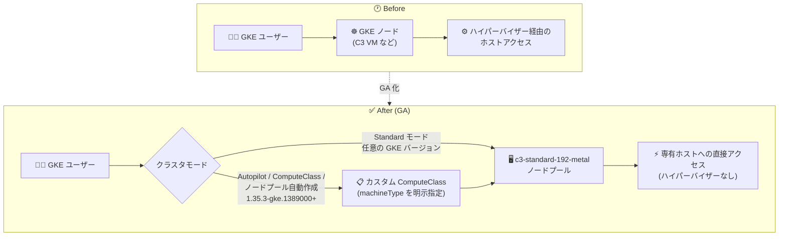

# Google Kubernetes Engine: C3 ベアメタルマシンタイプの GA (一般提供開始)

**リリース日**: 2026-09-01

**サービス**: Google Kubernetes Engine (GKE)

**機能**: C3 マシンシリーズのベアメタルマシンタイプの GKE サポート

**ステータス**: GA (一般提供)

📊 [このアップデートのインフォグラフィックを見る](https://takech9203.github.io/google-cloud-news-summary/20260901-gke-c3-bare-metal-ga.html)

## 概要

C3 マシンシリーズのベアメタルマシンタイプ (`c3-standard-192-metal` など) が、GKE クラスタで一般提供 (GA) になりました。Standard モードでは、利用可能な任意の GKE バージョンでこれらのマシンタイプをプロビジョニングできます。Autopilot モード、ComputeClass、ノードプール自動作成で使用する場合は、カスタム ComputeClass で正確なマシンタイプを指定し、GKE バージョン 1.35.3-gke.1389000 以降を使用する必要があります。

C3 は Compute Engine で最初にベアメタルマシンタイプを提供したマシンシリーズで、第 4 世代 Intel Xeon スケーラブルプロセッサ (コードネーム Sapphire Rapids) を搭載しています。ベアメタルインスタンスはホストサーバーの CPU とメモリに Compute Engine のハイパーバイザーを介さず直接アクセスでき、CPU パフォーマンスカウンタや CPU 内蔵アクセラレータ (QAT、DLB、IAA など) もすべて公開されます。専有ホストサーバー上で動作するため、そのホスト上では他のインスタンスは実行されません。

このアップデートにより、サードパーティ製ハイパーバイザーの実行、CPU 性能に敏感なワークロード、仮想マシンでのライセンス利用が許可されていないソフトウェアなどを、GKE のコンテナオーケストレーションと組み合わせて運用できるようになります。Kubernetes 上で大規模かつハイパーバイザーオーバーヘッドのないノードを必要とするプラットフォームチームやインフラ管理者が主な対象ユーザーです。

**アップデート前の課題**

- C3 ベアメタルマシンタイプは GKE クラスタで一般提供されておらず、ハイパーバイザーを介さない専有ホストのノードを GKE で安心して本番利用することが難しかった
- ハイパーバイザーの介在しない環境を必要とするワークロード (サードパーティ製ハイパーバイザーの実行、CPU パフォーマンスカウンタへの直接アクセスなど) を GKE ノード上で実行する GA レベルの選択肢が限られていた
- Autopilot モードや ComputeClass では、ベアメタルマシンタイプを利用する標準的な方法が確立されていなかった

**アップデート後の改善**

- Standard モードでは、利用可能な任意の GKE バージョンで `c3-standard-192-metal` などのベアメタルマシンタイプをプロビジョニングできるようになった
- Autopilot モード、ComputeClass、ノードプール自動作成でも、カスタム ComputeClass で正確なマシンタイプを指定することで利用可能になった (GKE 1.35.3-gke.1389000 以降)
- 192 vCPU / 最大 1,536 GB メモリの専有ホストを GKE ノードとして利用でき、ハイパーバイザーオーバーヘッドのない大規模ノードで Kubernetes ワークロードを実行できるようになった

## アーキテクチャ図



Standard モードでは任意の GKE バージョンで C3 ベアメタルノードを直接プロビジョニングでき、Autopilot モードや ComputeClass 経由の場合はカスタム ComputeClass で正確なマシンタイプを指定して利用します。

## サービスアップデートの詳細

### 主要機能

1. **Standard モードでの C3 ベアメタルノードプール作成**
   - `c3-standard-192-metal` などのマシンタイプを、利用可能な任意の GKE バージョンでプロビジョニング可能
   - 通常の VM ノードプールと同じ方法 (マシンタイプ名に `-metal` を含むタイプを指定) で作成できる

2. **Autopilot モード / ComputeClass / ノードプール自動作成での利用**
   - カスタム ComputeClass の `machineType` フィールドで正確なマシンタイプを指定する必要がある
   - GKE バージョン 1.35.3-gke.1389000 以降が必要
   - `machineFamily: c3` のようにマシンシリーズを広く指定してもベアメタルタイプはプロビジョニングされない
   - 事前定義された Autopilot Performance ComputeClass ではベアメタルマシンタイプはサポートされない

3. **ハイパーバイザーを介さない専有ホストの活用**
   - ホストサーバーの CPU・メモリへの直接アクセスが可能で、CPU パフォーマンスカウンタもすべて公開される
   - QAT、DLB、IAA などの CPU 内蔵アクセラレータを利用可能
   - ベアメタルインスタンスは専有ホスト上で動作し、同一ホスト上で他のインスタンスは実行されない

## 技術仕様

### C3 ベアメタルマシンタイプ

| マシンタイプ | vCPU | メモリ |
|------|------|------|
| `c3-highcpu-192-metal` | 192 | 512 GB |
| `c3-standard-192-metal` | 192 | 768 GB |
| `c3-highmem-192-metal` | 192 | 1,536 GB |

### C3 ベアメタルインスタンスの特徴

| 項目 | 詳細 |
|------|------|
| プロセッサ | 第 4 世代 Intel Xeon スケーラブルプロセッサ (Sapphire Rapids) |
| 基盤 | Titanium (ネットワークオフロード) |
| ストレージ | Hyperdisk Balanced / Hyperdisk Extreme (ローカル SSD は非対応) |
| ディスクインターフェース | NVMe のみ |
| ネットワーク帯域 | 標準で最大 100 Gbps、per VM Tier_1 で最大 200 Gbps |
| ネットワークドライバ | Intel IDPF (gVNIC / VirtIO は非対応) |
| ホストメンテナンス | ライブマイグレーション不可 (TERMINATE 設定が必要) |

### GKE で利用する際のバージョン要件

| 利用形態 | 要件 |
|------|------|
| Standard モード (ノードプール手動作成) | 利用可能な任意の GKE バージョン |
| Autopilot モード / ComputeClass / ノードプール自動作成 | カスタム ComputeClass で正確な machineType を指定 + GKE 1.35.3-gke.1389000 以降 |

### カスタム ComputeClass の設定例

```yaml
apiVersion: cloud.google.com/v1
kind: ComputeClass
metadata:
  name: c3-bare-metal
spec:
  priorities:
  - machineType: c3-standard-192-metal
  nodePoolAutoCreation:
    enabled: true
```

ベアメタルノードタイプは正確なマシンタイプの指定が必須のため、`machineFamily` ではなく `machineType` フィールドを使用します。

## 設定方法

### 前提条件

1. Autopilot モード、ComputeClass、ノードプール自動作成で使用する場合は、GKE バージョン 1.35.3-gke.1389000 以降のクラスタ
2. C3 ベアメタルマシンタイプが利用可能なゾーンの選択 (利用可能リージョンのセクションを参照)

### 手順

#### ステップ 1: Standard モードでノードプールを作成する場合

```bash
gcloud container node-pools create c3-metal-pool \
  --cluster=CLUSTER_NAME \
  --location=LOCATION \
  --machine-type=c3-standard-192-metal
```

利用可能な任意の GKE バージョンで、通常のノードプール作成と同じ手順で C3 ベアメタルマシンタイプを指定します。

#### ステップ 2: Autopilot / ノードプール自動作成で使用する場合

```bash
# カスタム ComputeClass を適用
kubectl apply -f c3-bare-metal-computeclass.yaml
```

```yaml
# Pod / Deployment から ComputeClass を選択
apiVersion: apps/v1
kind: Deployment
metadata:
  name: high-performance-app
spec:
  template:
    spec:
      nodeSelector:
        cloud.google.com/compute-class: c3-bare-metal
      containers:
      - name: app
        image: IMAGE
```

カスタム ComputeClass で正確なマシンタイプ (`c3-standard-192-metal` など) を指定し、ワークロードの nodeSelector から ComputeClass を選択します。

## メリット

### ビジネス面

- **ライセンス制約への対応**: 仮想マシンでの利用がライセンス上許可されていないソフトウェアを、GKE 管理下のベアメタルノードで実行できる
- **運用の一元化**: ベアメタルインスタンスも VM と同じ方法で消費・管理でき、GKE のオーケストレーションに統合することで、専用の物理サーバー運用を別途構築する必要がない

### 技術面

- **ハイパーバイザーオーバーヘッドの排除**: ホスト CPU・メモリへの直接アクセスにより、CPU 性能に敏感なワークロードやリアルタイムワークロードに適する
- **CPU 機能のフル活用**: CPU パフォーマンスカウンタへの直接アクセス、スレッドピニング、QAT / DLB / IAA などの CPU 内蔵アクセラレータを利用可能
- **大規模ノード**: 192 vCPU / 最大 1,536 GB メモリの専有ホストを単一 GKE ノードとして利用でき、最大 200 Gbps (Tier_1) のネットワーク帯域を確保できる

## デメリット・制約事項

### 制限事項

- Autopilot モード、ComputeClass、ノードプール自動作成では、正確なマシンタイプの指定 (カスタム ComputeClass の `machineType`) が必須。`machineFamily: c3` のような広い指定ではベアメタルタイプはプロビジョニングされない
- 事前定義された Autopilot Performance ComputeClass ではベアメタルマシンタイプは使用できない
- C3 ベアメタルインスタンスではローカル SSD が利用できない (ストレージは Hyperdisk Balanced / Hyperdisk Extreme のみ)
- ライブマイグレーションは不可 (ホストメンテナンス動作は TERMINATE)
- ハイパーバイザーメトリクスによる CPU 使用率モニタリングは利用不可 (Ops Agent の「OS Reported CPU %」で代替)
- Windows イメージはサポートされない。OS は IDPF ドライバをサポートするイメージに限定される

### 考慮すべき点

- 専有ホスト前提の大型マシンタイプ (192 vCPU) のため、小規模ワークロードにはコスト効率が合わない可能性がある。ビンパッキングを意識したワークロード設計が望ましい
- ベアメタルインスタンスのネットワークインターフェースは単一 (追加は Dynamic Network Interfaces で構成)
- 利用可能なゾーンが限られるため、リージョン設計時に対応ゾーンの確認が必要

## ユースケース

### ユースケース 1: サードパーティ製ハイパーバイザー / ネストした仮想化基盤の運用

**シナリオ**: ネットワークセキュリティアプライアンス、CI/CD パイプライン、サードパーティ製プライベートクラウドなど、ハイパーバイザーを介さないホストアクセスを必要とするワークロード (サードパーティ製ハイパーバイザーの実行を含む) を、GKE のスケジューリング・自動化と組み合わせて運用したい。

**実装例**:
```yaml
apiVersion: cloud.google.com/v1
kind: ComputeClass
metadata:
  name: hypervisor-nodes
spec:
  priorities:
  - machineType: c3-standard-192-metal
  nodePoolAutoCreation:
    enabled: true
```

**効果**: ハイパーバイザーの介在しない専有ホスト上で仮想化ソフトウェアを直接実行しつつ、ノードのライフサイクル管理を GKE に任せられる。

### ユースケース 2: CPU 性能に敏感なリアルタイム / 金融ワークロード

**シナリオ**: 金融取引所システムなど、CPU パフォーマンスカウンタへの直接アクセスやプロセスのスレッドピニングが必要なリアルタイムワークロードを Kubernetes 上で実行したい。

**効果**: ハイパーバイザーオーバーヘッドのない予測可能な CPU 性能と、QAT / DLB / IAA などの CPU 内蔵アクセラレータを GKE ワークロードから活用できる。

## 料金

C3 ベアメタルインスタンスの料金は Compute Engine の料金体系に従い、GKE では通常どおりノードとして使用したコンピュートリソースに対して課金されます (Standard クラスタはクラスタ管理手数料も別途発生)。確約利用割引 (CUD) にも対応しています。最新の料金は以下の公式ページを参照してください。

- [Compute Engine の料金 (VM インスタンス料金)](https://cloud.google.com/compute/vm-instance-pricing)
- [GKE の料金](https://cloud.google.com/kubernetes-engine/pricing)

## 利用可能リージョン

C3 ベアメタルマシンタイプは、Compute Engine のドキュメントに記載のゾーンで利用可能です。主なリージョン (2026 年 9 月時点、ドキュメントより):

- **北米**: us-central1、us-east1、us-east4、us-east5、us-west1
- **ヨーロッパ**: europe-west1、europe-west3、europe-west4、europe-north2
- **アジア太平洋**: asia-east1、asia-south1、asia-southeast1
- **中東**: me-central1

ゾーンごとに利用可能なマシンタイプ (`c3-highcpu-192-metal` / `c3-standard-192-metal` / `c3-highmem-192-metal`) が異なるため、詳細は [ベアメタルインスタンスのドキュメント](https://docs.cloud.google.com/compute/docs/instances/bare-metal-instances) を参照してください。

## 関連サービス・機能

- **Compute Engine (C3 マシンシリーズ)**: 本アップデートの基盤。C3 は Compute Engine で最初にベアメタルマシンタイプを提供したシリーズ
- **カスタム ComputeClass**: Autopilot / ノードプール自動作成でベアメタルタイプを使うために必須の仕組み。`machineType` ルールで正確なマシンタイプを指定する
- **Hyperdisk (Balanced / Extreme)**: C3 ベアメタルインスタンスで利用可能なストレージ。ローカル SSD の代替として使用
- **Titanium**: C3 の基盤となるオフロード技術。ネットワーク処理をホスト CPU からオフロードする
- **Google Cloud VMware Engine**: ベアメタル上でのサードパーティハイパーバイザー活用の代表例 (VMware ワークロード向け)

## 参考リンク

- 📊 [インフォグラフィック](https://takech9203.github.io/google-cloud-news-summary/20260901-gke-c3-bare-metal-ga.html)
- [公式リリースノート](https://docs.cloud.google.com/release-notes#September_01_2026)
- [C3 マシンシリーズ (ドキュメント)](https://docs.cloud.google.com/compute/docs/general-purpose-machines#c3_series)
- [ベアメタルインスタンスの概要](https://docs.cloud.google.com/compute/docs/instances/bare-metal-instances)
- [カスタム ComputeClass について](https://docs.cloud.google.com/kubernetes-engine/docs/concepts/about-custom-compute-classes)
- [料金ページ (Compute Engine)](https://cloud.google.com/compute/vm-instance-pricing)

## まとめ

C3 ベアメタルマシンタイプの GKE サポートが GA となり、ハイパーバイザーを介さない 192 vCPU の専有ホストを Kubernetes ノードとして本番利用できるようになりました。サードパーティ製ハイパーバイザーの実行、CPU 性能に敏感なリアルタイムワークロード、VM ライセンス制約のあるソフトウェアの実行を GKE で検討しているチームは、Standard モードでの直接指定、または GKE 1.35.3-gke.1389000 以降でのカスタム ComputeClass による導入を検討してください。

---

**タグ**: #GKE #ComputeEngine #C3 #BareMetal #ComputeClass #Autopilot #GA
