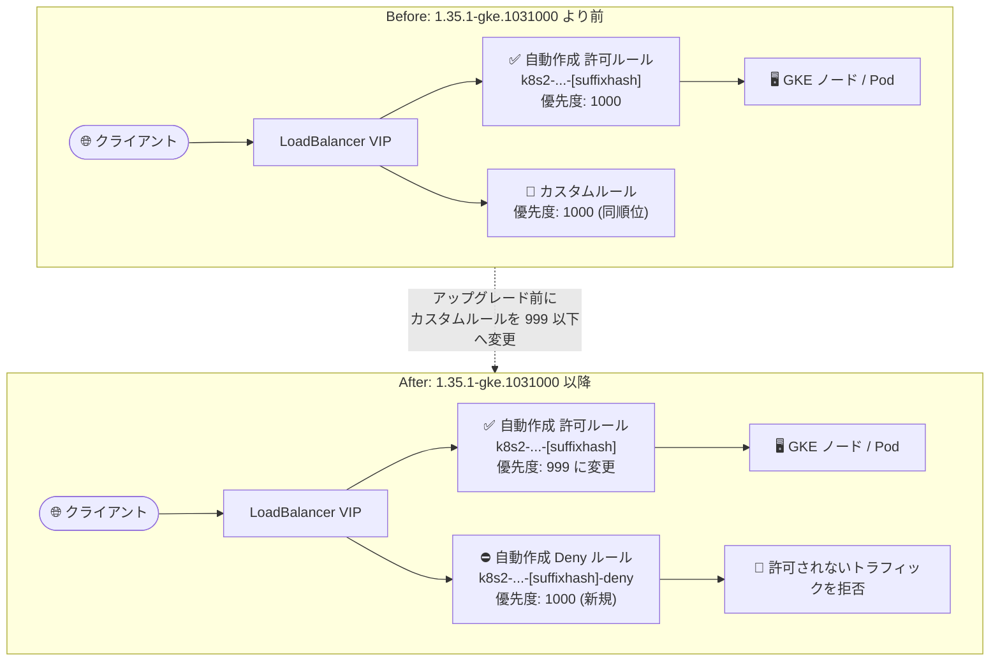

# Google Kubernetes Engine: Service 用自動作成ファイアウォールルールの優先度変更と Deny ルール追加

**リリース日**: 2026-09-01

**サービス**: Google Kubernetes Engine (GKE)

**機能**: Service 用自動作成ファイアウォールルールの優先度変更 (1000 → 999) および明示的 Deny ルールの追加

**ステータス**: Change (GKE 1.35.1-gke.1031000 以降で適用)

📊 [このアップデートのインフォグラフィックを見る](https://takech9203.github.io/google-cloud-news-summary/20260901-gke-service-firewall-rules-priority-change.html)

## 概要

GKE バージョン **1.35.1-gke.1031000 以降**では、LoadBalancer Service 用に GKE が自動作成する VPC ファイアウォールルールの挙動が変更されます。変更点は 2 つあり、(1) Service 用の複数の既存自動作成ルール (許可ルール) の優先度が **1000 から 999** に変更されること、(2) 他の自動作成ルールで明示的に許可されていないトラフィックを**拒否する追加のファイアウォールルール** (優先度 1000) が新規作成されることです。

この変更により、LoadBalancer の仮想 IP アドレス宛のトラフィックは「自動作成の許可ルール (優先度 999) で許可されたもの以外はデフォルトで拒否 (優先度 1000)」という、より安全なモデルに移行します。一方で、**優先度 1000 のカスタムファイアウォールルールを使用して GKE の自動作成ルールを上書き (オーバーライド) している環境では、予期しない動作が発生する可能性**があります。該当するクラスタの管理者は、1.35.1-gke.1031000 以降へのアップグレード前に必ずカスタムルールの見直しが必要です。

**アップデート前の課題**

- 以前は、GKE が自動作成する Service 用の許可ルールは優先度 1000 で作成されており、明示的な Deny ルールは存在しなかった
- LoadBalancer VIP 宛のトラフィックのうち許可ルールに一致しないものは、VPC の他のルールや暗黙のルールに従って評価されており、Service 単位での明示的な拒否は行われていなかった
- ユーザーが優先度 1000 のカスタムルールで GKE の自動作成ルールと同一優先度の制御を行っているケースがあった

**アップデート後の改善 (および影響)**

- 自動作成の許可ルールが優先度 999 となり、新設される優先度 1000 の Deny ルールより確実に優先評価されるようになった
- LoadBalancer VIP 宛で明示的に許可されていないトラフィックは、自動作成の Deny ルールにより拒否されるようになり、セキュリティ姿勢が向上した
- **注意**: 優先度 1000 のカスタムルールで GKE ルールを上書きしていた場合、新しい Deny ルール (優先度 1000) と同一優先度になり、意図した優先関係が崩れる可能性がある

## アーキテクチャ図



アップグレード後は、許可ルール (999) → Deny ルール (1000) の順で評価されるため、優先度 1000 のカスタムルールは新しい Deny ルールと同順位となり、意図しない動作の原因になります。カスタムルールは 999 以下 (数値としてより小さい値) へ変更が必要です。

## サービスアップデートの詳細

### 主要な変更点

1. **既存の許可ルールの優先度変更 (1000 → 999)**
   - Service 用に自動作成される複数の既存ファイアウォールルールの優先度が 1000 から 999 に変更される
   - 公式ドキュメントによると、GKE Subsetting またはバックエンドサービスベースのリージョン外部パススルー Network Load Balancer で使用される `k8s2-[cluster-id]-[namespace]-[service-name]-[suffixhash]` (IPv4)、同 `-ipv6` (IPv6)、ヘルスチェック用の同 `-fw`、`k8s2-[cluster-id]-l4-shared-hc-fw` などが対象

2. **明示的な Deny ルールの新規作成 (優先度 1000)**
   - 他の自動作成ルールで明示的に許可されていないトラフィックを拒否するファイアウォールルールが追加で作成される
   - `k8s2-[cluster-id]-[namespace]-[service-name]-[suffixhash]-deny` (IPv4、送信元 `0.0.0.0/0`)、同 `-deny-ipv6` (IPv6、送信元 `::/0`) が該当し、ターゲットは LoadBalancer VIP、プロトコル/ポートは All
   - これらの Deny ルールは 1.35.1-gke.1031000 より前のバージョンには存在しない

3. **カスタムファイアウォールルール利用者への影響**
   - カスタムファイアウォールルールで GKE の Service 用ファイアウォールルールを上書きしている場合、この変更により予期しない動作が発生する可能性がある

### アップグレード前に必要なアクション (Release Notes 記載)

クラスタを 1.35.1-gke.1031000 以降にアップグレードする**前に**、以下を実施してください。

1. **優先度 1000 のカスタムルールの優先度変更**: 優先度 1000 でトラフィックを許可または拒否するカスタムファイアウォールルールがある場合、優先順位を維持するために、それらのルールの優先度を数値的により小さい値 (999 以下) に変更する
2. **Deny ルールによる必要トラフィックの遮断がないか確認**: 新しく自動作成される Deny ルールが、外部 IP アドレスを使用するロードバランサーに必要なトラフィックをブロックしないことを確認する

## 技術仕様

### 対象となる主な自動作成ルール (1.35.1-gke.1031000 で変更)

| ルール名 | 用途 | 変更前の優先度 | 変更後の優先度 |
|------|------|------|------|
| `k8s2-[cluster-id]-[namespace]-[service-name]-[suffixhash]` | Service への IPv4 Ingress トラフィック許可 (GKE Subsetting / バックエンドサービスベース外部パススルー NLB) | 1000 | 999 |
| `k8s2-[cluster-id]-[namespace]-[service-name]-[suffixhash]-ipv6` | Service への IPv6 Ingress トラフィック許可 | 1000 | 999 |
| `k8s2-[cluster-id]-[namespace]-[service-name]-[suffixhash]-fw` | ヘルスチェック許可 (`externalTrafficPolicy: Local`) | 1000 | 999 |
| `k8s2-[cluster-id]-l4-shared-hc-fw` | ヘルスチェック許可 (`externalTrafficPolicy: Cluster`) | 1000 | 999 |
| `k8s2-[cluster-id]-[namespace]-[service-name]-[suffixhash]-deny` | 許可ルールで明示的に許可されていない IPv4 トラフィックを拒否 (送信元 `0.0.0.0/0`、全プロトコル) | (存在しない) | 1000 (新規) |
| `k8s2-[cluster-id]-[namespace]-[service-name]-[suffixhash]-deny-ipv6` | 許可ルールで明示的に許可されていない IPv6 トラフィックを拒否 (送信元 `::/0`、全プロトコル) | (存在しない) | 1000 (新規) |

なお、公式ドキュメントには、ターゲットプールベースの Service 用ルールについても同様の変更 (`k8s-fw-[loadbalancer-hash]` の優先度 999 化と `k8s-fw-[loadbalancer-hash]-deny` の追加など) が **GKE 1.35.1-gke.1473000 以降**で適用される旨が記載されています。

### ファイアウォール評価順序のポイント

| 項目 | 詳細 |
|------|------|
| VPC ファイアウォールルールの優先度 | 数値が小さいほど優先 (0 が最高、65535 が最低) |
| 変更後の評価順序 | 許可ルール (999) → Deny ルール (1000) → その他のルール / 暗黙のルール |
| Deny ルールのスコープ | ターゲットは LoadBalancer VIP、プロトコル/ポートは All |
| 適用範囲の注意 | GKE 管理のファイアウォールルールは、GKE がファイアウォール作成を管理しているリソースにのみ適用される。階層型ファイアウォールポリシーやネットワークファイアウォールポリシーなど他のルールも合わせて評価される |

## 設定方法

### 前提条件

1. GKE クラスタで LoadBalancer Service を使用しており、GKE の自動作成ファイアウォールルールが有効であること
2. カスタムファイアウォールルールで GKE の Service 用ルールを上書きしているかどうかを把握していること

### 手順 (アップグレード前の確認・対応)

#### ステップ 1: 優先度 1000 のカスタムルールを洗い出す

```bash
# VPC 内の優先度 1000 のファイアウォールルールを一覧表示
gcloud compute firewall-rules list \
  --filter="priority=1000 AND network=NETWORK_NAME" \
  --format="table(name, priority, direction, sourceRanges.list(), allowed[].map().firewall_rule().list(), denied[].map().firewall_rule().list())"
```

GKE が自動作成したルール (`k8s-`、`k8s2-`、`gke-` プレフィックス) 以外で、優先度 1000 の許可/拒否カスタムルールを特定します。

#### ステップ 2: カスタムルールの優先度を 999 以下に変更する

```bash
# カスタムルールの優先度を数値的に小さい値へ変更 (例: 998)
gcloud compute firewall-rules update CUSTOM_RULE_NAME --priority=998
```

GKE の自動作成許可ルール (999) より優先させたい場合は、999 より小さい値を指定します。

#### ステップ 3: 外部 IP を使うロードバランサーの必要トラフィックを確認する

新しく作成される Deny ルールが、外部 IP アドレスを使用するロードバランサーに必要なトラフィックをブロックしないことを確認します。確認には Connectivity Tests やファイアウォールルールのロギングが利用できます。

```bash
# 例: 対象 VIP 宛の到達性を Connectivity Tests で検証
gcloud network-management connectivity-tests create lb-vip-test \
  --source-ip-address=SOURCE_IP \
  --destination-ip-address=LB_VIP \
  --destination-port=443 \
  --protocol=TCP
```

#### ステップ 4: クラスタをアップグレードする

上記の確認・対応が完了してから、クラスタを 1.35.1-gke.1031000 以降にアップグレードします。

## メリット

### ビジネス面

- **セキュリティ姿勢の強化**: LoadBalancer VIP 宛の明示的に許可されていないトラフィックが自動的に拒否されるため、意図しない露出のリスクが低減する
- **挙動の予測可能性向上**: 許可 (999) と拒否 (1000) の優先関係が明確になり、Service 単位のトラフィック制御が把握しやすくなる

### 技術面

- **明示的な Deny によるフェイルセーフ**: `spec.loadBalancerSourceRanges` で許可した送信元以外からのトラフィックが、VIP 宛では明示的に拒否される
- **IPv4 / IPv6 双方に対応**: Deny ルールは IPv4 (`-deny`) と IPv6 (`-deny-ipv6`) の両方が作成される

## デメリット・制約事項

### 制限事項

- 1.35.1-gke.1031000 より前のバージョンでは Deny ルールは存在せず、許可ルールの優先度も 1000 のまま (アップグレードにより挙動が変わる)
- 対象は GKE がファイアウォール作成を管理している Service 用ルール。自動作成を無効化して手動管理している場合の挙動は「Manage automatic firewall rule creation」のドキュメントを参照

### 考慮すべき点

- **カスタムルール利用者は要対応**: 優先度 1000 のカスタムルールで GKE ルールを上書きしている場合、アップグレード前に優先度を 999 以下に変更しないと、新しい Deny ルールと同順位になり予期しない動作 (必要なトラフィックの遮断など) が発生する可能性がある
- **外部 IP のロードバランサーの疎通確認**: 新しい Deny ルールが必要なトラフィックをブロックしないか、アップグレード前に検証が必要
- 階層型ファイアウォールポリシー、グローバル/リージョンネットワークファイアウォールポリシーなど、他のファイアウォール制御との評価順序も含めて全体像を確認すること

## ユースケース

### ユースケース 1: 特定の送信元だけに LoadBalancer Service を公開している環境のアップグレード準備

**シナリオ**: `spec.loadBalancerSourceRanges` を使わず、優先度 1000 のカスタム許可/拒否ルールで LoadBalancer VIP へのアクセスを制御している。クラスタを 1.35 系へアップグレードしたい。

**実装例**:
```bash
# 1. 該当 VIP をターゲットとするカスタムルールを確認
gcloud compute firewall-rules list --filter="priority=1000"

# 2. カスタムルールの優先度を 999 より小さい値へ変更
gcloud compute firewall-rules update allow-partner-to-lb --priority=900
gcloud compute firewall-rules update deny-others-to-lb --priority=901

# 3. その後にクラスタをアップグレード
```

**効果**: アップグレード後も、カスタムルールが GKE の自動作成 Deny ルール (1000) より確実に優先され、意図した優先関係が維持される。

### ユースケース 2: 外部公開 LoadBalancer の疎通をアップグレード前に検証する

**シナリオ**: 外部 IP アドレスを使用する複数の LoadBalancer Service を運用しており、新しい Deny ルールによって必要なトラフィックが遮断されないか事前に確認したい。

**効果**: Connectivity Tests とファイアウォールルールロギングを用いて、自動作成の許可ルール (999) で必要なトラフィックがすべてカバーされていることを確認でき、アップグレード起因の障害を未然に防げる。

## 料金

このアップデート自体に追加料金はありません。VPC ファイアウォールルールの作成・使用に料金は発生しません (ファイアウォールルールロギングを有効化した場合はロギング料金が発生します)。GKE の料金は [GKE 料金ページ](https://cloud.google.com/kubernetes-engine/pricing) を参照してください。

## 利用可能リージョン

GKE バージョン 1.35.1-gke.1031000 以降を実行するクラスタに適用されます。リージョン固有の制限に関する記載はありません。

## 関連サービス・機能

- **Cloud Load Balancing**: Service (type: LoadBalancer) の背後で使用されるパススルー Network Load Balancer。今回の変更対象は主に GKE Subsetting / バックエンドサービスベースの外部パススルー NLB 用ルール
- **Cloud NGFW / VPC ファイアウォール**: 自動作成ルールは VPC ファイアウォールルールとして作成される。階層型・ネットワークファイアウォールポリシーとの評価順序にも注意
- **Network Intelligence Center (Connectivity Tests)**: アップグレード前後の疎通確認に有用
- **ファイアウォールルールロギング**: どのルールがトラフィックを許可/拒否したかの特定に有用

## 参考リンク

- 📊 [インフォグラフィック](https://takech9203.github.io/google-cloud-news-summary/20260901-gke-service-firewall-rules-priority-change.html)
- [公式リリースノート (2026-09-01)](https://docs.cloud.google.com/release-notes#September_01_2026)
- [GKE の自動作成ファイアウォールルール (Service firewall rules)](https://docs.cloud.google.com/kubernetes-engine/docs/concepts/firewall-rules#service-fws)
- [VPC ファイアウォールルールの作成を管理する](https://docs.cloud.google.com/kubernetes-engine/docs/concepts/firewall-rules#manage-firewall-rule-creation)
- [GKE 料金ページ](https://cloud.google.com/kubernetes-engine/pricing)

## まとめ

GKE 1.35.1-gke.1031000 以降では、Service 用の自動作成ファイアウォールルールの優先度が 1000 から 999 に変更され、明示的に許可されていないトラフィックを拒否する優先度 1000 の Deny ルールが新たに作成されます。セキュリティ強化につながる一方、優先度 1000 のカスタムファイアウォールルールで GKE ルールを上書きしている環境では予期しない動作の原因となるため、**アップグレード前にカスタムルールの優先度を 999 以下に変更し、外部 IP を使用するロードバランサーの必要トラフィックが遮断されないことを確認**してください。

---

**タグ**: #GKE #Kubernetes #Firewall #VPC #LoadBalancer #Networking #Security #BreakingChange
