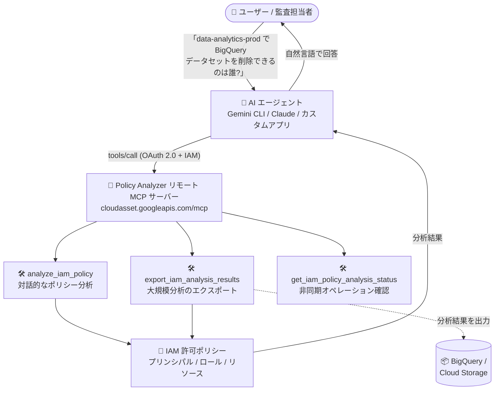

# Policy Intelligence: Policy Analyzer MCP サーバーが GA (一般提供)

**リリース日**: 2026-09-01

**サービス**: Policy Intelligence

**機能**: Policy Analyzer リモート MCP サーバー

**ステータス**: GA (一般提供)

📊 [このアップデートのインフォグラフィックを見る](https://takech9203.github.io/google-cloud-news-summary/20260901-policy-intelligence-policy-analyzer-mcp-server-ga.html)

## 概要

Policy Analyzer のリモート MCP (Model Context Protocol) サーバーが一般提供 (GA) になりました。この MCP サーバーは、Gemini CLI、ChatGPT、Claude などの AI アプリケーションや開発中のカスタムエージェントから Policy Analyzer のツールを直接呼び出せるようにするもので、AI エージェントが「誰が何にアクセスできるか」という IAM 構成の分析・監査を実行できるようになります。

Policy Analyzer の MCP ツールは Cloud Asset Inventory MCP サーバーの一部として提供され、Google Cloud のインフラストラクチャ上で動作するマネージドなグローバル HTTP エンドポイント (`https://cloudasset.googleapis.com/mcp`) 経由で利用できます。Policy Analyzer API を有効化すると MCP サーバーも有効になり、ローカルに MCP サーバーを構築・運用する必要はありません。

対象ユーザーは、IAM のアクセス経路の分析・監査を効率化したいセキュリティ管理者・監査担当者や、IAM 分析機能を組み込んだ AI エージェント・AI アプリケーションを開発する開発者です。2026 年 8 月 6 日に GA となった Policy Troubleshooter MCP サーバー (「なぜアクセスできる/できないか」の診断) に続き、Policy Intelligence ファミリーの MCP 対応がさらに拡充された形です。

**アップデート前の課題**

- 「誰がこのリソースにアクセスできるか」「このプリンシパルは何ができるか」を調べるには、管理者が Google Cloud コンソールや `gcloud` コマンドで Policy Analyzer のクエリを手動で組み立てて実行する必要があった
- AI エージェントから Policy Analyzer を利用するには、Cloud Asset Inventory API (`AnalyzeIamPolicy` など) を呼び出すカスタムツール定義やローカル MCP サーバーを自前で実装・運用する必要があった
- 大規模な分析結果を BigQuery や Cloud Storage にエクスポートする非同期オペレーションの発行・ポーリングも、エージェントに組み込むには独自実装が必要だった

**アップデート後の改善**

- AI エージェントや AI アプリケーションが、マネージドなリモート MCP サーバー経由で IAM 許可ポリシーの分析・監査を自然言語の対話から実行できるようになった
- `analyze_iam_policy` (対話的なポリシー分析)、`export_iam_analysis_results` (BigQuery / Cloud Storage への大規模分析結果のエクスポート)、`get_iam_policy_analysis_status` (非同期オペレーションのステータス確認) の 3 つのツールが GA として正式サポートされ、本番用途で利用できるようになった
- OAuth 2.0 + IAM によるきめ細かな認可、Model Armor によるプロンプト/レスポンス保護 (オプション)、集中監査ログ、IAM 拒否ポリシーによる MCP 利用制御など、Google Cloud マネージド MCP サーバー共通のセキュリティ・ガバナンス機能を利用できるようになった

## アーキテクチャ図



AI エージェントがユーザーの自然言語の質問を受け、リモート MCP サーバー経由で Policy Analyzer のツールを呼び出して IAM 許可ポリシーを分析し、「誰が・何に・どのようなアクセスを持つか」を回答するフローです。大規模分析は BigQuery / Cloud Storage への非同期エクスポートで処理します。

## サービスアップデートの詳細

### 主要機能

1. **analyze_iam_policy ツール**
   - IAM 許可ポリシーを分析し、「誰が・どのリソースに・何ができるか」を特定する。プリンシパルがアクセスできるリソースの検索、リソースにアクセスできるプリンシパルの検索、アクセス経路の確認などが可能
   - `analysis_query` パラメータで分析のルートコンテナ (`scope`) を指定し、リソース名・プリンシパル識別子・ロール/権限のセレクタをオプションで指定できる
   - `expand_groups` (グループ展開)、`expand_roles` (ロール展開)、`expand_resources` (リソース展開)、`analyze_service_account_impersonation` (サービスアカウント権限借用の分析) のオプションを指定できる (いずれもデフォルト `false`)

2. **export_iam_analysis_results ツール**
   - IAM ポリシーを非同期で分析し、結果を BigQuery データセットまたは Cloud Storage バケットにエクスポートする。リソース展開や権限借用分析を伴う大規模分析に適する
   - 長時間実行オペレーション (LRO) のオブジェクトを返すため、後述の `get_iam_policy_analysis_status` ツールで完了 (`done: true`) までポーリングする

3. **get_iam_policy_analysis_status ツール**
   - `export_iam_analysis_results` が返したオペレーション `name` を渡して、長時間実行オペレーションのステータスを確認する専用ツール

4. **Google Cloud マネージドリモート MCP サーバーとしての共通機能**
   - マネージドなグローバル HTTP エンドポイントの提供 (ローカル MCP サーバーの構築・運用が不要)
   - OAuth 2.0 + IAM によるきめ細かな認可 (API キーは不可)
   - Model Armor によるプロンプト/レスポンスの保護 (オプション)
   - 集中監査ログ、IAM 拒否ポリシーによる MCP 利用制御 (プリンシパル、ツールの read-only 属性、サービス名/ツール名、OAuth クライアント ID に基づく制御)

## 技術仕様

### MCP サーバーの基本情報

| 項目 | 詳細 |
|------|------|
| エンドポイント | `https://cloudasset.googleapis.com/mcp` (グローバル、Cloud Asset Inventory MCP サーバーの一部) |
| トランスポート | HTTP |
| 有効化 | Policy Analyzer API の有効化で MCP サーバーも有効になる |
| 認証 | OAuth 2.0 + IAM (すべての Google Cloud ID をサポート。API キーは不可) |
| OAuth スコープ | `https://www.googleapis.com/auth/cloudasset` |
| 提供ツール | `analyze_iam_policy`、`export_iam_analysis_results`、`get_iam_policy_analysis_status` |
| 対応クライアント | Gemini CLI、ChatGPT、Claude、Antigravity、カスタム AI アプリケーションなど |

### 必要な IAM ロール

| ロール | 用途 |
|--------|------|
| `roles/cloudasset.viewer` (Cloud Asset Viewer) | 基本的なポリシー分析 |
| `roles/iam.roleViewer` (Role Viewer) | カスタム IAM ロールを含むポリシーの分析 |
| `roles/serviceusage.serviceUsageConsumer` (Service Usage Consumer) | gcloud CLI からのポリシー分析 |
| `roles/mcp.toolUser` (MCP Tool User) | MCP ツール呼び出しの実行 |

必要な権限は `cloudasset.assets.analyzeIamPolicy`、`cloudasset.assets.searchAllResources`、`cloudasset.assets.searchAllIamPolicies`、`iam.roles.get` (カスタムロール分析時)、`serviceusage.services.use` (gcloud 利用時)、`mcp.tools.call` です。

### analyze_iam_policy ツールの主な仕様

| 項目 | 詳細 |
|------|------|
| `analysis_query.scope` | プロジェクトスコープ (`projects/PROJECT_ID`) のみサポート。**フォルダ・組織スコープは非サポート** |
| `resource_selector.full_resource_name` | スコープ内の特定リソースへのアクセスを調べる場合のみ指定 (例: `//storage.googleapis.com/BUCKET_NAME`) |
| `execution_timeout` | 未指定の場合は `60s` が推奨値 |
| オプション | `expand_groups` / `expand_roles` / `expand_resources` (デフォルト `false`)、`analyze_service_account_impersonation` (デフォルト `false`) |

## 設定方法

### 前提条件

1. Policy Analyzer API が有効化されていること (有効化により MCP サーバーも有効になる)
2. 利用するプリンシパルに前述の IAM ロール (Cloud Asset Viewer、MCP Tool User など) が付与されていること
3. エージェント用に専用の ID を作成することが推奨される (リソースアクセスの制御・監視のため)

### 手順

#### ステップ 1: MCP クライアントの設定

AI アプリケーションのリモート MCP サーバー追加設定で、以下の情報を入力します。

```text
Server name : Policy Analyzer MCP server
Server URL  : https://cloudasset.googleapis.com/mcp
Transport   : HTTP
OAuth scope : https://www.googleapis.com/auth/cloudasset
```

認証情報には、Google Cloud 認証情報、OAuth クライアント ID とシークレット、またはエージェント ID と認証情報のいずれかを使用します。Web ベースのアプリケーションではリダイレクト URI の許可リスト登録が必要です (カスタムリダイレクト URI は非サポート)。

#### ステップ 2: ツール一覧の確認 (任意)

`tools/list` メソッドは認証不要で、提供されるツールの仕様を確認できます。

```bash
curl --location 'https://cloudasset.googleapis.com/mcp' \
  --header 'content-type: application/json' \
  --header 'accept: application/json, text/event-stream' \
  --data '{ "method": "tools/list", "jsonrpc": "2.0", "id": 1 }'
```

#### ステップ 3: Model Armor による保護の有効化 (任意)

MCP ツール呼び出しとレスポンスを保護するには、Model Armor の Floor Settings で MCP サニタイズを有効にします。

```bash
gcloud model-armor floorsettings update \
  --full-uri='projects/PROJECT_ID/locations/global/floorSetting' \
  --enable-floor-setting-enforcement=TRUE \
  --add-integrated-services=GOOGLE_MCP_SERVER \
  --google-mcp-server-enforcement-type=INSPECT_AND_BLOCK \
  --enable-google-mcp-server-cloud-logging \
  --malicious-uri-filter-settings-enforcement=ENABLED
```

エージェントと MCP サーバーが別プロジェクトの場合は、両プロジェクトに Floor Settings を作成でき、その場合 Model Armor は各プロジェクトで 1 回ずつ呼び出されます。

## メリット

### ビジネス面

- **IAM 監査の効率化**: 「このプロジェクトで BigQuery データセットを削除できるのは誰か」といった監査上の問いに、AI エージェントが自然言語の対話で即座に回答できるため、アクセスレビューや監査対応の工数を削減できる
- **専門知識への依存の低減**: `AnalyzeIamPolicy` API のクエリ構造やグループ/ロール/リソース展開のオプションを理解していない担当者でも、エージェント経由で正確な分析結果を得られる
- **GA によるプロダクション利用**: 一般提供となったことで、本番環境のセキュリティ運用ワークフローや社内向け AI アシスタントへの組み込みを正式サポートの下で行える

### 技術面

- **マネージドエンドポイント**: リモート MCP サーバーとして Google のインフラ上で動作するため、ローカル MCP サーバーの構築・運用・アップデートが不要
- **大規模分析のエクスポートに対応**: `export_iam_analysis_results` + `get_iam_policy_analysis_status` により、リソース展開や権限借用分析を伴う大規模分析を非同期で実行し、結果を BigQuery / Cloud Storage に直接出力するワークフローをエージェントから実行できる
- **セキュリティ統制の一元化**: OAuth 2.0 + IAM の認可、IAM 拒否ポリシーによるツール利用制御、Model Armor 保護、集中監査ログにより、エージェントの MCP 利用をガバナンス下に置ける

## デメリット・制約事項

### 制限事項

- `analyze_iam_policy` / `export_iam_analysis_results` の `scope` はプロジェクトスコープ (`projects/PROJECT_ID`) のみで、フォルダ・組織スコープはサポートされない
- API キーによる認証は受け付けない (OAuth 2.0 + IAM のみ)
- Policy Analyzer の展開処理には上限がある (グループ展開: 1 グループあたり 1,000 メンバー、リソース展開: 1 リソースあたり 1,000 件、長時間実行分析のリソース展開: 100,000 件)
- Security Command Center の Premium / Enterprise ティアの組織レベル有効化がない場合、分析クエリは組織あたり 1 日 20 回までに制限される

### 考慮すべき点

- Policy Intelligence の MCP サーバーはクロスジュリスディクショナル (管轄をまたぐ) ルーティングを使用するため、Model Armor を有効にすると使用中・転送中データのデータレジデンシー要件に影響する可能性がある
- Model Armor でロギングを有効にするとペイロード全体が記録されるため、ログに機密情報が含まれる可能性に注意が必要
- Model Armor の Floor Settings は Vertex AI など他の統合サービスにも影響するため、MCP 保護のための変更が他サービスのトラフィックスキャン動作に波及する点に注意が必要
- エージェント用には専用の ID を作成し、リソースへのアクセスを制御・監視することが推奨される

## ユースケース

### ユースケース 1: 特定プロジェクトのアクセス監査レポート作成

**シナリオ**: セキュリティ監査で「本番データ分析プロジェクトの BigQuery データセットを削除できる ID をすべて洗い出す」必要がある。監査担当者は Policy Analyzer MCP サーバーを接続済みの AI アシスタントに依頼する。

**実装例**:
```text
プロンプト例:
「data-analytics-prod プロジェクト内のどこかで BigQuery データセットを
削除できるすべての ID の完全なレポートを作成してください。」

→ エージェントが analyze_iam_policy ツールを呼び出し
  (scope: projects/data-analytics-prod)、
  該当するプリンシパル・ロール・リソースの一覧を回答
```

**効果**: コンソールでのクエリ組み立てなしに、対話だけで「誰が何を削除できるか」を網羅的に特定でき、アクセスレビューの所要時間を短縮できる。

### ユースケース 2: 大規模分析結果の BigQuery エクスポート

**シナリオ**: グループメンバーシップを展開した詳細な分析結果を、後続の集計・可視化のために BigQuery テーブルに保存したい。

**実装例**:
```text
プロンプト例:
「この分析を audit-project:iam_analysis.bq_deleters BigQuery テーブルに
エクスポートしてください。閲覧権限のあるグループはメンバーシップを
展開してください。」

→ エージェントが export_iam_analysis_results ツールを呼び出し、
  返却されたオペレーション name を get_iam_policy_analysis_status で
  done: true までポーリング
```

**効果**: 大規模な IAM 分析の非同期実行と BigQuery への出力をエージェントに任せられ、分析結果を SQL やダッシュボードでそのまま活用できる。

## 料金

Policy Analyzer の分析クエリは、各組織で 1 日あたり 20 回まで無料で実行できます (許可ポリシー分析と組織ポリシー分析の合計)。1 日 20 回を超える分析クエリを実行するには、Security Command Center の Premium または Enterprise ティアの組織レベル有効化が必要です。

また、Cloud Asset Inventory 側のクォータとして `AnalyzeIamPolicy` / `AnalyzeIamPolicyLongrunning` はそれぞれコンシューマープロジェクトあたり 100 回/分・1,000 回/日 (デフォルト) の制限があります。

詳細は [Policy Intelligence の課金に関するドキュメント](https://docs.cloud.google.com/policy-intelligence/docs/billing-questions) を参照してください。

## 利用可能リージョン

MCP エンドポイントはグローバルエンドポイント (`https://cloudasset.googleapis.com/mcp`) として提供されます。

## 関連サービス・機能

- **Policy Troubleshooter MCP サーバー**: 2026 年 8 月 6 日に GA となった Policy Intelligence ファミリーの MCP サーバー。「なぜアクセスできる/できないか」の診断を提供し、Policy Analyzer (「誰が何にアクセスできるか」の分析) を補完する
- **Cloud Asset Inventory**: Policy Analyzer の MCP ツールは Cloud Asset Inventory MCP サーバー (`cloudasset.googleapis.com/mcp`) の一部として提供され、同サーバーは `list_assets` ツールも提供する
- **IAM (Identity and Access Management)**: 分析対象となる許可ポリシーを管理するサービス。MCP サーバーの認可にも IAM を使用し、IAM 拒否ポリシーで MCP ツールの利用を制御できる
- **BigQuery / Cloud Storage**: `export_iam_analysis_results` による大規模分析結果のエクスポート先
- **Model Armor**: MCP ツール呼び出しのプロンプト/レスポンスを検査・ブロックするオプションの保護機能
- **Security Command Center**: 1 日 20 回を超える分析クエリの実行には Premium / Enterprise ティアの組織レベル有効化が必要

## 参考リンク

- 📊 [インフォグラフィック](https://takech9203.github.io/google-cloud-news-summary/20260901-policy-intelligence-policy-analyzer-mcp-server-ga.html)
- [公式リリースノート](https://docs.cloud.google.com/release-notes#September_01_2026)
- [Use the Policy Analyzer remote MCP server](https://docs.cloud.google.com/policy-intelligence/docs/use-policy-analyzer-mcp)
- [Policy Analyzer MCP tool list](https://docs.cloud.google.com/policy-intelligence/docs/reference/policyanalyzer/mcp/policy-analyzer-mcp)
- [Cloud Asset Inventory MCP リファレンス](https://docs.cloud.google.com/asset-inventory/docs/reference/mcp)
- [Google Cloud MCP servers overview](https://docs.cloud.google.com/mcp/overview)
- [Policy Analyzer の概要](https://docs.cloud.google.com/policy-intelligence/docs/policy-analyzer-overview)
- [Policy Intelligence の課金に関するドキュメント](https://docs.cloud.google.com/policy-intelligence/docs/billing-questions)

## まとめ

Policy Analyzer リモート MCP サーバーの GA により、AI エージェントが「誰が何にアクセスできるか」という IAM 構成の分析・監査をマネージドかつセキュアな経路で実行できるようになり、8 月に GA となった Policy Troubleshooter MCP サーバーと合わせて、IAM 運用の診断・分析の両面をエージェントに委ねられる体制が整いました。アクセスレビューや IAM 監査に工数を割いているチームは、Policy Analyzer API を有効化して `analyze_iam_policy` / `export_iam_analysis_results` ツールの組み込みを検討することを推奨します。あわせて、エージェント専用 ID の作成、IAM 拒否ポリシー・Model Armor によるガバナンス設計、および無料枠 (組織あたり 1 日 20 クエリ) を超える利用時の Security Command Center ティア要件の確認も行うとよいでしょう。

---

**タグ**: `Policy Intelligence` `Policy Analyzer` `MCP` `IAM` `Cloud Asset Inventory` `AI エージェント` `セキュリティ` `監査` `GA`
