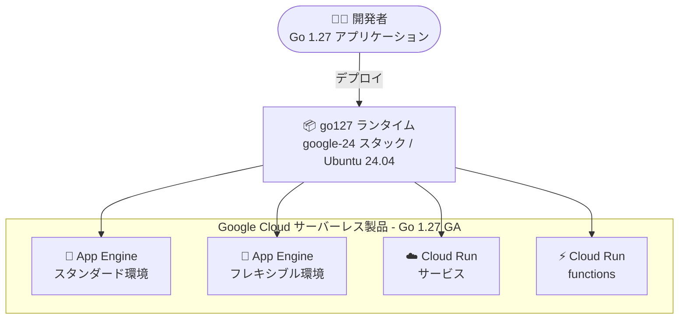

# App Engine / Cloud Run / Cloud Run functions: Go 1.27 ランタイムが GA に

**リリース日**: 2026-09-01

**サービス**: App Engine flexible environment (Go), App Engine standard environment (Go), Cloud Run, Cloud Run functions

**機能**: Go 1.27 ランタイムのサポート

**ステータス**: GA (一般提供)

📊 [このアップデートのインフォグラフィックを見る](https://takech9203.github.io/google-cloud-news-summary/20260901-serverless-go-1-27-runtime-ga.html)

## 概要

2026 年 9 月 1 日、Google Cloud のサーバーレスコンピューティング製品群である App Engine フレキシブル環境、App Engine スタンダード環境、Cloud Run、Cloud Run functions の 4 製品で、Go 1.27 ランタイムのサポートが一般提供 (GA) になりました。2026 年 8 月 19 日の Preview 公開 (App Engine スタンダード環境) から約 2 週間での GA 昇格です。

Go 1.27 は 2026 年 8 月にリリースされた Go の最新メジャーバージョンで、ジェネリックメソッド (メソッド宣言での型パラメータ) の導入、小さなオブジェクトのメモリ割り当ての最大 30% 高速化、`encoding/json/v2` による JSON 処理の刷新、ポスト量子暗号 ML-DSA (`crypto/mldsa`) のサポートなど、多くの改善を含みます。今回の GA により、これらの新機能を本番環境のサーバーレスワークロードで利用できるようになりました。

Go 1.27 ランタイム (ランタイム ID: `go127`) は Ubuntu 24.04 ベースの `google-24` スタック (デフォルト) および `google-24-full` スタック上で動作します。Cloud Run / Cloud Run functions のサポートスケジュールでは、非推奨 (Deprecation) が 2027 年 8〜9 月、廃止 (Decommission) が 2028 年 2〜3 月と案内されています。

**アップデート前の課題**

- Go 1.27 ランタイムは 2026 年 8 月 19 日から Preview として提供されており、本番ワークロードでの利用には GA を待つ必要があった
- GA のランタイムとしては Go 1.26 (2026 年 3 月 12 日 GA) が最新であり、Go 1.27 の新機能 (ジェネリックメソッド、`encoding/json/v2`、アロケーション高速化など) をサーバーレス環境で正式に利用できなかった
- Go のリリースポリシーでは、各メジャーバージョンは新しいメジャーリリースが 2 つ出るまでのサポートであるため、古いランタイムに留まると言語側のサポート終了リスクがある

**アップデート後の改善**

- App Engine (フレキシブル / スタンダード)、Cloud Run、Cloud Run functions の 4 つのサーバーレス製品すべてで、Go 1.27 を GA として本番利用できるようになった
- Go 1.27 の言語・ランタイム改善 (ジェネリックメソッド、小オブジェクト割り当ての最大 30% 高速化、goroutine リークプロファイルの GA、`encoding/json/v2` など) をマネージドランタイムで活用できるようになった
- ランタイム ID `go127` の指定 (Cloud Run functions は `--base-image go127`、App Engine は `app.yaml` の設定) だけで移行でき、Ubuntu 24.04 ベースの新しい `google-24` スタックが利用される

## アーキテクチャ図



Go 1.27 ランタイム (`go127`) が Ubuntu 24.04 ベースの `google-24` スタックとして提供され、4 つのサーバーレス製品すべてで GA として利用できることを示しています。

## サービスアップデートの詳細

### 主要機能

1. **4 つのサーバーレス製品での同時 GA**
   - App Engine フレキシブル環境 (Go)、App Engine スタンダード環境 (Go)、Cloud Run、Cloud Run functions で Go 1.27 ランタイムが同日に GA
   - ランタイム ID は共通で `go127`
   - Ubuntu 24.04 ベースの `google-24` スタック (デフォルト) と `google-24-full` スタックに対応

2. **Go 1.27 の言語・ランタイム改善 (go.dev リリースノートより)**
   - ジェネリックメソッド: メソッド宣言で独自の型パラメータを宣言可能に
   - メモリ割り当ての高速化: 80 バイト未満の小さなオブジェクトの割り当てコストを最大 30% 削減
   - goroutine リークプロファイル (`goroutineleak`) が GA になり、到達不能な同期プリミティブでブロックされた goroutine を検出可能
   - `encoding/json/v2` / `encoding/json/jsontext` による JSON 処理の刷新 (v1 も v2 ベースになりアンマーシャルが高速化)
   - ポスト量子署名 ML-DSA (`crypto/mldsa`、FIPS 204) と TLS 1.3 / X.509 での利用サポート
   - 標準ライブラリに `uuid` パッケージを追加、実験的な `simd` パッケージも導入

3. **ライフサイクルポリシーの明確化**
   - Cloud Run / Cloud Run functions での Go 1.27 の非推奨は 2027 年 8〜9 月、廃止は 2028 年 2〜3 月の予定
   - Go 1.26 以降、ランタイムのライフサイクルサポート日程は Go コミュニティのリリースサイクルにより密接に整合するよう変更されている
   - Go のリリースポリシー (新しいメジャーリリースが 2 つ出るまでサポート) に応じて、日程は延期される可能性がある

## 技術仕様

### Go 1.27 ランタイムの仕様

| 項目 | 詳細 |
|------|------|
| ランタイム ID | `go127` |
| スタック (ベース OS) | `google-24` (デフォルト)、`google-24-full` (Ubuntu 24.04) |
| ランタイムベースイメージ | `us-central1-docker.pkg.dev/serverless-runtimes/google-24/runtimes/go127` |
| 非推奨予定 (Cloud Run / functions) | 2027 年 8〜9 月 |
| 廃止予定 (Cloud Run / functions) | 2028 年 2〜3 月 |
| 依存関係管理 | Go modules (`go.mod`) または vendor ディレクトリ |
| 必要な gcloud CLI (App Engine フレキシブル) | 420.0.0 以降 |

### Go ランタイムのサポート状況 (Cloud Run / Cloud Run functions)

| ランタイム | ランタイム ID | スタック | 非推奨 | 廃止 |
|-----------|--------------|---------|--------|------|
| Go 1.27 | go127 | google-24 (デフォルト) | 2027 年 8〜9 月 | 2028 年 2〜3 月 |
| Go 1.26 | go126 | google-24 (デフォルト) | 2027 年 2〜3 月 | 2027 年 8〜9 月 |
| Go 1.25 | go125 | google-22 (デフォルト) | 2026-10-01 | 2027-04-01 |
| Go 1.24 | go124 | google-22 (デフォルト) | 2026-09-02 | 2027-03-02 |

## 設定方法

### 前提条件

1. Google Cloud プロジェクトで対象サービス (App Engine / Cloud Run / Cloud Run functions) の API が有効であること
2. gcloud CLI が最新であること (App Engine フレキシブル環境で Go 1.27 を使う場合は 420.0.0 以降)
3. アプリケーションが `go.mod` で依存関係を管理していること

### 手順

#### ステップ 1: Cloud Run functions で Go 1.27 を指定してデプロイ

```bash
gcloud run deploy FUNCTION \
  --source . \
  --function FUNCTION_ENTRYPOINT \
  --base-image go127
```

`--base-image go127` フラグで Go 1.27 のベースイメージを指定します。Google Cloud コンソールの場合は、Cloud Run の「関数を作成」でランタイムリストから Go 1.27 を選択します。

#### ステップ 2: App Engine フレキシブル環境の app.yaml を更新

```yaml
runtime: go
env: flex
runtime_config:
  operating_system: "ubuntu24"
  runtime_version: "1.27"
```

`operating_system` に `ubuntu24` を指定し、`runtime_version` に `1.27` を指定します。`runtime_version` を省略した場合は、最新の Go バージョンが使用されます。App Engine スタンダード環境の場合は `app.yaml` の `runtime` にランタイム ID (`go127`) を指定します。

#### ステップ 3: デプロイ

```bash
gcloud app deploy
```

デプロイ後、App Engine はパッチリビジョンを自動更新しますが、メジャーバージョン (例: 1.27 → 1.28) は自動更新されません。

## メリット

### ビジネス面

- **本番利用の解禁**: GA 昇格により、SLA が適用される本番ワークロードで Go 1.27 を安心して採用できる
- **長いサポート期間の確保**: Go 1.27 は Go ランタイムの中で最も長いサポート期間 (廃止予定 2028 年 2〜3 月) を持ち、ランタイム移行の頻度を減らせる
- **セキュリティ将来対応**: ポスト量子暗号 ML-DSA のサポートにより、耐量子セキュリティ要件への対応準備が可能

### 技術面

- **パフォーマンス向上**: 小さなオブジェクトの割り当てコストが最大 30% 削減され、割り当ての多いサーバーレスワークロードで恩恵を受けられる
- **JSON 処理の刷新**: `encoding/json/v2` により、より厳密なデフォルト動作と高速なアンマーシャルが利用可能
- **可観測性の向上**: goroutine リークプロファイルが GA になり、リークした goroutine の検出が容易になる
- **新しいベース OS**: Ubuntu 24.04 ベースの `google-24` スタックにより、最新のシステムライブラリを利用できる

## デメリット・制約事項

### 制限事項

- Go 1.27 のジェネリックメソッドは、インターフェースメソッドでの型パラメータ宣言や、ジェネリックメソッドによるインターフェースメソッドの実装には対応していない
- App Engine フレキシブル環境で Go 1.27 を使うには gcloud CLI 420.0.0 以降が必要
- Go のリリースポリシーにより、Go 1.27 は今後 2 つの新しいメジャーリリース (Go 1.28、1.29) が出るとコミュニティサポートが終了するため、継続的なランタイム更新の計画が必要

### 考慮すべき点

- `encoding/json` v1 の内部実装が v2 ベースに変わるなど、Go 1.27 にはアプリケーションの挙動に影響し得る変更が含まれるため、移行前に十分なテストを行うこと
- 既存の Go 1.24 ランタイムは 2026 年 9 月 2 日に非推奨、Go 1.25 は 2026 年 10 月 1 日に非推奨となる予定のため、古いランタイムを使用中の場合は移行計画を立てること
- `google-22` スタックから `google-24` スタックへの移行に伴い、ベース OS のパッケージ差異がビルドや実行に影響しないか確認すること

## ユースケース

### ユースケース 1: 既存の Go 製 Cloud Run functions のランタイム更新

**シナリオ**: Go 1.24 (2026 年 9 月 2 日に非推奨予定) で稼働中の Cloud Run functions を、サポート期間の長い最新ランタイムへ移行したい。

**実装例**:
```bash
gcloud run deploy my-function \
  --source . \
  --function HelloHTTP \
  --base-image go127
```

**効果**: 廃止予定が 2028 年 2〜3 月の最新ランタイムに移行でき、当面のランタイム更新作業が不要になる。あわせてアロケーション高速化や JSON 処理の高速化の恩恵を受けられる。

### ユースケース 2: 高スループット API サーバーのパフォーマンス改善

**シナリオ**: Cloud Run 上で JSON を大量に処理する Go 製 API サーバーを運用しており、レイテンシとインスタンスコストを削減したい。

**効果**: Go 1.27 の小オブジェクト割り当ての最大 30% 高速化と `encoding/json/v2` ベースの高速なアンマーシャルにより、CPU 使用率の低減とレスポンス改善が期待できる。goroutine リークプロファイルにより、長期稼働時のリソースリークの調査も容易になる。

## 料金

ランタイムバージョンの GA 自体による料金変更はありません。各サービスの料金は従来どおり、リクエスト数・vCPU / メモリ使用時間・インスタンス稼働時間などに基づきます。

- [Cloud Run の料金](https://cloud.google.com/run/pricing)
- [App Engine の料金](https://cloud.google.com/appengine/pricing)

## 利用可能リージョン

Go 1.27 ランタイムは、App Engine、Cloud Run、Cloud Run functions が提供されている各リージョンで利用できます。リージョンごとの提供状況は各サービスのドキュメントを参照してください。

- [Cloud Run のロケーション](https://cloud.google.com/run/docs/locations)
- [App Engine のリージョン](https://cloud.google.com/about/locations)

## 関連サービス・機能

- **Cloud Build / Buildpacks**: Go 1.27 ランタイム (App Engine フレキシブル環境や Cloud Run のソースデプロイ) は Google Cloud の Buildpacks を使用してコンテナイメージをビルドする
- **Artifact Registry**: ランタイムベースイメージ (`serverless-runtimes/google-24/runtimes/go127`) は Artifact Registry から提供される
- **Cloud Monitoring / Cloud Profiler**: Go 1.27 で GA となった goroutine リークプロファイルなど、`runtime/pprof` ベースの可観測性機能と組み合わせて利用できる

## 参考リンク

- 📊 [インフォグラフィック](https://takech9203.github.io/google-cloud-news-summary/20260901-serverless-go-1-27-runtime-ga.html)
- [公式リリースノート (2026 年 9 月 1 日)](https://docs.cloud.google.com/release-notes#September_01_2026)
- [App Engine フレキシブル環境の Go ランタイム](https://docs.cloud.google.com/appengine/docs/flexible/go/runtime)
- [App Engine スタンダード環境の Go ランタイム](https://docs.cloud.google.com/appengine/docs/standard/go/runtime)
- [Cloud Run のランタイムサポートスケジュール (Go)](https://docs.cloud.google.com/run/docs/runtime-support#go)
- [Cloud Run functions の実行環境 (Go)](https://docs.cloud.google.com/functions/docs/concepts/execution-environment#go)
- [Go 1.27 リリースノート (go.dev)](https://go.dev/doc/go1.27)
- [Cloud Run の料金ページ](https://cloud.google.com/run/pricing)

## まとめ

Go 1.27 ランタイムが App Engine (フレキシブル / スタンダード)、Cloud Run、Cloud Run functions の 4 製品で同時に GA となり、Google Cloud のサーバーレス全体で最新の Go を本番利用できるようになりました。ジェネリックメソッドやメモリ割り当ての高速化、`encoding/json/v2` など実運用に直結する改善が多いため、特に非推奨が迫っている Go 1.24 / 1.25 ランタイムを利用中のワークロードは、テストを実施のうえ `go127` への移行を計画することを推奨します。

---

**タグ**: App Engine, Cloud Run, Cloud Run functions, Go, ランタイム, サーバーレス, GA
