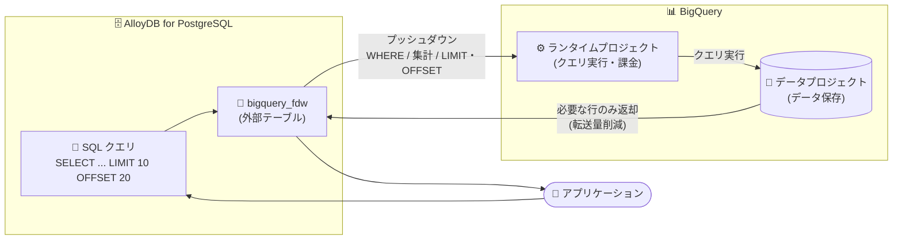

# AlloyDB for PostgreSQL: BigQuery リアルタイムデータアクセスに Limit プッシュダウンとランタイムプロジェクトが追加 (Preview)

**リリース日**: 2026-09-02

**サービス**: AlloyDB for PostgreSQL

**機能**: BigQuery リアルタイムデータアクセス (レイクハウスフェデレーション) の Limit プッシュダウンとランタイムプロジェクト

**ステータス**: Preview

📊 [このアップデートのインフォグラフィックを見る](https://takech9203.github.io/google-cloud-news-summary/20260902-alloydb-bigquery-limit-pushdown-runtime-projects.html)

## 概要

AlloyDB for PostgreSQL の BigQuery リアルタイムデータアクセス (Preview) に、**Limit プッシュダウン**と**ランタイムプロジェクト**の 2 つの機能が追加されました。この機能は `bigquery_fdw` 拡張機能 (Foreign Data Wrapper) によるレイクハウスフェデレーションの一部で、AlloyDB から標準の PostgreSQL 構文で BigQuery の最新データを ETL パイプラインなしに直接クエリできる仕組みを強化するものです。

Limit プッシュダウンにより、外部テーブルへのクエリに含まれる `LIMIT` 句と `OFFSET` 句の一部が自動的に BigQuery 側へプッシュダウンされ、要求された行のサブセットのみが返されるようになります。これによりネットワーク転送量が削減され、クエリ応答時間が改善します。従来サポートされていたフィルタプッシュダウン (`WHERE` 句) と集計プッシュダウン (`SUM`、`COUNT` など) に加わる 3 つ目のプッシュダウン最適化です。

ランタイムプロジェクトは、クエリを実行しコンピュートコストを負担するプロジェクト (課金プロジェクト) を、データを保存するプロジェクトとは独立して指定できる機能です。外部サーバーレベル (配下の全外部テーブルに適用) または外部テーブルレベル (サーバーレベルの設定をオーバーライド) で指定でき、コストセンターごとのコスト分離、クォータの独立管理、ワークロード別の支出管理が可能になります。HTAP (ハイブリッドトランザクション/分析処理) ワークロードを運用するデータベース管理者や、複数チームで BigQuery データを共有する組織に有用なアップデートです。

**アップデート前の課題**

- `LIMIT`/`OFFSET` 句は BigQuery 側にプッシュダウンされず、必要以上の行が AlloyDB に転送されるため、少数行のみ取得したいクエリでもネットワーク転送量とレイテンシが大きくなっていた
- 外部テーブルへのクエリ実行 (コンピュート) コストは、常にデータを保存するプロジェクトに課金され、ワークロードやコストセンターごとにコストを分離できなかった
- クエリのクォータもデータ保存プロジェクト側で消費されるため、複数ワークロードでデータを共有する場合にクォータ管理が困難だった

**アップデート後の改善**

- 条件を満たす `LIMIT`/`OFFSET` 句が自動的に BigQuery へプッシュダウンされ、要求された行のみが転送されることでネットワーク転送量が削減され、クエリ応答時間が改善された (ユーザー側の設定は不要)
- 外部サーバーまたは外部テーブルの `runtime_project` オプションで実行プロジェクトを指定でき、データを移動せずにコンピュートコストを特定のコストセンターに分離できるようになった
- テーブルレベルの指定はサーバーレベルの指定をオーバーライドするため、テーブル単位で柔軟な課金先の使い分けが可能になった

## アーキテクチャ図



アプリケーションが AlloyDB の外部テーブルにクエリを発行すると、`WHERE` 句・集計に加えて `LIMIT`/`OFFSET` 句も BigQuery にプッシュダウンされ、必要な行のみが AlloyDB に返されます。クエリの実行と課金は、データ保存プロジェクトとは別に指定したランタイムプロジェクトで行えます。

## サービスアップデートの詳細

### 主要機能

1. **Limit プッシュダウン (OFFSET プッシュダウンを含む)**
   - クエリの `LIMIT` 句と `OFFSET` 句を AlloyDB から BigQuery に移動する最適化技術
   - BigQuery が要求された特定の行サブセットのみを返すため、ネットワークトラフィックとクエリレイテンシが大幅に削減される
   - 可能な場合に自動的に適用され、ユーザー側の設定は不要
   - 適用条件: クエリが `FETCH FIRST` 句の `WITH TIES` オプションを使用していないこと、`LIMIT`/`OFFSET` の式が基本的な定数またはリモートで評価可能な式であること

2. **ランタイムプロジェクト (課金プロジェクト)**
   - クエリを実行しコンピュートコストを負担するプロジェクトを、データを保存するプロジェクトから分離して指定できる
   - 外部サーバーレベルで指定すると、関連付けられたすべての外部テーブルに適用される
   - 外部テーブルレベルで指定すると、サーバーレベルの設定をオーバーライドする
   - 指定しない場合は、従来どおりデータを所有するプロジェクトに課金される
   - コストセンターごとのコスト分離、クォータの独立管理、ワークロード横断の支出管理をデータ移動なしで実現

3. **最小権限のセキュリティコントロール (ベストプラクティス)**
   - `bigquery_fdw` 経由のクエリは AlloyDB クラスタのサービスアカウントで認証されるため、一般のデータベースユーザーが未承認のテーブルをマッピングできないよう制御が重要
   - 外部サーバーの `USAGE` 権限を制限 (必要に応じて `PUBLIC` から `REVOKE`) することで、管理者以外による `CREATE FOREIGN TABLE` の実行を防止
   - 外部テーブルの作成を管理者 (`alloydbsuperuser` など) に集約し、`GRANT SELECT` で特定テーブルへの選択的な読み取りアクセスを付与

## 技術仕様

### プッシュダウン最適化の種類

| プッシュダウン | 対象 | サポートされる操作 |
|------|------|------|
| フィルタプッシュダウン | `WHERE` 句 | 比較演算子 (`=`, `<`, `>`, `<=`, `>=`, `<>`)、論理演算子 (`AND`, `OR`, `NOT`)、`LIKE`/`NOT LIKE`、`IS NULL`/`IS NOT NULL`、`IN`/`NOT IN` |
| 集計プッシュダウン | 集計関数 | `SUM`, `COUNT`, `AVG`, `MIN`, `MAX` |
| **Limit プッシュダウン (新規)** | `LIMIT`/`OFFSET` 句 | `WITH TIES` を使用せず、式が定数またはリモート評価可能な場合に自動適用 |

### ランタイムプロジェクトの指定レベル

| 指定レベル | 適用範囲 | 優先度 |
|------|------|------|
| 外部サーバーレベル (`CREATE SERVER ... OPTIONS (runtime_project '...')`) | そのサーバーに関連付けられたすべての外部テーブル | テーブルレベル指定がある場合はオーバーライドされる |
| 外部テーブルレベル (`CREATE FOREIGN TABLE ... OPTIONS (runtime_project '...')`) | そのテーブルのみ | サーバーレベルの指定より優先 |
| 指定なし | - | データを所有するプロジェクトに課金 (デフォルト) |

### 必要な IAM ロール (AlloyDB クラスタサービスアカウント)

| ロール | 用途 |
|------|------|
| BigQuery Data Viewer (`roles/bigquery.dataViewer`) | テーブル/ビューのデータとメタデータの読み取り |
| BigQuery Read Session User (`roles/bigquery.readSessionUser`) | 読み取りセッションの作成と使用 |
| BigQuery Job User (`roles/bigquery.jobUser`) | クエリジョブの実行。**ランタイムプロジェクトを指定した場合は、ランタイムプロジェクト側でこのロールの付与が必要** |
| Storage Object Viewer (`roles/storage.objectViewer`) | BigQuery 外部テーブル (Cloud Storage 上の Iceberg テーブルなど) へのアクセス |

## 設定方法

### 前提条件

1. AlloyDB for PostgreSQL インスタンスで `bigquery_fdw.enabled` フラグを有効化する
2. AlloyDB API、BigQuery API、BigQuery Storage API などの必要な Cloud API を有効化する
3. AlloyDB クラスタのサービスアカウントに必要な IAM ロールを付与する (ランタイムプロジェクトを使用する場合は、ランタイムプロジェクトに対して BigQuery Job User を付与)

### 手順

#### ステップ 1: 拡張機能の作成

```sql
CREATE EXTENSION bigquery_fdw;
```

BigQuery データセットへのアクセスが必要なすべてのデータベースで拡張機能を作成します。

#### ステップ 2: ランタイムプロジェクトを指定して外部サーバーを作成

```sql
CREATE SERVER bq_server
  FOREIGN DATA WRAPPER bigquery_fdw
  OPTIONS (runtime_project 'RUNTIME_PROJECT_ID');
```

`runtime_project` は省略可能です。省略した場合、クエリはデータを保存するプロジェクトに課金されます。

#### ステップ 3: 最小権限の設定とユーザーマッピングの作成 (管理者が実行)

```sql
-- 未承認のテーブル作成を防ぐため USAGE を PUBLIC から剥奪
REVOKE ALL ON FOREIGN SERVER bq_server FROM PUBLIC;

-- 一般ユーザーのユーザーマッピングを作成
CREATE USER MAPPING FOR bob SERVER bq_server;
```

外部サーバーの `USAGE` 権限を制限することで、管理者以外のユーザーによる `CREATE FOREIGN TABLE` の実行を防止します。

#### ステップ 4: 外部テーブルの作成と選択的なアクセス付与 (管理者が実行)

```sql
-- テーブルレベルで runtime_project をオーバーライド可能
CREATE FOREIGN TABLE example_table (
  id INT,
  state VARCHAR
) SERVER bq_server OPTIONS (
  project 'BIGQUERY_PROJECT_ID',
  dataset 'BIGQUERY_DATASET_NAME',
  table 'example_table',
  runtime_project 'RUNTIME_PROJECT_ID'
);

-- 特定のユーザーに読み取りアクセスを付与
GRANT SELECT ON public.example_table TO bob;
```

作成後は、AlloyDB の通常のテーブルと同じようにクエリできます。`LIMIT`/`OFFSET` 句を含むクエリは、条件を満たせば自動的に BigQuery へプッシュダウンされます。

## メリット

### ビジネス面

- **コストの可視化と分離**: ランタイムプロジェクトにより、フェデレーテッドクエリのコンピュートコストをコストセンターやチームごとのプロジェクトに割り当てられ、データ移動なしでチャージバック運用が可能
- **クエリコストの削減**: Limit プッシュダウンにより転送データ量が減り、探索的なクエリや上位 N 件取得のコスト効率が向上

### 技術面

- **クエリ応答時間の改善**: `LIMIT`/`OFFSET` を BigQuery 側で処理することで、ネットワーク転送量とレイテンシが削減される (自動適用のためアプリケーション変更は不要)
- **クォータの独立管理**: クエリジョブがランタイムプロジェクト側で実行されるため、データ保存プロジェクトのクォータを消費せず、ワークロードごとにクォータを管理できる
- **セキュリティガバナンスの強化**: 外部サーバーの `USAGE` 制限により、サービスアカウント権限を悪用した未承認データセットへのマッピングを防止できる

## デメリット・制約事項

### 制限事項

- 本機能は Preview であり、Pre-GA Offerings Terms が適用される (サポートが限定される可能性がある)
- Limit プッシュダウンは、`FETCH FIRST` 句の `WITH TIES` オプションを使用するクエリや、`LIMIT`/`OFFSET` の式がリモートで評価できない場合には適用されない
- プッシュダウン適用後も BigQuery から大量のデータを返すクエリは最適化されず、BigQuery API のレスポンスサイズ上限によりクエリが失敗する可能性がある
- AlloyDB と BigQuery でデフォルトの照合順序 (collation) が異なるため、ソート順や文字列比較の結果が異なる場合がある (AlloyDB 側で ICU なしの `C.UTF-8`、BigQuery 側でデフォルト照合順序の使用を推奨)
- 外部テーブル作成時に、リモートの BigQuery テーブルの存在やスキーマは検証されない
- Database Migration Service は `bigquery_fdw` で作成した外部テーブルの移行をサポートしない (移行前に削除し、移行後に再作成する必要がある)

### 考慮すべき点

- BigQuery へのアクセス権限は AlloyDB クラスタのサービスアカウントで評価される。IAM データベース認証でサインインしたユーザーであっても、個々の IAM ユーザー権限は BigQuery テーブルに対してチェックされないため、外部サーバーの `USAGE` 制限などの最小権限コントロールの適用を検討すべき
- ランタイムプロジェクトを指定する場合、ランタイムプロジェクト側で AlloyDB クラスタサービスアカウントに BigQuery Job User ロールを付与する必要がある
- PostgreSQL と BigQuery で小数の精度の扱いが異なるため、複雑な計算で精度損失やオーバーフローが発生する可能性がある

## ユースケース

### ユースケース 1: 運用ダッシュボードでの上位 N 件表示 (HTAP)

**シナリオ**: AlloyDB 上の業務アプリケーションのダッシュボードで、BigQuery に蓄積された大規模な分析データから最新の上位 100 件を表示したい。

**実装例**:
```sql
SELECT order_id, amount, created_at
FROM bq_sales_history
WHERE region = 'apac'
ORDER BY created_at DESC
LIMIT 100;
```

**効果**: `WHERE` 句のフィルタプッシュダウンに加えて `LIMIT 100` が BigQuery にプッシュダウンされ、100 件のみが AlloyDB に転送される。ネットワーク転送量が削減され、ダッシュボードの応答時間が改善する。

### ユースケース 2: チーム別のコスト分離とクォータ管理

**シナリオ**: 全社共通のデータプロジェクトに保存された BigQuery データを、分析チームとアプリケーションチームがそれぞれ AlloyDB 経由で参照する。各チームのクエリコストを自チームのプロジェクトに計上したい。

**実装例**:
```sql
-- 分析チーム用の外部サーバー (分析チームのプロジェクトに課金)
CREATE SERVER bq_analytics
  FOREIGN DATA WRAPPER bigquery_fdw
  OPTIONS (runtime_project 'analytics-team-project');

-- アプリチーム用の外部サーバー (アプリチームのプロジェクトに課金)
CREATE SERVER bq_app
  FOREIGN DATA WRAPPER bigquery_fdw
  OPTIONS (runtime_project 'app-team-project');
```

**効果**: データを移動・複製することなく、クエリのコンピュートコストとクォータ消費をチームごとのプロジェクトに分離できる。コストセンター別のチャージバックと独立したクォータ管理が実現する。

## 料金

BigQuery Foreign Data Wrapper の利用には、以下の BigQuery 料金が適用されます。

- BigQuery コンピュート料金 (クエリ実行)
- BigQuery Storage API 料金 (データ読み取り)

ランタイムプロジェクトを指定した場合、クエリのコンピュートコストはランタイムプロジェクトに課金されます。指定しない場合は、データを所有するプロジェクトに課金されます。詳細は [BigQuery の料金ページ](https://cloud.google.com/bigquery/pricing)を参照してください。AlloyDB 自体の料金は [AlloyDB の料金ページ](https://cloud.google.com/alloydb/pricing)を参照してください。

## 関連サービス・機能

- **BigQuery**: フェデレーション先の分析データウェアハウス。組み込みストレージのほか、BigLake 外部テーブル経由で Cloud Storage 上の Apache Iceberg テーブルにもアクセス可能
- **BigQuery から AlloyDB へのデータ同期 (Preview)**: リアルタイムアクセスとは逆方向のアプローチとして、BigQuery のテーブルを AlloyDB に一回限りまたは定期的に同期する機能も提供されている (2026 年 8 月発表)
- **IAM (Identity and Access Management)**: AlloyDB クラスタサービスアカウントへのロール付与により BigQuery データへのアクセスを集中管理
- **AlloyDB AI / カラムナエンジン**: 外部の分析データを AlloyDB にマテリアライズすることで、ベクトル検索や AI ワークフローと組み合わせた活用が可能

## 参考リンク

- 📊 [インフォグラフィック](https://takech9203.github.io/google-cloud-news-summary/20260902-alloydb-bigquery-limit-pushdown-runtime-projects.html)
- [公式リリースノート](https://docs.cloud.google.com/release-notes#September_02_2026)
- [Access to real-time data in BigQuery overview](https://docs.cloud.google.com/alloydb/docs/access-real-time-data-overview)
- [Configure access to real-time data in BigQuery](https://docs.cloud.google.com/alloydb/docs/configure-access-real-time-data)
- [Secure BigQuery data access using the foreign data wrapper](https://docs.cloud.google.com/alloydb/docs/security-best-practices#secure-bq-fdw)
- [Choose how to access BigQuery data from AlloyDB](https://docs.cloud.google.com/alloydb/docs/choose-access-bigquery-data-from-alloydb)
- [BigQuery 料金ページ](https://cloud.google.com/bigquery/pricing)

## まとめ

AlloyDB の BigQuery リアルタイムデータアクセスは、Limit プッシュダウンによるクエリ性能の向上と、ランタイムプロジェクトによるコスト・クォータ管理の柔軟化により、HTAP ワークロードの実用性が一段と高まりました。既に `bigquery_fdw` を利用している場合、Limit プッシュダウンは自動適用されるため追加設定は不要ですが、複数チームでデータを共有する環境ではランタイムプロジェクトの導入と、外部サーバーの `USAGE` 権限制限による最小権限コントロールの適用を検討することを推奨します。

---

**タグ**: AlloyDB, PostgreSQL, BigQuery, レイクハウスフェデレーション, Foreign Data Wrapper, プッシュダウン, ランタイムプロジェクト, HTAP, Preview
