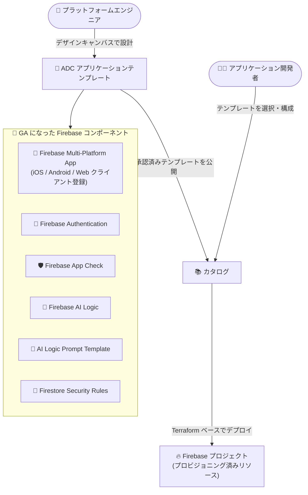

# Application Design Center: Firebase コンポーネント 6 種が GA

**リリース日**: 2026-09-02

**サービス**: Application Design Center

**機能**: Firebase コンポーネント (AI Logic / App Check / Authentication / Multi-Platform App / Firestore Security Rules) の General Availability

**ステータス**: GA (一般提供)

📊 [このアップデートのインフォグラフィックを見る](https://takech9203.github.io/google-cloud-news-summary/20260902-application-design-center-firebase-components-ga.html)

## 概要

Application Design Center (ADC) において、以下 6 つの Firebase 関連コンポーネントが General Availability (GA) になりました。

- Firebase AI Logic
- Firebase AI Logic Prompt Template
- Firebase App Check
- Firebase Authentication
- Firebase Multi-Platform App
- Firestore Security Rules

Application Design Center は、プラットフォームチームがアプリケーションアーキテクチャをテンプレートとして設計・共有し、開発チームがそのテンプレートからガバナンスの効いたインフラをデプロイできる Google Cloud のサービスです。バックエンドは Terraform で、デザインキャンバス (GUI)、自然言語チャット (Gemini Cloud Assist)、REST API、gcloud CLI から利用できます。今回の GA により、モバイル / Web アプリのバックエンドとして広く使われる Firebase の主要プロダクトを、組織標準に準拠したテンプレートの一部として本番ワークロード向けに設計・デプロイできるようになりました。

対象ユーザーは、Firebase を利用するアプリ開発を組織的なガバナンス (IAM、リージョン制限、セキュリティ標準) のもとで標準化したいエンタープライズのプラットフォームエンジニアと、テンプレートを使って迅速にインフラを立ち上げたいアプリケーション開発者です。

**アップデート前の課題**

- ADC の Firebase サポートは Preview (プレビュー) 段階であり、SLA や非推奨化ポリシーの対象外で、後方互換性のない変更が行われる可能性があったため、本番環境での採用にはリスクがあった
- Firebase プロジェクトのセットアップ (リソースのプロビジョニング、API の有効化、iOS / Android / Web アプリクライアントの登録) を組織標準に沿って統制する仕組みがテンプレートとして本番品質で提供されていなかった
- 生成 AI アプリで使うプロンプトテンプレートや Firestore のセキュリティルールを、Infrastructure as Code として一元的に管理・配布する Google 提供コンポーネントが Preview に留まっていた

**アップデート後の改善**

- Firebase 関連の 6 コンポーネントが GA となり、SLA の対象となる本番品質で ADC テンプレートに組み込めるようになった
- Firebase Multi-Platform App コンポーネントにより、Firebase プロジェクトと Apple (iOS) / Android / Web の各アプリクライアント登録を 1 つのコンポーネントで統一的にプロビジョニングできる
- Firebase AI Logic + Prompt Template + App Check + Authentication + Firestore Security Rules を組み合わせ、認証・不正利用対策・アクセス制御まで含めた生成 AI アプリの標準構成をテンプレート化し、カタログ経由で全社に配布できる

## アーキテクチャ図



プラットフォームエンジニアが GA になった Firebase コンポーネントを組み合わせてテンプレートを設計・カタログ公開し、アプリケーション開発者がそのテンプレートからガバナンスの効いた Firebase インフラをデプロイする流れを示しています。

## サービスアップデートの詳細

### 主要機能

今回 GA になった 6 コンポーネントの内容は以下のとおりです (公式ドキュメントの説明に基づく)。

1. **Firebase AI Logic**
   - Firebase 経由で Vertex AI の大規模言語モデル (LLM) を実行するためのコンポーネント
   - Firebase App Check によるセキュリティ統制のもとでモデルを利用する構成をテンプレート化できる

2. **Firebase AI Logic Prompt Template**
   - Firebase AI Logic アプリケーションで使用するプロンプトテンプレートを一元的に管理・デプロイし、アプリ間の一貫性を維持する

3. **Firebase App Check**
   - トラフィックが正規のアプリから発信されていることを証明 (アテステーション) することで、課金詐欺やフィッシングなどの不正利用からバックエンド API を保護する

4. **Firebase Authentication**
   - バックエンドサービス、使いやすい SDK、既製の UI ライブラリにより、アプリケーションのユーザーを安全に認証する

5. **Firebase Multi-Platform App**
   - 統一された Firebase プロジェクトと、Apple (iOS) / Android / Web 各プラットフォーム向けに登録されたアプリケーションクライアントをまとめてプロビジョニングする

6. **Firestore Security Rules**
   - Firestore データベースに対する厳格なアクセス制御とデータ検証を実現するセキュリティルールをデプロイ・管理する

## 技術仕様

### GA コンポーネントと対応 Terraform モジュール

ADC は Terraform をバックエンドとしており、各コンポーネントは Google 提供の Terraform モジュールに対応しています。

| コンポーネント | 分類 | Terraform モジュール |
|------|------|------|
| Firebase AI Logic | Services | `terraform-google-firebase/modules/firebase_ai_logic_core` |
| Firebase AI Logic Prompt Template | Assets | `terraform-google-firebase/modules/firebase_ai_logic_prompt_template` |
| Firebase App Check | Services | (terraform-google-firebase リポジトリ内モジュール) |
| Firebase Authentication | Services | (terraform-google-firebase リポジトリ内モジュール) |
| Firebase Multi-Platform App | Assets | `terraform-google-firebase/modules/firebase_multi_platform_application` |
| Firestore Security Rules | Assets | `terraform-google-firebase/modules/firestore_rules` |

### 関連する IAM ロール

ADC ではペルソナ (役割) に応じた IAM ロールの割り当てが推奨されています。

| タスク | ペルソナ | IAM ロール |
|------|------|------|
| スペース / カタログ / テンプレートを含む ADC ライフサイクル全体の管理 | プラットフォームエンジニア | `roles/designcenter.admin` (管理プロジェクト) |
| テンプレート作成とアプリの構成・デプロイ | プラットフォームエンジニア | `roles/designcenter.user` (管理プロジェクト) |
| アプリのライフサイクル全体の制御 (ソースコード / CI/CD 連携含む) | アプリケーション開発者 | `roles/designcenter.applicationAdmin` (管理プロジェクト) |
| 既存テンプレートに基づくアプリの構成・デプロイ | アプリケーション開発者 | `roles/designcenter.applicationEditor` (管理プロジェクト) |

なお、Firebase コンソールなど Firebase 側の操作には、別途 [Firebase IAM](https://firebase.google.com/docs/projects/iam/overview) の適切なロール (例: `roles/firebase.viewer`) が必要です。

## 設定方法

### 前提条件

1. ADC のセットアップ ([初期セットアップガイド](https://docs.cloud.google.com/application-design-center/docs/setup)): スペースの作成、チームへのアクセス割り当て、デプロイ先プロジェクトの準備
2. 上記の IAM ロールをペルソナに応じて付与

### 手順

#### ステップ 1: テンプレートの設計 (プラットフォームエンジニア)

Google Cloud コンソールのデザインキャンバスでコンポーネントをドラッグ & ドロップし、接続を定義します。例えば以下のような構成をテンプレートとして定義できます。

- Firebase Multi-Platform App で iOS / Android / Web アプリを許可
- Firebase AI Logic、Firebase Authentication、Firestore、Firestore Security Rules をアプリで利用可能に
- Security Rules は初期状態で全アクセス拒否 (deny all) とし、開発者がデプロイ時に必要なアクセスモデルに合わせて変更

Gemini Cloud Assist の自然言語チャット、REST API、gcloud CLI (`gcloud design-center`) からも設計できます。

#### ステップ 2: カタログへの公開 (プラットフォームエンジニア)

テンプレートをテストした後、チームの ADC カタログに追加し、アプリケーション開発者が参照できるようにスペースへ共有します。

#### ステップ 3: テンプレートの利用とデプロイ (アプリケーション開発者)

カタログからテンプレートを選択して構成し、アプリケーションドラフトを作成します。構成可能な項目 (リソースのリージョンなど) はテンプレート作成時にプラットフォームエンジニアが設定した範囲に限定されます。ドラフトを事前プロビジョニングされたプロジェクトへデプロイすると、Firebase コンソールでプロビジョニングされたリソースと有効化されたサービスを確認できます。

#### ステップ 4: アプリ本体の開発 (アプリケーション開発者)

ADC はインフラのセットアップ (リソースのプロビジョニングと API 有効化) を行いますが、アプリ本体のコーディングは対象外です。各アプリのコードベースに Firebase 構成 (例: Android の `google-services.json`) を追加し、Firestore を使う場合はデータモデルに合わせて Security Rules を更新・公開します。

## メリット

### ビジネス面

- **本番採用の障壁が解消**: Preview 段階では SLA 対象外だった Firebase コンポーネントが GA となり、エンタープライズの本番ワークロードで安心して利用できる
- **ガバナンスと開発速度の両立**: 組織標準を組み込んだ承認済みテンプレートにより、手動レビューを減らしつつ、開発者は数分でコンプライアンス準拠のインフラをデプロイできる
- **標準化によるスケール**: 認証・不正対策・AI・セキュリティルールを含む「生成 AI モバイルアプリの標準構成」を全社カタログとして再利用できる

### 技術面

- **Infrastructure as Code**: ADC は Terraform ベースのため、デザインキャンバスで定義したインフラのコード定義に常にアクセスできる
- **マルチプラットフォーム対応の一括プロビジョニング**: Firebase Multi-Platform App により、プロジェクト作成と iOS / Android / Web クライアント登録を 1 コンポーネントで完結できる
- **セキュリティのデフォルト組み込み**: Firestore Security Rules を deny all で初期化するなど、セキュアなデフォルトをテンプレートに埋め込める
- **App Hub との統合**: デプロイした ADC アプリは App Hub に自動登録され、モニタリング・コスト観測・トラブルシューティングを一元化できる

## デメリット・制約事項

### 制限事項

- ADC は現時点でテンプレートレベルでのポリシー定義 (IAM ロールやリージョン制限) をサポートしていない。IAM は Firebase IAM / Google Cloud IAM 側で、リージョン制限はフォルダまたは組織レベルの組織ポリシーで設定する必要がある
- Firebase 公式ドキュメントによると、ADC でデプロイした Firebase プロジェクトは Firebase コンソールや Firebase CLI のプロジェクト一覧に表示されない (プロジェクト ID がわかれば Firebase コンソールの URL から直接開くことは可能)

### 考慮すべき点

- ADC の一部機能 (Security Command Center フレームワークによるアプリケーション設計の検証など) は引き続き Preview であり、GA になったのは今回の 6 つの Firebase コンポーネント
- ADC の他のコンポーネントには Preview 段階のものも残っているため、テンプレートに含める各コンポーネントのローンチステージを [サポート対象リソース一覧](https://docs.cloud.google.com/application-design-center/docs/supported-resources) で確認すること

## ユースケース

### ユースケース 1: 生成 AI モバイルアプリの全社標準テンプレート

**シナリオ**: 複数の事業部が Firebase AI Logic を使った生成 AI 機能をモバイルアプリに組み込みたいが、認証・不正利用対策・プロンプト管理の実装が事業部ごとにバラバラになっている。

**実装例**:
```
テンプレート構成 (ADC デザインキャンバス):
  - Firebase Multi-Platform App (iOS / Android / Web)
  - Firebase Authentication (ユーザー認証)
  - Firebase App Check (正規アプリからのアクセスのみ許可)
  - Firebase AI Logic (Vertex AI モデル実行)
  - Firebase AI Logic Prompt Template (承認済みプロンプトの一元配布)
  - Firestore Security Rules (deny all で初期化)
```

**効果**: プラットフォームチームが承認した安全な生成 AI アプリ構成を各事業部が数分でデプロイでき、プロンプトの一貫性とバックエンド API の保護を全社で担保できる。

### ユースケース 2: Firebase プロジェクト立ち上げのセルフサービス化

**シナリオ**: 新規アプリのたびに Firebase プロジェクト作成、API 有効化、アプリクライアント登録、IAM 設定をインフラチームが手作業で行っており、リードタイムが長い。

**効果**: カタログのテンプレートから開発者自身がガードレール付きでプロジェクト一式をプロビジョニングでき、インフラチームの作業負荷とリードタイムを削減。デプロイされたアプリは App Hub に自動登録され、運用の可視性も維持される。

## 料金

今回のアップデートに固有の料金情報はリリースノートに記載されていません。テンプレートからデプロイされる Firebase の各リソース (Firebase AI Logic、Authentication、App Check、Firestore など) には、各プロダクトの料金体系が適用されます。詳細は以下を参照してください。

- [Google Cloud 料金一覧](https://cloud.google.com/pricing/list)
- [Firebase 料金](https://firebase.google.com/pricing)

## 関連サービス・機能

- **Firebase**: 今回 GA になったコンポーネント群の対象プロダクト。ADC の「アプリ」は Firebase プロジェクトに相当し、iOS / Android / Web アプリがリソースを共有する
- **App Hub**: ADC でデプロイしたアプリが自動登録され、モニタリング・コスト観測・トラブルシューティングを一元化できる
- **Gemini Cloud Assist**: 自然言語チャットからの ADC テンプレート設計 (AI によるひな形生成) に対応
- **Security Command Center**: セキュリティフレームワークをテンプレートに紐付けてアプリケーション設計を検証可能 (Preview)
- **Terraform / Infrastructure Manager**: ADC のバックエンド。独自の Terraform モジュールをコンポーネントとしてインポートすることも可能

## 参考リンク

- 📊 [インフォグラフィック](https://takech9203.github.io/google-cloud-news-summary/20260902-application-design-center-firebase-components-ga.html)
- [公式リリースノート](https://docs.cloud.google.com/release-notes#September_02_2026)
- [Application Design Center の概要](https://docs.cloud.google.com/application-design-center/docs/overview)
- [サポート対象リソース (コンポーネント一覧)](https://docs.cloud.google.com/application-design-center/docs/supported-resources)
- [Firebase と Application Design Center の利用ガイド](https://firebase.google.com/docs/projects/adc/get-started)
- [料金一覧](https://cloud.google.com/pricing/list)

## まとめ

Firebase の主要 6 コンポーネントが Application Design Center で GA となり、認証・不正利用対策・生成 AI・セキュリティルールを含む Firebase アプリの標準構成を、SLA 対象の本番品質でテンプレート化・全社配布できるようになりました。Firebase を組織的に利用しているエンタープライズは、サポート対象リソース一覧で各コンポーネントのローンチステージを確認のうえ、プラットフォームチームによるテンプレート整備と ADC カタログ経由のセルフサービス化を検討することを推奨します。

---

**タグ**: #ApplicationDesignCenter #Firebase #GA #PlatformEngineering #Terraform #FirebaseAILogic #AppCheck #Firestore
