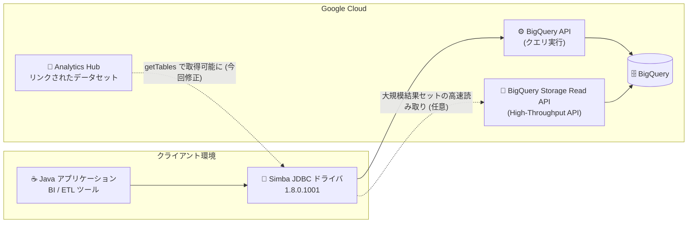

# BigQuery: Simba JDBC ドライバの更新版 (1.8.0.1001) リリース

**リリース日**: 2026-09-02

**サービス**: BigQuery

**機能**: Simba JDBC ドライバ更新 (バージョン 1.8.0.1001)

**ステータス**: リリース済み (Change)

📊 [このアップデートのインフォグラフィックを見る](https://takech9203.github.io/google-cloud-news-summary/20260902-bigquery-simba-jdbc-driver-update.html)

## 概要

BigQuery 用 Simba JDBC ドライバの更新版 (バージョン 1.8.0.1001) が利用可能になりました。Simba JDBC ドライバは、insightsoftware (Google Cloud Ready - BigQuery パートナー) が開発する JDBC ドライバで、Java アプリケーションや BI ツール、ETL ツールなどから標準の JDBC インターフェースで BigQuery に接続するために広く利用されています。

今回の 1.8.0 リリース (コネクタとしては 2026-08-19 リリース) では、Analytics Hub のリンクされたデータセット取得時のエラー修正、デフォルト OAuth クライアント ID / シークレットの更新、サードパーティライブラリ (Jackson) の更新、PCNT テーブルのメタデータ呼び出しサポート、Default Dataset の区切り文字変更などが含まれています。JRE 8、11、21 をサポートします。

一部の変更 (OAuth クライアントの更新、Default Dataset の区切り文字変更) は既存の接続設定に影響する破壊的変更を含むため、アップグレード時には設定の見直しが必要です。

**アップデート前の課題**

- BigQuery Analytics Hub の共有データセット (リンクされたデータセット) が適切にサポートされておらず、`getTables` で取得するとエラー (NPE) が発生する可能性があった
- PCNT テーブルに対するメタデータ呼び出し (`getSchemas`、`getTables` など) に対応していなかった
- 同梱の Jackson ライブラリが旧バージョン (jackson-databind 2.18.2 など) のままだった

**アップデート後の改善**

- Analytics Hub のリンクされたデータセットを `getTables` で取得した際のエラーが解消された (GBQJ-911)
- `getSchemas` や `getTables` などのメタデータ呼び出しで PCNT テーブルが表示されるようになった (GBQJ-949)
- Jackson 系ライブラリが 2.21.5 系に更新され、依存ライブラリが最新化された (GBQJ-926)
- デフォルトの OAuth クライアント ID / シークレットが更新された (GBQJ-915)

## アーキテクチャ図



Java アプリケーションは Simba JDBC ドライバ経由で BigQuery API に接続し、オプションで Storage Read API (High-Throughput API) による高速読み取りが可能です。今回の更新で Analytics Hub のリンクされたデータセットのメタデータ取得時のエラーが解消されました。

## サービスアップデートの詳細

### 主要な変更点 (1.8.0 で解決された問題)

1. **Analytics Hub リンクされたデータセットの NPE 修正 (GBQJ-911)**
   - Analytics Hub の共有データセットが適切にサポートされず、`getTables` で取得時にエラーが発生する問題を解消

2. **デフォルト OAuth クライアント ID / シークレットの更新 (GBQJ-915)**
   - デフォルトの OAuth Client ID と Secret が更新された
   - **注意**: アップグレード後、ユーザーアカウント認証 (User Account Authentication) を使用している場合は、新しいリフレッシュトークンの再生成が必要

3. **サードパーティライブラリの更新 (GBQJ-926)**
   - jackson-core 2.21.5 (旧: 2.21.1)
   - jackson-databind 2.21.5 (旧: 2.18.2)
   - jackson-annotations 2.21 (旧: 2.18.2)
   - jackson-datatype-jsr310 2.21.5 (旧: 2.18.2)

4. **PCNT テーブルのメタデータサポート (GBQJ-949)**
   - `getSchemas` や `getTables` などのメタデータ呼び出しで PCNT テーブルが表示されるようになった

5. **Default Dataset の区切り文字変更 (GBQJ-951)**
   - Default Dataset の区切り文字が `.` から `:` に変更された
   - 新しくサポートされる形式は `project:dataset`、および PCNT 環境向けの `project:dataset.namespace`
   - **注意**: アップグレード後、Default Dataset を使用している場合は設定の更新が必要

## 技術仕様

### ドライバ情報

| 項目 | 詳細 |
|------|------|
| 最新バージョン | 1.8.0.1001 |
| コネクタリリース日 | 2026-08-19 (Google Cloud リリースノート掲載: 2026-09-02) |
| 対応 Java プラットフォーム | JRE 8、11、21 |
| JDBC 仕様 | JDBC 4.2 互換 |
| 開発元 | insightsoftware (Google Cloud Ready - BigQuery パートナー) |
| 前バージョン | 1.7.0.1001 |
| ダウンロード | [SimbaJDBCDriverforGoogleBigQuery42_1.8.0.1001.zip](https://storage.googleapis.com/simba-bq-release/jdbc/SimbaJDBCDriverforGoogleBigQuery42_1.8.0.1001.zip) |

### High-Throughput API (Storage Read API) 利用時に必要なロール

大規模な結果セットを標準の BigQuery API ではなく Storage Read API で読み取る場合、以下のロールが必要です。

| 項目 | 詳細 |
|------|------|
| 必要な IAM ロール | BigQuery Read Session User (`roles/bigquery.readSessionUser`) |
| 主な必要権限 | `bigquery.readsessions.create` / `bigquery.readsessions.getData` / `bigquery.readsessions.update` |

## 設定方法

### 前提条件

1. JRE 8、11、または 21 の実行環境
2. BigQuery へのアクセス権限 (High-Throughput API を使用する場合は `roles/bigquery.readSessionUser`)

### 手順

#### ステップ 1: ドライバのダウンロード

```bash
curl -O https://storage.googleapis.com/simba-bq-release/jdbc/SimbaJDBCDriverforGoogleBigQuery42_1.8.0.1001.zip
```

insightsoftware のインストール / 構成ガイドの手順に従ってセットアップします。

#### ステップ 2: アップグレード時の設定確認

```text
# ユーザーアカウント認証を使用している場合
→ 新しいリフレッシュトークンを再生成する (OAuth Client ID / Secret 更新のため)

# Default Dataset を設定している場合
→ 区切り文字を `.` から `:` に変更する
   例: myproject:mydataset (PCNT 環境では myproject:mydataset.namespace)
```

既存の 1.7.x 以前からのアップグレードでは、上記 2 点の設定変更が必要になる場合があります。

## メリット

### ビジネス面

- **データ共有シナリオの安定化**: Analytics Hub 経由で共有されたデータセットを JDBC 接続の BI / ETL ツールから安定して参照できるようになり、組織間データ共有の活用が進めやすくなる
- **依存ライブラリの最新化**: Jackson 系ライブラリの更新により、依存関係の脆弱性管理・コンプライアンス対応の観点で最新状態を維持できる

### 技術面

- **メタデータ取得の改善**: `getSchemas` / `getTables` で PCNT テーブルが取得可能になり、ツールからのカタログ参照範囲が広がる
- **エラーの解消**: Analytics Hub リンクされたデータセット取得時の NPE が修正され、例外ハンドリングの回避策が不要になる

## デメリット・制約事項

### 破壊的変更 (アップグレード時の注意)

- ユーザーアカウント認証を利用している場合、リフレッシュトークンの再生成が必要 (GBQJ-915)
- Default Dataset の区切り文字が `.` から `:` に変更されたため、既存の Default Dataset 設定の更新が必要 (GBQJ-951)

### Simba ドライバ共通の制限事項

- BigQuery のロード機能・エクスポート機能はサポートされない
- クエリプレフィックスはサポートされない (SQL 方言は `QueryDialect` 接続プロパティで指定)
- DML の制限事項がすべて適用される
- パラメータ化クエリはクエリ検証のみでパフォーマンスには影響しない
- BigQuery 専用であり、他のプロダクトには使用できない

### 既知の問題 (抜粋)

- カタログ関数の結果が適切にソートされない (GBQJ-788)
- Workforce / Workload Identity Federation の executable-sourced credentials は未サポート (GBQJ-594)
- 同一 LogPath で複数接続を LogLevel=6 に設定するとコネクタが異常終了する場合がある

## ユースケース

### ユースケース 1: BI ツールから Analytics Hub 共有データセットを参照

**シナリオ**: JDBC 接続の BI ツールから、Analytics Hub 経由で他組織から共有されたリンクされたデータセットのテーブル一覧を参照して分析する。

**効果**: 従来 `getTables` でエラーになる可能性があった共有データセットが正しく取得できるようになり、共有データの分析ワークフローが安定する。

### ユースケース 2: 既存 Java アプリケーションのドライバ更新

**シナリオ**: Simba JDBC ドライバ 1.7.x を利用中の Java アプリケーションを 1.8.0.1001 にアップグレードし、依存ライブラリの脆弱性対応とバグ修正を取り込む。

**実装例**:
```text
1. 1.8.0.1001 の zip を取得しクラスパスのドライバ JAR を差し替え
2. ユーザーアカウント認証の場合はリフレッシュトークンを再生成
3. Default Dataset 設定を `project:dataset` 形式に更新
4. 接続テスト・メタデータ取得 (getTables 等) の回帰確認
```

**効果**: Jackson 2.21.5 系への更新を含む最新の修正を適用しつつ、破壊的変更による接続障害を未然に防止できる。

## 料金

Simba JDBC ドライバ自体は無償でダウンロードでき、追加ライセンスも不要です。ただし、ドライバ利用時には以下の BigQuery 料金が適用されます。

| 項目 | 適用される料金 |
|------|-----------------|
| クエリ実行 | BigQuery コンピューティング料金 |
| 大規模結果セットの宛先テーブル書き込み (設定時) | BigQuery ストレージ料金 |
| High-Throughput API による読み取り | BigQuery Storage Read API 料金 |

詳細は [BigQuery の料金ページ](https://cloud.google.com/bigquery/pricing) を参照してください。

## 関連サービス・機能

- **Google 開発の JDBC / ODBC ドライバ**: Simba ドライバの代替として、Google が開発した [JDBC ドライバ](https://docs.cloud.google.com/bigquery/docs/jdbc-for-bigquery) / [ODBC ドライバ](https://docs.cloud.google.com/bigquery/docs/odbc-for-bigquery) の利用も公式に案内されている
- **BigQuery Storage Read API**: ドライバの High-Throughput API 機能で使用され、大規模結果セットの高速読み取りを実現する
- **Analytics Hub**: 組織間のデータセット共有サービス。今回の修正でリンクされたデータセットのメタデータ取得が安定した
- **Simba ODBC ドライバ for BigQuery**: 非 Java アプリケーション向けの姉妹ドライバ (現行 3.3.1.3003)

## 参考リンク

- 📊 [インフォグラフィック](https://takech9203.github.io/google-cloud-news-summary/20260902-bigquery-simba-jdbc-driver-update.html)
- [公式リリースノート (2026-09-02)](https://docs.cloud.google.com/release-notes#September_02_2026)
- [Simba ODBC / JDBC ドライバのドキュメント](https://docs.cloud.google.com/bigquery/docs/reference/odbc-jdbc-drivers#current_jdbc_driver)
- [Simba Google BigQuery JDBC Data Connector Release Notes (1.8.0.1001)](https://storage.googleapis.com/simba-bq-release/jdbc/release-notes_1.8.0.1001.txt)
- [ドライバダウンロード (1.8.0.1001)](https://storage.googleapis.com/simba-bq-release/jdbc/SimbaJDBCDriverforGoogleBigQuery42_1.8.0.1001.zip)
- [料金ページ (BigQuery)](https://cloud.google.com/bigquery/pricing)

## まとめ

Simba JDBC ドライバ 1.8.0.1001 は、Analytics Hub 共有データセットのエラー修正や依存ライブラリの更新など、安定性・保守性を高めるアップデートです。ただし OAuth クライアントの更新と Default Dataset 区切り文字の変更という 2 つの破壊的変更を含むため、アップグレード前にリフレッシュトークンの再生成と Default Dataset 設定の見直しを計画したうえで適用することを推奨します。

---

**タグ**: #BigQuery #JDBC #SimbaDriver #insightsoftware #AnalyticsHub #DataAnalytics
